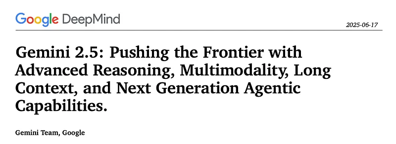
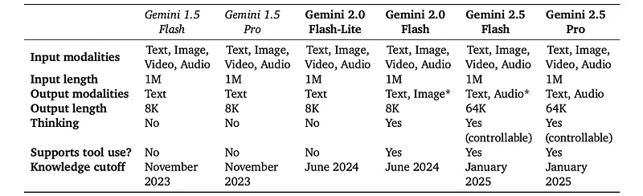
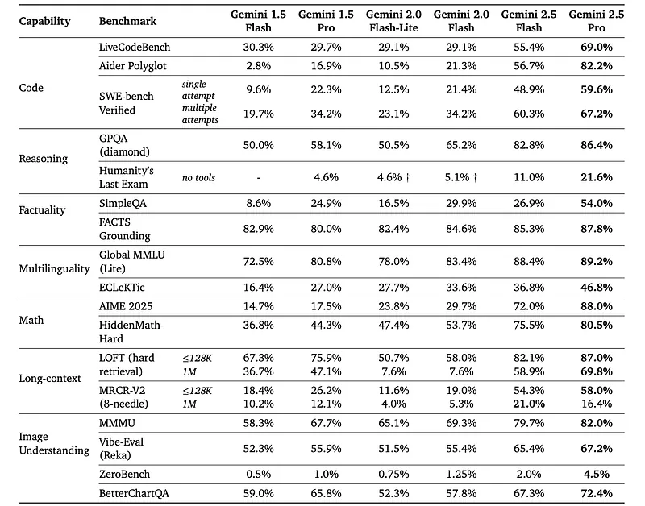
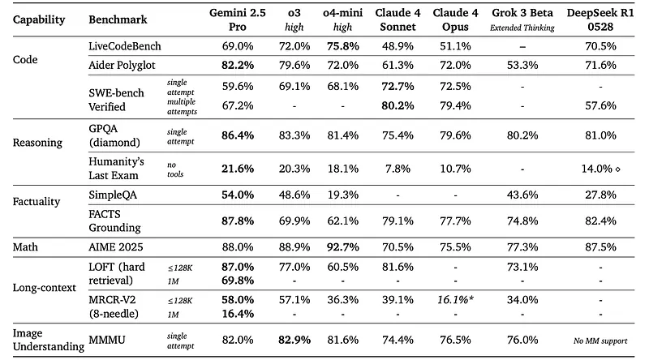
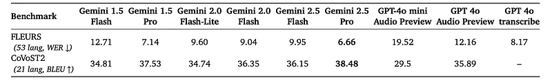
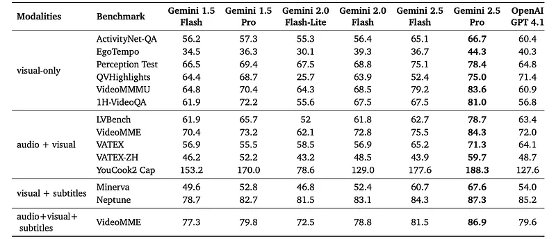
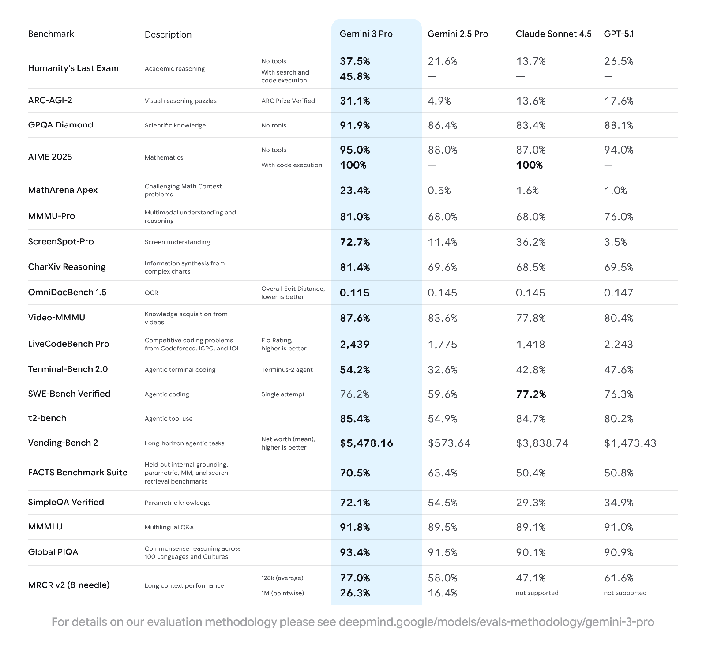

# Papers Explained 393 - Gemini 2.5

The pre-training dataset is a large-scale, diverse collection of data encompassing a wide range of domains and modalities, which includes publicly available web-documents, code (various programming languages), images, audio (including speech and other audio types), and video, with a cutoff date as June 2024 for 2.0 and January 2025 for...

This page ingests the source article into the wiki and connects it to [[Papers Explained Corpus]], [[Large Language Models]], [[Audio Models]], [[Reinforcement Learning Topic]], [[Synthetic Data]], [[Code Models]], [[Supervised Fine-Tuning]], [[Reinforcement Learning]], [[Verifier-Bounded Learning]].

## Source Metadata

- Source file: `raw/2025-06-23_Papers-Explained-393--Gemini-2-5-3b8877cf4da9.md`
- Source title: Papers Explained 393: Gemini 2.5
- Published: 2025-06-23
- Canonical: [https://medium.com/@ritvik19/papers-explained-393-gemini-2-5-3b8877cf4da9](https://medium.com/@ritvik19/papers-explained-393-gemini-2-5-3b8877cf4da9)

## Key Ideas

- The pre-training dataset is a large-scale, diverse collection of data encompassing a wide range of domains and modalities, which includes publicly available web-documents, code (various programming languages), images, audio (including speech and other audio...
- Compared to the Gemini 1.5 pre-training dataset, new methods for improved data quality for both filtering and deduplication were also utilized.
- The post-training dataset, like Gemini 1.5, consists of instruction tuning data that is carefully collected and vetted, is a collection of multimodal data with paired instructions and responses in addition to human preference and tool-use data.
- Since the initial announcement of Gemini 1.5, significant advancements have been made in post-training methodologies, driven by a consistent focus on data quality across the Supervised Fine-Tuning (SFT), Reward Modeling (RM), and Reinforcement Learning (RL)...
- Furthermore, the training compute allocated to RL has been increased, allowing deeper exploration and refinement of model behaviors.

## Notes

The Gemini 2.X model family, including Gemini 2.5 Pro, Gemini 2.5 Flash, Gemini 2.0 Flash, and Gemini 2.0 Flash-Lite, represents Google’s next generation of AI models designed for agentic systems. These models build upon the Gemini 1.5 series and are natively multimodal, supporting long context inputs exceeding 1 million tokens and native tool use. Gemini 2.5 Pro excels in reasoning and coding, producing interactive web applications and understanding codebases, while Gemini 2.5 Flash balances quality, cost, and latency for complex tasks. Gemini 2.0 Flash is a fast, cost-efficient model for everyday tasks, and Gemini 2.0 Flash-Lite is the fastest and most cost-efficient for at-scale usage

*Figure: Comparison of Gemini 2.X model family with Gemini 1.5 Pro and Flash.*

## Model Architecture

The Gemini 2.5 models are sparse mixture-of-experts (MoE) transformers with native multimodal support for text, vision, and audio inputs. Developments to the model architecture contribute to the significantly improved performance of Gemini 2.5 compared to Gemini 1.5 Pro. The Gemini 2.5 model series makes considerable progress in enhancing large-scale training stability, signal propagation, and optimization dynamics, resulting in a considerable boost in performance straight out of pre-training compared to previous Gemini models. The smaller models in the Gemini 2.5 series i.e Flash size and below, use distillation, as was done in the Gemini 1.5 series. To reduce the cost associated with storing the teacher’s next token prediction distribution, it is approximated using a k-sparse distribution over the vocabulary.

## Dataset

The pre-training dataset is a large-scale, diverse collection of data encompassing a wide range of domains and modalities, which includes publicly available web-documents, code (various programming languages), images, audio (including speech and other audio types), and video, with a cutoff date as June 2024 for 2.0 and January 2025 for 2.5.

Compared to the Gemini 1.5 pre-training dataset, new methods for improved data quality for both filtering and deduplication were also utilized.

The post-training dataset, like Gemini 1.5, consists of instruction tuning data that is carefully collected and vetted, is a collection of multimodal data with paired instructions and responses in addition to human preference and tool-use data.

## Post-training

Since the initial announcement of Gemini 1.5, significant advancements have been made in post-training methodologies, driven by a consistent focus on data quality across the Supervised Fine-Tuning (SFT), Reward Modeling (RM), and Reinforcement Learning (RL) stages. A key focus has been leveraging the model itself to assist in these processes, enabling more efficient and nuanced quality control.

Furthermore, the training compute allocated to RL has been increased, allowing deeper exploration and refinement of model behaviors. This has been coupled with a focus on verifiable rewards and model-based generative rewards to provide more sophisticated and scalable feedback signals. Algorithmic changes to the RL process have also improved stability during longer training.

## Thinking

The training recipe has evolved from the original experimental thinking model, Gemini 2.0 Flash Thinking (launched in December 2024), which excelled in mathematics and coding, to the Gemini 2.5 Thinking series, which incorporates Thinking natively across all domains. Thinking has been integrated with other Gemini capabilities, including native multimodal inputs (images, text, video, audio) and long context (1M+ tokens). For any of these capabilities, the model decides for itself how long to think before providing an answer. The ability to set a Thinking budget is also provided, constraining the model to respond within a desired number of tokens. This allows users to trade off performance with cost.

## Capability-specific improvements

### Code

In pre-training, the focus was intensified on incorporating a greater volume and diversity of code data from both repository and web sources into the training mixture. During post-training, novel training techniques were developed, incorporating reasoning capabilities and curating a diverse set of engineering tasks, with the aim to equip Gemini with effective problem-solving skills crucial for addressing modern engineering challenges. Key applications demonstrating these advancements include IDE functionalities, code agent use cases for complex, multi-step operations within full repositories, and multimodal, interactive scenarios such as end-to-end web and mobile application development.

### Factuality

Gemini 2.0 marked a significant leap as the first model family trained to natively call tools like Google Search, enabling it to formulate precise queries and synthesize fresh information with sources. Building on this, Gemini 2.5 integrates advanced reasoning, allowing it to interleave these search capabilities with internal thought processes to answer complex, multi-hop queries and execute long-horizon tasks. The model has learned to use search and other tools, reason about the outputs, and issue additional, detailed follow-up queries to expand the information available to it and to verify the factual accuracy of the response.

### Long context

Modeling and data advances helped improve the quality of the million-length context, and the internal evaluations were reworked to be more challenging to help steer the modeling research.

### Multilinguality

Gemini’s multilingual capabilities have also undergone a profound evolution since 1.5, which already encompassed over 400 languages via pretraining. This transformation stems from a holistic strategy, meticulously refining pre- and post-training data quality, advancing tokenization techniques, innovating core modeling, and executing targeted capability hillclimbing.

### Audio

While Gemini 1.5 was focused on native audio understanding tasks such as transcription, translation, summarization, and question-answering, in addition to understanding, Gemini 2.5 was trained to perform audio generation tasks such as text-to-speech or native audio-visual to audio out dialog. To enable low-latency streaming dialog, causal audio representations were incorporated that also allow streaming audio into and out of Gemini 2.5. These capabilities derive from an increased amount of pre-training data spanning over 200 languages, and development of improved post-training recipes. Finally, through improved post-training recipes, advanced capabilities such as thinking, affective dialog, contextual awareness, and tool use have been integrated into Gemini’s native audio models.

### Video

The pretraining and post-training video understanding data have been significantly expanded, improving the audio-visual and temporal understanding capabilities of the model. The models have been trained to perform competitively with 66 instead of 258 visual tokens per frame, enabling the use of about 3 hours of video instead of 1 hour within a 1M tokens context window.

### Deep Research

Gemini Deep Research is an agent built on top of the Gemini 2.5 Pro model designed to strategically browse the web and provide informed answers to even the most niche user queries. The agent is optimized to perform task prioritization, and is also able to identify when it reaches a dead-end when Browse.

## The path to Gemini 2.5

- On the way to Gemini 2.5 Pro, experimentation with the training recipe was conducted, and a small number of these experimental models were tested with users.

- Gemini 2.0 Pro: Released in February 2025, featuring strong coding performance, superior understanding and world knowledge, and a 2 million token context window.

- Gemini 2.0 Flash Native Image Generation: Released in March 2025, this model integrates image generation capabilities, enabling natural language prompting for image generation and editing, multi-step conversational editing, and interleaved text-image generation. It supports multiple languages.

- Gemini 2.5 Audio Generation: Offers Controllable TTS and Native Audio Dialog capabilities on AI Studio.

- TTS Pro and Flash models: Support over 80 languages with speech style controlled by prompts and fine-grained instructions. Can generate speech with multiple speakers.

- Native Audio Dialog model: Uses native audio generation, supporting style, pacing, and accent control. It supports tool use and function calling in over 24 languages, understands and responds to user tone, and can differentiate between relevant and irrelevant audio. An advanced ‘Thinking’ variant is available for complex queries.

- Gemini 2.5 Flash-Lite: Released in June 2025, this model aims to provide economical, ultra-low-latency capabilities with high throughput. It includes features like adjustable thinking budgets, tool connectivity (Google Search, code execution), multimodal input, and a 1 million-token context length. It echoes the initial release of 2.0 Flash-Lite.

- Gemini 2.5 Pro Deep Think: Employs a novel reasoning approach called Deep Think, which uses parallel thinking techniques to generate and critique hypotheses before arriving at a final answer. It achieves state-of-the-art performance in challenging benchmarks like Olympiad math, competitive coding, and multimodality. It was announced at Google I/O and released to trusted testers and advanced users in June 2025.

## Evaluation

- Gemini 2.5 models show significant improvements in coding tasks (LiveCodeBench, Aider Polyglot, SWE-bench Verified), math and reasoning (AIME 2025, GPQA), and image understanding compared to Gemini 1.5 models. The Gemini 2.5 Flash model outperforms previous Flash models and Gemini 1.5 Pro.

- Gemini 2.5 Pro achieves state-of-the-art (SoTA) score on the Aider Polyglot coding task.

- Gemini 2.5 Pro achieves the highest score on Humanity’s Last Exam, GPQA (diamond), SimpleQA, and FACTS Grounding factuality benchmarks.

- Gemini 2.5 Pro achieves SoTA score on both the LOFT and MRCR long-context tasks at 128k context.

- Gemini 2.5 Pro demonstrates state-of-the-art audio understanding performance on public benchmarks for ASR and AST.

- Gemini 2.5 Pro achieves state-of-the-art performance on key video understanding benchmarks, surpassing recent models like GPT 4.1.

## Gemini 3

Gemini 3 is Google’s latest and most intelligent AI model, designed to help users bring any idea to life. It represents a significant advancement in AI capabilities, building upon previous generations of Gemini models. Gemini 3 is state-of-the-art in several areas:

- Reasoning: It is built to grasp depth and nuance, perceiving subtle clues and peeling apart complex problems. It’s much better at understanding context and intent, reducing the need for extensive prompting.

- Multimodality: It is described as the best model in the world for multimodal understanding, seamlessly synthesizing information across text, images, video, audio, and code.

- Agentic Capabilities: Gemini 3 is Google’s most powerful agentic and vibe coding model, delivering richer visualizations and deeper interactivity. It excels at planning ahead over longer horizons and executing complex, multi-step workflows.

- Context Window: It features a 1 million-token context window, expanding the amount and types of information it can process.

- Responses: Its responses are smart, concise, and direct, offering genuine insight and acting as a true thought partner.

Gemini 3 Pro significantly outperforms previous models, including 2.5 Pro, on major AI benchmarks:

- LMArena Leaderboard: Tops with a breakthrough score of 1501 Elo.

- Humanity’s Last Exam: Achieves PhD-level reasoning with 37.5% (without tools).

- GPQA Diamond: Scores 91.9%.

- MathArena Apex: Sets a new state-of-the-art in mathematics with 23.4%.

- MMMU-Pro (Multimodal): Scores 81%.

- Video-MMMU (Multimodal): Scores 87.6%.

- SimpleQA Verified (Factual Accuracy): Scores 72.1%.

- WebDev Arena: Tops the leaderboard with 1487 Elo.

- Terminal-Bench 2.0 (Tool Use): Scores 54.2%.

- SWE-bench Verified (Coding Agents): Scores 76.2%, greatly outperforming 2.5 Pro.

- Vending-Bench 2 (Long-Horizon Planning): Tops the leaderboard, demonstrating consistent tool usage and decision-making for a full simulated year.

### Gemini 3 Deep Think Mode

- Enhanced Reasoning: This mode pushes the boundaries of intelligence even further, delivering a step-change in Gemini 3’s reasoning and multimodal understanding.

- Complex Problem Solving: Designed to help solve even more complex problems.

- Superior Performance: Outperforms Gemini 3 Pro on:

- Humanity’s Last Exam: 41.0% (without tools).

- GPQA Diamond: 93.8%.

- ARC-AGI-2: Achieves an unprecedented 45.1% (with code execution, ARC Prize Verified), demonstrating its ability to solve novel challenges.

Gemini 3 empowers users to:

### Learn Anything

- Multimodal Learning: Synthesizes information across various modalities (text, images, video, audio, code).

- Personalized Learning: Can decipher and translate handwritten recipes into a shareable cookbook, or analyze academic papers/video lectures to generate interactive flashcards, visualizations, or training plans (e.g., for pickleball).

- AI Mode in Search: Uses Gemini 3 to enable new generative UI experiences like immersive visual layouts and interactive tools/simulations based on queries.

### Build Anything

- Developer Productivity: Exceptional at zero-shot generation and handles complex prompts to render richer, more interactive web UI. It’s the best vibe coding and agentic coding model built by Google.

- Agent-First Development (Google Antigravity): A new platform that transforms AI assistance into an active partner. Agents can autonomously plan and execute complex, end-to-end software tasks, validate their own code, and have direct access to the editor, terminal, and browser. It also integrates Gemini 2.5 Computer Use for browser control and Nano Banana (Gemini 2.5 Image) for image editing.

- Availability for Developers: Accessible in Google AI Studio, Vertex AI, Gemini CLI, Google Antigravity, and third-party platforms like Cursor, GitHub, JetBrains, Manus, and Replit.

### Plan Anything

- Long-Horizon Planning: Demonstrates improved ability to reliably plan ahead over longer horizons, as shown by its performance on Vending-Bench 2.

- Automated Workflows: Combines deeper reasoning with consistent tool use to take action on behalf of users, navigating complex, multi-step workflows from start to finish (e.g., booking local services, organizing inboxes).

- Gemini Agent: Google AI Ultra subscribers can try these agentic capabilities in the Gemini app today, with expansion to more Google products planned.

## Paper

[Gemini 2.5: Pushing the Frontier with Advanced Reasoning, Multimodality, Long Context, and Next Generation Agentic Capabilities.](https://storage.googleapis.com/deepmind-media/gemini/gemini_v2_5_report.pdf)

[A new era of intelligence with Gemini 3](https://blog.google/products/gemini/gemini-3/)

## Figures

Figures from the Medium HTML export (`raw/2025-06-23_Papers-Explained-393--Gemini-2-5-3b8877cf4da9.md`); local copies under `wiki/assets/papers-explained-393-gemini-2-5/` when download succeeded.

| Figure | Caption |
|--------|---------|
|  | Title card: Gemini 2.5. |
|  | Comparison of Gemini 2.X model family with Gemini 1.5 Pro and Flash. |
|  | Papers Explained 393: Gemini 2.5. |
|  | Evaluation. |
|  | Evaluation. |
|  | Evaluation. |
|  | Evaluation. |
|  | Gemini 3 Pro significantly outperforms previous models, including 2.5 Pro, on major AI benchmarks. |
|  | Gemini 3 Pro significantly outperforms previous models, including 2.5 Pro, on major AI benchmarks. |
## Related

- [[Papers Explained Corpus]]
- [[Large Language Models]]
- [[Audio Models]]
- [[Reinforcement Learning Topic]]
- [[Synthetic Data]]
- [[Code Models]]
- [[Supervised Fine-Tuning]]
- [[Reinforcement Learning]]
- [[Verifier-Bounded Learning]]
- [[Papers Explained 392 - Hard Negative Mining for Domain-Specific Retrieval]]
- [[Papers Explained 394 - OpenThoughts]]

#summary #topic
