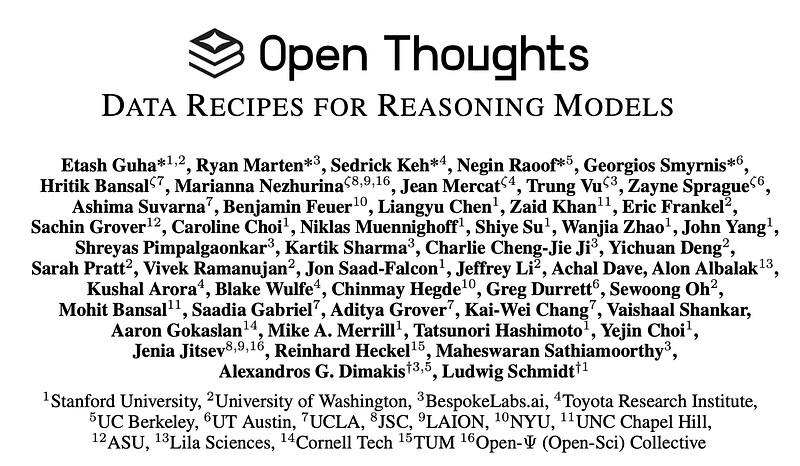
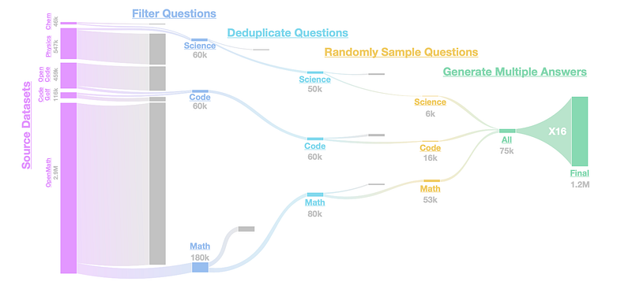
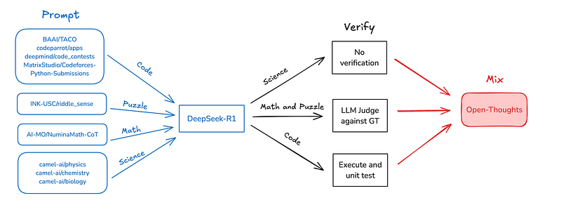
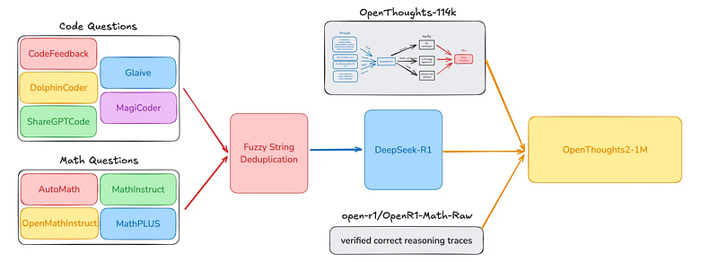

# Papers Explained 394 - OpenThoughts

The first step in the data generation pipeline is finding questions for each data domain. Question sourcing techniques can be broadly categorized into three types:

This page ingests the source article into the wiki and connects it to [[Papers Explained Corpus]], [[Synthetic Data]], [[Reasoning Models]], [[Code Models]], [[Large Language Models]], [[Model Compression and Efficiency]].

## Source Metadata

- Source file: `raw/2025-06-24_Papers-Explained-394--OpenThoughts-51fcf3dda8d2.html`
- Source title: Papers Explained 394: OpenThoughts
- Published: 2025-06-24
- Canonical: [https://medium.com/@ritvik19/papers-explained-394-openthoughts-51fcf3dda8d2](https://medium.com/@ritvik19/papers-explained-394-openthoughts-51fcf3dda8d2)

## Key Ideas

- The project is available [here](https://www.openthoughts.ai/).
- Fully synthetic — an existing LLM generates questions with little-to-no seed material. Examples include CodeAlpaca and CamelChemistry.
- Semi-synthetic — an LLM uses existing data sources such as CommonCrawl or FineWeb as seeds to form questions. Examples include TigerLabMath and AutoMathText.
- Non-synthetic — humans write the questions. Examples include StackExchange and ShareGPTCode.
- Experiments cover 27 different question sources for code questions, 21 sources for math, and 14 sources for science. The first step of the ablation is to generate 31,600 questions using each source.

## Notes

The goal of the OpenThoughts project is to create open-source datasets for training reasoning models. The OpenThoughts2–1M dataset led to OpenThinker2–32B, the first model trained on public reasoning data to match DeepSeek-R1-Distill-32B on standard reasoning benchmarks such as AIME and LiveCodeBench. The dataset was then improved further by systematically investigating each step of the data generation pipeline with 1,000+ controlled experiments, which led to OpenThoughts3. Beginning with BespokeStratos-17K, the project has progressed through four generations of releases, culminating in OpenThoughts3–1.2M and OpenThinker3–7B, finetuned from Qwen2.5–7B-Instruct.

The project is available [here](https://www.openthoughts.ai/).

## OpenThoughts3 Data Pipeline

### Question Sourcing

The first step in the data generation pipeline is finding questions for each data domain. Question sourcing techniques can be broadly categorized into three types:

- Fully synthetic — an existing LLM generates questions with little-to-no seed material. Examples include CodeAlpaca and CamelChemistry.

- Semi-synthetic — an LLM uses existing data sources such as CommonCrawl or FineWeb as seeds to form questions. Examples include TigerLabMath and AutoMathText.

- Non-synthetic — humans write the questions. Examples include StackExchange and ShareGPTCode.

Experiments cover 27 different question sources for code questions, 21 sources for math, and 14 sources for science. The first step of the ablation is to generate 31,600 questions using each source. For sources that produce fewer datapoints, the questions are repeated until the desired amount is reached. GPT-4o-mini is used for all sources that require an LLM. Finally, DeepSeek-R1 is used to generate responses for each question, even if a pre-existing answer exists.

### Code Question Generation Strategies

- StackExchange CodeGolf (Number of Questions: 85.9K): StackExchange forum focused on coding puzzles solved with the fewest possible characters.

- OpenCodeReasoning (Number of Questions: 459K): Large synthetic reasoning dataset consisting of 735,255 Python samples derived from 28,319 unique competitive programming questions.

- cognitivecomputations/dolphin-coder (Number of Questions: 101K): Synthetic questions evolved from LeetCode-style problems.

- m-a-p/CodeFeedback-Filtered-Instruction (Number of Questions: 150K): Dataset comprising synthetic and real coding questions filtered through a language model.

- KodCode/KodCode-V1 (Number of Questions: 384K): Fully synthetic and diverse coding dataset with problems covering algorithmic and package-specific topics.

- Multilingual-Multimodal-NLP/McEval-Instruct (Number of Questions: 35.8K): Multilingual dataset for tasks such as code understanding, completion, and generation.

- christopher/rosetta-code (Number of Questions: 75.4K): Multilingual dataset based on Rosetta Code, containing basic coding problems and solutions.

- glaiveai/glaive-code-assistant-v3 (Number of Questions: 946K): Synthetic dataset containing code problems and solutions created using Glaive’s data generation platform.

- StackExchange CodeReview (Number of Questions: 183K): Code review questions collected from the StackExchange codereview.meta.stackexchange.com forum.

- prithivMLmods/Coder-Stat (Number of Questions: 41.9K): Dataset focused on coding pattern analysis, error types, and performance metrics, with questions created by transforming erroneous code using GPT-4o-mini.

- OpenCoder-LLM/opc-sft-stage2 and OpenCoder-LLM/opc-sft-stage1: Collection of synthetic Python questions generated from documentation and educational materials. Specifically uses package_instruct subset from opc-sft-stage2, and the filtered_infinity_instruct, largescale_diverse_instruct, and realuser_instruct subsets from opc-sft-stage1.

- ise-uiuc/Magicoder-OSS-Instruct-75K (Number of Questions: 73.4K): Instruction-tuning dataset generated using gpt-3.5-turbo-1106 for open-source code modeling.

- codeparrot/apps (Number of Questions: 3.7K): Python dataset focused on generating code from natural language descriptions.

- ajibawa-2023/Code-290k-ShareGPT (Number of Questions: 283K): Human-asked programming questions sourced from ChatGPT interactions.

- nampdn-ai/tiny-codes (Number of Questions: >1M): Coding questions derived from textbooks, reformulated into question format using a language model.

- bigcode/commitpackft (Number of Questions: >1M): GitHub commit data transformed into coding questions, particularly for Python, C++, Java, C, C#, CSS, JavaScript, Shell, and Ruby. Questions are generated from commit messages and corresponding code using GPT-4o-mini.

- deepmind/code_contests (Number of Questions: 8.8K): Dataset of competitive programming questions.

- SenseLLM/ReflectionSeq-GPT (Number of Questions: 9.7K): Python dataset created using compiler feedback and language model prompting to form questions.

- MatrixStudio/Codeforces-Python-Submissions (Number of Questions: 538K): Collection of programming questions and solutions from the CodeForces platform.

- bigcode/self-oss-instruct-sc2-exec-filter-50k (Number of Questions: 47.6K): Dataset of difficult coding questions generated from GitHub code snippets using a language model.

- Magpie-Align/Magpie-Qwen2.5-Coder-Pro-300K-v0.1 (Number of Questions: 299K): Dataset of synthetic coding questions generated using the Qwen2.5 Coder 32B Instruct model.

- PrimeIntellect/real-world-swe-problems (Number of Questions: 69.6K): Dataset focused on realistic software engineering problems.

- StackExchange StackOverflow (Number of Questions: Not Specified): General-purpose coding questions sourced from the StackOverflow community.

- cfahlgren1/react-code-instructions (Number of Questions: 70.4K): Language model-generated dataset for coding instructions related to the React framework.

- PrimeIntellect/stackexchange-question-answering (Number of Questions: 309K): Curated programming questions from StackOverflow for question-answering tasks.

- PrimeIntellect/synthetic-code-understanding (Number of Questions: 59.9K): Dataset designed to teach a language model to predict the output of code snippets.

- bugdaryan/sql-create-context-instruction (Number of Questions: 78.6K): SQL-related questions derived from WikiSQL and Spider, reformulated as instruction-style prompts.

### Math Question Generation Strategies

- ai2-adapt-dev/OpenMathInstruct2-MATH (Number of Questions: >1M): MATH subset of the OpenMathInstruct2 dataset.

- AI-MO/NuminaMath-1.5 (Number of Questions: 853K): Collection of scanned math problems from competitive mathematics sources.

- GAIR/MathPile (Number of Questions: 99.5K): Unstructured mathematical text used as seed material for generating math questions with GPT-4o-mini.

- MetaMath-AIME (Number of Questions: >1M): Augmentation of the AIME and Art of Problem Solving (AoPS) sections of NuminaMath using the MetaMath pipeline with GPT-4o-mini.

- math-ai/AutoMathText (Number of Questions: >1M): Collection of unstructured math-related text transformed into questions using GPT-4o-mini.

- OpenMathInstruct2-AIME (Number of Questions: >1M): Application of the OpenMathInstruct2 augmentation pipeline to AIME and AoPS sections, using GPT-4o-mini for question generation.

- zwhe99/DeepMath-103K (Number of Questions: 95.9K): Curated math questions sourced from various datasets, filtered for difficulty.

- TIGER-Lab/MathInstruct (Number of Questions: 256K): Combination of existing math datasets and questions generated via large language models and Common Crawl data.

- nvidia/OpenMathInstruct-2 (Number of Questions: >1M): Synthetic math questions derived from the MATH and GSM8K training sets.

- ddrg/named_math_formulas (Number of Questions: >1M): Mathematical formulas used as seeds to generate corresponding questions with GPT-4o-mini.

- facebook/natural_reasoning (Number of Questions: >1M): Challenging reasoning-focused math questions backtranslated from DCLM and FineMath corpora.

- SynthLabsAI/Big-Math-RL-Verified (Number of Questions: 45.6K): A highly filtered collection of verifiable mathematics questions.

- Asap7772/hendrycks-math-mc-llama (Number of Questions: 79.9K): Multiple-choice version of the Hendrycks MATH dataset.

- TIGER-Lab/MATH-plus (Number of Questions: 847K): Mixture of MetaMath, MATH-Orca, and other augmented MATH datasets using GPT-4.

- ibivibiv/math_instruct (Number of Questions: >1M): Instruction-style dataset for math, further details not provided.

- BAAI/InfinityMATH (Number of Questions: 99.9K): Scalable instruction tuning dataset focused on mathematical reasoning.

- ajibawa-2023/Maths-College (Number of Questions: 937K): Dataset containing diverse problems covering college-level mathematics topics.

- MetaMath (Number of Questions: >1M): Reproduction of the original MetaMath dataset, with GPT-3.5-turbo replaced by GPT-4o-mini for question generation.

- allenai/math_qa (Number of Questions: 29.7K): Collection of math word problems, originally from the AQuA-RAT dataset.

- deepmind/math_dataset (Number of Questions: 1M): School-level math questions. Specifically includes subsets such as algebra__linear_2d_composed, probability__swr_p_level_set, polynomials__evaluate_composed, polynomials__simplify_power, calculus__differentiate_composed, and probability__swr_p_sequence.

- Lap1official/Math (Number of Questions: >1M): Large-scale math dataset; detailed metadata not available.

### Science Question Generation Strategies

- StackExchange Physics (Number of Questions: 547K): Questions sourced from the Physics StackExchange forum at[physics.stackexchange.com](https://physics.stackexchange.com/).

- Organic Chemistry PDF Pipeline (Number of Questions: 46.2K): Organic chemistry questions extracted from SCP-116K PDFs, textbooks, solution manuals, and related resources. Text was extracted using Gemini and refined into questions using GPT-4o-mini, followed by multiple filtering stages to ensure relevance to organic chemistry.

- mteb/cqadupstack-physics (Number of Questions: 38.3K): Physics-focused dataset created for community question-answering tasks. Unstructured texts were converted into structured questions using GPT-4o-mini.

- Camel-AI/Physics (Number of Questions: >1M): Physics question dataset generated via the Camel pipeline, recreated using GPT-4o-mini.

- Josephgflowers/Par-Four-Fineweb-Edu-Fortified-Chemistry-Physics-Astronomy-Math-Reason (Number of Questions: 988K): LLM-generated questions derived from FineWeb science texts, spanning multiple disciplines including physics, chemistry, astronomy, and mathematics.

- millawell/wikipedia_field_of_science (Number of Questions: 304K): Science-related questions generated from Wikipedia articles in scientific domains using GPT-4o-mini.

- zeroshot/arxiv-biology (Number of Questions: 1.2K): Biology questions generated by transforming abstracts from ArXiv biology papers into question form using GPT-4o-mini.

- Camel-AI/Chemistry (Number of Questions: >1M): Chemistry question dataset created via the Camel pipeline, reproduced using GPT-4o-mini.

- StackExchange Biology (Number of Questions: 60.3K): Questions collected from the Biology StackExchange forum at [biology.stackexchange.com](http://biology.stackexchange.com).

- Camel-AI/Biology (Number of Questions: >1M): Biology-focused dataset generated through the Camel pipeline and recreated using GPT-4o-mini.

- AdapterOcean/biology_dataset_standardized_unified (Number of Questions: 22K): Biology dataset in a unified format; further metadata not available.

### Mixing Questions

Experiments show that mixing many question sources degrades performance: mixing at most two sources yields the best results across all data domains. OpenMath-2-Math is used as the sole math question source, CodeGolf and Open-CodeReasoning as the code question sources, and StackExchangePhysics and OrganicChemistry-PDFs as the science question sources.

### Question Filtering

To select a high-quality subset of questions from each source, various filtering methods, including fastText classifiers, difficulty scores, and embedding distance, are extensively explored to select higher-quality questions. The two highest performing question filtering methods are difficulty-based filtering and response length filtering. Difficulty-based filtering asks an LLM (GPT-4o-mini) to assess the difficulty of each question, then retains the most difficult questions. Difficulty-based filtering is the winning strategy for code. Meanwhile, response length filtering asks an LLM to respond to each question directly, then selects the questions with the longest LLM-generated responses. Response length filtering performs the best for math and science. Difficulty-based filtering with GPT-4o-mini is used for code questions, and response length filtering with GPT-4.1-mini is used for math and science questions.

### Deduplication And Sampling Multiple Answers Per Question

Deduplication reduces repetition in the question set, enhancing question diversity. Three levels of strictness are explored:

- No Deduplication: All questions are kept, regardless of similarity.

- Exact Match Deduplication: Identical questions are removed.

- Fuzzy Deduplication: Questions with a string similarity above a certain threshold are considered duplicates and removed.

Sampling Multiple Answers Per Question increases answer diversity by querying the teacher model multiple times for each question to elicit distinct responses. Three levels of sampling are explored:

- 1x: One answer is generated per question.

- 4x: Four answers are generated per question.

- 16x: Sixteen answers are generated per question.

For code and science data, various combinations of deduplication and multiple answer generation yield similar results. For math, exact deduplication with 4x answers per question performs the best, and 16x answers per question is the second-best option.

The final pipeline uses 16×answers per question for all domains. It uses exact deduplication for math and science and no deduplication for code.

### Answer Filtering

For math datasets, the random filtering baseline outperformed all other filtering methods.

For code question-answer pairs, a fastText classifier was the best answer-filtering method. The positives for the fastText classifier came from CodeForces answered with DeepSeek-R1, and the negatives came from CodeForces answered with GPT-4o-mini.

For science, keeping the top 8 longest answers was the strongest question-answer filtering strategy.

Across all domains, the no-filtering strategy (training on all samples without controlling compute) led to performance similar to that of all other methods of filtering. The benefits of answer filtering were not significant enough to justify reducing the number of samples in the dataset, regardless of the domain. Therefore, this step was skipped in the following steps of the pipeline.

### Teacher Model

QwQ-32B is used as the teacher model.

### Scaling The Pipeline To OpenThoughts 3–1.2M

*Figure: The OpenThoughts3–1.2M Full Data Pipeline.*

OpenThoughts3–1.2M contains 850,000 math, 250,000 code, and 100,000 science datapoints. We chose this ratio following the OpenThoughts2–1M mixture used to train OpenThinker2, which exhibited strong and balanced performance on par with the DeepSeek-R1-Distill models.

## Bespoke-Stratos And Openthoughts 1 & 2

BespokeStratos-17K uses the same sources as SkyT1 but uses R1 as the annotator and gpt-4o-mini for verification and filtering incorrect solutions.

OpenThoughts1 (OpenThoughts-114K) was constructed by sourcing questions from four domains, completing answers with DeepSeek-R1, verifying (Math, Puzzle, and Code — not Science), and mixing.

*Figure: OpenThoughts-114K data recipe.*

OpenThoughts-114K scaled up the Sky-T1 pipeline, using DeepSeek-R1 as an annotator and an LLM Judge for verification. The pipeline is visualized in Figure 5, with details in the blog post.

*Figure: OpenThoughts2–1M data recipe.*

OpenThoughts2–1M uses additional question generation strategies across the math and code domains, including preexisting datasets like Glaive, ShareGPTCode, and OpenR1-Math, and datasets generated such as AutoMathText. The full pipeline is in Figure 6, with more details in the blog post.

OpenThoughts2–1M improved upon OpenThoughts-114K by adding new question generation strategies. This included preexisting datasets such as OpenR1 and CodeFeedback and also ones we generated ourselves, such as AutoMathText. Combining this with deduplication led to the 1 million-sized dataset.

## Paper

OpenThoughts: Data Recipes for Reasoning Models [2506.04178](https://arxiv.org/abs/2506.04178)

## Figures

Figures from the Medium HTML export (`raw/2025-06-24_Papers-Explained-394--OpenThoughts-51fcf3dda8d2.html`); local copies under `wiki/assets/papers-explained-394-openthoughts/` when download succeeded.

| Figure | Caption |
|--------|---------|
|  | Title card: OpenThoughts. |
|  | The OpenThoughts3–1.2M Full Data Pipeline. |
|  | OpenThoughts-114K data recipe. |
|  | OpenThoughts2–1M data recipe. |
## Related

- [[Papers Explained Corpus]]
- [[Synthetic Data]]
- [[Reasoning Models]]
- [[Code Models]]
- [[Large Language Models]]
- [[Model Compression and Efficiency]]
- [[Papers Explained 393 - Gemini 2.5]]
- [[Papers Explained 395 - AceReason-Nemotron 1.1]]
- [[Papers Explained 587: OpenThoughts Agent]]
- [[OpenThoughts]]

#summary #topic
