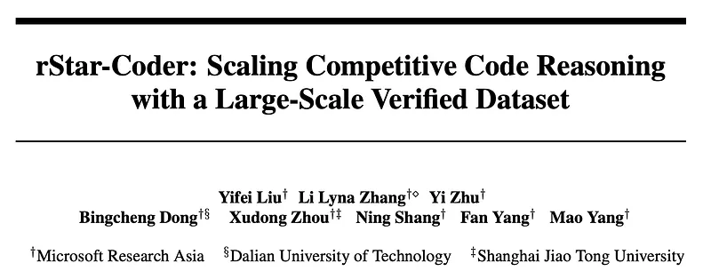
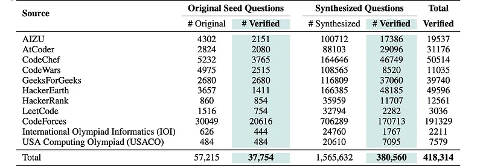
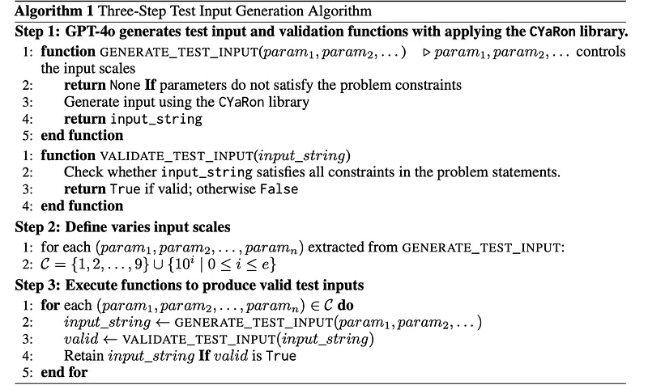
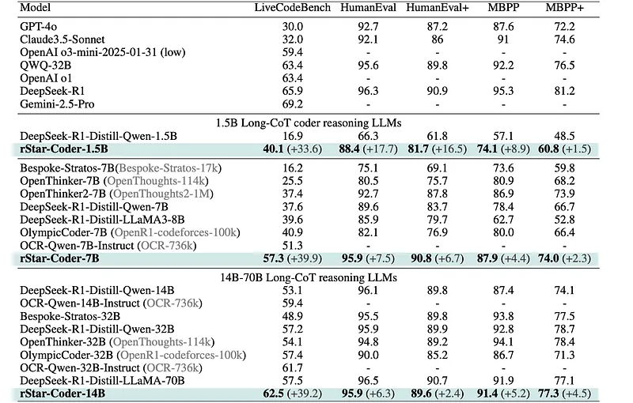
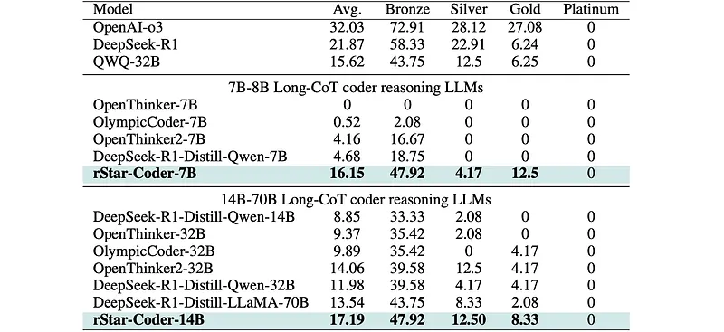

# Papers Explained 396 - rStar-Coder

rStar-Coder significantly improves LLM code reasoning capabilities by constructing a large-scale, verified dataset of 418K competition-level code problems, 580K long-reasoning solutions along with rich test cases of varying difficulty. This is achieved through:

This page ingests the source article into the wiki and connects it to [[Papers Explained Corpus]], [[Reasoning Models]], [[Code Models]], [[Large Language Models]], [[Synthetic Data]], [[Verifier-Bounded Learning]].

## Source Metadata

- Source file: `raw/2025-06-26_Papers-Explained-396--rStar-Coder-eeff4bb0b518.md`
- Source title: Papers Explained 396: rStar-Coder
- Published: 2025-06-26
- Canonical: [https://medium.com/@ritvik19/papers-explained-396-rstar-coder-eeff4bb0b518](https://medium.com/@ritvik19/papers-explained-396-rstar-coder-eeff4bb0b518)

## Key Ideas

- rStar-Coder significantly improves LLM code reasoning capabilities by constructing a large-scale, verified dataset of 418K competition-level code problems, 580K long-reasoning solutions along with rich test cases of varying difficulty.
- curating competitive programming code problems and oracle solutions to synthesize new, solvable problems
- introducing a reliable input-output test case synthesis pipeline that decouples the generation into a three-step input generation method and a mutual verification mechanism for effective output labeling
- augmenting problems with high-quality, test-case-verified long-reasoning solutions.
- The project is available at [GitHub](https://github.com/microsoft/rStar/).

## Notes

rStar-Coder significantly improves LLM code reasoning capabilities by constructing a large-scale, verified dataset of 418K competition-level code problems, 580K long-reasoning solutions along with rich test cases of varying difficulty. This is achieved through:

- curating competitive programming code problems and oracle solutions to synthesize new, solvable problems

- introducing a reliable input-output test case synthesis pipeline that decouples the generation into a three-step input generation method and a mutual verification mechanism for effective output labeling

- augmenting problems with high-quality, test-case-verified long-reasoning solutions.

The project is available at [GitHub](https://github.com/microsoft/rStar/).

## Methodology

### Collection of Competitive Code Problems

A seed dataset is curated from publicly available resources, including programming competition websites and open datasets, where the problems and test cases are designed by domain experts. This includes original problems, reference solutions, and available test cases from TACO, APPS, CodeContests, CodeContests-Python-Submission, CodeFroces from the OpenR1 project, and USA Computing Olympiad 2011–2023 (USACO). Problems are also gathered from the International Olympiad Informatics (IOI) spanning 2002–2023. As IOI problems are published in PDF format, they are converted into LaTex using Mathpix, following Numina-Math. In total, 57,215 problems are collected. To ensure high quality, duplicate problems across datasets are removed and problems lacking reference solutions are discarded, resulting in 37,754 unique problems with at least one reference solution.

*Figure: Summary of competitive-level programming problems.*

### Synthesis of new solvable code problems

Structured prompts are designed that include both the seed problem, its reference solution, and step-by-step synthesis instructions. The reference solution helps the LLM internalize the key algorithmic reasoning concepts involved in the seed problem. The model is instructed to:

- understand the seed problem and solution

- identify the reasoning and core knowledge being tested from the solution

- synthesize a new problem that tests similar skills. In total, 1,565K new code problems are synthesized.

```text
I will provide you with a programming problem along with its solution. Your task is to create a new, transformed programming problem based on the original one.
You need to complete the following steps:
1. Analyze and understand the original problem and its solution. Identify the reasoning steps (e.g., Step 1, Step
2, Step 3) and summarize the knowledge points tested in the original problem.
2. Design a new problem that is similar to the original one and can be solved using the same knowledge points.
If you reference any conditions or descriptions from the original problem, rewrite them clearly and avoid phrases like "as in the original problem".
* Provide two example test cases to demonstrate the new problem.
* Ensure that the complexity of the new problem is well-designed by specifying appropriate input constraints.
Your output should follow this format:
## Part 1: Original Problem and Solution Analysis
Step 1: [Describe the first step of reasoning]
Step 2: [Describe the second step of reasoning]
...
Knowledge Points: [Summarize the knowledge points tested, separated by commas if there are multiple]
## Part 2: New Problem Problem Description: [Describe the new problem clearly in natural language. Ensure
it doesn’t directly copy from the original problem description. Avoid phrases like "as in the original problem".]
Input Format: [Specify the input format]
Output Format: [Specify the output format]
## Part 3: Example Test Cases
Input: [Input for test case 1]
Output: [Expected output for test case 1]
Input: [Input for test case 2]
Output: [Expected output for test case 2]
Given Problem: {question}
Given Solution: {solution}
```

### Test Case Generation

A 3 step approach is proposed:

Generating utility functions for input generation and validation:

To produce high-quality test inputs that satisfy both the semantics and constraints of each problem, a frontier LLM (GPT-4o) is prompted to generate two utility functions per problem: one for test input generation and one for input validation. This serves two purposes:

- automatically producing well-structured inputs that satisfy problem constraints

- exposing scale-controlling parameters to enable flexible input sizing.

Notably, direct LLM generation of input values often causes hallucinations. To reduce this, GPT-4o is allowed to use CYaRon, a reliable input data generation toolkit. Given the problem description and CYaRon documentation, the LLM is asked to generate a GENERATE_TEST_INPUT function that uses scale parameters to call CYaRon for input construction, and a VALIDATE_TEST_INPUT function that parses the resulting input string and checks for constraint satisfaction.

```text
I will provide you with a programming problem description, and your task is to generate standardized test input samples using the CYaRon library.
You need to complete the following steps:
1. Parse the constraints on the input from the problem description, such as the range of input data, specific input constraints, etc.
2. Write a function `generate_test_input` using the CYaRon library to randomly generate test inputs based on a specified problem size. The function should validate that the parameters fall within the specified constraints. If any parameter is out of range, the function should return `None`. If the parameters are valid, generate a random test input and return an input string (`input_string`).
3. Write a function `validate_test_input` to verify whether the generated test input satisfies the requirements specified in the problem description. This includes checking the input data type and constraints parsed in step 1, such as range and other conditions. The function should take `input_string` as input and return a boolean (`True`/`False`).
**Part 1: Parse Input Constraints**
Specify the input constraints as described in the problem.
**Part 2: Code for Test Input Generation**
'''python
import cyaron as cy
def generate_test_input(param1, param2, ...):
# Check if parameters meet constraints
if not (condition1) or not (condition2):
return None
# Generate input using CYaRon
input_data = [
...
]
return "\n".join(map(str, input_data))
'''
**Part 3: Code to Validate Test Input**
'''python
def validate_test_input(input_string):
# Validation logic
return <boolean>
'''
**Given Problem:** {question}
```

Defining input scale ranges:

From the scale-controlling parameters exposed by the GENERATE_TEST_INPUT function in Step 1, value scales for each parameter are defined to control test case difficulty.

Executing utility functions to produce valid test inputs

Finally, for each instantiated scale-controlling parameters from Step 2, the GENERATE_TEST_INPUT function is invoked to generate a test input string. The VALIDATE_TEST_INPUT function is then used to verify whether each generated input string meets the constraints outlined in the corresponding problem statement. Only the inputs that pass validation are retained as valid test inputs.

### Mutual Verification for Test Output and Solution Labeling

For augmented test inputs from seed problems, the provided oracle solution is executed on the input. Since the reference solution is assumed correct, its output serves as the ground-truth label.

Labeling test outputs for synthetic problems is quite challenging as there are no oracle solutions. For each problem, 16 long-reasoning candidate solutions are sampled using a frontier reasoning model (QWQ-32B). A diverse set of at least 50 test inputs with varying complexities is then sampled. Each candidate solution is executed on this shared set of test inputs to generate the corresponding outputs. If a majority of these candidate solutions produce identical sets of outputs across this entire set of test inputs, then both these consistent sets of outputs and the candidate solutions that generated them are considered correct.

### Augmentation and Post-processing

Seed Problem Augmentation:

Solutions designed by experts are rewritten to include detailed reasoning steps, such as self-reflection. Diverse test cases are generated to verify the correctness of the solutions. QWQ-32B generates 16 Chain-of-Thought (CoT) solutions per problem, retaining only those that pass all tests. For difficult problems where QWQ-32B fails, all generated solutions are retained to capture diverse reasoning steps.

Post-Processing for Synthetic Data:

Unsolvable or overly difficult problems are removed using a mutual verification mechanism requiring at least 60% agreement on outputs, or 40% for Codeforces problems with cf_rating > 1600. Filtering unreliable problems resulted in 380K verified synthetic problems. The number of CoT solutions is reduced from 2.25M to one (the fastest based on CPU execution time) per problem for efficient fine-tuning.

Decontamination:

Problems that overlap (16-gram) with evaluation benchmarks like HumanEval, HumanEval+, MBPP, MBPP+, LiveCodeBench, and USACO 2025 are removed to ensure fair evaluation.

The final dataset includes 418K problems with extensive test cases, totaling 580K question-solution pairs.

### Experimental Setup

A 580K dataset was used to fine-tune Qwen2.5-Coder instruct models at 1.5B, 7B, and 14B scales for 6 epochs with a sequence length of 16k.

## Evaluation

*Figure: Results of rStar-Coder and frontier reasoning LLMs on diverse benchmarks.*

*Figure: rStar-Coder performance on USACO 2025.*

- rStar-Coder significantly improves LLMs’ code reasoning capabilities, achieving performance comparable to frontier reasoning LLMs with substantially smaller model sizes.

- rStar-Coder generalizes well to general code generation tasks, improving performance on HumanEval, HumanEval+, MBPP, and MBPP+ to state-of-the-art levels.

- rStar-Coder models (7B and 14B) perform competitively on challenging Olympiad programming problems (USACO 2025), even outperforming larger models like QWQ-32B.

## Paper

rStar-Coder: Scaling Competitive Code Reasoning with a Large-Scale Verified Dataset [2505.21297](https://arxiv.org/abs/2505.21297)

## Figures

Figures from the Medium HTML export (`raw/2025-06-26_Papers-Explained-396--rStar-Coder-eeff4bb0b518.md`); local copies under `wiki/assets/papers-explained-396-rstar-coder/` when download succeeded.

| Figure | Caption |
|--------|---------|
|  | Title card: rStar-Coder. |
|  | Summary of competitive-level programming problems. |
|  | A 3 step approach is proposed. |
|  | Results of rStar-Coder and frontier reasoning LLMs on diverse benchmarks. |
|  | rStar-Coder performance on USACO 2025. |
## Related

- [[Papers Explained Corpus]]
- [[Reasoning Models]]
- [[Code Models]]
- [[Large Language Models]]
- [[Synthetic Data]]
- [[Verifier-Bounded Learning]]
- [[Papers Explained 395 - AceReason-Nemotron 1.1]]
- [[Papers Explained 397 - SweEval]]

#summary #topic
