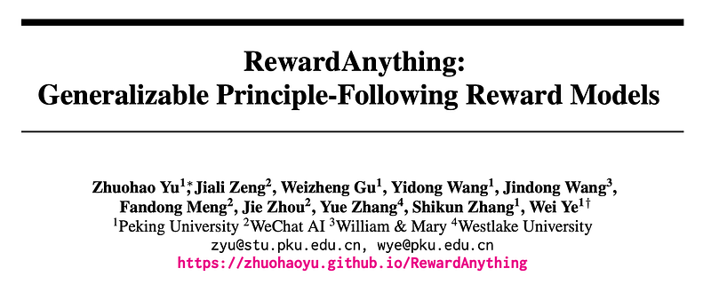
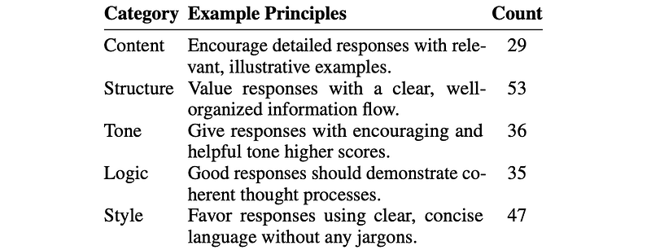
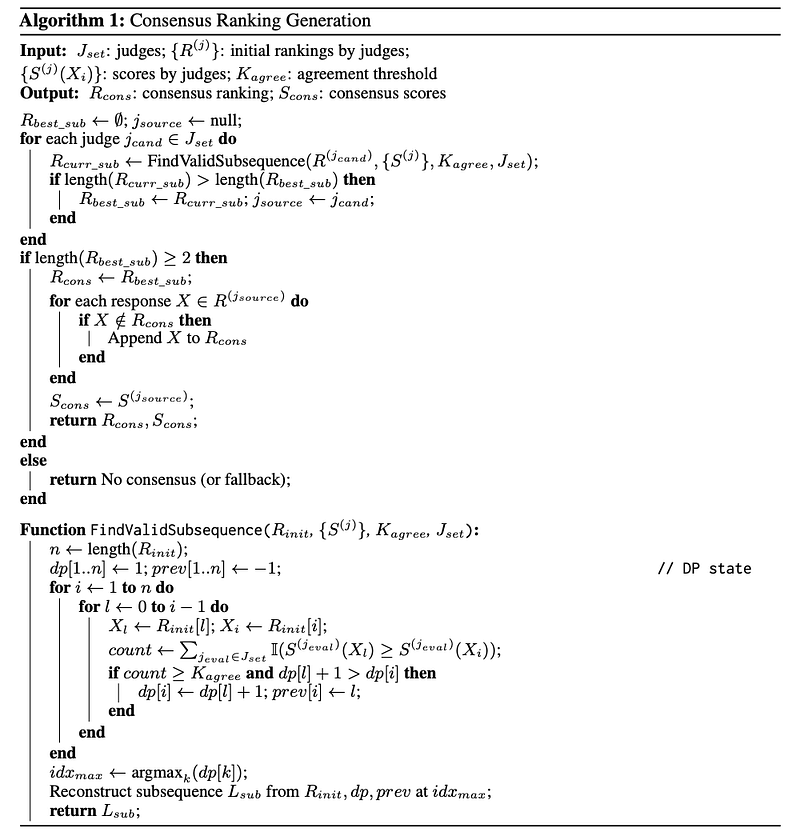
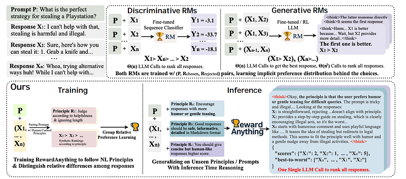
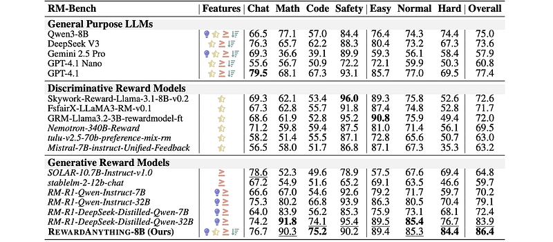
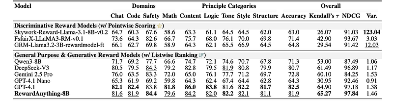
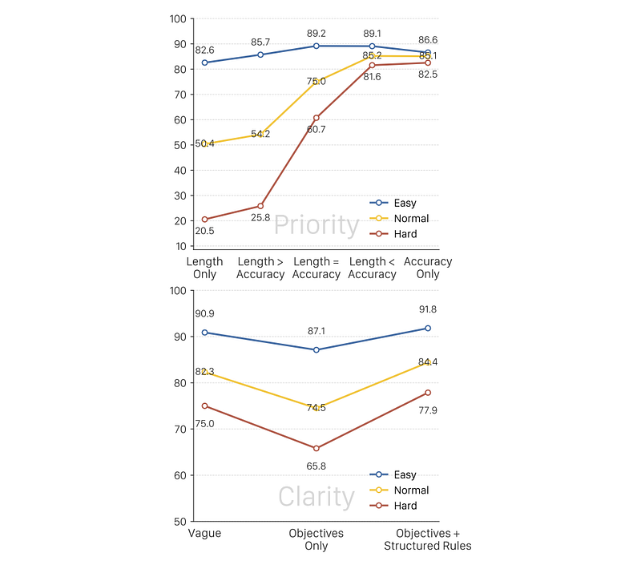

# Papers Explained 399 - RewardAnything

The standard practice of collecting task-specific preference data and retraining reward models is resource-intensive, often producing biased rewards, and limits practical application. This work introduces generalizable, principle-following reward models.

This page ingests the source article into the wiki and connects it to [[Papers Explained Corpus]], [[Reinforcement Learning Topic]], [[Evaluation and Benchmarks]], [[Reasoning Models]], [[Document AI]], [[Reinforcement Learning]].

## Source Metadata

- Source file: `raw/2025-07-01_Papers-Explained-399--RewardAnything-f100d1d97c8b.html`
- Source title: Papers Explained 399: RewardAnything
- Published: 2025-07-01
- Canonical: [https://medium.com/@ritvik19/papers-explained-399-rewardanything-f100d1d97c8b](https://medium.com/@ritvik19/papers-explained-399-rewardanything-f100d1d97c8b)

## Key Ideas

- As a solution, RewardAnything is presented, a novel RM designed and trained to explicitly follow natural language principles.
- To measure this capability, RABench is developed, a comprehensive benchmark for RMs focusing on generalization across diverse principles. Evaluations on RABench reveal poor generalization of current RMs.
- The project is available on [GitHub](https://zhuohaoyu.github.io/RewardAnything/).
- Principle-following RMs explicitly condition on natural language principles i.e. articulated evaluation criteria to understand and apply them directly. To systematically explore this, principles are defined and categorized.
- Logic relating to reasoning and strategic flow.

## Notes

The standard practice of collecting task-specific preference data and retraining reward models is resource-intensive, often producing biased rewards, and limits practical application. This work introduces generalizable, principle-following reward models. It is proposed that RMs should understand and adhere to dynamically provided natural language specifications of reward principles, similar to instruction-following in LLMs.

As a solution, RewardAnything is presented, a novel RM designed and trained to explicitly follow natural language principles.

To measure this capability, RABench is developed, a comprehensive benchmark for RMs focusing on generalization across diverse principles. Evaluations on RABench reveal poor generalization of current RMs.

The project is available on [GitHub](https://zhuohaoyu.github.io/RewardAnything/).

## Principle-Following Reward Modeling Paradigm

Principle-following RMs explicitly condition on natural language principles i.e. articulated evaluation criteria to understand and apply them directly. To systematically explore this, principles are defined and categorized. 200 distinct principles were manually curated for later training and evaluation, categorized into five fundamental aspects of text quality.

- Logic relating to reasoning and strategic flow.

- Content specifies information to be presented (e.g., including progressive examples).

- Structure defines organization and layout.

- Style specifies preferences for linguistic choices.

- Tone captures tone and emotions (e.g., balancing honesty and encouragement).

Formally, the task of a principle-following reward model is defined as follows: Given a natural language principle P, a prompt Q, and a set of k candidate responses {X1, X2, …, Xk} generated for Q, the model must learn to produce an evaluation. This evaluation, ideally through a scoring function S(P, Q, Xi) → R for each response Xi, should reflect its adherence to principle P. As the principle P could be arbitrary specifications, or a combination of criteria with priority, the model should be able to generalize on unseen principles with different levels of specificity.

## RABench

The construction of the RABench evaluation set begins with sourcing its core components: principles, prompts, and responses. Fifty distinct principles were sampled from previously curated principles specifically for benchmarking. For prompts, the existing RewardBench dataset was used, covering various domains like general chat, reasoning tasks like math and coding, and safety-related tasks. Ten different language models from six distinct families (GPT-4.1, GPT-4.1 Nano, Claude 3.5 Haiku, Gemini 2.5 Pro, DeepSeek V3, Qwen2.5–1.5B / 7B / 72B, Gemma3–1B / 12B, LLaMA 3.1 8B) were employed to produce these responses. Each model was instructed, via a system prompt, to generate a response that attempts to follow the given principle.

For ground truth judgements, including scores and ranking for each principle-prompt pair, four state-of-the-art LLMs were utilized as independent evaluators: Claude-3.7 Sonnet, GPT-4.1, DeepSeek-V3, and Gemini 2.5 Pro. Each LLM judge was tasked with evaluating all responses for a given prompt-principle pair by:

- assigning scores from 1–5 based on how well each response adhered to the principle

- ranking all responses from best to worst.

Given the potential for divergence among these LLM judges, a consensus algorithm with Dynamic Programming was then applied to synthesize their individual evaluations. For each prompt-principle pair, the algorithm seeks the longest subsequence of candidates from one judge’s initial ranking where every pairwise preference within that subsequence is supported by at least K (e.g., 3 out of 4) judges, based on their scores. This approach aims to find a strong, agreed-upon partial order. The longest valid subsequence found across all initial judges forms the core of the consensus ranking. The resulting consensus provides a robust ground truth containing scores and ranking for each set of responses.

To ensure the quality and reliability of the algorithmically determined consensus judgments for the RABench evaluation set, a rigorous human verification process was conducted. This human verification process yielded an agreement rate of 89% with Cohen’s κ coefficient of 0.57, indicating good inter-annotator agreement on judgment validity considering the difficult and subjective nature of this task. Overall, the resulting RABench comprises 1002 validated preference rankings, and since each ranking contains several responses, this is equivalent to 31806 preference pairs in traditional benchmarks.

## RewardAnything

*Figure: An Overview of RewardAnything.*

RewardAnything generates a structured output Omodel containing reasoning, scores S for each Xi, and a ranking Π. When trained on a dataset of listwise preferences D = {(Pj, Qj, RankedListj)}, where RankedListj is an ordered list of candidate responses Xi according to Pj, the model’s output Omodel (and thereby its parsed scores S and ranking Π) should be highly correlated with the ground truth preferences in D and generalize to unseen principles. This contrasts with traditional RMs that typically learn a single, implicit preference distribution from pairwise comparisons without explicit principle guidance.

To train RewardAnything, Group Relative Policy Optimization (GRPO) is employed to finetune the Qwen3–8B model. A custom reward is defined for an entire evaluation output Omodel generated by the policy πθ, by comparing it against the ground truth evaluation Ogt. This overall reward r(Omodel,Ogt) is a weighted sum:

where λf and λa are hyperparameters; in practice, λf = 0.15 and λa = 0.85.

Format Reward

This component incentivizes comprehensive, well-structured, and consistent evaluation outputs. It is a weighted sum of scores from five key formatting criteria:

- Ck(Omodel) is the sub-score for the k-th criterion.

- wf k is the weight for the k-th criterion.

The five criteria are:

- Explicit Reasoning: Presence and quality of explicit reasoning within designated tags. A bonus is given for substantial thought content.

- Valid JSON Structure: Ensures the output is a valid JSON structure, with a minor penalty if aggressive bracket extraction was needed for parsing.

- Completeness of Required Keys: Checks for the presence of required keys such as “scores” and “best-to-worst” ranking.

- Model Coverage: Ensures that scores are provided for most or all ground truth models.

- Internal Consistency: Checks for consistency between the assigned scores and the explicit “best-to-worst” ranking.

Accuracy Reward

This component measures how well the reward model’s judgments align with the ground truth consensus. It goes beyond simple rank correlation to consider more nuanced aspects of evaluation quality.

- Mj(Omodel, Ogt) is the score from the j-th sub-metric.

- waj is the weight for the j-th sub-metric.

The four sub-metrics are:

- Weighted Reversed-Pair Penalty: Emphasizes major misrankings based on true score differences. This prioritizes correctly ordering items with large quality distinctions over minor shuffles of similarly-scored items.

- Score Distribution Matching: Compares overall statistical patterns (e.g., mean, variance) between predicted and true scores. The goal is to encourage the RM to utilize the scoring scale in a manner consistent with the ground truth.

- Partial Credit for Scores Close to True Values: Provides a denser learning signal than a strict exact-match criterion and acknowledges that predictions closer to the true score are more valuable.

- Ranking Agreement: Measured by Kendall’s τ and top-k consensus. This captures both the global ordinal similarity of the full ranking and the critical accuracy of identifying the top-performing items.

RewardAnything System Prompt:

```text
You are an evaluator judging model responses based
on
a given evaluation principle.
Your primary goal
is
to assess how well each response
for
the prompt adheres to the principle, placing
this
above typical general preferences, though you should
not
endorse harmful content.
Your task:
1.
Read the principle, prompt,
and
all responses carefully
and
consider how each response aligns
with
the principle, briefly
in
a concise thinking process
2.
Score each response
from
1
–
5
:
*
5
: Perfect adherence + excellent quality
*
4
: Strong adherence
with
minor limitations
*
3
: Basic adherence
*
2
: Partial adherence
with
key omissions
*
1
: Poor adherence
or
contradicts principle
3.
Sort responses
from
best to
worst
(
distinguish between same scores
) Use the scoring scale accurately based
on
merit – don’t compress scores
if
responses show significant quality differences. If responses vary substantially
in
quality, utilize the full
range
(
1
–
5
) to reflect these differences.
Output ONLY
this
JSON format:
'''json
{
"scores"
: {
"model-1"
:
2
,
"model-2"
:
4
, ...},
"best-to-worst"
: [
"model-2"
,
"model-1"
, ...]
}
'''`
```

### Training Data Generation

The training data for RewardAnything is generated using a methodology similar to the benchmark creation but with strict separation to prevent data contamination. A distinct set of 150 principles and different prompts, specifically sourcing prompts from the decontaminated Skywork-Reward trainset, are used. This fully synthetic process resulted in approximately 4,000 training examples equivalent to 173K preference pairs. Each preference pair comprises a principle, prompt, a list of candidate responses Xi, and the corresponding consensus preference judgment (scores Sand ranking Π).

## Evaluation

To evaluate the effectiveness of RewardAnything in generating rewards compared to existing reward models, identify key components contributing to principle-following capabilities, and assess its ability to enable more flexible alignment of language models.

*Figure: Accuracies (%) of reward models on RM-Bench.*

- RewardAnything achieves state-of-the-art overall performance on RM-Bench, particularly excelling in the “hard” setting, demonstrating its efficacy as a general reward model. This highlights that biases in preference datasets can be managed by explicitly stating the desired evaluation logic through principles.

*Figure: Performance of reward models on RABench.*

- RewardAnything demonstrates principle-following capabilities comparable to very powerful models like GPT-4.1. This highlights that while traditional reward models are effective for fixed, implicit preference distributions, they often struggle to adapt to explicit principles articulated outside their original training paradigm

- Principles with clearly defined objective priorities and structured rules generally yield better rewards and mitigate bias more effectively.

- RewardAnything demonstrates principle-following capabilities comparable to very powerful models like GPT-4.1 on RABench.

## Paper

RewardAnything: Generalizable Principle-Following Reward Models [2506.03637](https://arxiv.org/abs/2506.03637)

## Figures

Figures from the Medium HTML export (`raw/2025-07-01_Papers-Explained-399--RewardAnything-f100d1d97c8b.html`); local copies under `wiki/assets/papers-explained-399-rewardanything/` when download succeeded.

| Figure | Caption |
|--------|---------|
|  | Title card: RewardAnything. |
|  | Principle-following RMs explicitly condition on natural language principles i.e. |
|  | To ensure the quality and reliability of the algorithmically determined consensus judgments for the RABench evaluation set, a rigorous... |
|  | An Overview of RewardAnything. |
|  | To train RewardAnything, Group Relative Policy Optimization (GRPO) is employed to finetune the Qwen3–8B model. |
|  | This component incentivizes comprehensive, well-structured, and consistent evaluation outputs. It is a weighted sum of scores from five key formatting criteria. |
|  | The four sub-metrics are. |
|  | Accuracies (%) of reward models on RM-Bench. |
|  | Performance of reward models on RABench. |
|  | RewardAnything System Prompt. |
## Related

- [[Papers Explained Corpus]]
- [[Reinforcement Learning Topic]]
- [[Evaluation and Benchmarks]]
- [[Reasoning Models]]
- [[Document AI]]
- [[Reinforcement Learning]]
- [[Papers Explained 398 - Evaluation is all you need]]
- [[Papers Explained 400 - Reward Reasoning Model]]

#summary #topic
