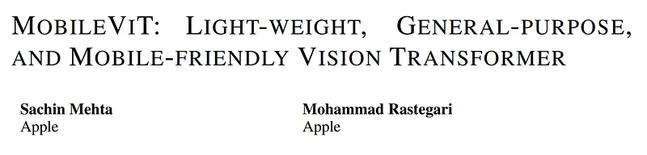
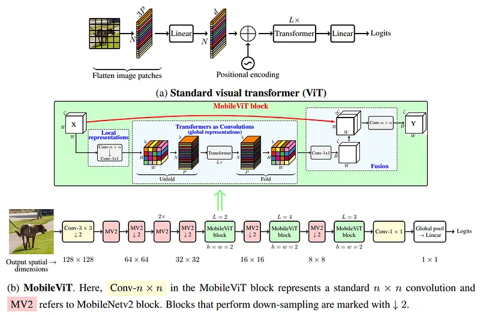
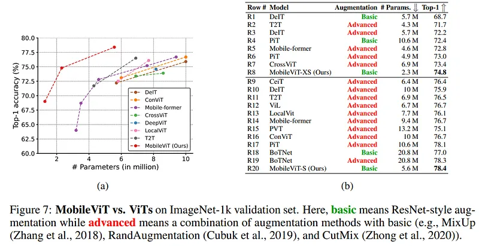
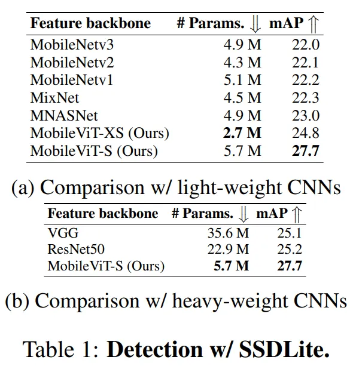
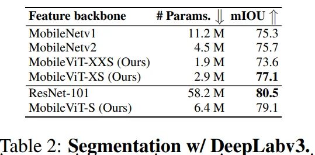
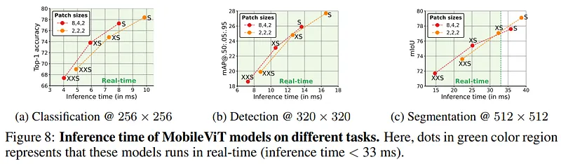

# Papers Explained 40 - MobileViT

MobileViT is a light-weight and general-purpose vision transformer for mobile devices. MobileViT presents a different perspective for the global processing of information with transformers.

This page ingests the source article into the wiki and connects it to [[Papers Explained Corpus]], [[Computer Vision]], [[Model Compression and Efficiency]], [[Large Language Models]], [[Synthetic Data]].

## Source Metadata

- Source file: `raw/2023-04-03_Papers-Explained-40--MobileViT-4793f149c434.md`
- Source title: Papers Explained 40: MobileViT
- Published: 2023-04-03
- Canonical: [https://medium.com/@ritvik19/papers-explained-40-mobilevit-4793f149c434](https://medium.com/@ritvik19/papers-explained-40-mobilevit-4793f149c434)

## Key Ideas

- The core idea of MobileViT is to learn global representations with transformers as convolutions.
- The MobileViT block, aims to model the local and global information in an input tensor with fewer parameters.
- To enable MobileViT to learn global representations with spatial inductive bias, we unfold XL into N non-overlapping flattened patches XU. For each p, inter-patch relationships are encoded by applying transformers to obtain XG
- Unlike ViTs that lose the spatial order of pixels, MobileViT neither loses the patch order nor the spatial order of pixels within each patch. Therefore, we can fold XG to obtain XF.
- The computational cost of multi-headed self-attention in MobileViT and ViTs is O(N²P d) and O(N²d), respectively. In theory, MobileViT is inefficient as compared to ViTs. However, in practice, MobileViT is more efficient than ViTs.

## Notes

MobileViT is a light-weight and general-purpose vision transformer for mobile devices. MobileViT presents a different perspective for the global processing of information with transformers.

A standard ViT model reshapes the input X into a sequence of flattened patches Xf, projects it into a fixed d-dimensional space Xp, and then learns inter-patch representations using a stack of L transformer blocks. The computational cost of self-attention in vision transformers is O(N²d). Because these models ignore the spatial inductive bias that is inherent in CNNs, they require more parameters to learn visual representations. Also, in comparison to CNNs, these models exhibit substandard optimizability. These models are sensitive to L2 regularization and require extensive data augmentation to prevent overfitting.

The core idea of MobileViT is to learn global representations with transformers as convolutions. This allows us to implicitly incorporate convolution-like properties (e.g., spatial bias) in the network, learn representations with simple training recipes (e.g., basic augmentation), and easily integrate MobileViT with downstream architectures.

## Architecture

### MobileViT block

The MobileViT block, aims to model the local and global information in an input tensor with fewer parameters. Formally, for a given input tensor X, MobileViT applies a n × n standard convolutional layer followed by a point-wise (or 1×1) convolutional layer to produce XL. The n×n convolutional layer encodes local spatial information while the point-wise convolution projects the tensor to a high-dimensional space (or d-dimensional, where d > C) by learning linear combinations of the input channels.

To enable MobileViT to learn global representations with spatial inductive bias, we unfold XL into N non-overlapping flattened patches XU. For each p, inter-patch relationships are encoded by applying transformers to obtain XG

Unlike ViTs that lose the spatial order of pixels, MobileViT neither loses the patch order nor the spatial order of pixels within each patch. Therefore, we can fold XG to obtain XF. XF is then projected to low C-dimensional space using a point-wise convolution and combined with X via concatenation operation. Another n × n convolutional layer is then used to fuse these concatenated features.

### Relationship to convolutions

Standard convolutions can be viewed as a stack of three sequential operations: (1) unfolding, (2) matrix multiplication (to learn local representations), and (3) folding. MobileViT block is similar to convolutions in the sense that it also leverages the same building blocks. MobileViT block replaces the local processing (matrix multiplication) in convolutions with deeper global processing (a stack of transformer layers). As a consequence, MobileViT has convolution-like properties (e.g., spatial bias). Hence, the MobileViT block can be viewed as transformers as convolutions.

### Computational cost

The computational cost of multi-headed self-attention in MobileViT and ViTs is O(N²P d) and O(N²d), respectively. In theory, MobileViT is inefficient as compared to ViTs. However, in practice, MobileViT is more efficient than ViTs. MobileViT has 2× fewer FLOPs and delivers 1.8% better accuracy than DeIT on the ImageNet-1K dataset.

### MobileViT architecture

Our networks are inspired by the philosophy of lightweight CNNs. We train MobileViT models at three different network sizes (S: small, XS: extra small, and XXS: extra extra small) that are typically used for mobile vision tasks.

The initial layer in MobileViT is a strided 3 × 3 standard convolution, followed by MobileNetv2 (or MV2) blocks and MobileViT blocks.

We use Swish as an activation function. Following CNN models, we use n = 3 in the MobileViT block. The spatial dimensions of feature maps are usually multiples of 2 and h, w ≤ n. Therefore, we set h = w = 2 at all spatial levels.

## Implementation details and Experimental Results

### Image Classification

We train MobileViT models from scratch on the ImageNet-1k classification dataset.

Overall, these results show that similar to CNNs, MobileViTs are easy and robust to optimize. Therefore, they can be easily applied to new tasks and datasets.

### Mobile Object Detection

We integrate MobileViT with a single-shot object detection backbone. We finetune MobileViT, pre-trained on the ImageNet-1k dataset, at an input resolution of 320 × 320 on the MS-COCO dataset.

### Mobile Semantic Segmentation

We integrate MobileViT with DeepLabv3. We finetune MobileViT on the PASCAL VOC 2012 dataset.

## Performance on Mobile Devices

## Paper

MobileViT: Light-weight, General-purpose, and Mobile-friendly Vision Transformer [2110.02178](https://arxiv.org/abs/2110.02178)

Recommended Reading [Vision Transformers](https://ritvik19.medium.com/list/vision-transformers-61e6836230f1)

## Figures

Figures from the Medium HTML export (`raw/2023-04-03_Papers-Explained-40--MobileViT-4793f149c434.md`); local copies under `wiki/assets/papers-explained-40-mobilevit/` when download succeeded.

| Figure | Caption |
|--------|---------|
|  | Title card: MobileViT. |
|  | The core idea of MobileViT is to learn global representations with transformers as convolutions. |
|  | To enable MobileViT to learn global representations with spatial inductive bias, we unfold XL into N non-overlapping flattened patches XU. |
|  | We train MobileViT models from scratch on the ImageNet-1k classification dataset. |
|  | We integrate MobileViT with a single-shot object detection backbone. |
|  | We integrate MobileViT with DeepLabv3. |
|  | We integrate MobileViT with DeepLabv3. |
## Related

- [[Papers Explained Corpus]]
- [[Computer Vision]]
- [[Model Compression and Efficiency]]
- [[Large Language Models]]
- [[Synthetic Data]]
- [[Papers Explained 39 - DeiT]]
- [[Papers Explained 41 - LAMBERT]]

#summary #topic
