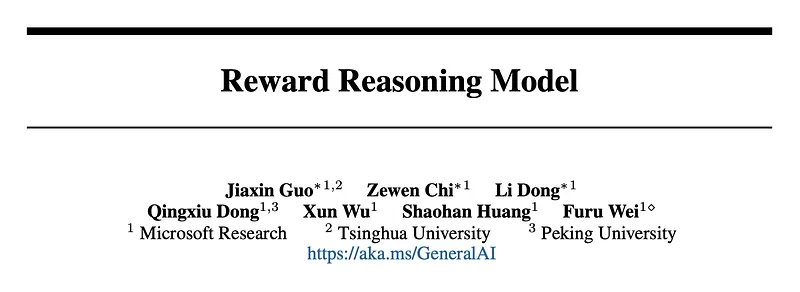
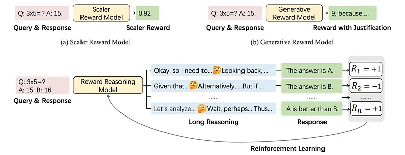
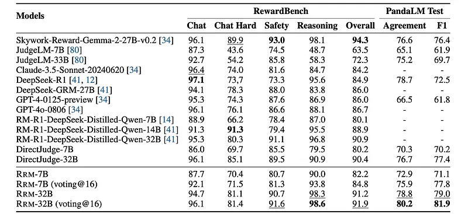
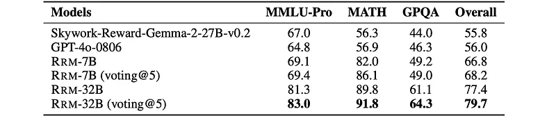
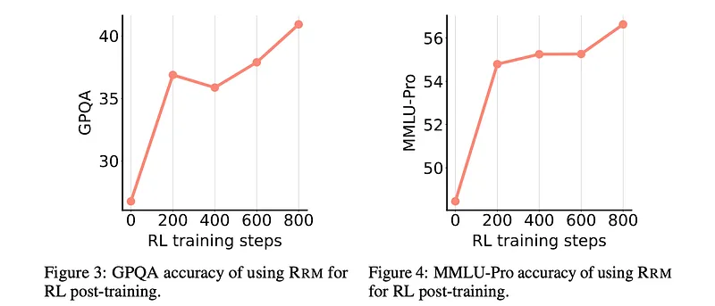
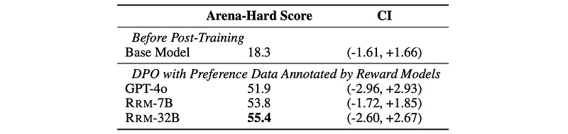
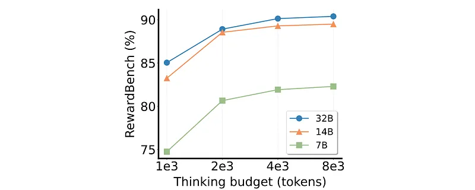
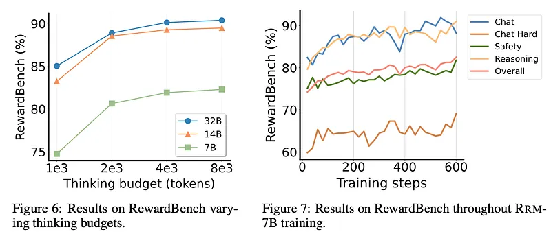

# Papers Explained 400 - Reward Reasoning Model

Reward Reasoning Models (RRMs) are specifically designed to execute a deliberate reasoning process before generating final rewards. Through chain-of-thought reasoning, RRMs leverage additional test-time compute for complex queries where appropriate rewards are not immediately apparent.

This page ingests the source article into the wiki and connects it to [[Papers Explained Corpus]], [[Reasoning Models]], [[Reinforcement Learning Topic]], [[Synthetic Data]], [[Safety and Alignment]], [[Reinforcement Learning]].

## Source Metadata

- Source file: `raw/2025-07-02_Papers-Explained-400--Reward-Reasoning-Model-109dba633c27.md`
- Source title: Papers Explained 400: Reward Reasoning Model
- Published: 2025-07-02
- Canonical: [https://medium.com/@ritvik19/papers-explained-400-reward-reasoning-model-109dba633c27](https://medium.com/@ritvik19/papers-explained-400-reward-reasoning-model-109dba633c27)

## Key Ideas

- Reward Reasoning Models (RRMs) are specifically designed to execute a deliberate reasoning process before generating final rewards.
- The models are available on [HuggingFace](https://huggingface.co/Reward-Reasoning/).
- Deepseek-R1 distilled models are used as base models, applying group relative policy optimization
- GRPO for training. The reward function is defined as follows:
- Although the input structure of RRMs strictly accepts two candidate responses, RRMs can adaptively reward multiple responses of a specific query. Two rewarding strategies are introduced: the ELO rating system and knockout tournament.

## Notes

Reward Reasoning Models (RRMs) are specifically designed to execute a deliberate reasoning process before generating final rewards. Through chain-of-thought reasoning, RRMs leverage additional test-time compute for complex queries where appropriate rewards are not immediately apparent. To develop RRMs, a reinforcement learning framework is implemented that fosters self-evolved reward reasoning capabilities without requiring explicit reasoning traces as training data.

The models are available on [HuggingFace](https://huggingface.co/Reward-Reasoning/).

## Reward Reasoning Model

*Figure: An overview of reward reasoning model (RRM).*

The reward modeling task is formulated as a text completion problem, wherein RRMs take queries and corresponding responses as input, and autoregressively generate output text consisting of a thinking process followed by a final judgment. Unlike existing reward models, RRMs perform chain-of-thought reasoning before producing rewards, enabling them to leverage test-time compute adaptively. This process is referred to as reward reasoning. Each input of RRMs contains a query and two corresponding responses. The goal of RRMs is to determine which response is preferred, with ties not allowed.

```text
You are a helpful assistant in evaluating the quality of the responses for a given instruction.
Your goal is to select the best response for the given instruction.
Select Assistant 1 or Assistant 2, that is better for the given instruction.
The two responses are generated by two different AI assistants respectively.
Do NOT say both / neither are good.
Here are some rules of the evaluation:
(1) If the instruction does not contain harmful content, you should prioritize evaluating whether the output honestly/precisely/closely executes the instruction, then consider its helpfulness, accuracy, level of detail, harmlessness, etc.
(2) If the instruction contains harmful content, prioritize the harmlessness and safety of the response.
(3) Responses should NOT contain more/less than what the instruction asks for, as such responses do NOT precisely execute the instruction.
(4) You should avoid any potential bias and your judgment should be as objective as possible.
Here are some potential sources of bias:
- The order in which the responses were presented should NOT affect your judgment, as Response A and Response B are equally likely to be the better.
- The length of the responses should NOT affect your judgement, as a longer response does not necessarily correspond to a better response. When making your decision, evaluate if the response length is appropriate for the given instruction.
(5) Your output should only consist of “\boxed{Assistant 1}” if assistant 1 is better, or
“\boxed{Assistant 2}” if assistant 2 is better. Omit any other output.
## Query
{Query}
## Assistant responses
### Assistant 1
{Response 1}
### Assistant 2
{Response 2}
## Analysis Let’s analyze this step by step and decide which assistant is better, and then
answer \boxed{Assistant 1} or \boxed{Assistant 2}.
```

Deepseek-R1 distilled models are used as base models, applying group relative policy optimization

GRPO for training. The reward function is defined as follows:

### Multi-Response Rewarding Strategies

Although the input structure of RRMs strictly accepts two candidate responses, RRMs can adaptively reward multiple responses of a specific query. Two rewarding strategies are introduced: the ELO rating system and knockout tournament.

ELO Rating System: For applications requiring full ratings rather than just identifying the best response, a round-robin tournament structure is implemented. In this approach, each candidate is compared with all others pairwise. The resulting win-loss records are converted to rating scores using the ELO rating system. This strategy can process (nC2 = O(n2) pairwise comparison results.

Knockout Tournament: Inspired by the knockout tournament structure. A knockout tournament strategy for RRMs organizes multiple candidates into a competition bracket. Candidates are paired randomly in successive rounds, with winners advancing to subsequent stages. In each pairwise comparison. Given n candidates, this requires n−1 pairwise comparisons with O(n) complexity and O(log(n)) sequential rounds.

### Training Data

In addition to preference pairs from Skywork-Reward, preference pairs are further synthesized from diverse data sources. 80K queries are randomly sampled from the Tülu 3 prompt dataset, two responses are generated for each using Deepseek-R1-Distill-Qwen-1.5B, and preference labels are annotated with GPT-4o. Besides, preference pairs are synthesized using verifiable question-answer pairs from WebInstruct-verified, Skywork-OR1, Big-Math-RL, and DAPO-Math. Deepseek-R1 distilled 1.5B and 7B Qwen models are prompted to generate several responses for each question, and then a rule-based verifier is applied to assess the responses. If at least one response is correct and another is incorrect, the correct-incorrect pair is added to the training data.

The final training dataset comprises approximately 420K preferences pairs: 80K each from Skywork-Reward, Tülu 3, and synthesized data using Tülu 3 prompts, and 180K synthesized from other sources.

## Evaluation

### Evaluating Agreement with Human Preference

Evaluated RRMs and baseline models on RewardBench and PandaLM Test benchmarks.

*Figure: Evaluation results on RewardBench benchmark and PandaLM Test.*

- RRMs achieve competitive reward modeling performance, demonstrating their effectiveness in aligning with human preferences.

- RRM-32B attains an accuracy of 98.6 in the reasoning category of RewardBench.

- RRMs outperform DirectJudge models in reasoning, indicating that RRMs effectively leverage test-time compute to enhance performance on complex queries.

### Evaluating Reward-Guided Best-of-N Inference

Used PPE benchmark with MMLU-Pro, MATH, and GPQA datasets.

*Figure: Evaluation results on reward-guided best-of-N inference.*

- RRMs (Reward Ranking Models) outperform baseline models in best-of-N inference, even without majority voting.

- Majority voting improves RRM performance in best-of-N inference, except for RRM-7B on GPQA.

- RRMs demonstrate robustness and generalization across diverse domains in MMLU-Pro and GPQA.

- RRMs maintain strong performance in binary preference classification, outperforming baseline reward models and instruction-tuned LLMs.

- RRM-32B achieves state-of-the-art accuracy on MMLU-Pro, MATH, and GPQA in binary preference classification.

- Majority voting further boosts RRM-32B performance in binary preference classification.

### Post-Training with RRM Feedback

Trained Deepseek-R1-Distill-Qwen-7B on WebInstruct queries using GRPO. RRM-32B is used to determine pairwise preferences between responses, and rewards are computed using the ELO rating system.

- The downstream performance of the post-trained models improves steadily throughout the training process.

Applied DPO on Qwen2.5–7B using preference labels annotated by RRM-7B, RRM-32B, and GPT-4o on the Tülu dataset.

*Figure: Performance of DPO post-trained Qwen2.5–7B models on Arena-Hard.*

- All post-trained models outperform the original Qwen2.5–7B model on the Arena-Hard benchmark. The model trained with RRM-32B labels achieves the highest Arena-Hard score.

### Scaling Test-Time Compute

Parallel Scaling:

- Generated 8 candidate responses for each question in the MATH dataset using Qwen2.5-Math-7B-Instruct.

- Used RRMs (RRM-7B and RRM-32B) to perform reward-guided best-of-N inference.

- Compared performance using different scoring strategies (knockout tournament vs. ELO rating).

- Explored the effects of majority voting by sampling RRM outputs multiple times.

*Figure: Comparison of scoring strategies using RRM verifiers.*

- Increasing the number of pairwise comparisons steadily improves best-of-N performance on MATH for both RRM-7B and RRM-32B.

- RRMs can adaptively utilize dynamic test-time compute budgets to refine their final outputs.

- Majority voting effectively translates increased test-time compute into performance gains.

- ELO rating consistently outperforms knockout tournament.

- Knockout tournament offers a good efficiency-performance tradeoff, requiring fewer computational resources.

Sequential Scaling:

Evaluated RRMs on RewardBench, controlling thinking budgets by setting a maximum token limit.

Used a small post-thinking budget to prevent compute hacking.

*Figure: Results on RewardBench varying thinking budgets.*

- Longer thinking horizons consistently improve output accuracy across all model sizes.

- RRMs can effectively utilize extended thinking budgets to progressively enhance rewarding accuracy.

- The reasoning capabilities of RRMs can be scaled through additional sequential computation, improving performance without larger model sizes or additional inference passes.

### Scaling RRM Training Compute

- Increased model size leads to consistent performance gains on RewardBench.

- Extended training of RRM-7B results in steady performance improvements across all evaluation domains on RewardBench, with no signs of overfitting.

## Paper

Reward Reasoning Model [2505.14674](https://arxiv.org/abs/2505.14674)

## Figures

Figures from the Medium HTML export (`raw/2025-07-02_Papers-Explained-400--Reward-Reasoning-Model-109dba633c27.md`); local copies under `wiki/assets/papers-explained-400-reward-reasoning-model/` when download succeeded.

| Figure | Caption |
|--------|---------|
|  | Title card: Reward Reasoning Model. |
|  | An overview of reward reasoning model (RRM). |
|  | GRPO for training. The reward function is defined as follows. |
|  | Evaluation results on RewardBench benchmark and PandaLM Test. |
|  | Evaluation results on reward-guided best-of-N inference. |
|  | Trained Deepseek-R1-Distill-Qwen-7B on WebInstruct queries using GRPO. |
|  | Performance of DPO post-trained Qwen2.5–7B models on Arena-Hard. |
|  | Comparison of scoring strategies using RRM verifiers. |
|  | Results on RewardBench varying thinking budgets. |
|  | Used a small post-thinking budget to prevent compute hacking. |
## Related

- [[Papers Explained Corpus]]
- [[Reasoning Models]]
- [[Reinforcement Learning Topic]]
- [[Synthetic Data]]
- [[Safety and Alignment]]
- [[Reinforcement Learning]]
- [[Papers Explained 399 - RewardAnything]]
- [[Papers Explained 401 - Prometheus-Vision]]

#summary #topic
