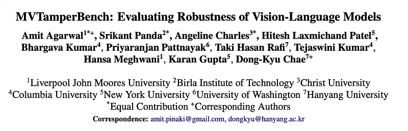
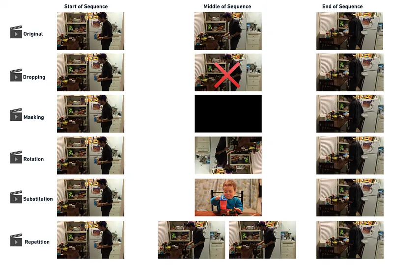
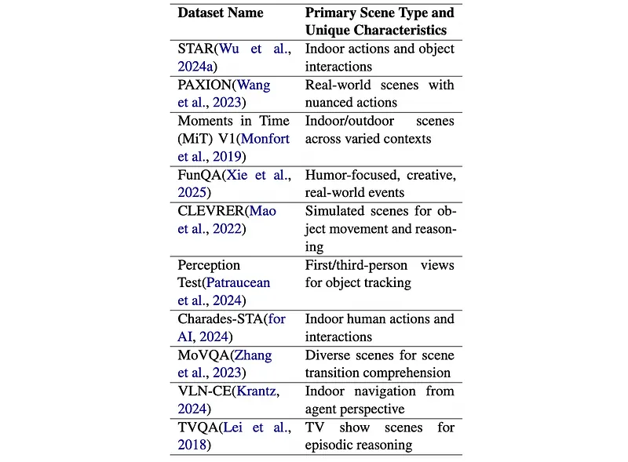
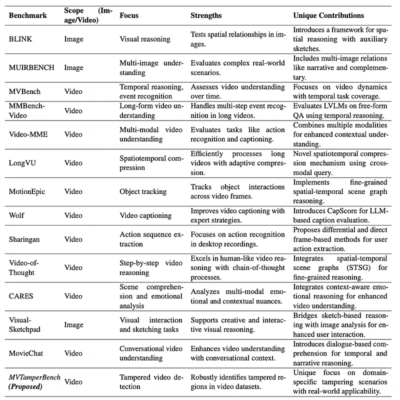
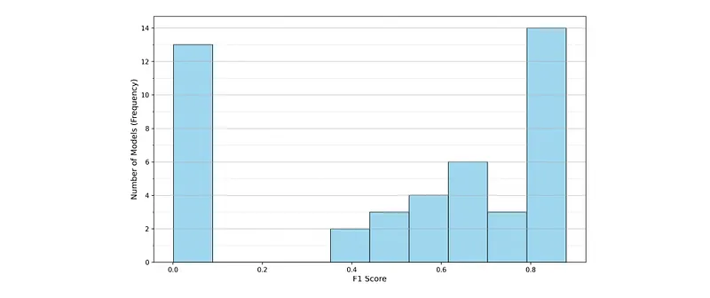
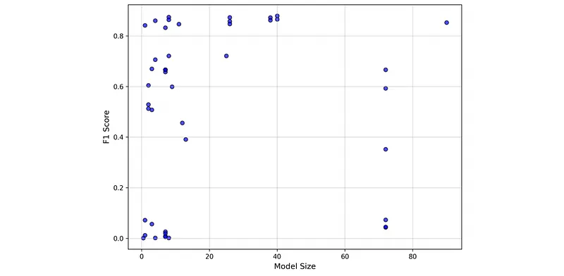
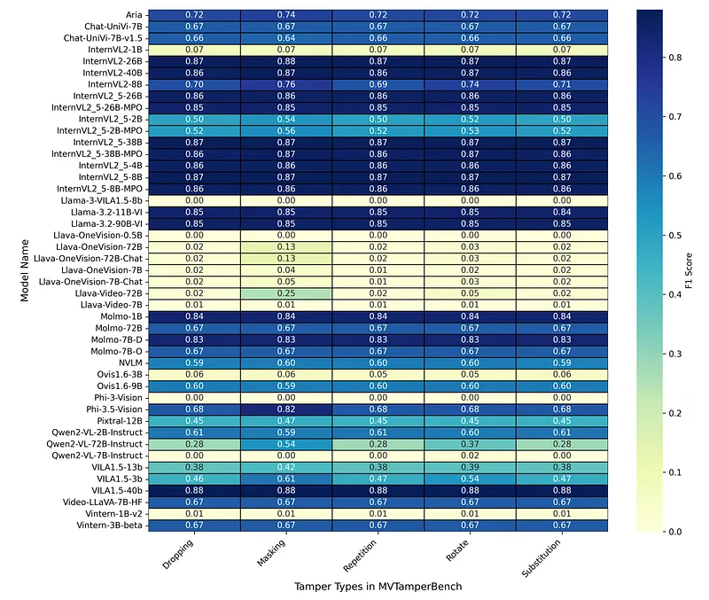
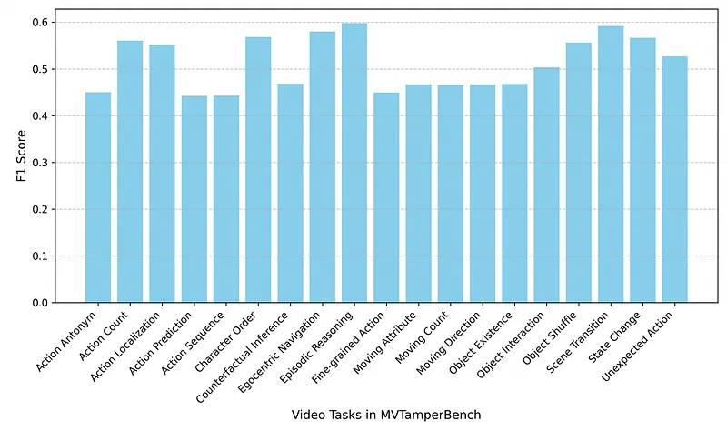

# Papers Explained 402 - MVTamperBench

MVTamperBench is a benchmark that systematically evaluates MLLM robustness against five prevalent tampering techniques: rotation, masking, substitution, repetition, and dropping; based on real-world visual tampering scenarios such as surveillance interference, social media content edits, and misinformation injection.

This page ingests the source article into the wiki and connects it to [[Papers Explained Corpus]], [[Evaluation and Benchmarks]], [[Vision Language Models]], [[Synthetic Data]].

## Source Metadata

- Source file: `raw/2025-07-04_Papers-Explained-402--MVTamperBench-828a22e9e0b9.md`
- Source title: Papers Explained 402: MVTamperBench
- Published: 2025-07-04
- Canonical: [https://medium.com/@ritvik19/papers-explained-402-mvtamperbench-828a22e9e0b9](https://medium.com/@ritvik19/papers-explained-402-mvtamperbench-828a22e9e0b9)

## Key Ideas

- MVTamperBench is a benchmark that systematically evaluates MLLM robustness against five prevalent tampering techniques: rotation, masking, substitution, repetition, and dropping;
- The following tampering methods are applied to the 3,487 original MVBench videos (excluding NTU dataset due to licensing), resulting in a total of 17,435 tampered clips.
- Dropping: Removes a 1-second segment for creating temporal discontinuity.
- Masking: Overlays a black rectangle on a 1-second segment. It aims to simulate visual data loss.
- Rotation: Rotates a 1-second segment by 180 degrees for introducing spatial distortion.

## Notes

MVTamperBench is a benchmark that systematically evaluates MLLM robustness against five prevalent tampering techniques: rotation, masking, substitution, repetition, and dropping; based on real-world visual tampering scenarios such as surveillance interference, social media content edits, and misinformation injection. MVTamperBench comprises 3.4K original videos, expanded into over 17K tampered clips covering 19 distinct video manipulation tasks.

## MVTamperBench

The following tampering methods are applied to the 3,487 original MVBench videos (excluding NTU dataset due to licensing), resulting in a total of 17,435 tampered clips.

- Dropping: Removes a 1-second segment for creating temporal discontinuity.

- Masking: Overlays a black rectangle on a 1-second segment. It aims to simulate visual data loss.

- Rotation: Rotates a 1-second segment by 180 degrees for introducing spatial distortion.

- Substitution: Replaces a 1-second segment with a pre-selected clip from another video, in order to disrupt temporal and contextual flow.

- Repetition: Repeats a 1-second segment, introducing temporal redundancy.

*Figure: Illustration of the five video frame tampering techniques.*

- Tampering Duration: The tampering duration is fixed at 1 second. This durationias chosen because shorter durations might be overlooked by model sampling mechanisms, while longer durations could resemble normal scene transitions.

- Tampering Location: All manipulations occur at the video’s midpoint to disrupt central content. Tampering near the start or end could be mistaken for scene cuts or information loss.

- Substitution Source: For the Substitution tampering type, the 1-second clip is randomly chosen from a consistent pool of different videos within MVBench to ensure uniform difficulty.

*Figure: Summary of Datasets in MVTamperBench.*

*Figure: Comparison between Video and Image Analysis Benchmarks.*

### Evaluation Protocol

Each model is tasked with identifying whether a video has been tampered with or not. For every video, the model is presented with the following structured prompt:

```text
Does this video exhibit any signs of tampering, such as corruption, blackouts, rotated frames, repeated frames, or swapped frames?
Options: A. Yes B. No
```

The primary evaluation metric is the F1 Score, chosen for its ability to balance precision and recall, particularly in scenarios where misclassifications (false positives and false negatives) can significantly impact robustness evaluation.

## Evaluation

*Figure: Distribution of F1 (overall) scores across models.*

- Evaluation of 45 MLLMs revealed significant variability in their robustness, with some models performing poorly (F1 < 0.2) and a few achieving high performance (F1 > 0.8).

*Figure: Scatter plot between model size and overall F1.*

- There is no significant correlation observed between model size and tampering detection performance (Pearson r=0.05), suggesting that architectural differences and training techniques contribute more significantly to robustness than parameter count.

*Figure: F1 scores across models and tampering types.*

- High-performing models (F1 (overall) > 0.8) demonstrated consistent robustness across all tampering types.

- Low-performing models (F1 < 0.2) performed slightly better on Masking (which relies more on spatial reasoning) but generally struggled with temporal disruptions like Dropping and Substitution.

*Figure: F1 (overall) scores for task categories in MVTamperBench.*

- F1 (overall) scores varied significantly across the 19 video task categories in MVTamperBench.

- Easier Tasks: Tasks like Episodic Reasoning, Scene Transition, Ego-centric Navigation, and State Change consistently achieved higher F1 scores, as they involve shorter temporal dependencies and simpler spatial reasoning, allowing models to leverage pre-trained vision-language features.

- Challenging Tasks: Tasks such as Action Prediction, Counterfactual Inference, and Fine-Grained Action posed significant challenges for tampering detection, as they inherently require complex temporal reasoning and context preservation, making them highly sensitive to disruptions.

## Paper

MVTamperBench: Evaluating Robustness of Vision-Language Models [2412.19794](https://arxiv.org/abs/2412.19794)

## Figures

Figures from the Medium HTML export (`raw/2025-07-04_Papers-Explained-402--MVTamperBench-828a22e9e0b9.md`); local copies under `wiki/assets/papers-explained-402-mvtamperbench/` when download succeeded.

| Figure | Caption |
|--------|---------|
|  | Title card: MVTamperBench. |
|  | Illustration of the five video frame tampering techniques. |
|  | Summary of Datasets in MVTamperBench. |
|  | Comparison between Video and Image Analysis Benchmarks. |
|  | Distribution of F1 (overall) scores across models. |
|  | Scatter plot between model size and overall F1. |
|  | F1 scores across models and tampering types. |
|  | F1 (overall) scores for task categories in MVTamperBench. |
## Related

- [[Papers Explained Corpus]]
- [[Evaluation and Benchmarks]]
- [[Vision Language Models]]
- [[Synthetic Data]]
- [[Papers Explained 401 - Prometheus-Vision]]
- [[Papers Explained 403 - Crosslingual Reasoning through Test-Time Scaling]]

#summary #topic
