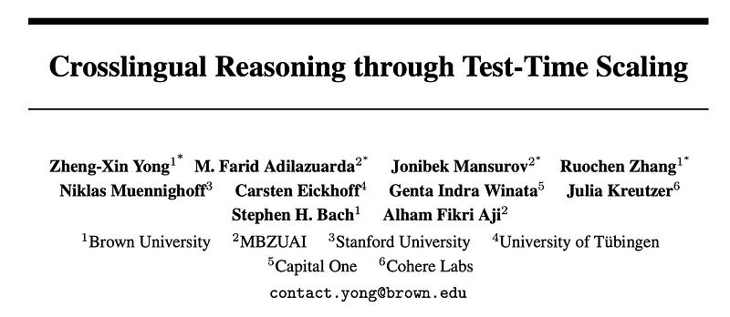
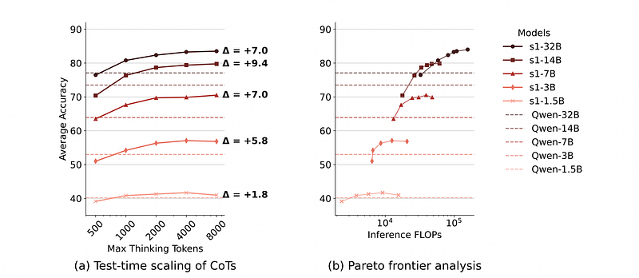
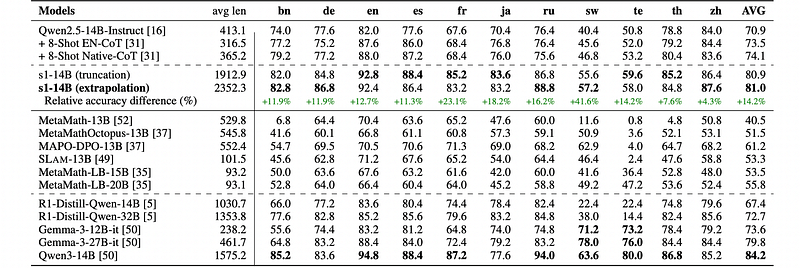
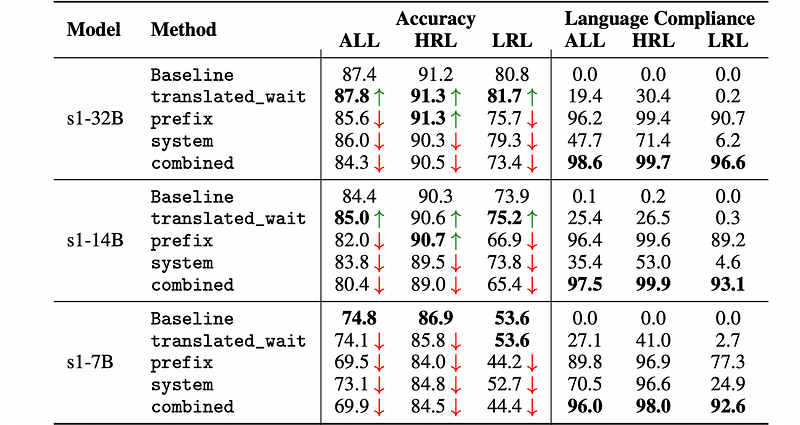
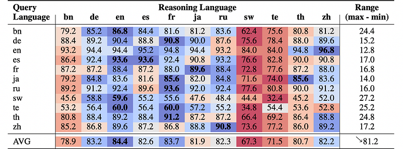
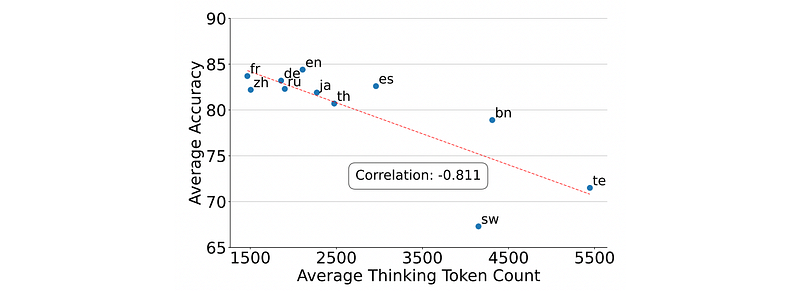
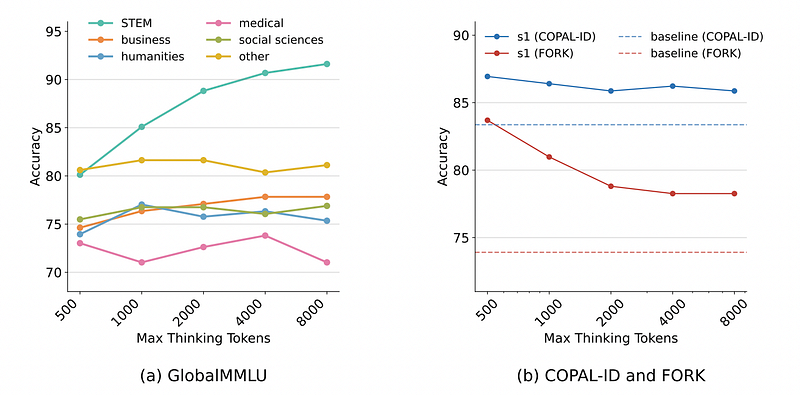

# Papers Explained 403 - Crosslingual Reasoning through Test-Time Scaling

This work investigates how much test-time compute can improve multilingual reasoning abilities of English-centric RLMs. Research questions include:

This page ingests the source article into the wiki and connects it to [[Papers Explained Corpus]], [[Reasoning Models]], [[Multilingual Models]].

## Source Metadata

- Source file: `raw/2025-07-07_Papers-Explained-403--Crosslingual-Reasoning-through-Test-Time-Scaling-ee069fcca028.html`
- Source title: Papers Explained 403: Crosslingual Reasoning through Test-Time Scaling
- Published: 2025-07-07
- Canonical: [https://medium.com/@ritvik19/papers-explained-403-crosslingual-reasoning-through-test-time-scaling-ee069fcca028](https://medium.com/@ritvik19/papers-explained-403-crosslingual-reasoning-through-test-time-scaling-ee069fcca028)

## Key Ideas

- RQ1. Crosslingual test-time scaling: How effective is test-time scaling of English-centric RLMs on multilingual reasoning tasks?
- RQ2. Language-mixing behaviors: What kind of language-mixing patterns do English-centric RLMs exhibit when they interact with non-English prompts?
- RQ3. Language forcing: How well do English-centric RLMs perform when being forced to think in non-English languages?
- RQ4. Cross-domain generalization: How well does crosslingual reasoning generalize beyond the original STEM domain, such as humanities and social sciences?
- Models: s1.1 models, which are multilingual Qwen2.5-Instruct models finetuned on 1k English-only reasoning data generated by DeepSeek-R1 are used for two reasons:

## Notes

This work investigates how much test-time compute can improve multilingual reasoning abilities of English-centric RLMs. Research questions include:

- RQ1. Crosslingual test-time scaling: How effective is test-time scaling of English-centric RLMs on multilingual reasoning tasks?

- RQ2. Language-mixing behaviors: What kind of language-mixing patterns do English-centric RLMs exhibit when they interact with non-English prompts?

- RQ3. Language forcing: How well do English-centric RLMs perform when being forced to think in non-English languages?

- RQ4. Cross-domain generalization: How well does crosslingual reasoning generalize beyond the original STEM domain, such as humanities and social sciences?

## Experimental Setup

Models: s1.1 models, which are multilingual Qwen2.5-Instruct models finetuned on 1k English-only reasoning data generated by DeepSeek-R1 are used for two reasons:

- Their English mathematical reasoning capability reaches state-of-the-art performance

- The models and the training data are fully open-sourced. Experiments are conducted with s1 models at different scales — specifically with 1.5B, 3B, 7B, 14B, and 32B parameters.

Budget forcing: Budget forcing refers to techniques for controlling inference budget for long Chains of Thought (CoTs). This can be done in two ways: truncation, which cuts off long CoTs after they reach maximum thinking tokens, or extrapolation, which adds tokens such as “Wait” at the end of CoTs to force the model to continue reasoning. In the extrapolation setup, adding “Wait” only once is experimented with since significant performance gains from lengthening CoTs are not observed.

Evaluation data:

For RQ1, RQ2, and RQ3, the Multilingual Grade School Math (MGSM) benchmark is used. It contains 250 grade-school math problems from the GSM8K dataset that have been manually translated into ten languages — Bengali (bn), German (de), Spanish (es), French (fr), Japanese (ja), Russian (ru), Swahili (sw), Telugu (te), Thai (th), and Mandarin Chinese (zh).

For RQ4, three different cross-domain benchmarks are evaluated:

- Global-MMLU: a multilingual translated version of the original MMLU dataset that spans different subject topics, including STEM, business, humanities, medical, social sciences, etc. Additionally, it also contains annotations that identify whether the question is culturally agnostic or specific, allowing for more fine-grained analysis.

- Food ORiented cultural commonsense Knowledge (FORK): a manually-curated set of commonsenseQA-style questions in English for probing cultural biases and assumptions on food-related customs around the world.

- COPAL-ID: a manually-curated datasets following COPA’s causal reasoning format in Indonesian languages to evaluate causal reasoning with Indonesian cultural nuances.

## RQ1: Crosslingual test-time scaling

*Figure: Crosslingual test-time scaling of s1 and Qwen models on the MGSM benchmark (excluding English) across different model sizes*

- s1 models outperform Qwen’s few-shot prompting baseline across languages in MGSM (excluding English) when given a high inference thinking budget.

- The 14B model offers a good balance between accuracy and computational cost compared to the 32B model.

- s1 models with cross-lingual test-time scaling show substantial accuracy increases compared to Qwen2.5 baselines.

*Figure: MGSM performance comparison against 14B-sized s1 model with maximum 8k thinking tokens.*

- Crosslingual test-time scaling benefits both high-resource and low-resource languages.

- Truncation and extrapolation budget forcing strategies show similar performance.

Conclusions:

- Sufficient model capacity (at least 3B parameters) is necessary for effective crosslingual test-time scaling.

- Training on large amounts of English and Chinese data can lead to catastrophic forgetting of lower-resource languages.

## RQ2: Language-mixing behaviors

The language used by the s1 model (and its base model Qwen) when answering math questions in four languages (Japanese, Russian, Thai, and Chinese) is examined. The analysis focused on identifying the dominant language in the model’s responses and characterizing the patterns of language mixing within the reasoning process.

*Figure: Proportion of dominant languages in models’ entire responses when queried with multilingual math questions*

- The s1 model, after finetuning on English reasoning data, generates responses with English as the dominant language, even when the questions are in other languages. In contrast, the base model Qwen tends to generate responses in the same language as the question.

*Figure: Breakdown of language-mixing patterns in s1’s reasoning.*

- The dominant language-mixing pattern in s1’s reasoning is “quote-and-think,” where the model quotes phrases from the input question (in the original language) and then interprets them in English.

- Russian exhibits the most intersentential language-mixing.

- Intrasentential language-mixing is also dominated by the quote-and-think pattern.

Conclusions:

- Fine Tuning on a relatively small amount of English reasoning data can significantly shift a multilingual model’s behavior to become English-dominant.

- The “quote-and-think” pattern suggests that the model is not simply translating the question but genuinely parsing and reasoning about the mathematical relationships expressed in the original language. The multilingual capability of the base models is preserved for natural language understanding and allows s1 to reason about what it has understood about the question.

- The model has developed a sophisticated strategy for handling multilingual mathematical reasoning by leveraging its understanding of the original language while primarily reasoning in English.

## RQ3. Language forcing

Different language forcing techniques are experimented with on the MGSM benchmark using 11 languages. The model is forced to reason in a language (k’) given a question in another language (k). Task accuracy and language compliance (proportion of tokens generated in the intended language) are used for evaluation. Various language forcing strategies are compared: translated_wait, prefix, system prompt, and combined. The baseline involved the models thinking in English using the combined setup.

- Reasoning in high-resource languages (HRLs) achieves similar accuracy to the English baseline, regardless of the language forcing strategy. This suggests effective crosslingual transfer from English reasoning finetuning.

- For low-resource languages (LRLs), the combined strategy (using all forcing techniques) underperforms the baseline, indicating that English reasoning finetuning doesn’t transfer as well to LRLs.

- Strategies that allow a mix of English and the target language (e.g., translated_wait, system) outperform strict in-language approaches (combined) for LRLs.

- There’s a trade-off between accuracy and language compliance. Achieving high language compliance often comes at the cost of task performance.

*Figure: Performance scores across different reasoning languages given query language.*

- Reasoning in HRLs (English, French, German) yields similarly high performance. English is the most performant reasoning language, followed by French.

- Chinese is not necessarily the best reasoning language, even when the question is in Chinese.

- Reasoning in English or the query language doesn’t always yield the best performance.

- Lower-resourced languages (Swahili, Telugu) result in substantially lower overall accuracy.

*Figure: MGSM accuracy against number of thinking tokens in s1 models’ outputs in different reasoning languages.*

- There’s a significant negative correlation between token count and mathematical problem-solving accuracy. Reasoning in LRLs requires more computational resources (tokens) and underperforms HRLs.

- Translating inputs into HRLs (e.g., French) can boost accuracy, even when the model reasons in that language.

- The model is less sensitive to query language in HRLs than in LRLs. Querying in HRLs increases consistency in achieving the correct answer with different reasoning languages.

## RQ4. Cross-domain generalization

The performance of the s1 model, trained on English-only data, is evaluated on cross-domain benchmarks. Test-time scaling of thinking tokens is used as a key evaluation technique.

*Figure: Effects of thinking time for s1 models on different domains of Global-MMLU benchmark.*

- In-domain (STEM) generalization: s1 outperforms the base model (Qwen2.5–32B-Instruct) on STEM subjects in Global-MMLU, with significant accuracy gains in some languages (e.g., bn, sw). Test-time scaling of thinking tokens further improves performance in STEM domains.

- Out-of-domain (non-STEM) generalization: Reasoning finetuning benefits are domain-specific. Some domains (business, social sciences) show slight improvements, while others (medical) experience a decrease in accuracy. Minimal cross-domain generalization of test-time scaling was observed.

- Cultural-specific knowledge and reasoning: Minimal benefits of test-time scaling were observed. Increasing thinking tokens can lead to poorer performance (overthinking). No clear pattern was found regarding which type (culture-specific or culture-agnostic) benefits the most from s1-training.

## Paper

Crosslingual Reasoning through Test-Time Scaling [2505.05408](https://arxiv.org/abs/2505.05408)

## Figures

Figures from the Medium HTML export (`raw/2025-07-07_Papers-Explained-403--Crosslingual-Reasoning-through-Test-Time-Scaling-ee069fcca028.html`); local copies under `wiki/assets/papers-explained-403-crosslingual-reasoning-through-test-time-scaling/` when download succeeded.

| Figure | Caption |
|--------|---------|
|  | Title card: Crosslingual Reasoning through Test-Time Scaling. |
|  | Crosslingual test-time scaling of s1 and Qwen models on the MGSM benchmark (excluding English) across different model sizes. |
|  | MGSM performance comparison against 14B-sized s1 model with maximum 8k thinking tokens. |
|  | Proportion of dominant languages in models’ entire responses when queried with multilingual math questions. |
|  | Breakdown of language-mixing patterns in s1’s reasoning. |
|  | Different language forcing techniques are experimented with on the MGSM benchmark using 11 languages. |
|  | Performance scores across different reasoning languages given query language. |
|  | MGSM accuracy against number of thinking tokens in s1 models’ outputs in different reasoning languages. |
|  | Effects of thinking time for s1 models on different domains of Global-MMLU benchmark. |
## Related

- [[Papers Explained Corpus]]
- [[Reasoning Models]]
- [[Multilingual Models]]
- [[Papers Explained 402 - MVTamperBench]]
- [[Papers Explained 404 - Pangea]]

#summary #topic
