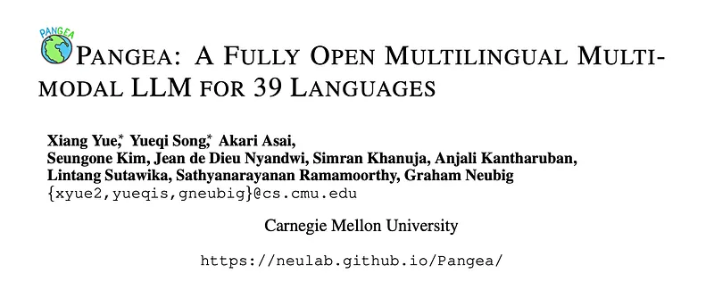
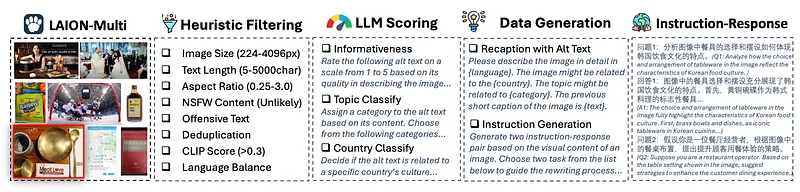
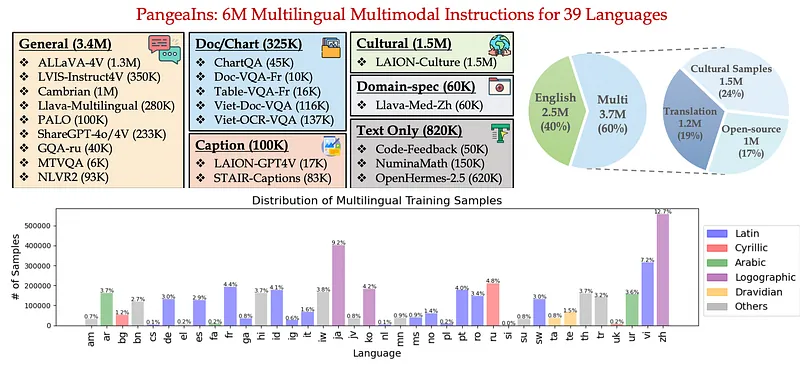
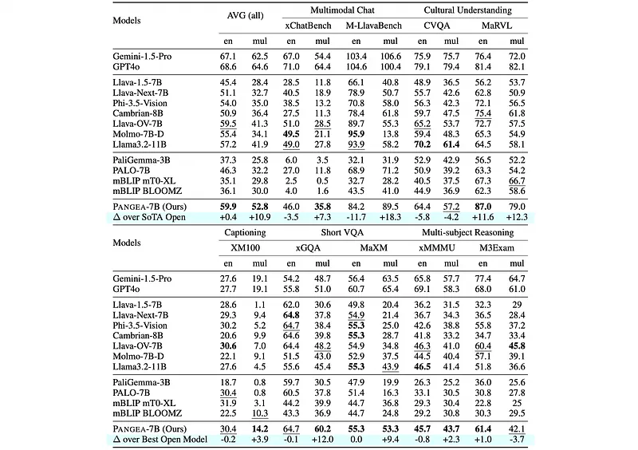
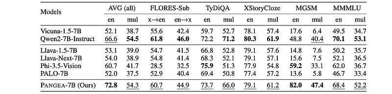

# Papers Explained 404 - Pangea

Pangea is a multilingual multimodal LLM trained on PangeaIns, a diverse 6M instruction dataset spanning 39 languages. PangeaIns features high-quality English instructions, carefully machine-translated instructions, and culturally relevant multimodal tasks to ensure cross-cultural coverage.

This page ingests the source article into the wiki and connects it to [[Papers Explained Corpus]], [[Synthetic Data]], [[Vision Language Models]], [[Multilingual Models]], [[Large Language Models]], [[Reasoning Models]], [[Supervised Fine-Tuning]].

## Source Metadata

- Source file: `raw/2025-07-08_Papers-Explained-404--Pangea-b5fbfecf9912.md`
- Source title: Papers Explained 404: Pangea
- Published: 2025-07-08
- Canonical: [https://medium.com/@ritvik19/papers-explained-404-pangea-b5fbfecf9912](https://medium.com/@ritvik19/papers-explained-404-pangea-b5fbfecf9912)

## Key Ideas

- Pangea is a multilingual multimodal LLM trained on PangeaIns, a diverse 6M instruction dataset spanning 39 languages.
- The project is available at [GitHub](https://neulab.github.io/Pangea/).
- A diverse and high-quality instruction tuning dataset called PangeaIns is developed, comprising 6 million samples in 39 languages, with a focus on linguistic and cultural diversity.
- A high-quality set of English multimodal instructions serves as the foundation for translation into other languages.
- The proprietary Gemini 1.5 Pro model is used to expand the English instructions to other languages. To resolve issues such as mismatched conversation turns or missing candidates in multiple-choice questions, a post-processing pipeline is developed.

## Notes

Pangea is a multilingual multimodal LLM trained on PangeaIns, a diverse 6M instruction dataset spanning 39 languages. PangeaIns features high-quality English instructions, carefully machine-translated instructions, and culturally relevant multimodal tasks to ensure cross-cultural coverage. To rigorously assess models’ capabilities, PangeaBench is introduced, a holistic evaluation suite encompassing 14 datasets covering 47 languages.

The project is available at [GitHub](https://neulab.github.io/Pangea/).

## PangeaIns: Multilingual Multimodal Instruction Tuning

A diverse and high-quality instruction tuning dataset called PangeaIns is developed, comprising 6 million samples in 39 languages, with a focus on linguistic and cultural diversity.

### Machine Translated Instructions

A high-quality set of English multimodal instructions serves as the foundation for translation into other languages. These instructions span a wide range of visual understanding tasks, including general visual instructions and conversations, visual reasoning, captioning, and chart question answering. Additionally, text-only high-quality English instructions covering general instructions, code, and math are added.

The proprietary Gemini 1.5 Pro model is used to expand the English instructions to other languages. To resolve issues such as mismatched conversation turns or missing candidates in multiple-choice questions, a post-processing pipeline is developed. This pipeline automatically corrected these errors or directly dropped the examples, ensuring that all translated instructions remained consistent.

### Multicultural Understanding Instructions

*Figure: Overview of multicultural understanding instructions data generation pipeline.*

Machine translation struggles with cultural understanding because data translated from English often focuses on Anglo-centric ideas. To fix this, a system is created to teach multicultural understanding. Since both images and text can have deep cultural meanings, the goal is to create a dataset that helps models recognize these cultural details and respond correctly in different cultural situations.

To make sure the dataset covers many cultures, 10 million images are taken from the LAION-Multi dataset, which includes images and short descriptions from various languages and places. A filtering process is used to ensure the images are good quality and culturally relevant.

Automatic filtering is done using these rules: Image Size, Aspect Ratio, Text Length, no inappropriate content, no offensive text, no duplicate images, and a CLIP Score (to check if the image and text description matched).

To further improve the dataset, the Llama-3.1–8B-Instruct model is used to check the quality, topics, and cultural relevance of the text descriptions (alt text) for each image. The model is asked to: 1) Rate Text Quality: The alt text is rated from 1 to 5 on how well it described the image, without seeing the image. Alt text scoring below 4 is removed. 2) Classify Subject: The model assigned a topic to the alt text based on its content. 3) Classify Country/Region: The model decided if the alt text is closely related to a specific country’s culture. Images labeled as “no specific country” (about 60% of the dataset) are removed to focus on culturally identifiable content.

To keep the dataset balanced, images from common topics like objects, materials, and clothing are reduced to avoid focusing too much on specific topics or regions. Then, an accessibility check is done, removing 30% of the remaining samples due to image download or other issues.

To give context and help the model understand the images, more detailed captions are created using Gemini 1.5 Pro, based on the high-quality alt texts. Each image is given a caption in the language of its cultural origin. The alt text is very important because it often had culturally specific information that the images alone didn’t show. This extra information helps the model create captions that better capture cultural details.

After creating new captions, multilingual instructions are generated using Gemini 1.5 Pro, based on the detailed captions. Instead of just asking the model to create random instructions, careful planning is done. Thirteen task types are created (like Information Seeking, Coding & Debugging, Cultural Interpretation, etc.). Then, for each image, up to two question-answer pairs are created, representing different instruction types to ensure a diverse set of interactions. This ensures that the model not only recognizes these visual elements but also responds appropriately across varied linguistic and different instruction contexts.

### Curating Existing Multilingual Instructions

To further enrich PangeaIns, an extensive survey of available multilingual multi-modal literature and datasets, including those hosted on HuggingFace, is conducted. As a result, several high-quality, open-source datasets are incorporated into PangeaIns. These include Chinese ALLaVA-4V, Viet Document and OCR QA, Llava Chinese, Llava Medical Chinese Instruction, LLaVA-Japanese-Instruct, MTVQA, Japanese STAIR Captions, Russian GQA, French Doc-VQA, and French Table-VQA.

### Dataset Statistics

*Figure: Statistics of PangeaIns, comprising 6M multimodal instructions in 39 languages.*

The final language ratio of English to Multilingual is kept at 40%:60% because a significant portion of English data plays an important role in cross-lingual transfer. The inclusion of diverse multimodal instructions ensures that the model develops a deeper understanding of varied linguistic and cultural environments.

## PangeaBench: Evaluation Of Multilingual Multimodal Models

To assess the capabilities of Pangea across a variety of languages, cultures, and task types, we have developed PangeaBench, a comprehensive multilingual and multimodal evaluation suite.

### Multimodal Tasks

The multimodal tasks in PangeaBench are categorized as follows:

- Multimodal Chat: Assesses the model’s ability to engage in natural conversations using both text and images. It includes the xChatBench dataset and M-LlavaBench.

- Captioning: Evaluates the model’s performance in multilingual image captioning, using a refined version of the XM3600 dataset called XM100.

- Cultural Understanding: Tests the model’s ability to reason about culturally diverse visual content, utilizing the CVQA and MaRVL datasets.

- Multilingual VQA (Visual Question Answering): Measures the model’s proficiency in answering questions about images in multiple languages, using the xGQA and MaXM datasets.

- Multi-Subject Reasoning: Evaluates the model’s reasoning abilities across different academic subjects, employing the xMMMU and M3Exam datasets.

### Text-Only Multilingual Datasets

PangeaBench includes text-only multilingual tasks to assess a model’s linguistic understanding without visual context. These tasks are categorized as follows:

QA (Question Answering):

- TyDiQA: Tests the model’s ability to answer questions across 11 typologically diverse languages.

Translation:

- FLORES-Sub: Assesses machine translation performance, sampling 11 languages from the FLORES dataset.

Reasoning:

- MMMLU: Tests general language understanding using a human-translated version of MMLU.

- XStoryCloze: Evaluates commonsense reasoning ability in multilingual contexts.

- MGSM: Tests mathematical reasoning ability in multilingual contexts.

## Experimental Setup

The model uses LLaVA-Next as architecture, Qwen2–7B-Instruct as the language model backbone and clip-vit-large-patch14–336 as the vision encoder. The training consists of two stages. First, the vision-language connector that aligns the outputs of vision encoder to backbone, is pretrained with the LLaVA LCS-558K. Then, fine-tuning is performed on PangeaIns. The model is pretrain and fine-tuned for 1 epoch.

## Evaluation

### Multilingual Multimodal Results

*Figure: Overall performance on the multilingual multimodal benchmarks in PangeaBench.*

- Pangea-7B outperforms existing open-source models in both English and multilingual tasks.

- Pangea-7B demonstrates more balanced cross-language capabilities compared to other models, with a smaller performance drop when transitioning from English to multilingual tasks.

- Pangea-7B still faces challenges compared to closed-source models like GPT4o, and there’s room for improvement in fully closing the performance gap between English and multilingual tasks.

### Multilingual Text-Only Results

*Figure: Overall performance on text-only multilingual benchmarks in PangeaBench.*

- Pangea-7B achieves the best text performance among multimodal LLMs, outperforming baselines like Llava-Next-7B.

- Pangea-7B generally maintains or slightly drops in performance compared to its text backbone, Qwen2–7B-Instruct.

- Pangea-7B shows a significant improvement in MGSM due to the inclusion of math-related instructions in PangeaIns.

## Paper

Pangea: A Fully Open Multilingual Multimodal LLM for 39 Languages [2410.16153](https://arxiv.org/abs/2410.16153)

## Figures

Figures from the Medium HTML export (`raw/2025-07-08_Papers-Explained-404--Pangea-b5fbfecf9912.md`); local copies under `wiki/assets/papers-explained-404-pangea/` when download succeeded.

| Figure | Caption |
|--------|---------|
|  | Title card: Pangea. |
|  | Overview of multicultural understanding instructions data generation pipeline. |
|  | Statistics of PangeaIns, comprising 6M multimodal instructions in 39 languages. |
|  | Overall performance on the multilingual multimodal benchmarks in PangeaBench. |
|  | Overall performance on text-only multilingual benchmarks in PangeaBench. |
## Related

- [[Papers Explained Corpus]]
- [[Synthetic Data]]
- [[Vision Language Models]]
- [[Multilingual Models]]
- [[Large Language Models]]
- [[Reasoning Models]]
- [[Supervised Fine-Tuning]]
- [[Papers Explained 403 - Crosslingual Reasoning through Test-Time Scaling]]
- [[Papers Explained 405 - Universal Tokenizer]]

#summary #topic
