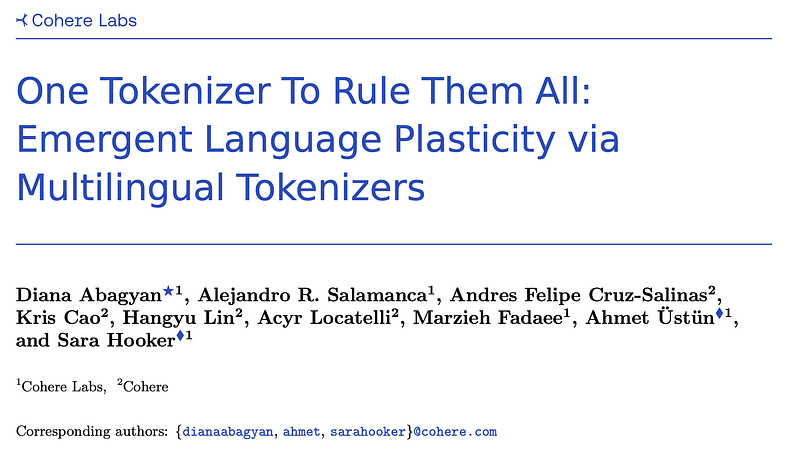
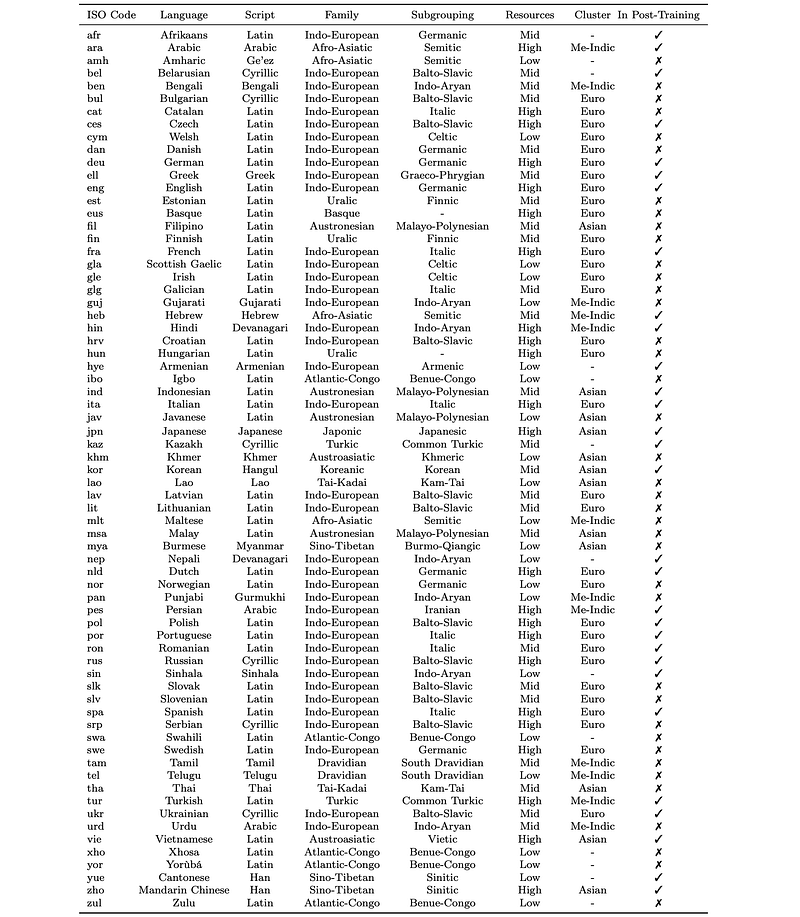
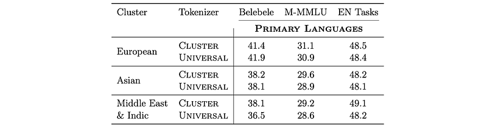
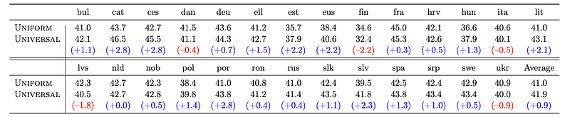
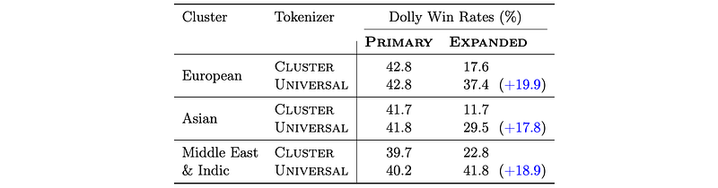
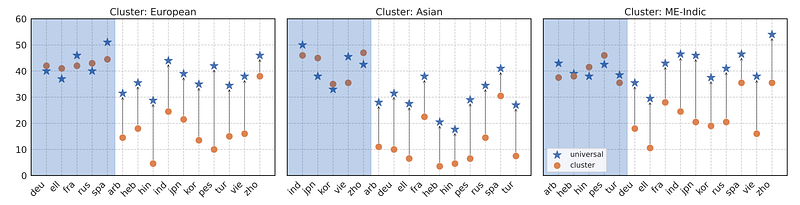
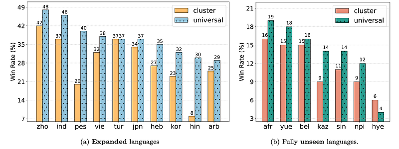
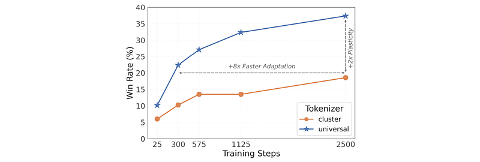
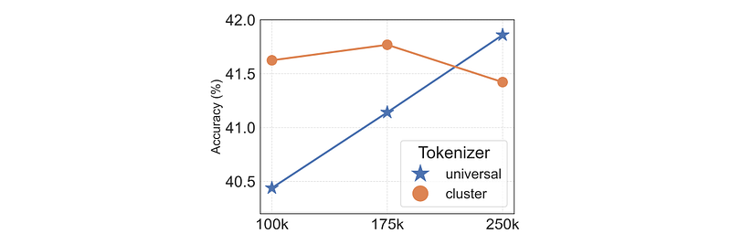
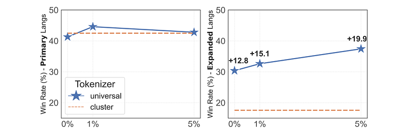

# Papers Explained 405 - Universal Tokenizer

The experiments include 62 typologically and lexicographically diverse languages, broken up into three geographically motivated clusters:

This page ingests the source article into the wiki and connects it to [[Papers Explained Corpus]], [[Large Language Models]], [[Multilingual Models]], [[Synthetic Data]], [[Supervised Fine-Tuning]].

## Source Metadata

- Source file: `raw/2025-07-09_Papers-Explained-405--Universal-Tokenizer-1dfd6e76cbd1.html`
- Source title: Papers Explained 405: Universal Tokenizer
- Published: 2025-07-09
- Canonical: [https://medium.com/@ritvik19/papers-explained-405-universal-tokenizer-1dfd6e76cbd1](https://medium.com/@ritvik19/papers-explained-405-universal-tokenizer-1dfd6e76cbd1)

## Key Ideas

- Middle-Eastern and Indic languages (ME-Indic).
- For each geo-cluster, language models are pretrained primarily on the languages within that cluster (referred to as the primary subset) and the remaining languages (referred to as the expanded subset) are used as reference points for plasticity adaptation...
- The goal is to introduce highly plastic and adaptable model properties. The interventions are evaluated under various adaptation strategies:
- Continued Pretraining: Models are further pre-trained with data from both primary and expanded language subsets.
- Targeted Adaptation (Expanded Languages): Supervised fine-tuning is performed using instruction-style data solely from the expanded language subsets for each cluster model.

## Notes

Pretraining massively multilingual Large Language Models (LLMs) for many languages at once is challenging due to limited model capacity, scarce high-quality data, and compute constraints. Moreover, the lack of language coverage of the tokenizer makes it harder to address the gap for new languages purely at the post-training stage. This work studies what relatively cheap interventions early on in training improve adaptation capabilities of the model post-training to new languages (language plasticity). The focus is on tokenizer design and proposes using a universal tokenizer that is trained for more languages than the primary pretraining languages to enable efficient adaptation in expanding language coverage after pretraining.

## Methodology

The experiments include 62 typologically and lexicographically diverse languages, broken up into three geographically motivated clusters:

- European languages

- Asian languages

- Middle-Eastern and Indic languages (ME-Indic).

For each geo-cluster, language models are pretrained primarily on the languages within that cluster (referred to as the primary subset) and the remaining languages (referred to as the expanded subset) are used as reference points for plasticity adaptation experiments. In addition, 7 fully unseen languages, such as Sinhala and Kazakh, which were not present in the tokenizer or base model training data, are also considered.

The goal is to introduce highly plastic and adaptable model properties. The interventions are evaluated under various adaptation strategies:

- Continued Pretraining: Models are further pre-trained with data from both primary and expanded language subsets. Half of the training mix consists of an even distribution of all languages in the instruction finetuning data, and the other half is a standard cooldown mix with high-quality datasets.

- Targeted Adaptation (Expanded Languages): Supervised fine-tuning is performed using instruction-style data solely from the expanded language subsets for each cluster model.

- Targeted Adaptation (Fully Unseen Languages): Fine-tuning is conducted on fully unseen languages (not in the tokenizer or pretraining data), one language at a time, to simulate a heavily under-resourced scenario.

Tokenizer Variants: A massively multilingual tokenizer is trained using data from all 62 languages as well as cluster-specific tokenizers that represent only the primary language subsets, referred to as Universal and Cluster tokenizers, respectively.

## Experimental Set-up

Pretraining Datasets: Models are pre-trained with a mixture of English (55%), code (15%), and multilingual corpora (30%). For models pre-trained with the Universal tokenizer, 5% of the English data is reallocated and uniformly distributed among all the expanded languages.

Cooldown and Instruct Datasets: Continued pretraining uses cooldown data that upweights higher quality datasets, including text, math, code, and instruct-style data. For experiments on fully unseen languages, a limited set of instructions (14,800 per language) from the translated Dolly training set is used.

Training Details: Models are 3.3 billion parameters and trained for 100 billion tokens.

## Tokenizer Training

The Byte Pair Encoding (BPE) algorithm is used for training all tokenizers with the GPT-4o (gpt4-o200k) regex used for pretokenization. Tokenizer training data is sampled from the pretraining data mixture (50GB).

A specialized weighting methodology is used, combining language bucketing with size-proportional data distribution. This involves:

- Considering the natural distribution of data available across languages.

- Forming language buckets based on languages that share the same family and script.

- Using uniform weighting across languages within each language bucket.

- Calculating language weights using the formula: wi = (wd_i * wb_i) / (n wd_n * wb_n) where wd_i and wb_i denote weights for data distribution and language bucket, respectively.

The main experiments use a vocabulary size of 250k tokens. The impact of vocabulary size is further explored with sizes varying between 100k, 175k, and 250k.

## Evaluation Setup

Generative Task Evaluation: “Unpacking tokenization” suggests generative tasks are better than classification for evaluating tokenizers. The quality of generations is assessed using LLM-as-a-Judge win rates, with original generations as the reference. The dolly_human_edited and dolly_machine_translated splits of the Aya Evaluation Dataset are used as test data, derived from Dolly-15k. 15 adaptation languages are used for open-ended evaluation. Command-A is used as the judge model, based on its performance in multilingual settings, scoring closely to GPT4o

Task-Specific Performance (Multilingual): Two datasets are used:

- Belebele: A multiple-choice question machine-reading comprehension (MRC) dataset with 122 language variants.

- Multilingual MMLU (M-MMLU): A machine-translated version of the original MMLU dataset covering various topics.

English-Only Evaluation: Models are evaluated on 11 English-only natural language inference and commonsense reasoning benchmarks: ARC-C, ARC-E, BoolQ, CommonsenseQA, Hellaswag, MMLU, OpenBookQA, PIQA, SIQA, TruthfulQA, and WinoGrande.

## Results

### Results on Pretraining Performance

Pretrained models using both Universal and Cluster tokenizers are compared across different geo-clusters (Euro, ME-Indic, Asian).

*Figure: Comparison of Cluster vs. Universal tokenizers during the pretraining on the primary languages across three regional clusters.*

*Figure: Comparison of Universal vs. Uniform tokenizer performance on Belebele, when used for pretraining of Euro cluster model.*

- The Universal tokenizer is competitive with the Cluster tokenizer, with performance differences generally less than 0.5% average accuracy across tasks and clusters.

- Minimal performance trade-offs were observed when switching to the Universal tokenizer for primary cluster languages.

- In some cases, the Universal tokenizer led to slight performance increases (e.g., on Belebele for the Euro cluster).

- Balanced language weighting using language buckets during tokenizer training improves pretraining performance, with up to a 2.8% accuracy increase observed in the Euro cluster model.

- Universal tokenizer with balanced weighting outperforms Uniform weighting in 21 European languages out of 27, with a relative gain of 2.2% (41.9 vs 41.0) on average.

### Benefits of Plasticity in Continued Pretraining

*Figure: Win rates after continued pretraining on primary and expanded language subsets.*

- The Universal tokenizer leads to significantly higher plasticity (increased win rates) for the expanded language subsets across clusters.

- The average increase in win rate for the expanded language subsets is 18.9% when using the Universal tokenizer.

- The improvement is consistent across clusters: +19.9% (Euro), +17.8% (Asian), and +18.9% (ME-Indic).

- Persian (+25.8%), Hindi (+23.3%), and Vietnamese (+22.0%) showed the highest benefit from the Universal tokenizer in the Euro, Asian, and ME-Indic clusters, respectively.

*Figure: Win rates for models trained with the Universal and Cluster tokenizers against Dolly generations..*

- The Universal tokenizer preserves performance on primary languages, with a near identical performance (with a slight increase of 0.3% on average) on downstream open-ended generations.

- The Universal tokenizer enables adaptation boost with no drop in primary languages compared to Cluster tokenizer.

- Using the Universal tokenizer for primary languages does not create trade-offs when improving plasticity for an expanded set of languages.

### Benefits of Plasticity in Targeted Adaptation

*Figure: Win rates on expanded languages after targeted adaptation.*

*Figure: Language-specific results after targeted adaptation through SFT for the Euro cluster model.*

- The Universal tokenizer significantly outperforms the Cluster tokenizer in targeted language adaptation using only expanded language data, with an average increase of 14.6% across languages and geo-clusters.

- The Universal tokenizer also provides gains in targeted adaptation for fully unseen languages, with an average improvement of 2.0% on 7 under-resourced languages.

- The Universal tokenizer demonstrates superior multilingual plasticity compared to the Cluster tokenizer, not only for languages seen during tokenizer training but also for fully unseen languages.

- The Universal tokenizer’s performance in low-data environments with unseen languages suggests a promising direction for future research and highlights the value of flexible tokenizer design.

### Adaptation Efficiency with the Universal Tokenizer

*Figure: Average win rates on the expanded (new) language subset during continued pretraining that involves both primary and expanded language subsets.*

- The Universal tokenizer enables +8x faster adaptation in terms of sample efficiency compared to the Cluster tokenizer.

- The Universal tokenizer achieves the same level of performance as the Cluster tokenizer in only 300 steps, while the Cluster tokenizer requires 2500 steps.

- The Universal tokenizer requires significantly less data (150K samples) to achieve the same performance as the Cluster tokenizer (1.3M samples).

- The Universal tokenizer achieves +2x higher performance for downstream adaptation compared to the Cluster tokenizer.

### Necessity of Large Vocabulary Size

- Cluster tokenizers’ performance remained relatively stable across different vocabulary sizes.

- Universal tokenizer performance scales with vocabulary size.

- Universal tokenizer outperforms Cluster tokenizer at a vocabulary size of 250,000.

- At smaller vocabulary sizes (100k and 175k), Cluster tokenizers outperform the Universal tokenizer.

- The Universal tokenizer requires a large vocabulary size (e.g., 250,000 subwords) to achieve optimal results and outperform Cluster tokenizers.

- Investment in universal tokenizers requires a reallocation of weights to ensure a proper vocabulary budget.

- A vocabulary size of 250k was chosen for the main pretraining runs based on this ablation study.

### Presence of Expanded Language Subset in Pretraining

- Even with 0% pretraining data for the expanded languages, the Universal tokenizer achieves a 12.8% performance boost (win rate) over the Cluster tokenizer.

- Including a minimal amount of data (up to 5%) for the expanded languages increases adaptation performance from 12.8% to 19.8% win rates without negatively impacting performance on the primary pretraining languages.

- The Universal tokenizer demonstrates plasticity and robustness even under different assumptions of multilingual data presence.

## Paper

One Tokenizer To Rule Them All: Emergent Language Plasticity via Multilingual Tokenizers [2506.10766](https://arxiv.org/abs/2506.10766)

## Figures

Figures from the Medium HTML export (`raw/2025-07-09_Papers-Explained-405--Universal-Tokenizer-1dfd6e76cbd1.html`); local copies under `wiki/assets/papers-explained-405-universal-tokenizer/` when download succeeded.

| Figure | Caption |
|--------|---------|
|  | Title card: Universal Tokenizer. |
|  | The goal is to introduce highly plastic and adaptable model properties. The interventions are evaluated under various adaptation strategies. |
|  | Comparison of Cluster vs. Universal tokenizers during the pretraining on the primary languages across three regional clusters. |
|  | Comparison of Universal vs. Uniform tokenizer performance on Belebele, when used for pretraining of Euro cluster model. |
|  | Win rates after continued pretraining on primary and expanded language subsets. |
|  | Win rates for models trained with the Universal and Cluster tokenizers against Dolly generations.. |
|  | Win rates on expanded languages after targeted adaptation. |
|  | Language-specific results after targeted adaptation through SFT for the Euro cluster model. |
|  | Average win rates on the expanded (new) language subset during continued pretraining that involves both primary and expanded language subsets. |
|  | Pretrained models using both Universal and Cluster tokenizers are compared across different geo-clusters (Euro, ME-Indic, Asian). |
|  | Pretrained models using both Universal and Cluster tokenizers are compared across different geo-clusters (Euro, ME-Indic, Asian). |
## Related

- [[Papers Explained Corpus]]
- [[Large Language Models]]
- [[Multilingual Models]]
- [[Synthetic Data]]
- [[Supervised Fine-Tuning]]
- [[Papers Explained 404 - Pangea]]
- [[Papers Explained 406 - Answer Matching]]

#summary #topic
