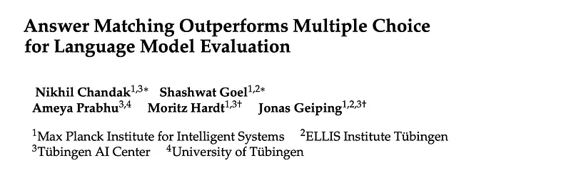
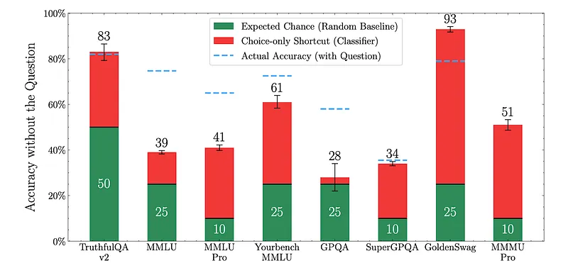
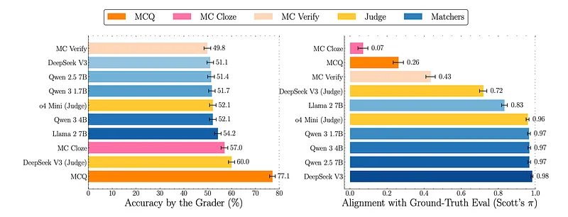
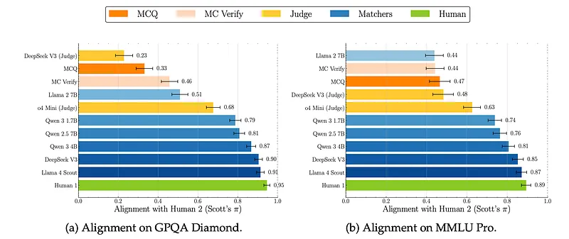
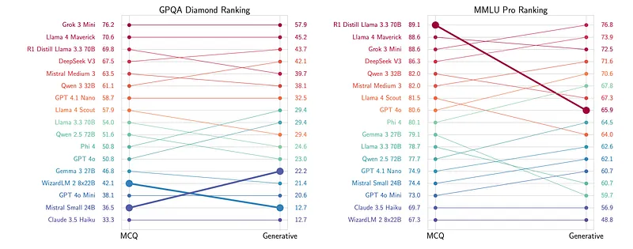
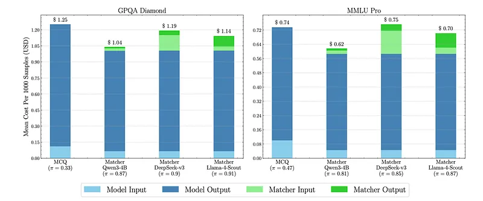

# Papers Explained 406 - Answer Matching

This paper argues that multiple-choice benchmarks, traditionally used for evaluating language models, suffer from a critical flaw: they allow models to exploit discriminative shortcuts and answer questions without truly understanding or generating the correct response.

This page ingests the source article into the wiki and connects it to [[Papers Explained Corpus]], [[Large Language Models]], [[Evaluation and Benchmarks]].

## Source Metadata

- Source file: `raw/2025-07-10_Papers-Explained-406--Answer-Matching-0940b4c50570.md`
- Source title: Papers Explained 406: Answer Matching
- Published: 2025-07-10
- Canonical: [https://medium.com/@ritvik19/papers-explained-406-answer-matching-0940b4c50570](https://medium.com/@ritvik19/papers-explained-406-answer-matching-0940b4c50570)

## Key Ideas

- This paper argues that multiple-choice benchmarks, traditionally used for evaluating language models, suffer from a critical flaw: they allow models to exploit discriminative shortcuts and answer questions without truly understanding or generating the correct...
- The project is available at [GitHub](https://github.com/nikhilchandak/answer-matching).
- Evaluating generative models involves determining if a generated response (R) is a member of the set of correct answers (AQ) for a given question (Q). This is difficult when there are many possible correct responses (|AQ| > 1).
- If there’s only one correct response (|AQ| = 1), evaluation can be done via string matching (e.g., in NLP benchmarks like SQuaD).
- In mathematics, even with infinitely many equivalent expressions, rule-based symbolic equivalence can often suffice.

## Notes

This paper argues that multiple-choice benchmarks, traditionally used for evaluating language models, suffer from a critical flaw: they allow models to exploit discriminative shortcuts and answer questions without truly understanding or generating the correct response. The authors propose “answer matching” as a superior alternative for evaluating the generative capabilities of language models.

The project is available at [GitHub](https://github.com/nikhilchandak/answer-matching).

## Discriminative Shortcuts to Multiple Choice Evaluations

Evaluating generative models involves determining if a generated response (R) is a member of the set of correct answers (AQ) for a given question (Q). This is difficult when there are many possible correct responses (|AQ| > 1).

- If there’s only one correct response (|AQ| = 1), evaluation can be done via string matching (e.g., in NLP benchmarks like SQuaD).

- In mathematics, even with infinitely many equivalent expressions, rule-based symbolic equivalence can often suffice.

- In natural language, many paraphrases can convey the same meaning, making direct string matching insufficient.

Multiple choice attempts to circumvent the |AQ| > 1 problem by providing the model with a question (Q), a single correct answer (a), and several incorrect choices (distractors, wi). The model’s response is marked correct only if it matches ‘a’.

This reduces the set of correct answers to a singleton (‘a’), simplifying automatic grading.

However, this approach fundamentally changes the task. Instead of requiring the model to generate a correct response (a generative problem), it shifts to requiring the model to discriminate between correct and incorrect choices (a discriminative problem).

To demonstrate the extent to which multiple-choice benchmarks can be solved discriminately, a language model (Qwen3–4B) is finetuned to predict the correct answer given only the choices without the question. For finetuning, the dedicated train split of the dataset is used whenever available; otherwise, the test set is randomly split 50–50, training on the first half and evaluating on the second half (held-out).

*Figure: Shortcut accuracy achieved by finetuning a discriminative classifier that sees only the answer choices, without any access to the question.*

- Strikingly high accuracies can be achieved across popular datasets using choice-only shortcuts.

- Accuracy beyond chance raises concerns about whether the dataset truly reflects generative question answering, as the model doesn’t even know the question.

## Answer Matching for Generative Evaluation

A simple way to prevent discriminative shortcuts is by not providing the model with choices in the input. The model is simply tasked with providing a free-form response R, and then, another model checks whether the response R matches with a provided reference answer a, termed as Answer Matching.

Alignment is measured using Scott’s π, an inter-annotator agreement metric recommended in recent LLM-as-a-Judge literature.

While this approach has been occasionally considered in the LLM-as-a-Judge literature, the distinction is crucial. In traditional LLM-as-a-Judge tasks, a judge model J must verify the correctness of a response R to a question Q without access to a reference answer, leading to various issues. In contrast, using a language model for answer matching involves checking if the model response is semantically or functionally equivalent to the reference answer in the context of the question, which is intuitively easier than verifying the correctness of an arbitrary response.

```text
def
get_judge_prompt_with_gt
(
question:
str
,
target:
str
,
response:
str
,
incorrect_options:
str
|
None
=
None
,
cot:
bool
=
True
,
) ->
str
:
"""
Generate a prompt for the judge with ground truth.
Args:
question: The question being asked.
target: The ground‑truth answer.
response: The response to judge.
incorrect_options: Optional string containing incorrect options.
cot: Whether to include a chain‑of‑thought (COT) instruction.
Returns:
A formatted prompt string for the judge.
"""
# The response can contain more information than the ground truth.
# It can be more specific (e.g., “Labrador” vs. “dog”) or list additional
# correct answers, but it must cover everything in the ground truth.
# Paraphrasing is acceptable.
prompt =
f"""Your task is to judge whether the given response to a question
matches a provided ground‑truth answer or not. You are given a question, a
ground‑truth answer, and the response you must judge.
For a response to “match”, it must include at least as much information as the
ground‑truth answer.
The response may contain more information than the ground truth. It can be more
specific (for example, “Labrador” is more specific than “dog”) or list
additional possible correct answers, but it must cover everything mentioned in
the ground truth. Paraphrasing is acceptable.
For numeric answers, the relative error—defined as
|response − ground_truth| / mean(response, ground_truth)—must be less than 1 %.
Possible judgments:
"0": The response does not match the ground‑truth answer.
"1": The response matches the ground‑truth answer.
Question: "
{question}
"
Ground truth: "
{target}
"
"""
if
incorrect_options:
prompt +=
f"\n
{incorrect_options}
"
prompt +=
f"""
Response: "
{response}
"
Your job is to ONLY check whether the given response matches the ground‑truth
answer in the context of the question. You DO NOT need to assess factual
correctness. This is part of an automated evaluation process, therefore you
MUST OUTPUT your final answer as "0" or "1" in <answer></answer> tags.
"""
if
cot:
prompt += (
'\nThink step by step and end your response with '
'<answer>0</answer> OR <answer>1</answer> TAGS.'
)
else
:
prompt += (
'\nYOU SHOULD ALWAYS END YOUR RESPONSE WITH '
'<answer>0</answer> OR <answer>1</answer> TAGS.'
)
return
prompt
```

### Alignment on MATH Questions

*Figure: Accuracy estimated by different graders and their alignment with ground truth evaluation on MATH.*

The MATH dataset is used to evaluate LLMs, with the MATH-Verify library providing rule-based ground-truth evaluations. A parallel multiple-choice version is also available.

- Answer Matching: Answer matching, even with a relatively smaller model (1.7B parameter Qwen3), achieves near-perfect alignment with the ground-truth (π = 0.97). Larger models like DeepSeek v3 (671B parameters) also perform well as matchers (π = 0.98).

- LLM-as-a-Judge: Using LLMs as judges shows only modest agreement with the ground truth (π = 0.72) even with very large models.

- Standard Multiple Choice (MCQ): Standard MCQ evaluation has low alignment (π = 0.26) due to false positives, as the task is an easier discriminative problem.

- Multiple Choice Verification: This method presents each choice separately and requires the model to independently verify its correctness. It estimates similar accuracy to answer matching but has poorer alignment (π = 0.43) than answer matching but better than standard MCQ.

- Multiple Choice Cloze: This method only provides the question and measures completion likelihoods over all choices. It has the lowest alignment (π = 0.07), indicating outcomes almost independent from the ground-truth. It’s a non-generative likelihood evaluation, which may not suit modern models that use chain-of-thought generation.

### Alignment on Multiple Choice Data in Natural Language

*Figure: Human-agreement comparison.*

Variants of MMLU-Pro and GPQA-Diamond for generative evaluation are created, providing only the question to the model and using the correct choice as a reference answer. Questions are filtered to ensure they could be answered without choices and had a unique correct answer, addressing the issue that many questions rely on the choices to convey the intended answer’s style and specificity.

800 model responses are manually evaluated for correctness, and humans also rated the specificity of questions and reference answers. The study focused on a subset of 493 MMLU-Pro questions and 126 GPQA-Diamond questions that met the specificity criteria.

The alignment of different automatic evaluations (LLMs as judges and LM matchers) are compared with human judgments, finding that LM matchers consistently achieved higher agreement (Scott’s π).

Error Analysis: Error analysis of LLM-as-a-judge revealed a high rate of false positives, where the judge incorrectly identified responses as correct.

Smaller models (Qwen3) showed near-human level alignment, while larger models (DeepSeek, Llama) had agreement within the range of inter-annotator disagreement. This aligns with findings that smaller models with a reference answer perform better than larger models without one.

## Towards Benchmarking with Answer Matching

The implications of adopting answer matching within the benchmarking ecosystem are examined, focusing on its impact on model rankings, evaluation costs, replicability of benchmark results, and future dataset development.

### Impact on Model Rankings

*Figure: Leaderboard rankings change when moving from MCQ to answer-matching.*

- Model rankings change significantly when moving from MCQ to answer-matching on generative responses.

- Chat-optimized proprietary models (e.g., GPT variants, Claude 3.5 Haiku) tend to improve their ranking in generative evaluation.

- Open-weight models optimized for multiple-choice benchmarks (e.g., R1-Distill Llama 70B, WizardLM 2) can experience marked drops in ranking.

- This highlights that benchmark conclusions and model selection critically depend on the chosen evaluation protocol.

### Addressing Benchmark Saturation

- Benchmarks that appear saturated due to high cardinal values in MCQ format reveal substantial headroom when switched to generative evaluation.

- For example, a drop of over 20% in accuracy was observed across models on GPQA Diamond when evaluated generatively, with best models scoring 60%.

- Existing datasets can be repurposed for free-form evaluations, continuing to serve as meaningful indicators of progress.

- Human-verified free-form subsets of MMLU-Pro and GPQA-Diamond are publicly released to facilitate this.

### Cost-Effectiveness of Answer Matching

*Figure: Breakdown of evaluation cost averaged across 17 models.*

- Evaluating models using answer matching, even with frontier models like DeepSeek v3, is no more expensive than MCQ evaluations.

- Using models with high human alignment, such as Llama-4-Scout, can even make answer matching cheaper than MCQ.

- Evaluation costs are primarily driven by the length of model responses; models generate longer responses for MCQs as they often attempt free-form solutions first.

- The additional cost of answer matching (running a language model as a matcher) is marginal compared to the generation overhead, as matching is an easier task than solving from scratch.

### Reliability of Answer Matching

- Reproducibility: Concerns about reproducibility with LM-as-grader evaluations are mitigated by the improved capabilities of open-weight models (e.g., DeepSeek-v3, Qwen3–4B) and by conducting evaluations at zero temperature.

- Robustness: Rankings remain highly stable even when using different models for answer matching (e.g., DeepSeek-v3, Llama-4-Scout, Qwen3–4B).

- No evidence of self-preference bias was found, unlike in traditional LLM Judge setups.

- While adversarial setups were not tested, the text suggests reporting MCQ results alongside LM-based answer matching to raise suspicion if performance is exclusively high on the latter.

### Intrinsic Validity and Timing

- While MCQ has good construct validity for measuring multiple-choice test performance, it lacks validity for generative capabilities.

- Older models lacked the intrinsic validity required for answer matching, performing poorly on this task.

- Only with the recent generation of models, which achieve near-human agreement levels, has answer matching emerged as a clearly superior mode of evaluation.

### Converting Multiple Choice Benchmarks

- Existing multiple-choice benchmarks can be reused for answer matching, but with a caveat: many MCQ questions are not specific enough on their own and rely on choices for disambiguation.

- Filtering such questions can reduce dataset size by more than half and skew category distribution towards STEM (where unique answers are more common).

- This motivates the creation of new questions that are more specific or provide a list of reference answers for multiple possibilities.

- New benchmarks (e.g., SimpleQA, BrowserComp) are already designing questions with single, indisputable, short answers, which is considered more fruitful than creating higher-quality distractors for MCQs.

## Paper

Answer Matching Outperforms Multiple Choice for Language Model Evaluation [2507.02856](https://arxiv.org/abs/2507.02856)

## Figures

Figures from the Medium HTML export (`raw/2025-07-10_Papers-Explained-406--Answer-Matching-0940b4c50570.md`); local copies under `wiki/assets/papers-explained-406-answer-matching/` when download succeeded.

| Figure | Caption |
|--------|---------|
|  | Title card: Answer Matching. |
|  | Shortcut accuracy achieved by finetuning a discriminative classifier that sees only the answer choices, without any access to the question. |
|  | Accuracy estimated by different graders and their alignment with ground truth evaluation on MATH. |
|  | Human-agreement comparison. |
|  | Leaderboard rankings change when moving from MCQ to answer-matching. |
|  | Breakdown of evaluation cost averaged across 17 models. |
## Related

- [[Papers Explained Corpus]]
- [[Large Language Models]]
- [[Evaluation and Benchmarks]]
- [[Papers Explained 405 - Universal Tokenizer]]
- [[Papers Explained 407 - Should We Still Pretrain Encoders with Masked Language Modeling]]

#summary #topic
