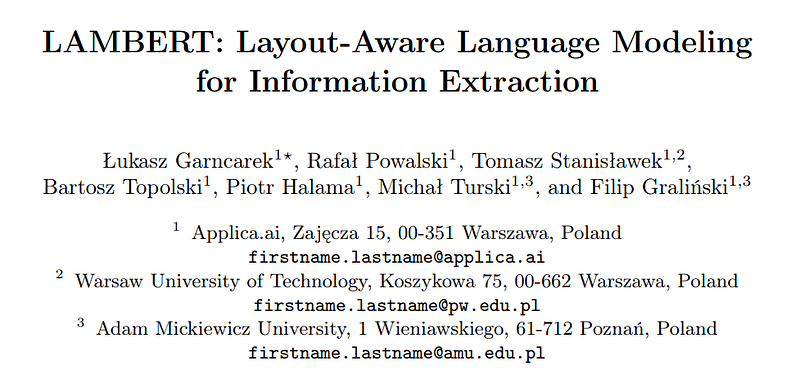
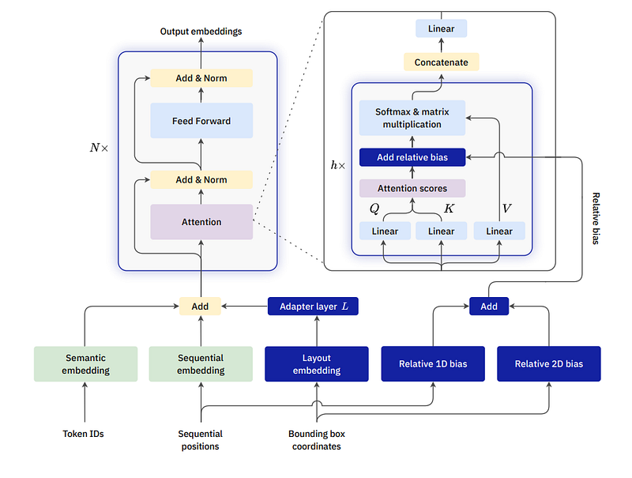
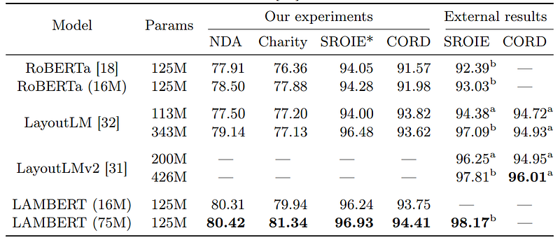

# Papers Explained 41 - LAMBERT

We inject the layout information into the model in two ways. Firstly, we modify the input embeddings of the original RoBERTa model by adding the layout term. We also experiment with completely removing the sequential embedding term. Secondly, we apply relative attention bias in the context of the sequential position.

This page ingests the source article into the wiki and connects it to [[Papers Explained Corpus]], [[Embedding and Retrieval]], [[Document AI]], [[Large Language Models]].

## Source Metadata

- Source file: `raw/2023-04-10_Papers-Explained-41--LAMBERT-8f52d28f20d9.html`
- Source title: Papers Explained 41: LAMBERT
- Published: 2023-04-10
- Canonical: [https://medium.com/@ritvik19/papers-explained-41-lambert-8f52d28f20d9](https://medium.com/@ritvik19/papers-explained-41-lambert-8f52d28f20d9)

## Key Ideas

- We inject the layout information into the model in two ways. Firstly, we modify the input embeddings of the original RoBERTa model by adding the layout term. We also experiment with completely removing the sequential embedding term.
- A document is represented by a sequence of tokens ti and their bounding boxes bi . To each element of this sequence, we assign its layout embedding li , carrying the information about the position of the token with respect to the whole document.
- We first normalize the bounding boxes by translating them so that the upper left corner is at (0, 0), and dividing their dimensions by the page height. This causes the page bounding box to become (0, 0, w, 1), where w is the normalized width.
- The layout embedding of a token will be defined as the concatenation of four embeddings of the individual coordinates of its bounding box.
- The resulting concatenation of single bounding box coordinate embeddings is then a vector in R 8d

## Notes

LAMBERT introduces a simple new approach to the problem of understanding documents where non-trivial layout influences the local semantics. LAMBERT is a modification of the Transformer encoder architecture in a way that allows it to use layout features obtained from an OCR system, without the need to re-learn language semantics from scratch. We only augment the input of the model with the coordinates of token bounding boxes, avoiding, in this way, the use of raw images. This leads to a layout-aware language model which can then be fine-tuned on downstream tasks.

We inject the layout information into the model in two ways. Firstly, we modify the input embeddings of the original RoBERTa model by adding the layout term. We also experiment with completely removing the sequential embedding term. Secondly, we apply relative attention bias in the context of the sequential position.

*Figure: LAMBERT model architecture. Differences with the plain RoBERTa model are indicated by white text on dark blue background.*

### Layout embeddings

A document is represented by a sequence of tokens ti and their bounding boxes bi . To each element of this sequence, we assign its layout embedding li , carrying the information about the position of the token with respect to the whole document.

We first normalize the bounding boxes by translating them so that the upper left corner is at (0, 0), and dividing their dimensions by the page height. This causes the page bounding box to become (0, 0, w, 1), where w is the normalized width.

The layout embedding of a token will be defined as the concatenation of four embeddings of the individual coordinates of its bounding box. For an integer d and a vector of scaling factors θ ∈ R d , we define the corresponding embedding of a single coordinate t as

The resulting concatenation of single bounding box coordinate embeddings is then a vector in R 8d

Unlike the sequential position, which is a potentially large integer, bounding box coordinates are normalized to the interval [0, 1]. Hence, for our layout embeddings, we use larger scaling factors (θr), namely a geometric sequence of length n/8 interpolating between 1 and 500, where n is the dimension of the input embeddings.

### Relative Bias

In a typical Transformer encoder, a single attention head transforms its input vectors into three sequences: queries, keys, and values. The raw attention scores are then computed as αij. Afterward, they are normalized using softmax and used as weights in linear combinations of value vectors.

The point of relative bias is to modify the computation of the raw attention scores by introducing a bias term: α 0 ij = αij + βij .

In the sequential setting, βij = W(i−j) is a trainable weight, depending on the relative sequential position of tokens i and j.

We introduce a simple and natural extension of this mechanism to the two-dimensional context. In our case, the bias βij depends on the relative positions of the tokens. More precisely, let C 1 be an integer resolution factor (the number of cells in a grid used to discretize the normalized coordinates). If bi = (x1, y1, x2, y2) is the normalized bounding box of the i-th token, we first reduce it to a 2-dimensional position (ξi , ηi) = (Cx1, C(y1 + y2)/2), and then define

where H(l) and V (l) are trainable weights defined for every integer ` ∈ [−C, C). For a typical document C = 100 is enough, and we fix this in our experiments.

## Experiments

For the pretrained base model, we used the RoBERTa base variant (125M parameters, 12 layers, 12 attention heads, hidden dimension 768)

The models were trained on a masked language modeling objective extended with layout information and subsequently, on downstream information extraction tasks.

The training was performed on a collection of PDFs extracted from Common Crawl made up of a variety of documents, totaling approximately 315k documents (3.12M pages).

## Results

*Figure: Comparison of F1-scores for the considered models. Best results in each column are indicated in bold. In parentheses, the length of training of our models, expressed in non-unique pages, is presented for comparison. For RoBERTa, the first row corresponds to the original pretrained model without any further training, while in the second row the model was trained on our dataset. a result obtained from relevant publication; b result of a single model, obtained from the SROIE leaderboard*

## Paper

LAMBERT: Layout-Aware (Language) Modeling for information extraction [2002.08087v5](https://arxiv.org/abs/2002.08087v5)

## Figures

Figures from the Medium HTML export (`raw/2023-04-10_Papers-Explained-41--LAMBERT-8f52d28f20d9.html`); local copies under `wiki/assets/papers-explained-41-lambert/` when download succeeded.

| Figure | Caption |
|--------|---------|
|  | Title card: LAMBERT. |
|  | LAMBERT model architecture. Differences with the plain RoBERTa model are indicated by white text on dark blue background. |
|  | The layout embedding of a token will be defined as the concatenation of four embeddings of the individual coordinates of its bounding box. |
|  | We introduce a simple and natural extension of this mechanism to the two-dimensional context. |
|  | Comparison of F1-scores for the considered models. Best results in each column are indicated in bold. In parentheses, the length of training of our models, expressed in non-unique pages, is presented for comparison. For RoBERTa, the first row corresponds to the original pretrained model without any further training, while in the second row the model was trained on our dataset. a result obtained from relevant publication; b result of a single model, obtained from the SROIE leaderboard. |
## Related

- [[Papers Explained Corpus]]
- [[Embedding and Retrieval]]
- [[Document AI]]
- [[Large Language Models]]
- [[Papers Explained 40 - MobileViT]]
- [[Papers Explained 42 - UDOP]]

#summary #topic
