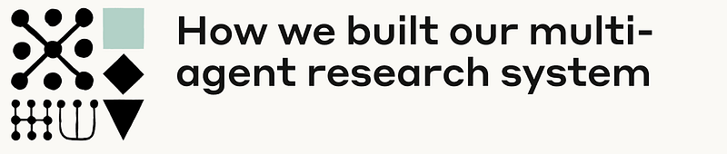
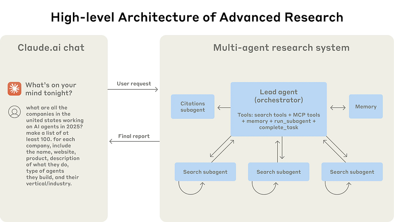
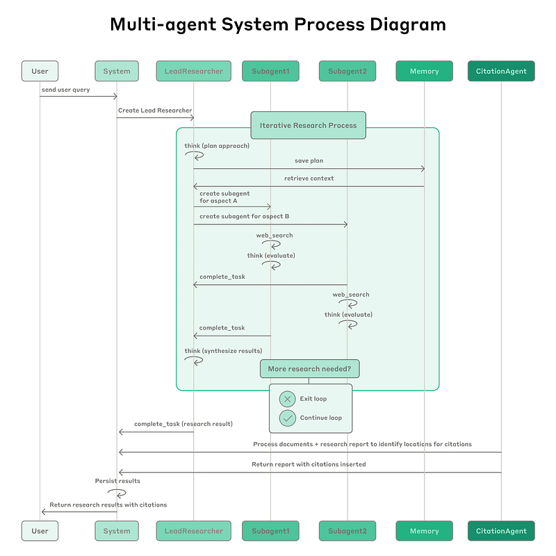

# Papers Explained 412 - Claude Research

Claude Research is a multi-agent system that searches across the web, Google Workspace, and any integrations to accomplish complex tasks. The Research feature involves an agent that plans a research process based on user queries, and then uses tools to create parallel agents that search for information simultaneously.

This page ingests the source article into the wiki and connects it to [[Papers Explained Corpus]], [[Agentic AI]], [[Large Language Models]], [[Embedding and Retrieval]].

## Source Metadata

- Source file: `raw/2025-07-18_Papers-Explained-412--Claude-Research-334b1f6a353b.html`
- Source title: Papers Explained 412: Claude Research
- Published: 2025-07-18
- Canonical: [https://medium.com/@ritvik19/papers-explained-412-claude-research-334b1f6a353b](https://medium.com/@ritvik19/papers-explained-412-claude-research-334b1f6a353b)

## Key Ideas

- Claude Research is a multi-agent system that searches across the web, Google Workspace, and any integrations to accomplish complex tasks.
- The research system employs a multi-agent architecture with an orchestrator-worker pattern, where a lead agent coordinates the process while delegating to specialized subagents that operate in parallel.
- Traditional approaches using Retrieval Augmented Generation (RAG) use static retrieval. That is, they fetch some set of chunks that are most similar to an input query and use these chunks to generate a response.
- Since each agent is steered by a prompt, prompt engineering was our primary lever for improving these behaviors. Below are some principles learned for prompting agents:
- Think like your agents: Effective prompting relies on developing an accurate mental model of the agent, which can make the most impactful changes obvious.

## Notes

Claude Research is a multi-agent system that searches across the web, Google Workspace, and any integrations to accomplish complex tasks. The Research feature involves an agent that plans a research process based on user queries, and then uses tools to create parallel agents that search for information simultaneously.

Research work is characterized by open-ended problems and unpredictable steps, making it difficult to predefine a fixed approach. This inherent unpredictability makes AI agents well-suited for research tasks, as they can adapt and explore tangential connections as the investigation progresses. The autonomous nature of AI agents allows them to make decisions based on intermediate findings over multiple turns, something a linear pipeline cannot achieve. The core of research is compression, extracting key insights from a large amount of information. Subagents aid in this compression by working in parallel, each with its own context window, to explore different facets of the research question. They then condense the most crucial information for the main research agent. This parallel approach, with distinct tools, prompts, and exploration paths, reduces path dependency and ensures thorough, independent investigations.

## Architecture overview for Research

The research system employs a multi-agent architecture with an orchestrator-worker pattern, where a lead agent coordinates the process while delegating to specialized subagents that operate in parallel.

When a user submits a query, the system creates a LeadResearcher agent that enters an iterative research process. The LeadResearcher begins by thinking through the approach and saving its plan to Memory to persist the context, since if the context window exceeds 200,000 tokens it will be truncated and it is important to retain the plan. It then creates specialized Subagents with specific research tasks. Each Subagent independently performs web searches, evaluates tool results using interleaved thinking, and returns findings to the LeadResearcher. The LeadResearcher synthesizes these results and decides whether more research is needed — if so, it can create additional subagents or refine its strategy. Once sufficient information is gathered, the system exits the research loop and passes all findings to a CitationAgent, which processes the documents and research report to identify specific locations for citations. This ensures all claims are properly attributed to their sources. The final research results, complete with citations, are then returned to the user.

Traditional approaches using Retrieval Augmented Generation (RAG) use static retrieval. That is, they fetch some set of chunks that are most similar to an input query and use these chunks to generate a response. In contrast, this architecture uses a multi-step search that dynamically finds relevant information, adapts to new findings, and analyzes results to formulate high-quality answers.

## Prompt engineering for research agents

Since each agent is steered by a prompt, prompt engineering was our primary lever for improving these behaviors. Below are some principles learned for prompting agents:

- Think like your agents: Effective prompting relies on developing an accurate mental model of the agent, which can make the most impactful changes obvious.

- Teach the orchestrator how to delegate: The lead agent must provide detailed task descriptions to subagents to avoid duplication, gaps, and misinterpretations.

- Scale effort to query complexity: Prompts should embed rules for scaling effort based on query complexity to prevent overinvestment in simple queries.

- Tool design and selection are critical: Agent-tool interfaces are critical. Agents need explicit heuristics for tool selection, and tools need clear descriptions.

- Heuristics over Rules: The prompting strategy focuses on instilling good heuristics based on human research strategies, with guardrails to prevent unintended side effects.

- Start wide, then narrow down: Search strategy should mirror expert human research: explore the landscape before drilling into specifics.

- Guide the thinking process: Extended thinking mode, where agents output their reasoning process, improves instruction-following, reasoning, and efficiency.

- Parallel tool calling transforms speed and performance

## Effective evaluation of agents

Evaluating multi-agent systems presents unique challenges. Traditional evaluations often assume that the AI follows the same steps each time: given input X, the system should follow path Y to produce output Z. But multi-agent systems don’t work this way. Even with identical starting points, agents might take completely different valid paths to reach their goal. Because the right steps are not always known, it is usually not possible to check if agents followed the “correct” steps prescribed in advance. Instead, flexible evaluation methods are needed that judge whether agents achieved the right outcomes while also following a reasonable process.

- Start with Small Samples: Begin evaluating early with small test cases (e.g., 20 queries) to identify significant impacts of changes. Don’t delay evaluations until large-scale testing is possible.

- LLM-as-Judge Evaluation: Use LLMs to evaluate outputs against criteria like factual accuracy, citation accuracy, completeness, source quality, and tool efficiency. LLMs can provide scores and pass-fail grades, enabling scalable evaluation of hundreds of outputs.

- Human Evaluation: Human testers are crucial for identifying edge cases, such as hallucinated answers, system failures, and subtle biases (e.g., preferring SEO-optimized content over authoritative sources).

- Emergent Behaviors: Multi-agent systems exhibit emergent behaviors, requiring an understanding of interaction patterns. Prompts should provide frameworks for collaboration, defining division of labor, problem-solving approaches, and effort budgets.

## Paper

[How we built our multi-agent research system](https://www.anthropic.com/engineering/built-multi-agent-research-system)

## Figures

Figures from the Medium HTML export (`raw/2025-07-18_Papers-Explained-412--Claude-Research-334b1f6a353b.html`); local copies under `wiki/assets/papers-explained-412-claude-research/` when download succeeded.

| Figure | Caption |
|--------|---------|
|  | Title card: Claude Research. |
|  | Research work is characterized by open-ended problems and unpredictable steps, making it difficult to predefine a fixed approach. |
|  | Traditional approaches using Retrieval Augmented Generation (RAG) use static retrieval. |
## Related

- [[Papers Explained Corpus]]
- [[Agentic AI]]
- [[Large Language Models]]
- [[Embedding and Retrieval]]
- [[Papers Explained 411 - Constitutional AI]]
- [[Papers Explained 413 - Reinforcement Learning with Reference Probability Reward (RLPR)]]

#summary #topic
