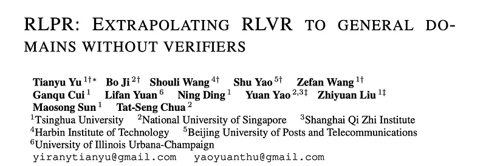
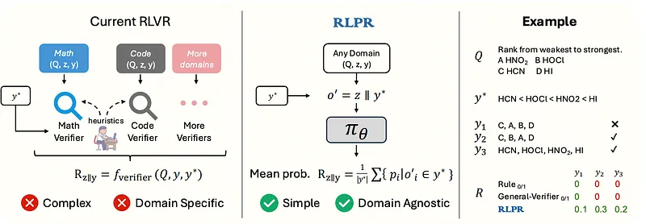
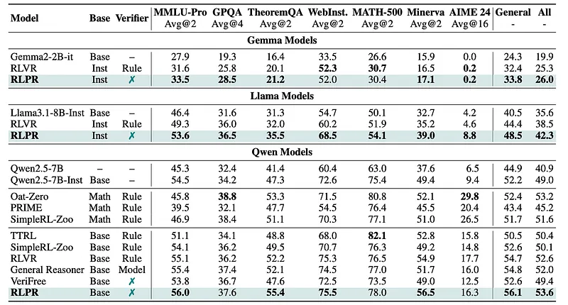
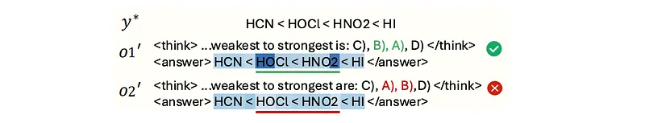
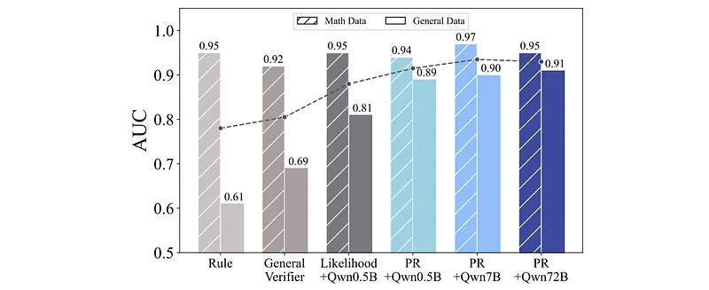

# Papers Explained 413 - Reinforcement Learning with Reference Probability Reward (RLPR)

Reinforcement learning from verifiable reward (RLVR) is a general post-training paradigm in which a rule-based verifier assigns a scalar reward score to each generated response. Specifically, given a prompt x, the policy πθ produces reasoning content z and the final answer y. Then the expected verifier score is optimized:

This page ingests the source article into the wiki and connects it to [[Papers Explained Corpus]], [[Reasoning Models]], [[Reinforcement Learning Topic]], [[Safety and Alignment]], [[Large Language Models]], [[Evaluation and Benchmarks]], [[Reinforcement Learning]], [[Verifier-Bounded Learning]].

## Source Metadata

- Source file: `raw/2025-07-21_Papers-Explained-413--Reinforcement-Learning-with-Reference-Probability-Reward--RLPR--ac742c006a22.md`
- Source title: Papers Explained 413: Reinforcement Learning with Reference Probability Reward (RLPR)
- Published: 2025-07-21
- Canonical: [https://medium.com/@ritvik19/papers-explained-413-reinforcement-learning-with-reference-probability-reward-rlpr-ac742c006a22](https://medium.com/@ritvik19/papers-explained-413-reinforcement-learning-with-reference-probability-reward-rlpr-ac742c006a22)

## Key Ideas

- The project is available at [GitHub](https://github.com/openbmb/RLPR).
- Reinforcement learning from verifiable reward (RLVR) is a general post-training paradigm in which a rule-based verifier assigns a scalar reward score to each generated response.
- where f_verifier is a task-specific, rule-based verifier checking whether the generated answer y_passes the test defined by ground truth y∗.
- Motivated by the observation that the LLM’s intrinsic probability of generating a correct answer directly indicates its internal evaluation of the reasoning quality, per-token decoding probabilities of the reference answer are used as the reward signal.
- where f_seq aggregates per-token probabilities into a single reward scalar for the response o.

## Notes

Reinforcement Learning with Verifiable Rewards (RLVR) is effective for improving LLM reasoning, but it’s limited to math and code due to the need for domain-specific verifiers, which are complex and don’t scale well. To address the challenge, the key observation is that LLM’s intrinsic probability of generating a correct free-form answer directly indicates its own evaluation of the reasoning reward (i.e., how well the reasoning process leads to the correct answer). Building on this insight, RLPR is proposed, a simple verifier-free framework that extrapolates RLVR to broader general domains.

The project is available at [GitHub](https://github.com/openbmb/RLPR).

## Reinforcement Learning with Reference Probability Reward

### Reinforcement Learning From Verifiable Rewards

Reinforcement learning from verifiable reward (RLVR) is a general post-training paradigm in which a rule-based verifier assigns a scalar reward score to each generated response. Specifically, given a prompt x, the policy πθ produces reasoning content z and the final answer y. Then the expected verifier score is optimized:

where f_verifier is a task-specific, rule-based verifier checking whether the generated answer y_passes the test defined by ground truth y∗.

### Probability Reward

Motivated by the observation that the LLM’s intrinsic probability of generating a correct answer directly indicates its internal evaluation of the reasoning quality, per-token decoding probabilities of the reference answer are used as the reward signal.

Each response to question Q is denoted as o = (o0,···,oN), where oi is an individual token in the response. To obtain probabilities, the generated answer y is first extracted from the full response sequence and the remaining content is denoted as reasoning z. A modified sequence o′ = (o′0,···,o′ N′) is then constructed by replacing the generated answer with the reference from the training data. This means that the tokens corresponding to the generated answer ‘y’ in the original sequence are substituted with the tokens of the reference answer ‘y*’ from the training dataset. The reasoning part ‘z’ of the generated response is not changed. This sequence is fed to the policy model to get probabilities (p0,···,pN′). The probability reward is computed as:

where f_seq aggregates per-token probabilities into a single reward scalar for the response o. While using f_seq = n (the normalized product of probabilities, i.e., sequence likelihood) reflects the overall likelihood of the reference answer, it introduces high variance and is overly sensitive to minor variations, such as synonyms. To address this issue, f_seq = 1/|y∗| (mean probabilities) is adopted, which yields a more robust reward signal and demonstrates superior correlation.

### Reward Debiasing

The probability-based rewards, while correlating with response quality, are influenced by latent factors unrelated to the reasoning process itself. These factors, denoted as Uothers, include characteristics of the question and the reference answer. Using the raw probability reward directly introduces bias due to these unobserved factors.

RLPR introduces a base score, r’, calculated by computing the probability score of directly decoding the reference answer without any intermediate reasoning. This score captures the influence of Uothers.

The debiased probability reward, denoted as ˆr, is then calculated as:

This debiasing step effectively removes the potential bias from the question and reference answer, modeling the probability reward as the improvement in probability given the generated reasoning. This stabilizes training and enhances reward robustness.

### Standard Deviation Filtering

Existing RLVR methods employ accuracy filtering to stabilize training by excluding too difficult and too easy prompts. Typically, this involves filtering entirely correct or incorrect prompts. However, the continuous nature of PR makes it challenging to directly apply accuracy filtering since it is hard to set a universal threshold for response correctness.

Through the analysis of accuracy filtering, filtering prompts with low standard deviation in reward values can effectively achieve a similar effect.

Meanwhile, the overall standard deviation distribution continuously shifts during training, and a fixed threshold may cause either too strict or loose filtering at different training stages. To address this, an exponential moving average is adopted to dynamically update the filtering threshold β using the average standard deviation of each training step. By filtering the prompts whose reward standard deviation is less than β, an adaptive curriculum learning mechanism is introduced to improve both the training stability and final performance.

## Experiment Setup

Experiments are conducted on Gemma2, Llama3.1, and Qwen2.5 (default) series models. The collection of prompts released by General Reasoner is adopted, which includes high-quality reasoning questions across multiple complex domains. To focus on the effectiveness of RLPR in general domains, only non-mathematics prompts from the data are used. GPT-4.1 is asked to filter out prompts that are too easy, resulting in 77k prompts for training. The max generation length for training and evaluation is 3072. For reliable answer extraction, the “<think></think><answer></answer>” template of R1 is adopted.

## Evaluation

*Figure: Overall performance on seven reasoning benchmarks.*

- RLPR significantly improves general-domain reasoning performance, achieving an average improvement of 24.9% on four benchmarks using Qwen2.5–7B.

- RLPR outperforms the RLVR baseline on Qwen, Llama, and Gemma models, with improvements of 1.4, 3.9, and 1.4 average points, respectively.

- RLPR enhances mathematical reasoning capabilities, even without explicit training on mathematical data, surpassing Oat-Zero and SimpleRL-Zoo on the Minerva benchmark.

- RLPR performs better than methods that use trained verifier models, exceeding General Reasoner by an average of 1.6 points across seven reasoning benchmarks.

- RLPR demonstrates a significant performance advantage over concurrent verifier-free methods, with improvements of 7.6 points on TheoremQA and 7.5 points on Minerva compared to VeriFree.

*Figure: Token-level probability visualization.*

- PR’s Error Reflection: Probability-based Reward (PR) can precisely reflect errors at a token level, as illustrated by a lower score on an incorrect token in a response sequence.

*Figure: Reward quality comparison.*

- PR Outperforms Rule-Based Verifiers on General Data: PR demonstrates superior discrimination capability compared to rule-based verifiers, especially on general-domain prompts where rule-based verifiers struggle due to limited natural language processing.

- PR Outperforms Other Verifier Models: PR consistently outperforms other verifier models (like the General-Verifier) across both mathematical and general domains, achieving significant improvements.

- Efficiency of PR: PR leverages the intrinsic capabilities of Large Language Models (LLMs) to directly produce high-quality reward scores in a single forward pass, eliminating the need for text post-processing, which is a limitation for finetuning-based paradigms like the General-Verifier.

- PR Effectiveness with Small Models: PR is effective even with small-scale models, with the smallest tested model (Qwen2.5–0.5B) outperforming a specifically trained General-Verifier.

- PR Robustness: PR values show negligible correlation with response length and decoding entropy, indicating that it serves as a robust reward mechanism.

*Figure: Effect of different RLVR training data and reward mechanisms.*

- PR Essential for General-Domain Data: PR is crucial for effectively utilizing general-domain data, which otherwise poses challenges for existing rule-based verifiers and can lead to diminished performance.

## Paper

RLPR: Extrapolating RLVR to General Domains without Verifiers [2506.18254](https://arxiv.org/abs/2506.18254)

## Figures

Figures from the Medium HTML export (`raw/2025-07-21_Papers-Explained-413--Reinforcement-Learning-with-Reference-Probability-Reward--RLPR--ac742c006a22.md`); local copies under `wiki/assets/papers-explained-413-reinforcement-learning-with-reference-probability-reward-rlpr/` when download succeeded.

| Figure | Caption |
|--------|---------|
|  | Title card: Reinforcement Learning with Reference Probability Reward (RLPR). |
|  | where f_verifier is a task-specific, rule-based verifier checking whether the generated answer y_passes the test defined by ground truth y∗. |
|  | where f_verifier is a task-specific, rule-based verifier checking whether the generated answer y_passes the test defined by ground truth y∗. |
|  | Each response to question Q is denoted as o = (o0,···,oN), where oi is an individual token in the response. |
|  | The probability-based rewards, while correlating with response quality, are influenced by latent factors unrelated to the reasoning process... |
|  | The debiased probability reward, denoted as ˆr, is then calculated as. |
|  | Overall performance on seven reasoning benchmarks. |
|  | Token-level probability visualization. |
|  | Reward quality comparison. |
|  | Effect of different RLVR training data and reward mechanisms. |
## Related

- [[Papers Explained Corpus]]
- [[Reasoning Models]]
- [[Reinforcement Learning Topic]]
- [[Safety and Alignment]]
- [[Large Language Models]]
- [[Evaluation and Benchmarks]]
- [[Reinforcement Learning]]
- [[Verifier-Bounded Learning]]
- [[Papers Explained 412 - Claude Research]]
- [[Papers Explained 414 - Out-of-distribution Math Problems Evaluation with 3 Generalization Axes…]]

#summary #topic
