# Papers Explained 414 - Out-of-distribution Math Problems Evaluation with 3 Generalization Axes…

OMEGA (Out-of-distribution Math Problems Evaluation with 3 Generalization Axes) is a controlled yet diverse benchmark designed to evaluate three axes of out-of-distribution generalization, inspired by Boden’s typology of creativity:

This page ingests the source article into the wiki and connects it to [[Papers Explained Corpus]], [[Reasoning Models]], [[Evaluation and Benchmarks]], [[Computer Vision]], [[Agentic AI]].

## Source Metadata

- Source file: `raw/2025-07-22_Papers-Explained-414--Out-of-distribution-Math-Problems-Evaluation-with-3-Generalization-Axes--ac4abe71a794.html`
- Source title: Papers Explained 414: Out-of-distribution Math Problems Evaluation with 3 Generalization Axes…
- Published: 2025-07-22
- Canonical: [https://medium.com/@ritvik19/papers-explained-414-out-of-distribution-math-problems-evaluation-with-3-generalization-axes-ac4abe71a794](https://medium.com/@ritvik19/papers-explained-414-out-of-distribution-math-problems-evaluation-with-3-generalization-axes-ac4abe71a794)

## Key Ideas

- Exploratory: applying known problem-solving skills to more complex instances within the same problem domain
- Compositional: combining distinct reasoning skills, previously learned in isolation, to solve novel problems that require integrating these skills in new and coherent ways
- Transformative: adopting novel, often unconventional strategies by moving beyond familiar approaches to solve problems more effectively.
- Programmatic generation and solution validation: To ensure scalability, both problem instances and their solutions are programmatically generated.
- Grid search algorithms for function_intersection problems.

## Notes

## Papers Explained 414: Out-of-distribution Math Problems Evaluation with 3 Generalization Axes (OMEGA)

OMEGA (Out-of-distribution Math Problems Evaluation with 3 Generalization Axes) is a controlled yet diverse benchmark designed to evaluate three axes of out-of-distribution generalization, inspired by Boden’s typology of creativity:

- Exploratory: applying known problem-solving skills to more complex instances within the same problem domain

- Compositional: combining distinct reasoning skills, previously learned in isolation, to solve novel problems that require integrating these skills in new and coherent ways

- Transformative: adopting novel, often unconventional strategies by moving beyond familiar approaches to solve problems more effectively.

*Figure: Examples of training-test pairs designed to test distinct generalization capabilities.*

All training and test problems are generated from carefully designed templates to enable precise control over problem structure, diversity, and required reasoning strategies. To do so, 40 templated problem generators spanning six mathematical domains are used: arithmetic, algebra, combinatorics, number theory, geometry, and logic & puzzles. These problems are calibrated at the knowledge level comparable to the American Invitational Mathematics Examination (AIME), with many serving as crucial sub-components in solving Olympiad-level problems.

*Figure: Example problem templates across six mathematical domains.*

- Single-scope with meaningful variations: Each problem template is designed to focus on a single-scope mathematical strategy, meaning the required solution approach is confined within a well-defined framework, which enables controlled studies of specific reasoning patterns. For example, problem families on different geometric shapes are isolated independently instead of combining multiple shapes in a single template. Simultaneously, meaningful variation is ensured by designing parameters that fundamentally alter solution trajectories when modified, contrasting with datasets like GSM-PLUS where numerical perturbations often preserve the underlying solution path without introducing new reasoning challenges.

- Programmatic generation and solution validation: To ensure scalability, both problem instances and their solutions are programmatically generated. This requirement significantly influenced template selection, especially for geometry problems that demand sophisticated procedural generation. Diverse computational methods are employed for solution validation, including:

- Grid search algorithms for function_intersection problems.

- Exhaustive enumeration for combinatorial tasks.

- Computer vision techniques, such as cv2.approxPolyDP from OpenCV, for accurately counting polygons in rotation problems.

### Exploratory Generalization

Exploratory generalization assesses whether a model can faithfully extend a single reasoning strategy beyond the range of complexities seen during training. Concretely, the model is exposed to problems drawn from one template τ, all lying within a “low-complexity” regime, and is then evaluated on harder instances from the same family.

This axis probes robustness: does the model generalizes the same algorithm to higher complexity problems? or does it merely memorize solutions at a fixed complexity level?

A task-specific complexity measure (δ) is used to rank problems by increasing complexity. A cutoff threshold (δ0) is defined. Training Data includes all problem instances where δ ≤ δ0. Testing Data consists of problem instances where δ>δ0. The δ0 is chosen such that the base model achieves under 50% accuracy on the training data, indicating the inherent difficulty of the tasks and allowing room for improvement.

### Compositional Generalization

Compositional generalization probes a model’s ability to integrate multiple, distinct reasoning strategies. Unlike explorative generalization, which scales a known method to larger instances, compositional generalization requires a fusion of sub-skills synergistically.

This axis determines whether a model can move beyond mastering individual reasoning patterns to dynamically combine them. This helps distinguish shallow, rote learning from genuine skill integration and true task understanding.

To ensure meaningful compositional settings, the following principles are enforced:

Cohesive Skill Integration:

- Compositional training problems must necessitate a true synthesis of multiple reasoning skills, not just a superficial concatenation.

- Solving the problem should depend on the synergistic application of sub-skills, rather than their naive application in sequence.

Complete Skill Coverage:

- Every reasoning skill involved in the composed test task must be independently represented in the training set.

- This ensures that success on the test reflects the model’s ability to compose familiar strategies, rather than relying on exposure to novel ones.

Nontrivial Complexity of Train Problems:

- Training problems should be sufficiently challenging to ensure the model genuinely learns each sub-skill.

- This makes any gains observed from compositional ability more attributable to skill integration rather than simple memorization. The text notes that training problems from their templated inventory remain challenging even at low complexity levels (1–2) for the base model.

The compositional dataset is structured around specific categories. Within each problem family, a “core skill” is identified. Corresponding training examples are constructed to isolate and reinforce this individual core skill. Test problems are designed to require the synergistic application of two distinct skills. The solution cannot be obtained by applying each skill naively; it demands their true integration. Each setting includes multiple training instances for individual skills and corresponding test instances that assess the model’s ability to combine them effectively.

7 distinct settings are provided to assess compositional performance.

*Figure: Examples of training and test tasks that probe Compositional generalization ability of LLM.*

### Transformative Generalization

Transformative generalization asks whether a model can abandon a familiar but ultimately ineffective strategy in favor of a qualitatively different and more efficient one. These tasks lie outside the scope of mere extension or composition; they demand a “jump out of the box.” It requires looking at the problem in a new or creative way that avoids the usual methods, which aren’t working.

To ensure meaningful transformative settings, the following principles are enforced:

- Same Problem Scope, New Insight: Training and test problems belong to the same template family (e.g., polynomial-root finding or function-intersection). However, test instances are specifically designed such that the familiar tactic learned during training either fails completely or becomes intractably cumbersome.

- Necessity of Reframing: Solving the test problem must necessitate a novel strategy. This could involve a symmetry-exploiting substitution, a global geometric argument, or other non-obvious insights, rather than relying on exhaustive casework or brute-force enumeration.

- Nontrivial Training Tasks: The training problems themselves must be sufficiently challenging. This ensures that the model genuinely learns and masters the familiar, conventional tactic before being compelled to abandon it for the more efficient, novel approach required by the test problems.

The transformative dataset is structured into seven distinct categories, each designed to evaluate a model’s ability to adopt novel problem-solving approaches.

- Training Problems are generated from standard templates and can typically be solved using conventional reasoning strategies of moderate complexity. Their purpose is to ensure the model thoroughly acquires foundational skills and masters the “familiar tactic.”

- Test Problems are intentionally constructed to render the familiar methods ineffective. They compel the model to devise and employ qualitatively distinct solutions.

*Figure: Examples of training and test tasks that probe Transformative generalization.*

## Experiments: Limits of Reasoning Language Models

Four frontier models are evaluated: DeepSeek-R1, Claude-3.7-Sonnet, OpenAI-o3-mini, and OpenAI-o4-mini3, across different complexity levels, measuring exact-match accuracy on a held-out set of 100 samples per complexity level.

### Reasoning LLMs performance degrades with increasing problem complexity

*Figure: Exact-match accuracy of four top-tier LLMs on OMEGA, plotted against increasing complexity levels.*

- LLM performance degrades as problem complexity increases, despite using Chain-of-Thought (CoT) reasoning.

- CoT reasoning is effective only below a critical complexity threshold; beyond that, performance deteriorates rapidly.

*Figure: Performance and reasoning patterns across six mathematical task domains showing accuracy degradation and verification behavior as problem complexity increases.*

- Models often reach correct solutions early but spend excessive tokens on verification (“overthinking”).

- Incorrect responses consistently consume more tokens than correct ones.

*Figure: The percentage of incorrect responses exhibiting two distinct error patterns.*

- Two dominant patterns of reasoning failures were identified:

- Correct → Incorrect shift: Models initially arrive at the correct answer but then revise toward an incorrect one.

- Reasoning Spirals (Wrong → Wrong): Models never reach the correct answer and cycle through flawed reasoning paths.

- CoT with self-correction and backtracking is not sufficient to counter the snowballing of errors due to the autoregressive nature of transformers.

- CoT overthinking can paradoxically lead models to abandon the correct branch and answer, causing them to fall into spirals of errors.

### Is Lower Accuracy Simply Caused by Errors in Computation? Not Really, LLMs Exhibit Preference for Heuristics Over Direct Computation

*Figure: Reasoning trace analysis.*

Three key trends:

- Shrinking calculation budget: The fraction of tokens devoted to computation decreases as problem complexity increases.

- Growing reliance on guesswork: The use of conjectural statements increases as problem complexity increases.

- High per-step accuracy: When the model does compute, it does so more reliably at higher complexity levels.

- Accuracy loss at higher complexity is not solely driven by numerical mistakes, but also by the model’s reluctance to invest reasoning budget in systematic calculation.

- Mitigating this issue may require steering mechanisms that incentivize faithful computation rather than merely improving arithmetic skill.

### Can More Inference-Time Compute Solve Harder Problems? Helps at Moderate Complexity, but Gains Plateau at Higher Levels

*Figure: Pass@k performance of the advanced LLMs across complexity levels for geometry rotation problems.*

- Increasing the search space (number of candidates) improves performance, especially when problem complexity is low, approaching 100% accuracy.

- As problem complexity increases, the benefit of increasing the search space diminishes, and performance drops to zero at the highest complexity level (level 6).

- The failure at high complexity is not due to context length limitations.

- A modest increase in combinatorial load can overwhelm current reasoning LLMs.

- Simply increasing the search space cannot overcome the fundamental limitations of transformers.

- Smarter scaling approaches are needed that enable models to learn underlying algorithms and skills, rather than relying solely on increased compute.

- Increasing the number of attempts beyond 64 is unlikely to improve performance at the highest complexity level.

## RL Generalization Experiments

The impact of RL on the generalization capabilities of the base model, Qwen2.5–7B-Instruct and Qwen2.5-Math-7B, is evaluated across all three distinct generalization paradigms.

### Can RL Effectively Generalize from Easy to Hard Problems? Strong Early Gains, but Generalization Plateaus with Task Complexity

*Figure: Performance comparison of Qwen2.5–7B-Instruct before and after RL on OMEGA under the exploratory generalization setting.*

- RL training on low-complexity problems (levels 1–2) consistently improves generalization to medium-complexity problems (level 3), with larger gains on in-domain (ID) examples compared to out-of-domain (OOD) examples.

- The performance boost from RL is not uniform across all domains; geometry shows smaller gains compared to Zebra Logic.

*Figure: Generalization across complexity levels.*

- Training RL on a broader range of complexities (levels 1–4) does not necessarily improve generalization to harder problems (level 5).

- RL can uncover effective reasoning strategies through reward-driven exploration, even in complex combinatorial reasoning tasks.

- Domain complexity and prior exposure significantly influence RL effectiveness.

- RL alone may not be sufficient to push performance beyond the model’s base capabilities on very hard problems.

- RL improvements appear task-dependent rather than uniformly correlated with the base model’s initial performance.

- RL fine-tuning narrows the gap between in-distribution and OOD performance, but does not reliably equip the model with the underlying skills required to solve more complex tasks and to transfer reasoning capabilities from easy to hard problems.

### Can RL Learn to Compose Math Skills into Integrated Solutions? Strong Performance on Isolated Skills, but Limited Compositional Generalization

*Figure: Performance comparison of Qwen2.5–7B-Instruct on OMEGA under the compositional generalization setting.*

- RL training significantly improves performance on individual skills (Sai and Sbi) compared to a base model. Performance often exceeds 69% accuracy.

- The magnitude of improvement varies across settings, suggesting some skills are easier to reinforce than others.

- Models struggle to combine learned skills when tested on integrated tasks, showing little to no improvement after RL.

- RL is effective at reinforcing specific, isolated reasoning capabilities.

- Current RL approaches tend to overfit to specific patterns within each skill domain rather than learning flexible, generalizable reasoning strategies.

- RL can promote compositional generalization, but only when the underlying skills are conceptually aligned and sufficiently reinforced during joint training.

### Can RL Go Beyond Familiar Skills to Discover New Reasoning Abilities? Learns Familiar Strategies, but Struggles with Unconventional Solution Paths

*Figure: Performance comparison of Qwen2.5–7B-Instruct on OMEGA under the transformational generalization setting.*

- RL training provides substantial benefits on in-domain examples (+56% on matrix rank).

- Performance on OOD transformational problems remains low after RL, often 0%.

- A small improvement was observed in Setting 7 (+10 pp), but the model still relied on naive solutions.

- In the matrix rank setting, RL training led to performance deterioration, dropping 30 percentage points from the base model’s OOD performance of 70%.

- RL offers meaningful gains when a familiar structure exists but struggles to induce genuinely novel reasoning strategies without prior exposure.

- RL training alone may be insufficient for discovering novel reasoning paradigms.

- Transformational capabilities may require explicit exposure to diverse problem-solving strategies during base model training or supervised fine-tuning.

- RL optimization can sometimes reinforce suboptimal patterns learned during training rather than promoting exploration of alternative approaches.

## Paper

OMEGA: Can LLMs Reason Outside the Box in Math? Evaluating Exploratory, Compositional, and Transformative Generalization [2506.18880](https://arxiv.org/abs/2506.18880)

## Figures

Figures from the Medium HTML export (`raw/2025-07-22_Papers-Explained-414--Out-of-distribution-Math-Problems-Evaluation-with-3-Generalization-Axes--ac4abe71a794.html`); local copies under `wiki/assets/papers-explained-414-out-of-distribution-math-problems-evaluation-with-3-generalization-axes/` when download succeeded.

| Figure | Caption |
|--------|---------|
| 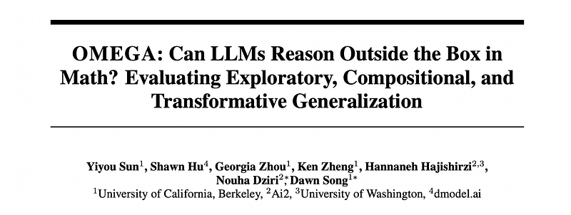 | Title card: Out-of-distribution Math Problems Evaluation with 3 Generalization Axes…. |
| 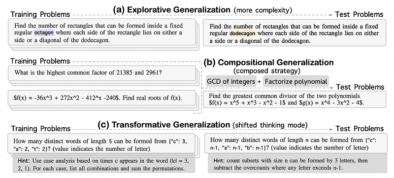 | Examples of training-test pairs designed to test distinct generalization capabilities. |
| 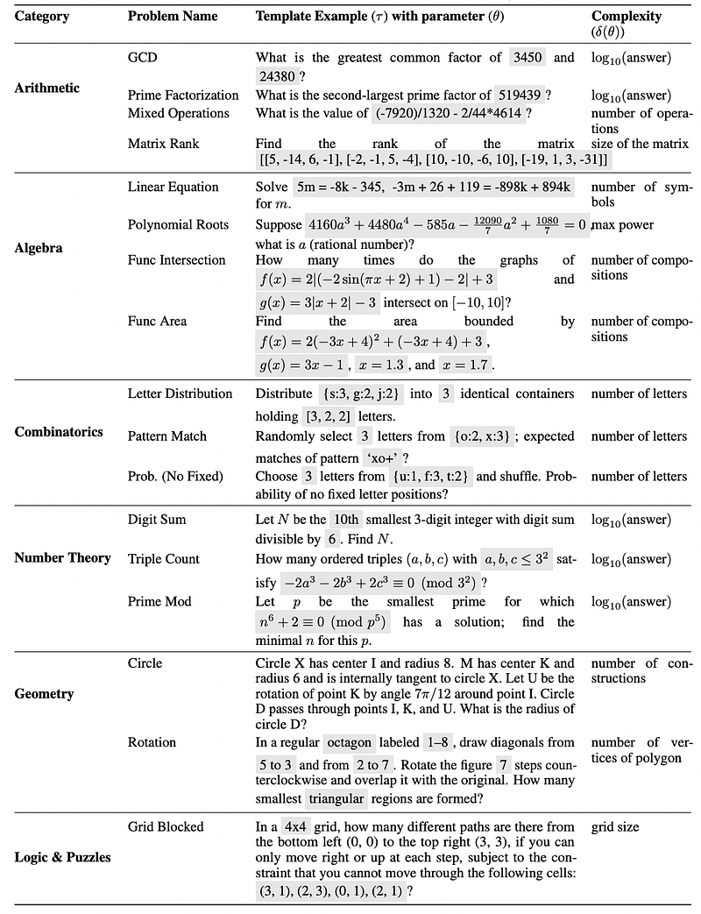 | Example problem templates across six mathematical domains. |
| 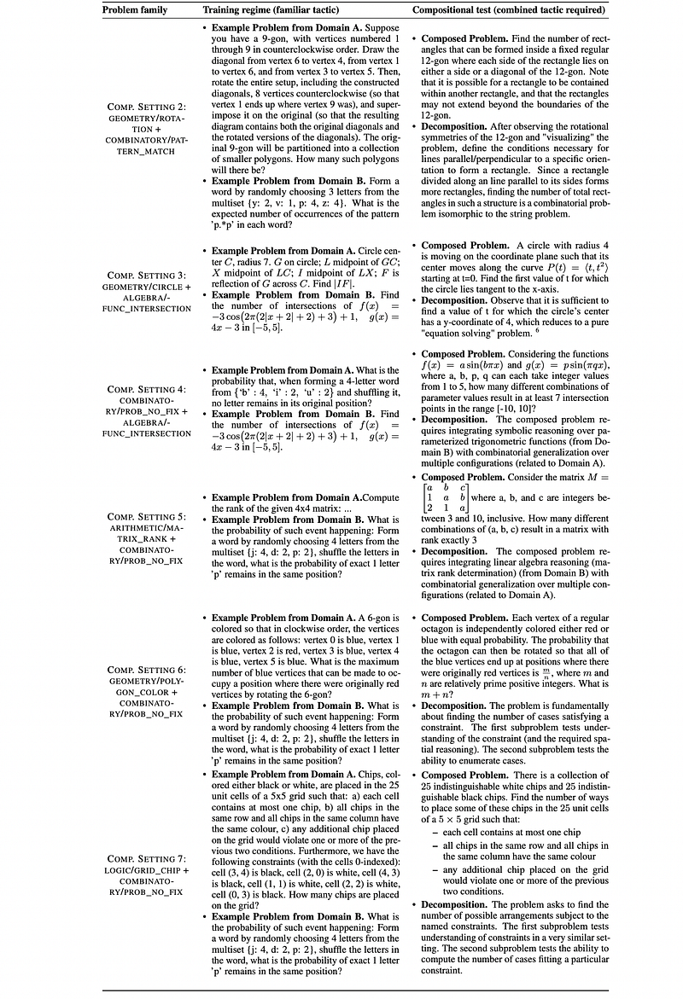 | Examples of training and test tasks that probe Compositional generalization ability of LLM. |
| 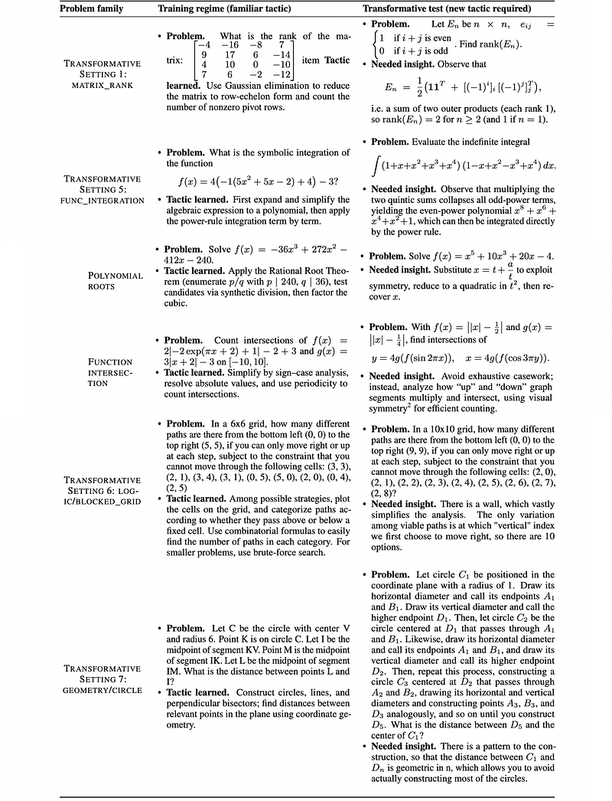 | Examples of training and test tasks that probe Transformative generalization. |
| 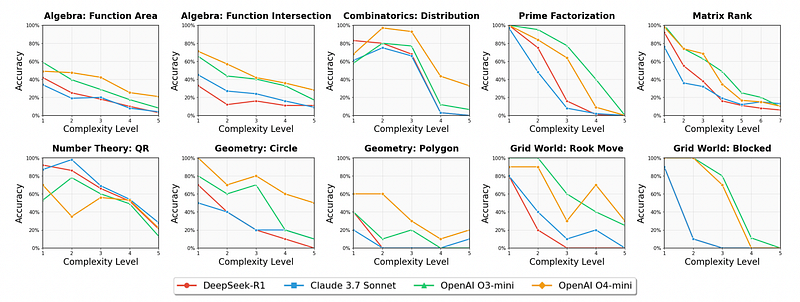 | Exact-match accuracy of four top-tier LLMs on OMEGA, plotted against increasing complexity levels. |
| 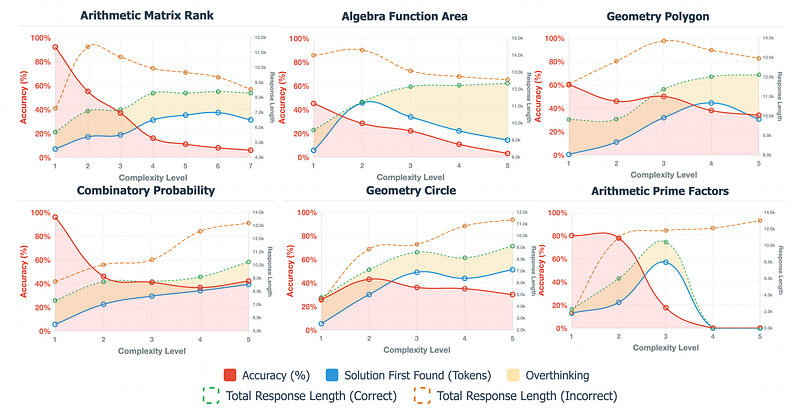 | Performance and reasoning patterns across six mathematical task domains showing accuracy degradation and verification behavior as problem complexity increases. |
| 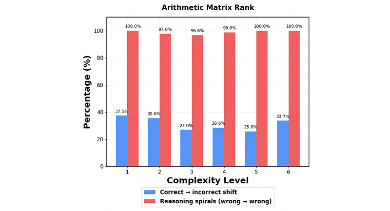 | The percentage of incorrect responses exhibiting two distinct error patterns. |
| 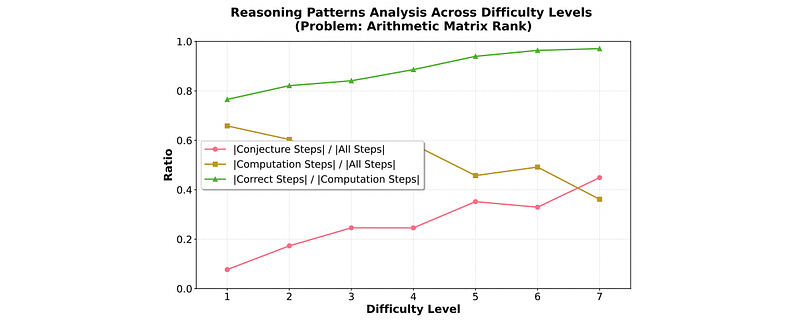 | Reasoning trace analysis. |
| 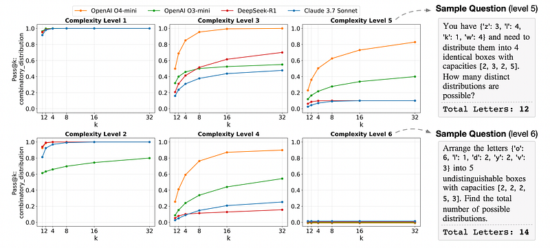 | Pass@k performance of the advanced LLMs across complexity levels for geometry rotation problems. |
| 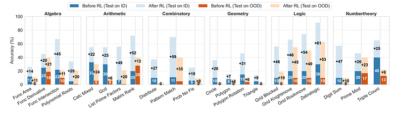 | Performance comparison of Qwen2.5–7B-Instruct before and after RL on OMEGA under the exploratory generalization setting. |
| 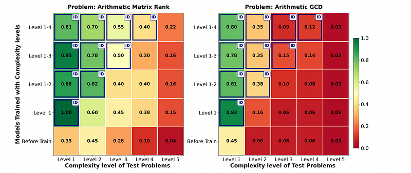 | Generalization across complexity levels. |
| 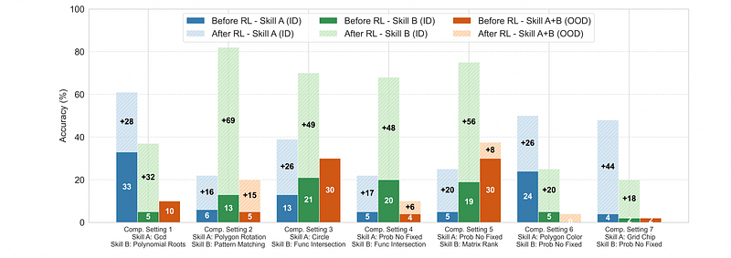 | Performance comparison of Qwen2.5–7B-Instruct on OMEGA under the compositional generalization setting. |
| 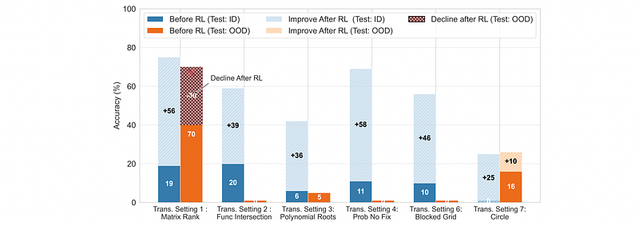 | Performance comparison of Qwen2.5–7B-Instruct on OMEGA under the transformational generalization setting. |
## Related

- [[Papers Explained Corpus]]
- [[Reasoning Models]]
- [[Evaluation and Benchmarks]]
- [[Computer Vision]]
- [[Agentic AI]]
- [[Papers Explained 413 - Reinforcement Learning with Reference Probability Reward (RLPR)]]
- [[Papers Explained 415 - Gemini 2.5 Pro Capable of Winning Gold at IMO 2025]]

#summary #topic
