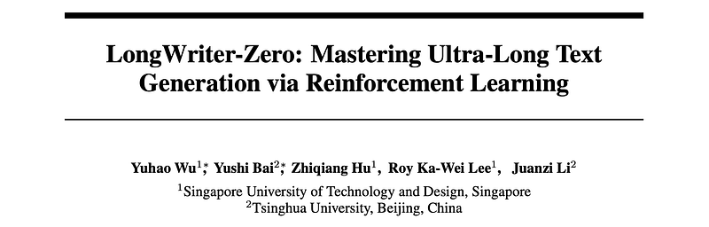
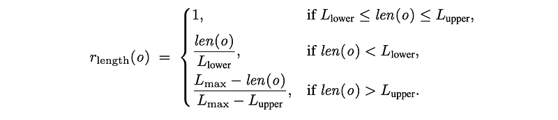
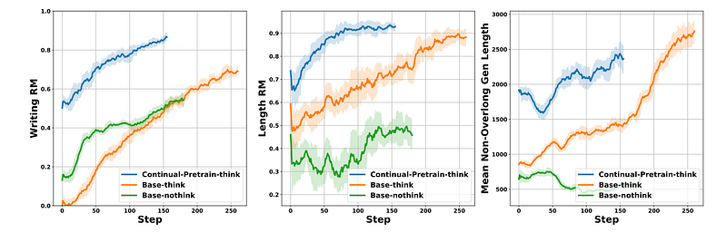
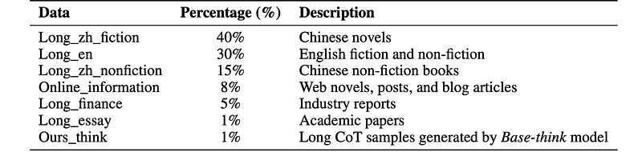
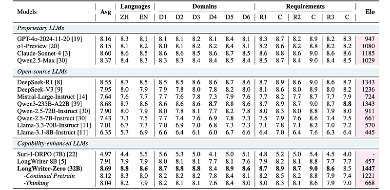
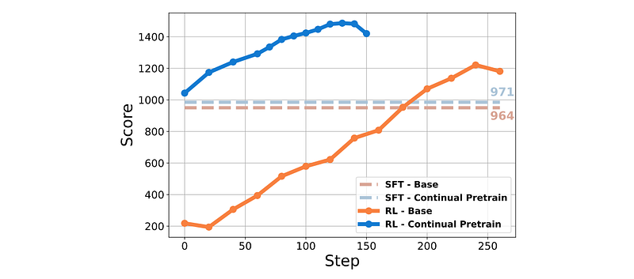
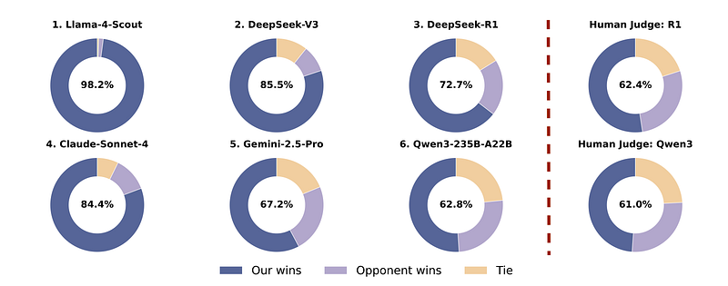

# Papers Explained 416 - LongWriter-Zero

To train policies for ultra-long-form generation, the Group Relative Policy Optimization (GRPO) algorithm is adopted for RL training on the Qwen2.5–32B base model. Training prompts are sampled from two large-scale, real-world instruction datasets: English instructions from WildChat-1M and Chinese instructions from LMSYS-Chat-1M.

This page ingests the source article into the wiki and connects it to [[Papers Explained Corpus]], [[Reinforcement Learning Topic]], [[Synthetic Data]], [[Safety and Alignment]], [[Evaluation and Benchmarks]], [[Long Context]], [[Reinforcement Learning]].

## Source Metadata

- Source file: `raw/2025-07-24_Papers-Explained-416--LongWriter-Zero-326f86fa5be5.html`
- Source title: Papers Explained 416: LongWriter-Zero
- Published: 2025-07-24
- Canonical: [https://medium.com/@ritvik19/papers-explained-416-longwriter-zero-326f86fa5be5](https://medium.com/@ritvik19/papers-explained-416-longwriter-zero-326f86fa5be5)

## Key Ideas

- To train policies for ultra-long-form generation, the Group Relative Policy Optimization (GRPO) algorithm is adopted for RL training on the Qwen2.5–32B base model.
- To provide a timely and comprehensive monitor of the model’s long-form generation capabilities during training, Arena-Write is manually curated, a lightweight benchmark comprising 100 diverse real-world user writing instructions as test prompts.
- A composite reward function is designed that integrates multiple reward models, each targeting a distinct aspect of writing quality.
- Guides the model to produce responses of appropriate length, using QwQ-32B to predict the appropriate word count range for each query.
- Qwen2.5–72B is finetuned on manually-labeled preference data (yw, yl) over writing-related prompt x, following the Bradley-Terry model to model preferences to capture holistic writing quality, including fluency, coherence, and helpfulness.

## Notes

This work proposes an incentivization based approach that, starting entirely from scratch and without relying on any annotated or synthetic data, leverages reinforcement learning (RL) to foster the emergence of ultra-long, high-quality text generation capabilities in LLMs. RL training is performed starting from a base model, similar to R1-Zero, guiding it to engage in reasoning that facilitates planning and refinement during the writing process. To support this, specialized reward models are employed to steer the LLM towards improved length control, writing quality, and structural formatting.

## Reinforcement Learning for Ultra-Long Text Generation

To train policies for ultra-long-form generation, the Group Relative Policy Optimization (GRPO) algorithm is adopted for RL training on the Qwen2.5–32B base model. Training prompts are sampled from two large-scale, real-world instruction datasets: English instructions from WildChat-1M and Chinese instructions from LMSYS-Chat-1M. To ensure the quality and suitability of queries for long-form generation, the QwQ-32B model is used to filter inputs, retaining only requests that demand high-quality, extended outputs.

To provide a timely and comprehensive monitor of the model’s long-form generation capabilities during training, Arena-Write is manually curated, a lightweight benchmark comprising 100 diverse real-world user writing instructions as test prompts.

### RQ1: Reward Design

A composite reward function is designed that integrates multiple reward models, each targeting a distinct aspect of writing quality.

Length RM

Guides the model to produce responses of appropriate length, using QwQ-32B to predict the appropriate word count range for each query.

```text
You are a professional query text–length assessor. Based on the type of the query content, you should:
1. Deeply understand the core requirement of the query (e.g., essay, blog post, summary, outline, thesis section, etc.). For example, the query “How do I start writing my thesis from scratch” asks for guidance on “how to begin writing a thesis,” so you would estimate a word-count range of [400, 800], rather than the total words needed to complete the entire thesis [7000, 10000].
2. Choose a lower bound that is a multiple of 100, with a minimum of 0.
3. Choose an upper bound that is a multiple of 100, with a maximum of 12,000. If the reasonable range certainly exceeds these limits, output: {"range": [0, 0]}
4. Ignore the 10% of extreme length cases to keep the range reasonable for most scenarios, and ensure the difference between upper and lower bounds does not exceed 3,000.
5. If the query contains an explicit word-count requirement, set the range to ±10% of that number. - For “write a 2,000-word essay,” output: {"range": [1800, 2200]} - For “no more than 2,000 words,” output [1800, 2000]; for “at least 2,000 words,” output [2000, 2200].
6. If the query cannot be fulfilled under the given conditions—for example, “Read and analyze this paper” without providing the paper, or “Analyze a project’s prospects” without specifying the project details—then output: {"range": [0, 0]}
Example:
Input “Write a high school essay” → {"range": [800, 1000]}
Input “Complete an academic paper on green cities” → {"range": [6000, 10000]}
Please process the current query: User Query
Analyze and output the JSON range accordingly.
```

Writing RM

Qwen2.5–72B is finetuned on manually-labeled preference data (yw, yl) over writing-related prompt x, following the Bradley-Terry model to model preferences to capture holistic writing quality, including fluency, coherence, and helpfulness.

Format RM

Enforces structural integrity and reduces redundancy. Checks whether the output conforms to a predefined structure: exactly one <think> segment followed by one <answer> segment.

Penalizes repetitive content based on semantic overlap metrics. This is important in RL settings where models may easily reach the target length required by the Length RM by generating nearly identical paragraphs.

Final Reward

Instead of averaging the unnormalized rewards, the average is computed over the individual advantages:

where,

The model is trained with the final composite reward. This training setting is denoted as Base-nothink.

### RQ2: Test-time Scaling

The think step, typically wrapped in <think> and </think> tokens, allows the model to plan and reflect before committing to a final response. These methods have achieved strong empirical results in reasoning-heavy domains like math and code. However, it remains unclear whether a similar test-time scaling effect generalizes to open-ended tasks such as long-form writing.

To investigate this, two prompting strategies are compared during RL training and inference, one explicitly demands the model to engage in thinking and the other asks the model to directly output the Response.

```text
A conversation between the user and the assistant.
The user provides a writing/general task, and the assistant completes it.
The assistant first deeply thinks through the writing/answering process in their mind before providing the final written work to the user. The assistant should engage in comprehensive and in-depth planning to ensure that every aspect of the writing/general task is detailed and wellstructured.
If there is any uncertainty or ambiguity in the writing request, the assistants should reflect, ask themselves clarifying questions, and explore multiple writing approaches to ensure the final output meets the highest quality standards.
Since writing is both a creative and structured task, the assistant should analyze it from multiple perspectives, considering coherence, clarity, style, tone, audience, purpose, etc.
Additionally, the assistant should review and refine the work to enhance its expressiveness.
The writing thought process and the final written work should be enclosed within <think> and <answer> tags, respectively, as shown below:
<think> A comprehensive strategy for writing that encompasses detailed planning and structural design—including brainstorming, outlining, style selection, audience adaptation, self-reflection, quality assurance, etc </think>
<answer> The final written work after thorough optimization and refinement </answer>
```

```text
A conversation between the user and the assistant.
The user provides a writing/general task, and the assistant completes it.
The assistant directly provides the final written work.
The final written work should be enclosed within <answer> tags, as shown below:
<answer>Final written work.</answer>
```

*Figure: RL Training curves.*

- Models trained with Think Prompt (Base-think) initially exhibit lower Writing RM scores, close to zero in early RL steps, compared to their Direct-Answer counterparts (Base-nothink).

- This early lag is expected, as the model must first learn the structure and utility of producing <think> and <answer> segments driven by the Format RM.

- However, as RL progresses, the Base-think model steadily improves and ultimately surpasses the Base-nothink baseline, achieving a higher ceiling in Writing RM scores.

- This improvement is attributed to the reflective planning enabled by the <think> phase, which helps the model organize thoughts, segment content meaningfully, and allocate information across the output more effectively.

- This is further supported by consistently higher Length RM scores, indicating better control over output length through planning in long CoT.

### RQ3: Impact of Continual Pretraining

Prior work has emphasized that the performance ceiling of RL is often bounded by the capabilities of the underlying base model. To investigate whether this observation also holds for open-ended tasks like long-form writing, we continual pretrain the Qwen2.5–32B model on 30 billion tokens of high-quality, writing-centric data before RL training. The corpus comprises a diverse selection of Chinese and English books, reports, and academic papers, covering a broad spectrum of genres and topics to strengthen the model’s writing competence.

A small portion of long CoT data from the RL trained Base-think model is distilled to enhance the model’s reflective reasoning ability and facilitate initial format alignment. This CoT data is incorporated into the pretraining corpus at a minimal ratio of 1% to avoid memorization of specific CoT patterns.

*Figure: Continual pretraining data distribution.*

The same GRPO training is applied to the model after continual pretraining, deriving the Continual-Pretrain-think model.

- The Continual-Pretrain-think model shows higher initial scores in both the Writing RM and Length RM metrics in the beginning.

- This early advantage roots in improved writing priors acquired during continual pretraining, as well as early format alignment fostered by the inclusion of distilled long CoT data.

- Beyond a strong starting point, the model also achieves a higher overall reward ceiling.

## LongWriter-Zero

Based on the insights from the three research questions, a robust training pipeline for long-form generation is established. The process begins with continual pretraining on long books and articles to enhance the model’s general writing competence. Following this, GRPO training is applied with the Think prompt to explicitly encourage the model to engage in reasoning before generating responses. Using this training pipeline, the final model, LongWriter-Zero, is built by starting from Qwen2.5–32B and applying 30B tokens of continual pretraining followed by 150 steps of RL.

## Evaluations

*Figure: WritingBench performance of different LLMs across six domains and three writing requirements (scale: 1–10).*

The domains are: (D1) Academic & Engineering, (D2) Finance & Business, (D3) Politics & Law, (D4) Literature & Art, (D5) Education, and (D6) Advertising & Marketing. Requirements include (R1) Style, (R2) Format, and (R3) Length. “C” denotes the category-specific score.

- LongWriter-Zero achieves the highest overall critic score of 8.69, outperforming all other models including DeepSeek-R1 (8.55).

- Best performance in five out of six domains: Academic & Engineering (8.7), Finance & Business (8.8), Politics & Law (8.8), Education (8.9), and Advertising & Marketing (8.6, tie).

- Slightly lags behind DeepSeek-R1 in Literature & Art (8.4 vs. 8.6).

- Highest scores in Style (R1: 8.7, C: 8.9) and Format (R2: 8.7, C: 9.0), with a competitive Length score (R3: 8.6).

- Significantly outperforms other models in Arena-Write with an Elo rating of 1447, followed by DeepSeek-R1 and Qwen3–235B-A22B (both 1343).

- Removing Test-time Scaling and Continual Pretraining leads to a substantial performance drop on both WritingBench and Arena-Write.

- Thinking is more critical for Arena-Write (1221 ↘668), while Continual Pretraining is more important for WritingBench (8.69 ↘8.12).

- Integrating intermediate reasoning (think) and continual pretraining is crucial for LongWriter-Zero’s performance.

*Figure: Arena-Write performance across RL training steps, comparing RL (solid) and SFT (dashed) starting from Base (orange) and Continual Pretrain (blue) initializations.*

- RL consistently outperforms SFT over both base models.

- SFT shows marginal improvement with scores increasing slightly from 964 (base) to 971 (continual pretrained).

- RL-based approach benefits significantly from stronger, continually pretrained initialization, yielding substantial performance gains (1221 ↗1447).

*Figure: Win-rate results of LongWriter-Zero in human-in-the-loop win-rate evaluation.*

- LongWriter-Zero demonstrates a substantial performance lead over six strong baseline models in automatic evaluations, with win rates as high as 98.2% and above 62% against the strongest baselines.

- Human evaluation shows LongWriter-Zero consistently demonstrates strong human preference, validating its reliability in real-world scenarios.

## Paper

LongWriter-Zero: Mastering Ultra-Long Text Generation via Reinforcement Learning [2506.18841](https://arxiv.org/abs/2506.18841)

## Figures

Figures from the Medium HTML export (`raw/2025-07-24_Papers-Explained-416--LongWriter-Zero-326f86fa5be5.html`); local copies under `wiki/assets/papers-explained-416-longwriter-zero/` when download succeeded.

| Figure | Caption |
|--------|---------|
|  | Title card: LongWriter-Zero. |
|  | Guides the model to produce responses of appropriate length, using QwQ-32B to predict the appropriate word count range for each query. |
|  | Instead of averaging the unnormalized rewards, the average is computed over the individual advantages. |
|  | where,. |
|  | RL Training curves. |
|  | Continual pretraining data distribution. |
|  | WritingBench performance of different LLMs across six domains and three writing requirements (scale: 1–10). |
|  | Arena-Write performance across RL training steps, comparing RL (solid) and SFT (dashed) starting from Base (orange) and Continual Pretrain (blue) initializations. |
|  | Win-rate results of LongWriter-Zero in human-in-the-loop win-rate evaluation. |
## Related

- [[Papers Explained Corpus]]
- [[Reinforcement Learning Topic]]
- [[Synthetic Data]]
- [[Safety and Alignment]]
- [[Evaluation and Benchmarks]]
- [[Long Context]]
- [[Reinforcement Learning]]
- [[Papers Explained 415 - Gemini 2.5 Pro Capable of Winning Gold at IMO 2025]]
- [[Papers Explained 417 - Kimi-Researcher]]

#summary #topic
