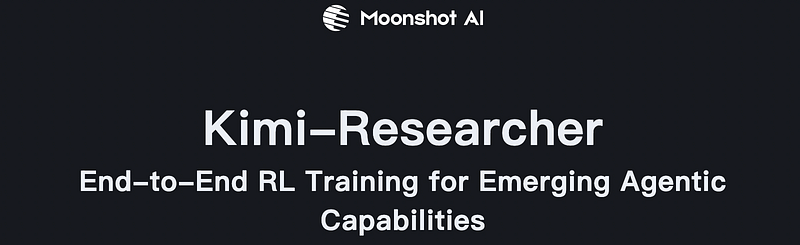
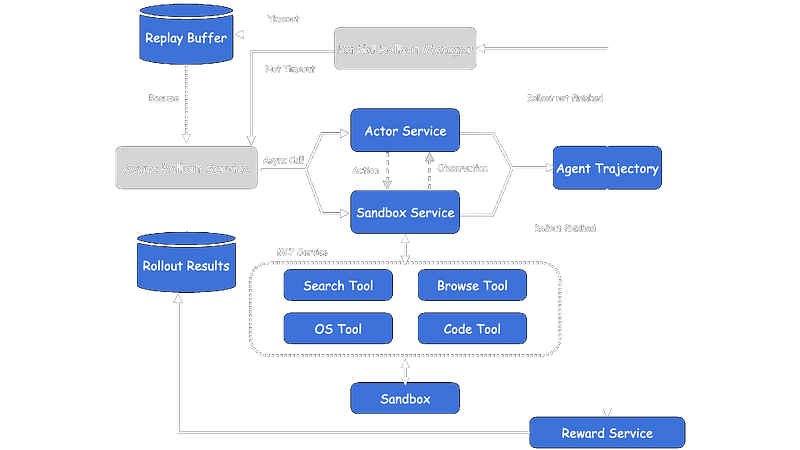
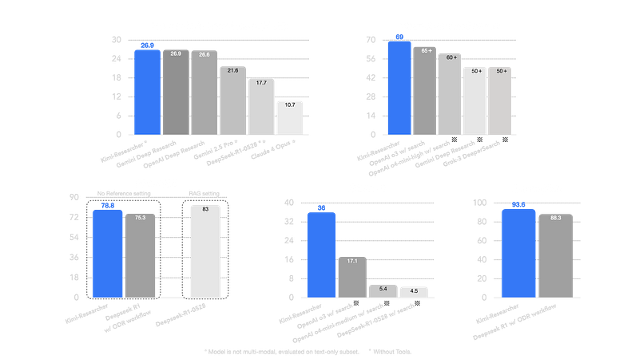

# Papers Explained 417 - Kimi-Researcher

Kimi-Researcher is an autonomous agent that excels at multi-turn search and reasoning. It performs an average of 23 reasoning steps and explores over 200 URLs per task. Built on an internal version of the Kimi k-series model and trained entirely through end-to-end agentic reinforcement learning.

This page ingests the source article into the wiki and connects it to [[Papers Explained Corpus]], [[Agentic AI]], [[Reasoning Models]], [[Reinforcement Learning Topic]], [[Safety and Alignment]], [[Evaluation and Benchmarks]], [[Reinforcement Learning]], [[On-Policy Distillation]].

## Source Metadata

- Source file: `raw/2025-07-25_Papers-Explained-417--Kimi-Researcher-baa1c9f4ae68.html`
- Source title: Papers Explained 417: Kimi-Researcher
- Published: 2025-07-25
- Canonical: [https://medium.com/@ritvik19/papers-explained-417-kimi-researcher-baa1c9f4ae68](https://medium.com/@ritvik19/papers-explained-417-kimi-researcher-baa1c9f4ae68)

## Key Ideas

- Kimi-Researcher is an autonomous agent that excels at multi-turn search and reasoning. It performs an average of 23 reasoning steps and explores over 200 URLs per task.
- Training with End-to-end reinforcement learning allows a single model to solve problems holistically by exploring strategies, receiving rewards, and learning from full trajectories.
- The training process involves several key components:
- To address the scarcity of high-quality agentic datasets, the training corpus is engineered with two complementary objectives:
- These tasks are designed to promote robust tool-use learning.

## Notes

Kimi-Researcher is an autonomous agent that excels at multi-turn search and reasoning. It performs an average of 23 reasoning steps and explores over 200 URLs per task. Built on an internal version of the Kimi k-series model and trained entirely through end-to-end agentic reinforcement learning.

Training with End-to-end reinforcement learning allows a single model to solve problems holistically by exploring strategies, receiving rewards, and learning from full trajectories. This approach naturally handles long, on-policy reasoning and adapts to changing tools and environments, unlike traditional methods like Imitation Learning or workflow-based systems.

The training process involves several key components:

### Training Data Engineering

To address the scarcity of high-quality agentic datasets, the training corpus is engineered with two complementary objectives:

Tool-Centric Tasks:

- These tasks are designed to promote robust tool-use learning.

- Prompts are constructed to require specific tool invocations, making naive approaches infeasible or inefficient.

- This teaches the agent not only when to invoke a tool but also how to orchestrate tool use effectively in complex, real-world settings.

Reasoning-Intensive Tasks:

- These tasks reinforce the agent’s core cognitive abilities and its capacity to integrate reasoning with tool usage.

- Math and Code Reasoning: Targets logical inference, algorithmic problem-solving, and sequential computation, enabling Kimi-Researcher to solve problems beyond simple chain-of-thought.

- Hard Search: Scenarios where the agent must iteratively search, synthesize, and reason within context constraints to derive valid answers, driving deeper planning and robust, tool-augmented reasoning strategies.

To build this diverse prompt set at scale, a fully automated pipeline is used for generating and validating question-answer pairs with minimal manual intervention. This pipeline ensures diversity and correctness by:

- Implementing a robust Ground Truth (GT) extraction method.

- Utilizing a rigorous filtering funnel to remove ambiguous, trivial, or incorrect pairs.

- Employing Pass@N checks to retain only non-trivial questions.

### RL Training Algorithm

The model is primarily trained using the REINFORCE algorithm. Several factors contribute to more stable training:

- On-policy Training: It is critical to generate strict on-policy data. During training, LLM engine mechanisms like toolcall format enforcers are disabled to ensure each trajectory is generated entirely based on the model’s own probability distribution.

- Negative Sample Control: To prevent entropy collapse during RL training, which can be caused by negative samples leading to a decrease in token probabilities, some negative samples are strategically discarded. This allows the model to continue improving over a longer training period.

### Reward Mechanism

Kimi-Researcher uses outcome rewards for training, providing a consistent preference in a dynamic training environment. The reward structure includes:

- Format Reward: The model is penalized for trajectories that include invalid tool calls or if the context/iteration exceeds the maximum limitation.

- Correctness Reward: For trajectories without format errors, rewards are based on the comparison between the model’s answer and the ground truth.

To promote efficiency and encourage shorter, more efficient explorations, a gamma-decay factor is applied to correct trajectories. The reward of a step s becomes γ^(s-1) * R_outcome, where R_outcome is the outcome reward, s is the number of steps, and γ (gamma) is the decay coefficient. This means shorter correct trajectories earn a higher reward for their initial actions compared to longer ones, even if both achieve the same final outcome.

### Context Management

For long-horizon research trajectories that involve massive observation contexts and can easily exceed context window limitations, a context-management mechanism is designed. This mechanism allows the model to retain important information while discarding unnecessary documents, extending a single rollout trajectory to over 50 iterations. An ablation study showed that models trained with context management use 30% more iterations, enabling them to acquire more information and achieve higher performance.

### Large-Scale Agent RL Infrastructure

To address the efficiency and stability challenges of large-scale Agent RL, a specialized infrastructure has been developed with the following key features:

- Fully Asynchronous Rollout: An asynchronous rollout system with extensible Gym-like interfaces is implemented. A server-based architecture orchestrates actor rollouts, environmental interactions, and reward calculations in parallel, significantly outperforming synchronous counterparts by eliminating resource idle time.

- Turn-level Partial Rollout: To solve the “long-tail problem” where a small fraction of tasks require extensive turns, a Turn-level Partial Rollout mechanism is designed. Tasks exceeding a time budget are saved to a replay buffer, and their remaining turns are executed in subsequent iterations with updated model weights. This mechanism delivers substantial rollout acceleration (at least 1.5x).

- Robust Sandbox Environment: A unified sandbox architecture eliminates inter-container overhead while maintaining isolation. It features zero-downtime scheduling with Kubernetes-based hybrid cloud architecture for dynamic resource allocation. Agent-tool communication uses the Model Context Protocol (MCP) to maintain stateful sessions with reconnection capabilities. The implementation supports multi-replica deployment for fault-tolerant operation and high availability.

## Evaluation

- Kimi-Researcher achieved a Pass@1 score of 26.9% on Humanity’s Last Exam, and Pass@4 accuracy of 40.17%.

- Kimi-Researcher achieved 69% pass@1 (averaged on 4 runs) on xbench-DeepSearch, outperforming models such as o3 with search tools.

- On benchmark tests for multi-turn search reasoning (FRAMES, Seal-0) and factual information (SimpleQA), Kimi-Researcher also achieved strong performance.

## Paper

[Kimi-Researcher: End-to-End RL Training for Emerging Agentic Capabilities](https://moonshotai.github.io/Kimi-Researcher/)

## Figures

Figures from the Medium HTML export (`raw/2025-07-25_Papers-Explained-417--Kimi-Researcher-baa1c9f4ae68.html`); local copies under `wiki/assets/papers-explained-417-kimi-researcher/` when download succeeded.

| Figure | Caption |
|--------|---------|
|  | Title card: Kimi-Researcher. |
|  | To address the efficiency and stability challenges of large-scale Agent RL, a specialized infrastructure has been developed with the following key features. |
|  | To address the efficiency and stability challenges of large-scale Agent RL, a specialized infrastructure has been developed with the following key features. |
## Related

- [[Papers Explained Corpus]]
- [[Agentic AI]]
- [[Reasoning Models]]
- [[Reinforcement Learning Topic]]
- [[Safety and Alignment]]
- [[Evaluation and Benchmarks]]
- [[Reinforcement Learning]]
- [[On-Policy Distillation]]
- [[Papers Explained 416 - LongWriter-Zero]]
- [[Papers Explained 418 - TabArena]]

#summary #topic
