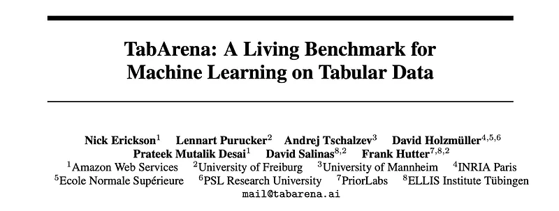
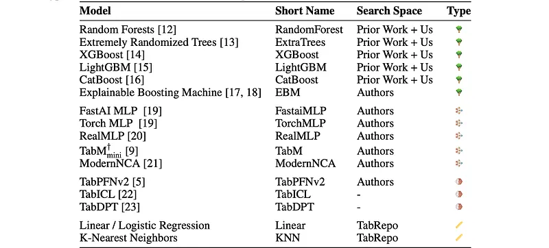
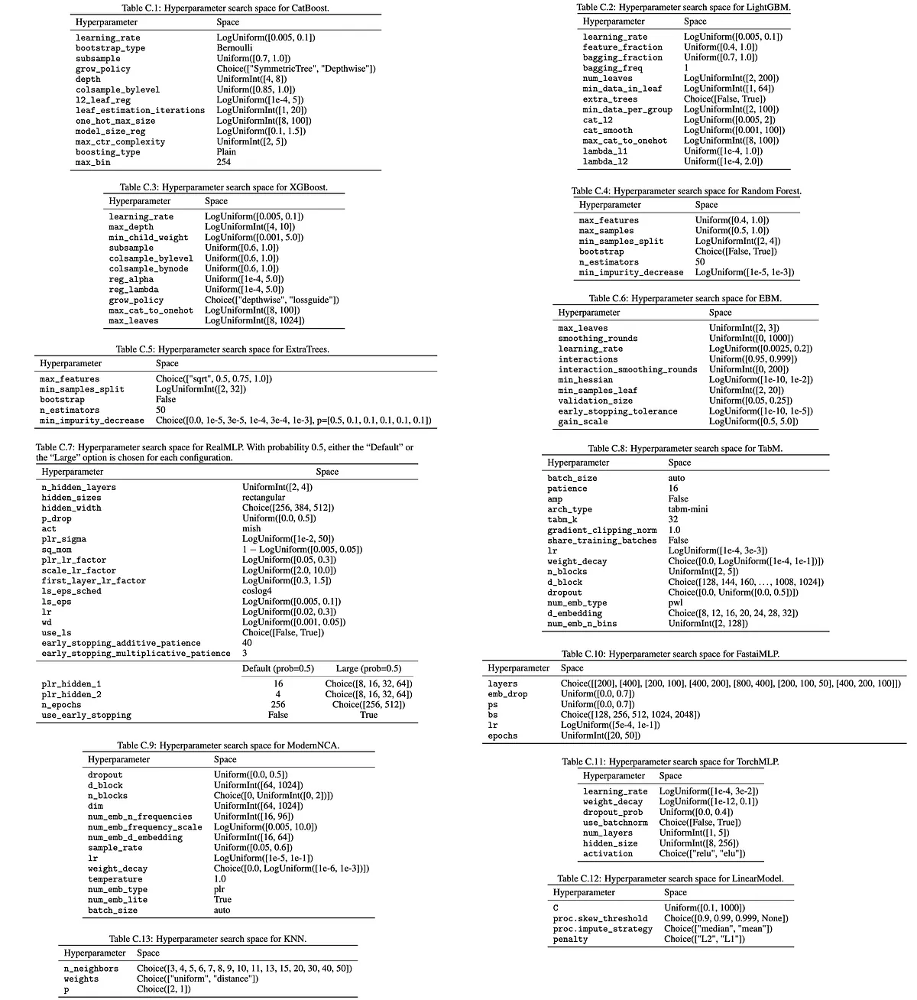
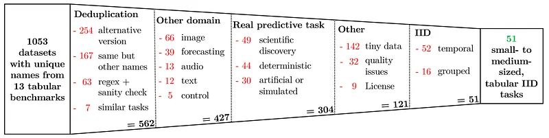
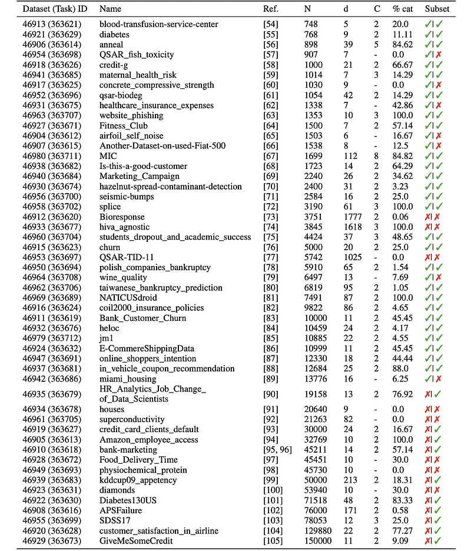
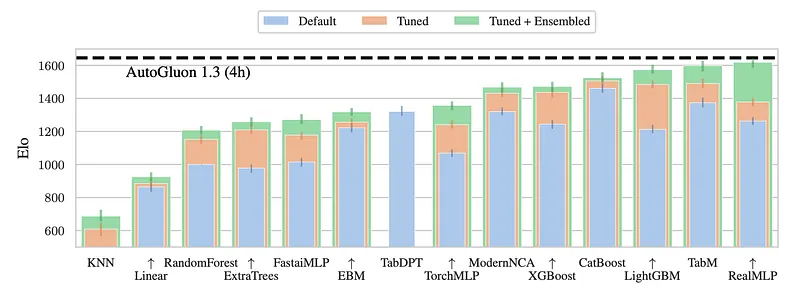
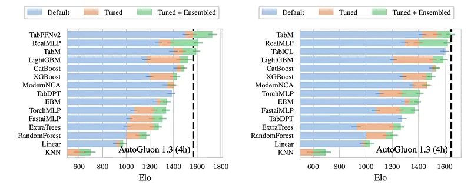

# Papers Explained 418 - TabArena

TabArena is the first continuously maintained living tabular benchmarking system. A representative collection of datasets and well-implemented models are manually curated, a large-scale benchmarking study is conducted to initialize a public leaderboard.

This page ingests the source article into the wiki and connects it to [[Papers Explained Corpus]], [[Evaluation and Benchmarks]].

## Source Metadata

- Source file: `raw/2025-07-28_Papers-Explained-418--TabArena-ff7e5159e982.md`
- Source title: Papers Explained 418: TabArena
- Published: 2025-07-28
- Canonical: [https://medium.com/@ritvik19/papers-explained-418-tabarena-ff7e5159e982](https://medium.com/@ritvik19/papers-explained-418-tabarena-ff7e5159e982)

## Key Ideas

- While gradient-boosted trees are still strong contenders on practical tabular datasets, deep learning methods have caught up under larger time budgets with ensembling.
- At the same time, foundation models excel on smaller datasets.
- Ensembles across models advance the state-of-the-art in tabular machine learning and the contributions of individual models are investigated.
- The benchmark is live [here](http://tabarena.ai/).
- TabArena is a living benchmark because of the protocols, which govern the curation of:

## Notes

TabArena is the first continuously maintained living tabular benchmarking system. A representative collection of datasets and well-implemented models are manually curated, a large-scale benchmarking study is conducted to initialize a public leaderboard.

- While gradient-boosted trees are still strong contenders on practical tabular datasets, deep learning methods have caught up under larger time budgets with ensembling.

- At the same time, foundation models excel on smaller datasets.

- Ensembles across models advance the state-of-the-art in tabular machine learning and the contributions of individual models are investigated.

The benchmark is live [here](http://tabarena.ai/).

TabArena is a living benchmark because of the protocols, which govern the curation of:

- Models and hyperparameter optimization

- Datasets

- Evaluation design.

Through continuous application and refinement of these protocols, it is ensured that TabArena remains current and maintained.

## Models and Hyperparameter Optimization Protocol

For instantiating TabArena, 14 state-of-the-art (foundation) models and two simple baselines are curated. TabArena models are powered by three components:

- Implementation in a well-tested modeling framework used in real-world applications

- Curated hyperparameter optimization protocols

- Improved validation and ensembling strategies, including ensembling over instances of a single model class.

*Figure: TabArena-v0.1 Models.*

Implementation Framework

Functionalities from AutoGluon are relied upon for implementing models. Each model is implemented within the standardized AbstractModel framework, which aligns with the scikit-learn API, and includes:

- model-agnostic preprocessing

- support for (inner) cross-validation with ensembling

- hyperparameter optimization

- evaluation metrics

- fold-wise training parallelization

- (customizable) model-specific preprocessing pipeline

- (customizable) early stopping and validation logic

- unit tests

Model-agnostic Preprocessing

The model-agnostic preprocessing is based on AutoGluon’s AutoMLPipelineFeatureGenerator and can handle various data types: boolean, numerical, categorical, datetime, and text. The implementation allows models to receive raw text and datetime columns for model-specific preprocessing.

- Text columns are transformed into n-hot encoded n-grams.

- Datetime columns are converted into Pandas datetime objects and split into year, month, day, and day of the week columns.

- Numerical columns are left untouched.

- Categorical columns are replaced with categorical codes for memory efficiency but are still treated as categorical.

- Constant or duplicated columns are dropped.

- Missing values are retained and delegated to model-specific preprocessing.

Model-specific Preprocessing

- CatBoost, LightGBM, XGBoost, EBM, TabICL, TabPFNv2, FastaiMLP, and TorchMLP do not use any custom model-specific preprocessing and rely entirely on the model’s code.

- RandomForest and ExtraTrees use ordinal encoding for categorical variables. Missing values are imputed to 0.

- TabDPT uses ordinal encoding for categorical variables.

- RealMLP handles missing numericals by mean imputation with a missingness indicator.

- TabM and ModernNCA use the numerical quantile-based preprocessing from TabM and then use mean imputation with an indicator for numerical features.

- Linear uses one-hot-encoding, mean or median imputation (hyperparameter), standard scaling, and quartile transformation (hyperparameter).

- KNN drops all categorical features and fills missing numerical values with 0. Moreover, it uses leave-one-out cross-validation instead of 8-fold cross-validation. The leave-one-out cross-validation is natively implemented into the KNN model logic and allows for obtaining the validation predictions per sample very efficiently.

Cross-validation and Ensembles

8-fold cross-validation ensembles are used for all foundation models. Refitting on training and validation data instead of using cross-validation ensembles is performed. Each tunable model is evaluated using post-hoc ensembling of different hyperparameter configurations.

Hyperparameter Optimization

For each model, a strong hyperparameter search space is curated. Where possible, the search spaces from the original paper are started with and finalized in dialogue with the models’ authors. Otherwise, search spaces from prior work are curated.

## Datasets Protocol

A representative collection of datasets is manually curated by filtering 1053 datasets used in 13 prior benchmarks.

*Figure: Data Curation Results.*

Datasets are selected that fulfilled the following requirements:

- The dataset and its predictive machine learning task are unique within the benchmark

- The dataset is IID, that is, a random split is appropriate for the underlying original task

- The dataset is not from a non-tabular modality, such as images, where it is unclear whether tabular machine learning is a reasonable alternative to domain-specific methods

- The dataset stems from a real random distribution, and is not generated, e.g., from a deterministic function

- The dataset was published explicitly for a predictive modeling task in a real-world application

- The dataset is small-to-medium-sized, i.e., it has at least 500 and at most 250,000 train samples

- A version of the dataset can be used without pre-applied problematic preprocessing, such as irreversible data leaks

- The dataset was originally published with a license allowing for scientific usage

- The dataset and its structured metadata can be automatically downloaded via a public API, or uploading the dataset to a public API is allowed

- The dataset and its predictive task do not raise ethical concerns.

*Figure: Datasets included in TabArena-v0.1.*

## Evaluation Design Protocol

Experiments are repeated per dataset to mitigate the impact of randomness.

- Datasets with fewer than 2500 samples: 10 times repeated 3-fold outer cross-validation.

- All other datasets: 3 repeats.

Models are evaluated using the Elo rating system, similar to Chatbot Arena.

- Elo scores predict the expected win probability of a model against others.

- A 400-point Elo gap corresponds to a 91% expected win rate.

- Elo scores are calibrated to a default random forest configuration (1000 Elo).

- 100 rounds of bootstrapping are performed to obtain 95% confidence intervals.

Elo scores are computed using:

- ROC AUC for binary classification.

- Log-loss for multiclass classification.

- RMSE for regression.

Besides Elo scores, the leaderboard tracks alternative metrics, training and inference efficiency, and provides scripts to generate the leaderboard, evaluation plots, and inspect results.

A reference pipeline, AutoGluon (version 1.3, best_quality preset, 4 hours training), is included to represent easily achievable performance.

## Results

### Peak Performance and Ensembling

*Figure: TabArena-v0.1 Leaderboard.*

- While CatBoost ranks first in conventional tuning, neural networks become the strongest single models on average after post-hoc ensembling.

- Peak performance of models is significantly misrepresented without post-hoc ensembling; the top three models (TabM, LightGBM, RealMLP) would perform worse than CatBoost without it.

### Tabular Foundation Models

*Figure: Leaderboard for TabPFNv2-compatible (left) and TabICL-compatible (right) datasets.*

- Tabular foundation models, specifically TabPFNv2, significantly outperform related approaches on small datasets within their constraints, establishing them as a go-to solution for such datasets.

- TabPFNv2 with tuning and post-hoc ensembling also outperforms AutoGluon on these constrained datasets.

## Paper

TabArena: A Living Benchmark for Machine Learning on Tabular Data [2506.16791](https://arxiv.org/abs/2506.16791)

## Figures

Figures from the Medium HTML export (`raw/2025-07-28_Papers-Explained-418--TabArena-ff7e5159e982.md`); local copies under `wiki/assets/papers-explained-418-tabarena/` when download succeeded.

| Figure | Caption |
|--------|---------|
|  | Title card: TabArena. |
|  | TabArena-v0.1 Models. |
|  | For each model, a strong hyperparameter search space is curated. |
|  | Data Curation Results. |
|  | Datasets included in TabArena-v0.1. |
|  | TabArena-v0.1 Leaderboard. |
|  | Leaderboard for TabPFNv2-compatible (left) and TabICL-compatible (right) datasets. |
## Related

- [[Papers Explained Corpus]]
- [[Evaluation and Benchmarks]]
- [[TabFM]] — Google zero-shot tabular foundation model evaluated on TabArena.
- [[Papers Explained 417 - Kimi-Researcher]]
- [[Papers Explained 419 - The Ladder of Reasoning]]

#summary #topic
