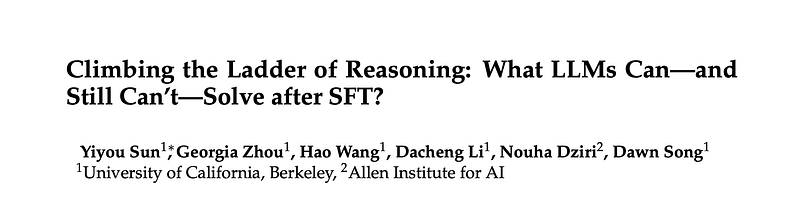
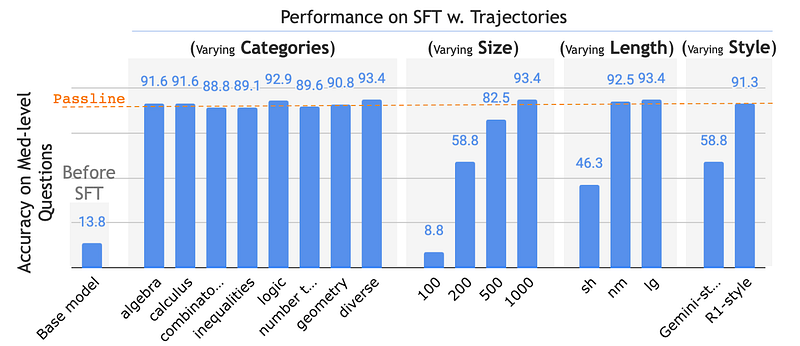
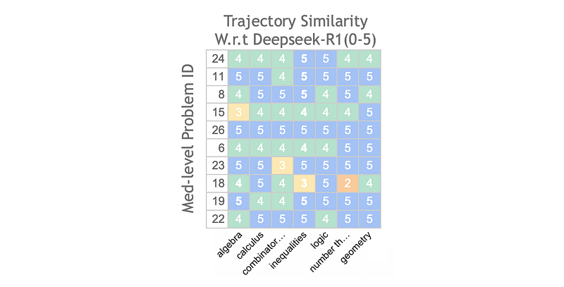
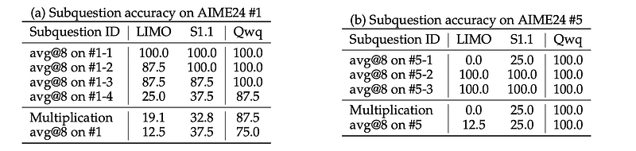
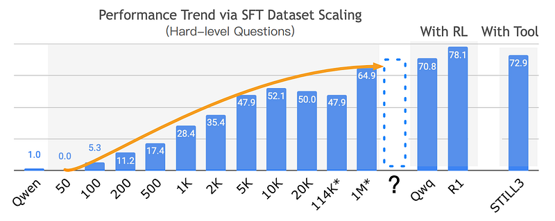

# Papers Explained 419 - The Ladder of Reasoning

This paper conducts a detailed analysis of model performance on the AIME24 dataset to understand how reasoning capabilities evolve. A ladder-like structure in problem difficulty is discovered, categorizing questions into four tiers: Easy, Medium, Hard, and Extremely Hard (Exh).

This page ingests the source article into the wiki and connects it to [[Papers Explained Corpus]], [[Reasoning Models]], [[Synthetic Data]], [[Large Language Models]], [[Evaluation and Benchmarks]], [[Verifier-Bounded Learning]], [[Supervised Fine-Tuning]].

## Source Metadata

- Source file: `raw/2025-07-29_Papers-Explained-419--The-Ladder-of-Reasoning-e58f9727abec.html`
- Source title: Papers Explained 419: The Ladder of Reasoning
- Published: 2025-07-29
- Canonical: [https://medium.com/@ritvik19/papers-explained-419-the-ladder-of-reasoning-e58f9727abec](https://medium.com/@ritvik19/papers-explained-419-the-ladder-of-reasoning-e58f9727abec)

## Key Ideas

- This paper conducts a detailed analysis of model performance on the AIME24 dataset to understand how reasoning capabilities evolve.
- Progression from Easy to Medium tier requires adopting an R1 reasoning style with minimal SFT (500–1K instances).
- Hard-level questions suffer from frequent model errors at each step of the reasoning chain, with accuracy plateauing at 65% despite logarithmic scaling.
- Exh-level questions present a fundamentally different challenge; they require unconventional problem-solving skills that current models uniformly struggle with.
- The project is available on [GitHub](https://github.com/sunblaze-ucb/reasoning_ladder/).

## Notes

This paper conducts a detailed analysis of model performance on the AIME24 dataset to understand how reasoning capabilities evolve. A ladder-like structure in problem difficulty is discovered, categorizing questions into four tiers: Easy, Medium, Hard, and Extremely Hard (Exh). The specific requirements for advancing between tiers are identified.

- Progression from Easy to Medium tier requires adopting an R1 reasoning style with minimal SFT (500–1K instances).

- Hard-level questions suffer from frequent model errors at each step of the reasoning chain, with accuracy plateauing at 65% despite logarithmic scaling.

- Exh-level questions present a fundamentally different challenge; they require unconventional problem-solving skills that current models uniformly struggle with.

The project is available on [GitHub](https://github.com/sunblaze-ucb/reasoning_ladder/).

## Experimental Setup

The AIME 2024 benchmark is chosen for its hierarchical difficulty, diversity across mathematical domains (algebra, number theory, geometry, combinatorics), and basic knowledge requirement (high school mathematics with occasional undergraduate-level concepts).

The base model used is Qwen2.5–32B-Instruct4 as Qwen-series inherently possess cognitive behaviors: verification, backtracking, subgoal setting, and backward chaining that Llama-series models lack.

Evaluation Metrics:

- Primary metric is avg@n, the average pass rate obtained by generating multiple solutions (with temperature set to 1) and averaging the outcomes (n = 8 by default).

- cov@n is also reported, indicating whether the model succeeds in at least one of the n attempts.

AIME24 questions are manually categorized into four difficulty levels (Easy, Medium, Hard, and Extremely Hard) based on the performance of public models (Qwen2.5–32B-Instruct fine-tuned on small-scale SFT datasets, and LLMs with large-scale post-training or tool use like R1, QwQ, and STILL3).

- Easy level consists of 4 questions for which the base model achieves an average accuracy above 50%.

- Medium (Med) level includes 10 questions where the small-scale SFT model attains over 50% accuracy.

- Extremely Hard (Exh-level) comprises 4 questions that yield less than 10% accuracy across all models.

- Hard level contains the remaining 12 questions that do not fit into the aforementioned categories.

## The First Ladder: From Easy-Level To Med-Level Questions

Qwen2.5–32B-Instruct achieved over 50% accuracy on Easy-level questions but only about 10% on Med-level questions, failing entirely (0% accuracy) on half of them.

After SFT on approximately 1,000 R1-style trajectories (e.g., S1.1, LIMO), these models significantly improved, reaching around 90% average accuracy on Med-level questions, with perfect accuracy on half of them.

This rapid improvement prompted an investigation into which aspects of the SFT data influenced this change.

### All You need is SFT on 1K random R1-style trajectories in any math categories

Variables Analyzed:

- Foundational Math Knowledge ©: Questions from diverse categories in OpenR1-Math-220k (algebra, calculus, combinatorics, inequalities, logic & puzzles, number theory, geometry) were evenly sampled.

- Dataset Size (N): Experiments varied the number of training examples: 100, 200, 500, 1000 examples per category.

- CoT Trajectory Length (L): Evaluated three tiers: normal (nm — 1,000 random trajectories), short (sh — 1,000 shortest), and long (lg — 1,000 longest).

- CoT Trajectory Style (S): Compared DeepSeek-R1 and Gemini-flash trajectories using 1K questions.

Performance P is a function of Category ©, Number of trajectories (N), Trajectory Length (L), and Style (S): P = f(C, N, L, S).

*Figure: Performance comparison of the base model across various SFT trajectory settings.*

To achieve performance P ≥ 90% on Medium-level questions, the minimal configuration required is:

P = f(C=*, N>500, L=nm/lg, S=R1)

This means the model consistently meets the passline only when trained with at least 500 long, randomly selected R1-style trajectories, independent of the specific math category.

### SFT leads models to similar problem-solving strategies

To investigate whether small-scale SFT genuinely imparts problem-solving skills, base models are fine-tuned on R1-style trajectories across multiple math categories using the configuration: P = f(C ∈{algebra, calculus, combinatorics, …}, N= 1000, L= lg, S= R1).

Evaluation Methodology:

- Fine-tuned models’ greedily sampled trajectories were compared against DeepSeek-R1 trajectories on AIME24 medium-level questions.

- GPT-4o-mini is used to summarize each reasoning trajectory into applied strategy and intermediate results.

- GPT-4o-mini then quantitatively assessed trajectory similarity on a 6-point scale (0: totally different to 5: almost identical).

*Figure: Trajectory similarity scores between various models (SFT-ed in different math domains) and Deepseek-R1 when solving Med-level math problems.*

Models tend to employ similar problem-solving strategies. Approximately 50% of trajectories were rated as “almost identical” (score 5), and the remaining 50% as “mostly similar” (score 4), despite being trained on diverse math categories.

## The second ladder: from Med-level to Hard-level questions

Unlike the sudden leap in performance from Easy to Med-level questions, the improvement from Med-level to Hard-level is gradual. Small-scale SFT models achieve low accuracy (around 25%) on Hard-level questions

### Why models fail: instability from exploration and computation of the task

*Figure: Comparison between small-scale SFT-ed models and the model with large-scale post-training on subquestions from two hard-level AIME24 problems.*

- Multiple Hidden Steps: Hard-level questions involve multiple sequential hidden steps. For example, AIME 2024 problem #1 requires finding coordinates, center/radius, intersection points, and lengths. Each step increases the chance of pursuing wrong reasoning paths, and the overall success rate is a product of individual step success rates, leading to declining accuracy with more steps.

- Computational Complexity: Certain steps in Hard-level questions are computationally intensive. For instance, AIME 2024 problem #5 requires calculating tetrahedron volume using the Cayley-Menger determinant, which is a primary obstacle for models with limited-scale SFT.

### SFT data scaling shows logarithmic trend in Hard-level question accuracy

Experiments are conducted by varying the number of CoT (Chain-of-Thought) trajectories (50, 100, 200, 500, 1K, 2K, 5K, 10K, 20K) and evaluating SFT’ed models (Openthinker-32B, Openthinker2–32B, Qwq-32B, STILL-3) based on Qwen2.5–32B-instruct.

*Figure: Performance scaling of models via SFT on Hard-level reasoning tasks.*

- Performance on Hard-level questions follows a logarithmic scaling pattern with respect to dataset size, with accuracy improvements plateauing at approximately 65%.

- Models utilizing reinforcement learning (Qwq-32B) or external computational tools (STILL-3) surpass this 65% ceiling, suggesting that integrating external tools significantly enhances stability in CoT trajectories.

- The precise data used for Qwq-32B is not public, leaving the specific advantages of RL over SFT as an open research question.

### Carefully curated small-scale SFT dataset does not deviate from the scaling trend

A curated dataset is constructed by selecting the top 90 most similar questions from open-r1/OpenR1-Math-220k for each Hard-level question, using OpenAI’s text-embedding-3-small model, resulting in approximately 1K CoT steps.

The SFT-ed model trained on this curated dataset achieved an average score of 33.6% on Hard-level questions, which is 5% higher than the 28.4% score obtained using a randomly constructed dataset of the same 1K size.

However, simply increasing the dataset size from 1K to 2K (randomly constructed) led to a larger improvement of 7%.

Despite the “unfair” comparison (curated dataset had knowledge of test questions), the results suggest that scaling up the dataset is generally more effective than careful curation, particularly in the small-scale SFT regime.

## The third ladder: from Hard-level to Exh-level questions

Despite fine-tuning with varying SFT dataset sizes, all models, including R1, achieve 0% accuracy on Exh-level questions. This indicates that the scaling behavior observed for Hard-level questions does not extend to Exh-level.

To understand the missing capabilities and limitations, R1 is probed with:

- Variations of the problem statement.

- Suggestive prompts and hints.

- Subproblems of the original problem.

- Questions designed to test specific sub-capabilities.

R1 is chosen for analysis as it represents an upper bound for models fine-tuned with popular SFT methods (R1-trajectories).

Key Limitations of LLMs (R1):

Rigidity in Common Strategies:

- LLMs tend to apply fixed patterns (e.g., coordinate systems for geometry, inclusion-exclusion for combinatorics), even when these are not the most feasible or efficient approaches.

- Example (Problem #2 — Octagon Coloring): R1 persistently attempts to use the inclusion-exclusion principle with rotation angles, which is overly complex, instead of the more straightforward casework approach.

Deficiency in Geometric Intuition:

- Limited by their 1-D sequential architecture, LLMs struggle to learn geometric intuition that is straightforward for humans.

- Example (Problem #21 — Rectangles in a Dodecagon): R1 finds it challenging to discover and utilize rotational symmetry (e.g., multiplying by 3 after identifying typical scenarios) for enumerating rectangles, instead attempting computationally intensive enumeration.

Limited Reasoning Context:

- Even with large context windows (up to 32K tokens), models fall short in cases requiring extensive exploration of substeps.

- Example (Problem #2 — Octagon Coloring): While R1 can correctly solve a subcase (e.g., counting configurations with exactly 4 blue vertices) with sufficient reasoning, it often rushes to an incorrect conclusion when tackling the full problem, where the subcase is just one part of a lengthy reasoning chain.

## Summary and implications for future study

SFT serves as a crucial intermediate step in standard training pipelines for reasoning models. The findings have several implications:

- Importance of SFT Dataset Scale: The scale of the SFT dataset remains important, even though recent studies suggest that stronger performance can be achieved with fewer samples (~1K).

- Ceiling Effect for Dataset Size: Scaling up dataset size eventually meets a ceiling, particularly for highly challenging (Exh-level) questions, which cannot be effectively addressed by simply expanding the volume of training samples.

- Developing Higher-Level Intelligence: Given preliminary evidence indicating that SFT-trained models adopt similar solutions for Med-level questions, a key question arises: Can SFT develop higher-level intelligence, such as utilizing uncommon yet ingenious solutions? The research aims to open new avenues for advancements in this domain.

## Paper

Climbing the Ladder of Reasoning: What LLMs Can-and Still Can’t-Solve after SFT? [2504.11741](https://arxiv.org/abs/2504.11741)

## Figures

Figures from the Medium HTML export (`raw/2025-07-29_Papers-Explained-419--The-Ladder-of-Reasoning-e58f9727abec.html`); local copies under `wiki/assets/papers-explained-419-the-ladder-of-reasoning/` when download succeeded.

| Figure | Caption |
|--------|---------|
|  | Title card: The Ladder of Reasoning. |
|  | Performance comparison of the base model across various SFT trajectory settings. |
|  | Trajectory similarity scores between various models (SFT-ed in different math domains) and Deepseek-R1 when solving Med-level math problems. |
|  | Comparison between small-scale SFT-ed models and the model with large-scale post-training on subquestions from two hard-level AIME24 problems. |
|  | Performance scaling of models via SFT on Hard-level reasoning tasks. |
## Related

- [[Papers Explained Corpus]]
- [[Reasoning Models]]
- [[Synthetic Data]]
- [[Large Language Models]]
- [[Evaluation and Benchmarks]]
- [[Verifier-Bounded Learning]]
- [[Supervised Fine-Tuning]]
- [[Papers Explained 418 - TabArena]]
- [[Papers Explained 420 - Fast Math R1 14B]]

#summary #topic
