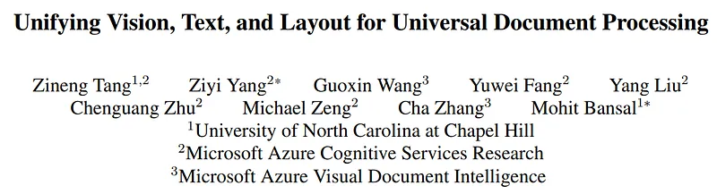
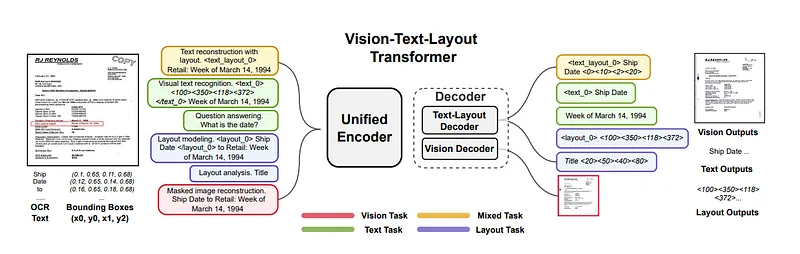
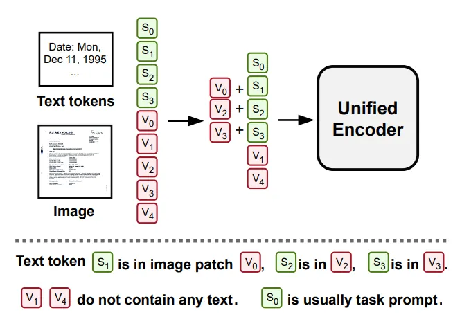
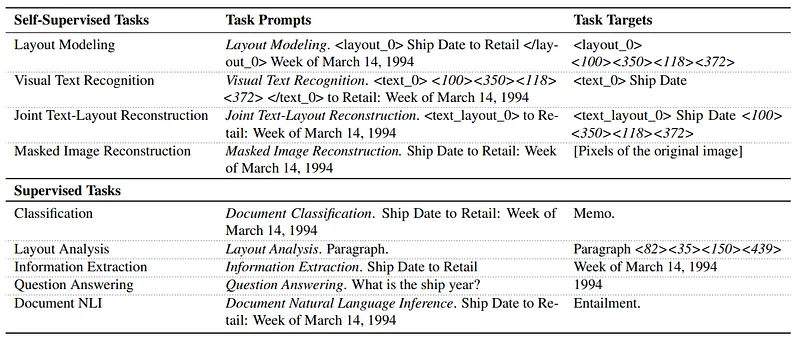
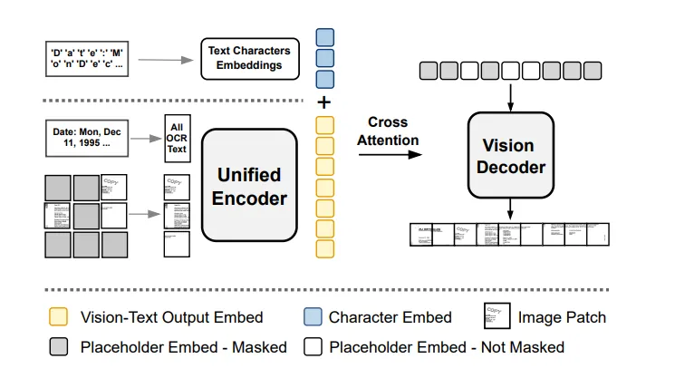
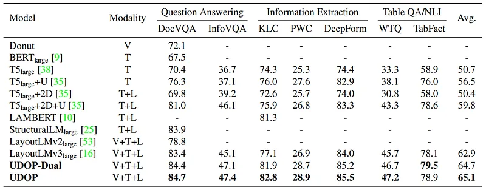
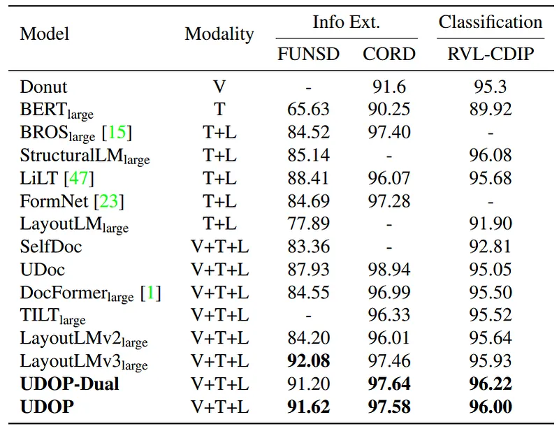

# Papers Explained 42 - UDOP

Universal Document Processing (UDOP) is a foundation Document AI model which unifies text, image, and layout modalities together with varied task formats, including document understanding and generation.

This page ingests the source article into the wiki and connects it to [[Papers Explained Corpus]], [[Document AI]], [[Embedding and Retrieval]], [[Large Language Models]].

## Source Metadata

- Source file: `raw/2023-04-18_Papers-Explained-42--UDOP-719732358ab4.md`
- Source title: Papers Explained 42: UDOP
- Published: 2023-04-18
- Canonical: [https://medium.com/@ritvik19/papers-explained-42-udop-719732358ab4](https://medium.com/@ritvik19/papers-explained-42-udop-719732358ab4)

## Key Ideas

- We propose a new Vision-Text-Layout (VTL) Transformer architecture to dynamically fuse and unite the image pixels and text tokens based on the layout information.
- Given the document image v, M word tokens inside the image, and the extracted layout structure {(x 1 i , y1 i , x2 i , y2 i )}, we first partition v into H/P × W/P image patches, where each patch is of size P × P × C.
- We build a unified representation for vision, text, and layout. We define the layout indicator function φ of image patch and token embeddings as follows:
- Then for each text token embedding si, the joint representation is the sum of its image patch feature and the text feature:
- For image patches vj without any text tokens, the joint representation, v`j is itself:

## Notes

Universal Document Processing (UDOP) is a foundation Document AI model which unifies text, image, and layout modalities together with varied task formats, including document understanding and generation. UDOP leverages the spatial correlation between textual content and document image to model image, text, and layout modalities with one uniform representation.

*Figure: UDOP unifies vision, text, and layout through a vision-text-layout Transformer and unified generative pretraining tasks including vision tasks, text tasks, layout tasks, and mixed tasks. We show the task prompts (left) and task targets (right) for all self-supervised objectives (joint text-layout reconstruction, visual text recognition, layout modeling, and masked autoencoding) and two example supervised objectives (question answering and layout analysis).*

## Architecture

### A Unified Vision, Text, and Layout Encoder

We propose a new Vision-Text-Layout (VTL) Transformer architecture to dynamically fuse and unite the image pixels and text tokens based on the layout information.

Given the document image v, M word tokens inside the image, and the extracted layout structure {(x 1 i , y1 i , x2 i , y2 i )}, we first partition v into H/P × W/P image patches, where each patch is of size P × P × C. We then encode each patch with a D-dim vector and group all patch embeddings into a sequence of vectors. where N = H/P × W/P . Text tokens are also converted to numerical D-dim embeddings by vocabulary look-up.

*Figure: Layout-induced vision-text embedding*

### Layout-Induced Vision-Text Embedding

We build a unified representation for vision, text, and layout. We define the layout indicator function φ of image patch and token embeddings as follows:

Then for each text token embedding si, the joint representation is the sum of its image patch feature and the text feature:

For image patches vj without any text tokens, the joint representation, v`j is itself:

Then {s`i } and {v`j } are fed into the VTL transformer encoder.

To further unify layout and text representation, we discretize the layout modality, i.e., continuous coordinates text bounding box, to layout tokens.

We do not use 1D position embeddings in VTL transformer encoder, since the joint embedding and the 2D position bias already incorporate the layout structure of the input document.

### Modality-Specific Model Variant

Instead of having one unified encoder, we separately use a text encoder (to encode both text and layout tokens) and a vision encoder. Position bias is used in both encoders to represent layout information following previous works. We name this variant UDOP-Dual.

### Vision-Text-Layout Decoder

The VTL decoder consists of a text-layout decoder and a vision decoder. The text layout decoder is a uni-directional Transformer decoder to generate text and layout tokens in a sequence-to-sequence manner. For the vision decoder, we adopt the decoder of MAE and directly generate the image pixels with text and layout information.

Both the text-layout decoder and vision decoder will cross-attend to the VTL encoder (in the case of UDOP-Dual, which has two modality-specific encoders, decoders cross-attend with the concatenation of two encoders’ outputs).

## Unified Generative Pretraining

*Figure: A summary of all generative pretraining objectives with task names, task prompts, and task targets*

### Self-Supervised Pretraining Tasks

- Layout Modeling asks the model to predict the positions of (group of) text tokens, given the document image and context text.

- Visual Text Recognition identifies text at a given location in the image.

- Joint Text-Layout Reconstruction requires the model to reconstruct the missing texts and locate them in the document image. Concretely, we mask a percentage of text tokens and ask the model to both the tokens and their bounding boxes.

- Masked Image Reconstruction with Text and Layout aims to reconstruct images with text and layout. We adopt the MAE objective for vision self-supervised learning.

*Figure: Masked autoencoding with text and layout*

### Supervised Pretraining Tasks

- Classification The task is to predict the document type. The task prompt is “Document Classification on (Dataset Name)” like “Document Classification on RVLCDIP”, then followed by text tokens. The target is the document class. We use RVL-CDIP with 16 document categories.

- Layout Analysis This task is to predict the locations of an entity in the document like title, paragraph, etc. The task prompt is “Layout Analysis on (Dataset Name)”, then followed by the entity name. The target is all bounding boxes that cover the given entity. We use PubLayNet.

- Information Extraction This task predicts the entity type and location of a text query (e.g., the abstract paragraph). The task prompt is “Information Extraction on (Dataset Name) (Text Query)”. The target is the entity label and the bounding box of each token of the query. We use DocBank, Kleister Charity (KLC), PWC, and DeepForm.

- Question Answering The task is to answer a given question associated with the document image. The task prompt is “Question Answering on (Dataset Name)”, then followed by the question and all document tokens. The target is the answer. We use WebSRC, VisualMRC, DocVQA, InfographicsVQA, and WTQ (WikiTableQuestions).

- Document NLI Document Natural Language Inference predicts the entailment relationship between two sentences in a document. The prompt is “Document Natural Language Inference on (Dataset Name)”, then followed by the sentence pair. The target is the “Entailment” or ”Not Entailment”. We use TabFact for this task.

## Experimental Setup

In UDOP, the unified encoder and text-layout decoder follow the encoder-decoder architecture of T5-large. The vision decoder is an MAE-large decoder. Overall UDOP has 794M trainable parameters.

For UDOP-Dual, the text-layout encoder-decoder follows T5-large, and the vision encoder-decoder has the same configuration as MAE-large. It has in total 1098M trainable parameters.

## Results

*Figure: Comparison with existing published models on the DUE-Benchmark. Modality T, L, V denote text, layout, or vision*

*Figure: Performance on FUNSD, CORD, and RVL-CDIP datasets. Modality V, T, L denote vision, text, and layout*

## Paper

Unifying Vision, Text, and Layout for Universal Document Processing [2212.02623](https://arxiv.org/abs/2212.02623)

Recommended Reading [Document Information Processing](https://ritvik19.medium.com/list/document-information-processing-3cd900a34972)

## Figures

Figures from the Medium HTML export (`raw/2023-04-18_Papers-Explained-42--UDOP-719732358ab4.md`); local copies under `wiki/assets/papers-explained-42-udop/` when download succeeded.

| Figure | Caption |
|--------|---------|
|  | Title card: UDOP. |
|  | UDOP unifies vision, text, and layout through a vision-text-layout Transformer and unified generative pretraining tasks including vision tasks, text tasks, layout tasks, and mixed tasks. We show the task prompts (left) and task targets (right) for all self-supervised objectives (joint text-layout reconstruction, visual text recognition, layout modeling, and masked autoencoding) and two example supervised objectives (question answering and layout analysis). |
|  | Layout-induced vision-text embedding. |
|  | We build a unified representation for vision, text, and layout. We define the layout indicator function φ of image patch and token embeddings as follows. |
|  | Then for each text token embedding si, the joint representation is the sum of its image patch feature and the text feature. |
|  | For image patches vj without any text tokens, the joint representation, v`j is itself. |
|  | A summary of all generative pretraining objectives with task names, task prompts, and task targets. |
|  | Masked autoencoding with text and layout. |
|  | Comparison with existing published models on the DUE-Benchmark. Modality T, L, V denote text, layout, or vision. |
|  | Performance on FUNSD, CORD, and RVL-CDIP datasets. Modality V, T, L denote vision, text, and layout. |
## Related

- [[Papers Explained Corpus]]
- [[Document AI]]
- [[Embedding and Retrieval]]
- [[Large Language Models]]
- [[Papers Explained 41 - LAMBERT]]
- [[Papers Explained 43 - GPT]]

#summary #topic
