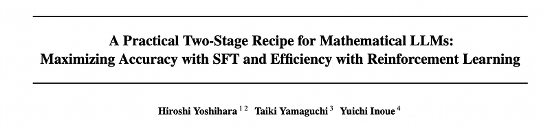
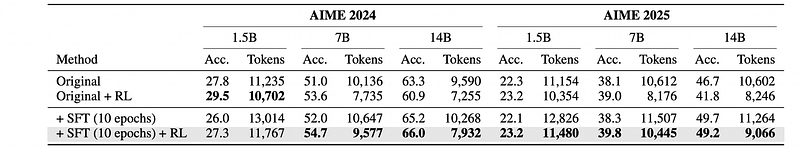
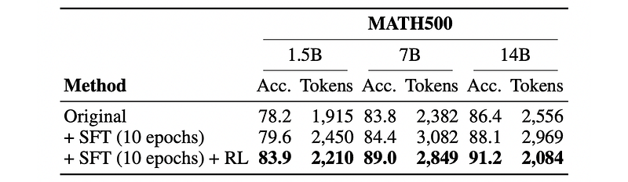
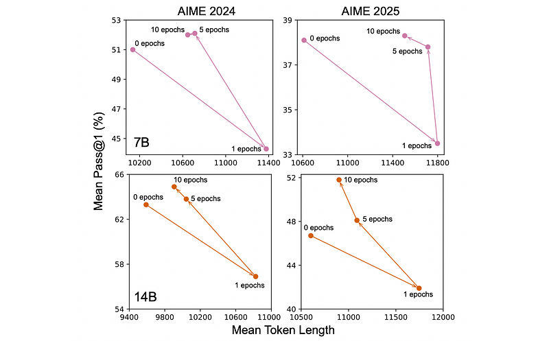
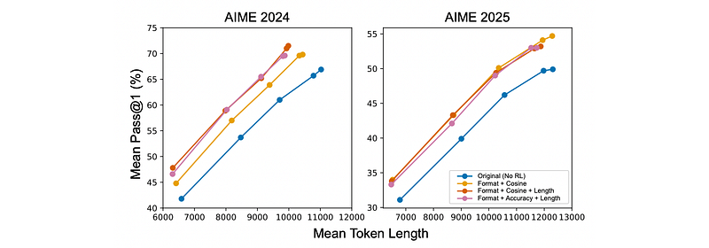
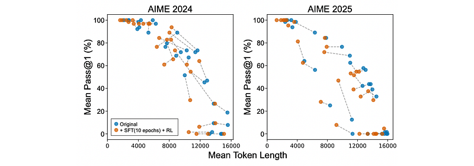

# Papers Explained 420 - Fast Math R1 14B

This model ranked 4th on the public leaderboard and 8th on the private leaderboard of the second edition of AI Mathematical Olympiad (AIMO). It utilizes a practical and effective training recipe that strategically integrates extended SFT with RL from online inference (GRPO).

This page ingests the source article into the wiki and connects it to [[Papers Explained Corpus]], [[Reasoning Models]], [[Evaluation and Benchmarks]], [[Reinforcement Learning Topic]], [[Large Language Models]], [[Synthetic Data]], [[Supervised Fine-Tuning]], [[Reinforcement Learning]].

## Source Metadata

- Source file: `raw/2025-07-30_Papers-Explained-420--Fast-Math-R1-14B-442d09c48987.html`
- Source title: Papers Explained 420: Fast Math R1 14B
- Published: 2025-07-30
- Canonical: [https://medium.com/@ritvik19/papers-explained-420-fast-math-r1-14b-442d09c48987](https://medium.com/@ritvik19/papers-explained-420-fast-math-r1-14b-442d09c48987)

## Key Ideas

- This model ranked 4th on the public leaderboard and 8th on the private leaderboard of the second edition of AI Mathematical Olympiad (AIMO).
- These methods play complementary, not competing, roles: a prolonged SFT phase first pushes the model’s accuracy to its limits, after which a GRPO phase dramatically improves token efficiency while preserving this peak performance.
- The project is available at [GitHub](https://github.com/analokmaus/kaggle-aimo2-fast-math-r1/).
- The DeepSeek-R1-Distill-Qwen models of the size: 1.5B, 7B, 14B were used as base models.
- The SFT dataset was meticulously constructed by amalgamating data from three distinct sources.

## Notes

This model ranked 4th on the public leaderboard and 8th on the private leaderboard of the second edition of AI Mathematical Olympiad (AIMO). It utilizes a practical and effective training recipe that strategically integrates extended SFT with RL from online inference (GRPO).

These methods play complementary, not competing, roles: a prolonged SFT phase first pushes the model’s accuracy to its limits, after which a GRPO phase dramatically improves token efficiency while preserving this peak performance. Experiments reveal that extending SFT for as many as 10 epochs is crucial for performance breakthroughs, and that the primary role of GRPO in this framework is to optimize solution length.

The project is available at [GitHub](https://github.com/analokmaus/kaggle-aimo2-fast-math-r1/).

## Method

The DeepSeek-R1-Distill-Qwen models of the size: 1.5B, 7B, 14B were used as base models.

### Stage 1: Supervised Fine-Tuning

The SFT dataset was meticulously constructed by amalgamating data from three distinct sources.

- From OpenR1 Math, approximately 3,000 examples where the reference DeepSeek-R1-Distill-Qwen model’s solution trace was notably long, exceeding 12,800 tokens, and where its accuracy was above 50% were selected.

- An additional 3,000 examples were included from the same source where the R1 model’s accuracy fell between 50% and 75%.

- The openr1 hard dataset contributed around 2,500 challenging samples sourced from open-r1-math-220k; these were problems that the DeepSeek-R1-Distill-Qwen-32B model was unable to solve in four attempts.

- Finally, the second-stage SFT data from the Light-R1-SFT Data was incorporated.

After merging these sources, duplicate entries were removed. For each unique problem, the correct generation that exhibited the shortest token length was selected. In instances where samples from Light-R1-SFT Data lacked ground truth answers, the answers were extracted and substituted from the R1 model’s solution traces. This comprehensive process yielded a high-difficulty dataset consisting of 7,900 problem-solution trace-answer triplets.

For the SFT process, full-parameter SFT was performed for 10 epochs. The maximum sequence length was set to 24,000, and packing was enabled. The models were trained using the system prompt: “Please reason step by step, and put your final answer within \boxed{}”.

### Stage 2: GRPO for Enhanced Token Efficiency

The dataset employed for GRPO training was the second-stage data from Light-R1-SFT Data. The reward function for GRPO was designed with three key components to guide the learning process.

Firstly, a Format Reward provided a binary signal (+1 or 0) based on adherence to the expected output structure, particularly matching the regular expression pattern r”^.*\boxed{(.*?)\}.*?</think>.*?$”.

Secondly, a Cosine Similarity Reward was implemented. For outputs that conformed to the required format, this reward measured the cosine similarity between the embedding of the model’s generated reasoning trace and that of a reference correct trace, where available, or used a proxy based on answer correctness. This reward was scaled to range from 0.1 to 1.0 for correct answers, thereby more subtly penalizing longer correct traces, and from -1.0 to -0.1 for incorrect answers, which more severely penalized shorter incorrect traces. The maximum trace length considered for this reward was 30,000 tokens.

Thirdly, a Length Penalty was applied, proportional to the length of the generated output, to explicitly discourage overly verbose solutions and promote conciseness.

The GRPO training was configured with num generations set to 8. The system prompt was: “You are a helpful and harmless assistant. You are Qwen developed by Alibaba. You should think step-by-step. Return final answer within \boxed{}”.

## Results

### Results on AIME

*Figure: Performance and the mean token usage across model sizes for AIME 2024 and 2025.*

- The proposed SFT + RL method improves both accuracy and token efficiency compared to the original models across nearly all model sizes on AIME 2024 and 2025.

- Accuracy gains from the SFT + RL method are more pronounced as the model size increases.

- Applying RL directly to the original 14B model improves token efficiency but degrades accuracy.

- Applying SFT before RL significantly boosts the accuracy of the 14B model, and the subsequent RL phase further enhances it.

- The 7B model shows incremental accuracy improvements with SFT and then with RL.

- For the 1.5B model, 10-epoch SFT did not yield a substantial accuracy increase.

### Results on MATH-500

*Figure: Mean Pass@1 (%) and mean output token length on MATH500.*

- The 10-epoch SFT phase increases both accuracy and mean token length.

- The subsequent RL phase improves accuracy further while reducing the token length.

- The method is effective on benchmarks with different difficulty levels and token requirements for inference.

### The Impact of Extensive SFT

*Figure: Performance comparison SFT on AIME 2024 and 2025.*

- Increasing the number of SFT epochs generally improves accuracy.

- Training for only one SFT epoch increases token length and significantly decreases accuracy.

- A prolonged SFT phase is crucial for stable and effective subsequent RL training when creating a specialized math model.

### Ablation on Reward Functions

*Figure: Ablation study of Reward functions.*

- Incorporating a length penalty reduces the average number of tokens required for inference.

- Cosine reward yields slightly higher accuracy than the binary accuracy reward alone.

### Analysis of Per-Problem Performance

*Figure: Per-problem changes in mean pass@1 and token length from the original model to the proposed recipe.*

- The recipe demonstrates a clear and consistent improvement across the majority of problems.

- For most questions, the recipe enhances the mean pass@1 score and reduces the solution length.

- For problems with high baseline accuracy (approaching 100%), the recipe maintains or further improves accuracy.

- The most significant impact is observed in the mid-range of difficulty (accuracy between 10% and 80%).

- While minor regressions occur in a few problems, the overall trend is simultaneous improvement in accuracy and token efficiency.

- Limited gains are observed for the most challenging problems with initially low accuracy, indicating a need for future work in this area.

### Final Performance on the AIMO Benchmark

- The model achieved a score of 29/50 on the public set (4th place) and 28/50 on the private set (8th place) out of 2,212 teams.

- The consistently high score on both public and private sets indicates the method’s robustness and capability to deliver genuinely high performance.

## Paper

A Practical Two-Stage Recipe for Mathematical LLMs: Maximizing Accuracy with SFT and Efficiency with Reinforcement Learning [2507.08267](https://arxiv.org/abs/2507.08267)

## Figures

Figures from the Medium HTML export (`raw/2025-07-30_Papers-Explained-420--Fast-Math-R1-14B-442d09c48987.html`); local copies under `wiki/assets/papers-explained-420-fast-math-r1-14b/` when download succeeded.

| Figure | Caption |
|--------|---------|
|  | Title card: Fast Math R1 14B. |
|  | Performance and the mean token usage across model sizes for AIME 2024 and 2025. |
|  | Mean Pass@1 (%) and mean output token length on MATH500. |
|  | Performance comparison SFT on AIME 2024 and 2025. |
|  | Ablation study of Reward functions. |
|  | Per-problem changes in mean pass@1 and token length from the original model to the proposed recipe. |
## Related

- [[Papers Explained Corpus]]
- [[Reasoning Models]]
- [[Evaluation and Benchmarks]]
- [[Reinforcement Learning Topic]]
- [[Large Language Models]]
- [[Synthetic Data]]
- [[Supervised Fine-Tuning]]
- [[Reinforcement Learning]]
- [[Papers Explained 419 - The Ladder of Reasoning]]
- [[Papers Explained 421 - AdaptiVocab]]

#summary #topic
