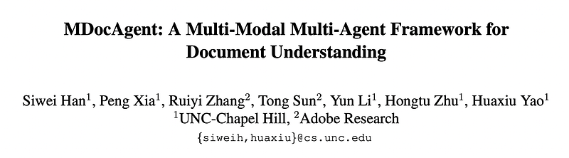
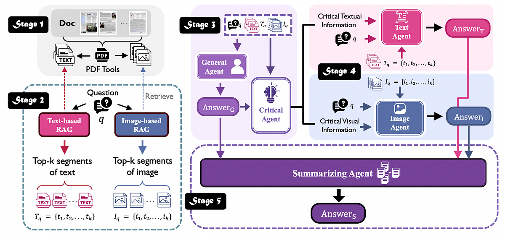
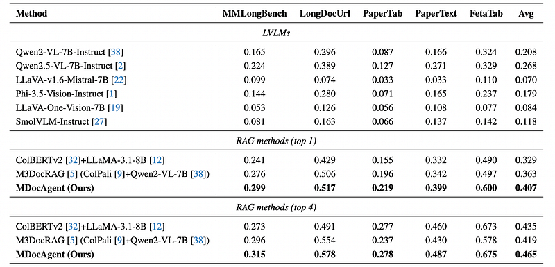

# Papers Explained 422 - MDocAgent

MDocAgent (A Multi-Modal Multi-Agent Framework for Document Understanding) is a novel RAG and multi-agent framework that leverages both text and image. The system employs five specialized agents: a general agent, a critical agent, a text agent, an image agent and a summarizing agent.

This page ingests the source article into the wiki and connects it to [[Papers Explained Corpus]], [[Agentic AI]], [[Document AI]], [[Embedding and Retrieval]], [[Vision Language Models]].

## Source Metadata

- Source file: `raw/2025-08-01_Papers-Explained-422--MDocAgent-db1c83ddc4ee.html`
- Source title: Papers Explained 422: MDocAgent
- Published: 2025-08-01
- Canonical: [https://medium.com/@ritvik19/papers-explained-422-mdocagent-db1c83ddc4ee](https://medium.com/@ritvik19/papers-explained-422-mdocagent-db1c83ddc4ee)

## Key Ideas

- MDocAgent (A Multi-Modal Multi-Agent Framework for Document Understanding) is a novel RAG and multi-agent framework that leverages both text and image.
- A Document D consists of a set of pages D = {p1,p2,…,pN}. For each page pi, textual con- tent is extracted using a combination of Optical Character Recognition (OCR) and PDF parsing techniques.
- The extracted text for each page pi is represented as a sequence of textual segments or paragraphs ti = {ti1, ti2, . . . , tiM }, where M represents the number of text segments on that page.
- This pre-processing results in two parallel representations of the document corpus: a textual representation consisting of extracted text segments and a visual representation consisting of the original page images.
- For the textual retrieval, extracted text segments ti of each page pi are indexed using ColBERTv2. Parallel to textual retrieval, visual context is extracted using ColPali.

## Notes

MDocAgent (A Multi-Modal Multi-Agent Framework for Document Understanding) is a novel RAG and multi-agent framework that leverages both text and image. The system employs five specialized agents: a general agent, a critical agent, a text agent, an image agent and a summarizing agent. These agents engage in multi-modal context retrieval, combining their individual insights to achieve a more comprehensive understanding of the document’s content.

## Multi-Modal Multi-Agent Framework for Document Understanding

*Figure: Overview of MDocAgent.*

### Document Pre-Processing

A Document D consists of a set of pages D = {p1,p2,…,pN}. For each page pi, textual con- tent is extracted using a combination of Optical Character Recognition (OCR) and PDF parsing techniques. OCR is employed to recognize text within image-based PDFs, while PDF parsing extracts text directly from digitally encoded text within the PDF.

The extracted text for each page pi is represented as a sequence of textual segments or paragraphs ti = {ti1, ti2, . . . , tiM }, where M represents the number of text segments on that page. Concurrently, each page pi is also preserved as an image, retaining its original visual layout and features.

This pre-processing results in two parallel representations of the document corpus: a textual representation consisting of extracted text segments and a visual representation consisting of the original page images.

### Multi-modal Context Retrieval

For the textual retrieval, extracted text segments ti of each page pi are indexed using ColBERTv2. Parallel to textual retrieval, visual context is extracted using ColPali.

### Initial Analysis and Key Extraction

The general agent AG, functioning as a preliminary multi-modal integrator, receives both the retrieved textual context Tq and the visual context Iq to generate a preliminary answer aG, which serves as a crucial starting point for more specialized analysis in the next stage.

> aG = AG(q,Tq,Iq)

Subsequently, the critical agent AC takes as input the question q, the retrieved contexts Tq and Iq , and the preliminary answer aG generated by the general agent to meticulously analyze these inputs and identify the most crucial pieces of information that are essential to accurately answer the question.

> Tc = AC(q,Tq,aG)

> Ic = AC(q,Iq,aG)

### Specialized Agent Processing

The text agent AT receives the retrieved text segments Tq and the critical textual information Tc as input.By focusing specifically on the critical textual information Tc, AT can pinpoint the most relevant evidence within the broader textual context Tq and perform a more focused analysis.

> aT =AT(q,Tq,Tc)

Concurrently, the image agent AI receives the retrieved images Iq and the critical visual information Ic. It processes the images in Iq, paying particular attention to the regions or features highlighted by the critical visual information Ic.

> aI = AI(q,Iq,Ic)

### Answer Synthesis

The summarizing agent AS receives the answers aG, aT , and aI generated by the gen- eral agent, text agent, and image agent, respectively. It analyzes the individual agent answers, identifying com- monalities, discrepancies, and complementary insights. It considers the supporting evidence provided by each agent. It constructs a final answer aS that leverages the collective intelligence of the multi-agent system.

> aS = AS(q,aG,aT,aI)

### Experiment Settings

Llama-3.1–8B- Instruct is usedfor the text agent. Qwen2- VL-7B-Instruct is used for the other four agents. In the RAG settings, 1 or 4 highest-scored segments are retrieved as input context for each example.

General Agent:

```text
You are an advanced agent capable of analyzing both text and images.
Your task is to use both the textual and visual information provided to answer the user’s question accurately.
Extract Text from Both Sources:
If the image contains text, extract it and consider both the text in the image and the provided textual content.
Analyze Visual and Textual Information:
Combine details from both the image (e.g., objects, scenes, or patterns) and the text to build a comprehensive understanding of the content.
Provide a Combined Answer:
Use the relevant details from both the image and the text to provide a clear, accurate, and context-aware response to the user’s question.
When responding:
• If both the image and text contain similar or overlapping information, cross-check and use both to ensure consistency.
• If the image contains information not present in the text, include it in your response if it is relevant to the question.
• If the text and image offer conflicting details, explain the discrepancies and clarify the most reliable source.
```

Critical Agent:

```text
Provide a Python dictionary of critical information based on all given information—one for text and one for image.
Respond exclusively in a valid dictionary format without any additional text.
The format should be:
{”text”: ”critical information for text”, ”image”: ”critical information for image”}
```

Text Agent:

```text
You are a text analysis agent.
Your job is to extract key information from the text and use it to answer the user’s question accurately.
Your tasks:
• Extract key details. Focus on the most important facts, data, or ideas related to the question.
• Understand the context and pay attention to the meaning and details.
• Use the extracted information to give a concise and relevant response to the user’s question. Provide a clear answer.
```

Image Agent:

```text
You are an advanced image processing agent specialized in analyzing and extracting information from images.
The images may include document screenshots, illustrations, or photographs.
Your tasks:
• Extract textual information from images using Optical Character Recognition (OCR).
• Analyze visual content to identify relevant details (e.g., objects, patterns, scenes).
• Combine textual and visual information to provide an accurate and context-aware answer to the user’s question.
```

Summarizing Agent:

```text
You are tasked with summarizing and evaluating the collective responses provided by multiple agents.
You have access to the following information:
• Answers: The individual answers from all agents.
Your tasks:
• Analyze: Evaluate the quality, consistency, and relevance of each answer. Identify commonalities, discrepancies, or gaps in reasoning.
• Synthesize: Summarize the most accurate and reliable information based on the evidence provided by the agents and their discussions.
• Conclude: Provide a final, well-reasoned answer to the question or task. Your conclusion should reflect the consensus (if one exists) or the most credible and well-supported answer.
Return the final answer in the following dictionary format:
{”Answer”: Your final answer here}
```

## Results

*Figure: Performance comparison across MDocAgent and existing state-of-the-art LVLMs and RAG-based methods.*

- MDocAgent significantly outperforms all baseline methods and other LVLMs across all benchmarks in both top-1 and top-4 retrieval scenarios.

- In top-1 retrieval, MDocAgent shows substantial improvements over the second-best methods (e.g., 16.7% on PaperText, 21.0% on FetaTab) and significantly outperforms the best LVLM and text-RAG-based baselines (51.9% and 23.7% average improvement, respectively). This highlights the effectiveness of incorporating visual information and the multi-agent architecture.

- MDocAgent also surpasses the state-of-the-art image-RAG-based method, M3DocRAG, by 12.1% on average, suggesting the superiority of its multi-agent framework and information extraction mechanism.

- In top-4 retrieval, MDocAgent maintains its leading performance, exceeding Qwen2.5-VL-7B by 73.5% on average. The consistent improvement with top-4 retrieval indicates MDocAgent’s ability to effectively utilize additional contextual information from multiple retrieved documents.

- The observation that M3DocRAG’s performance slightly decreases with top-4 retrieval compared to top-1 suggests potential limitations in its ability to handle larger amounts of retrieved information. MDocAgent outperforms M3DocRAG by 10.9% on average in top-4 retrieval.

## Paper

MDocAgent: A Multi-Modal Multi-Agent Framework for Document Understanding [2503.13964](https://arxiv.org/abs/2503.13964)

## Figures

Figures from the Medium HTML export (`raw/2025-08-01_Papers-Explained-422--MDocAgent-db1c83ddc4ee.html`); local copies under `wiki/assets/papers-explained-422-mdocagent/` when download succeeded.

| Figure | Caption |
|--------|---------|
|  | Title card: MDocAgent. |
|  | Overview of MDocAgent. |
|  | Performance comparison across MDocAgent and existing state-of-the-art LVLMs and RAG-based methods. |
## Related

- [[Papers Explained Corpus]]
- [[Agentic AI]]
- [[Document AI]]
- [[Embedding and Retrieval]]
- [[Vision Language Models]]
- [[Papers Explained 421 - AdaptiVocab]]
- [[Papers Explained 423 - Reasoning or Memorization]]

#summary #topic
