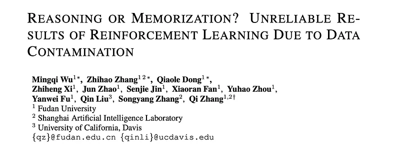
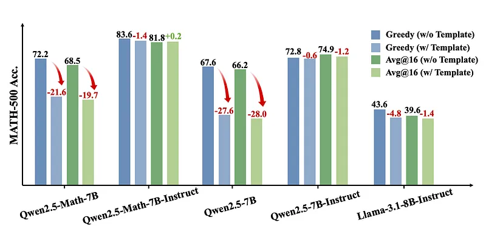
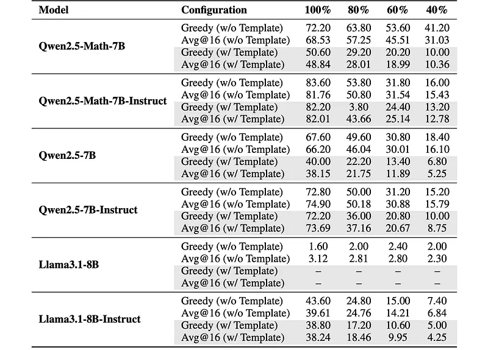
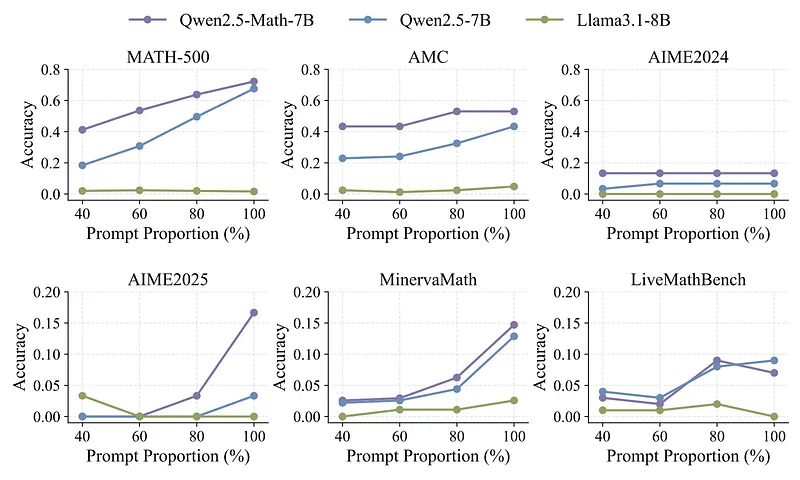
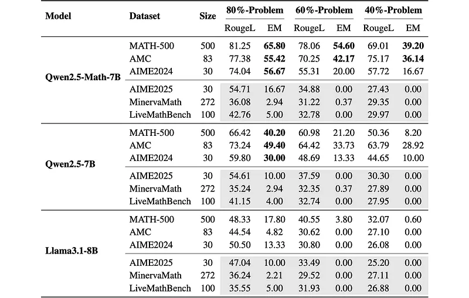
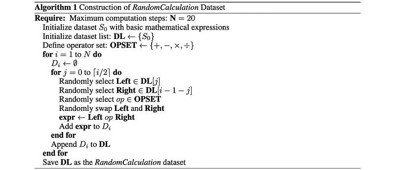
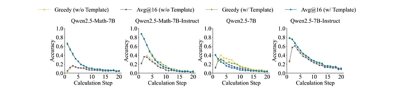
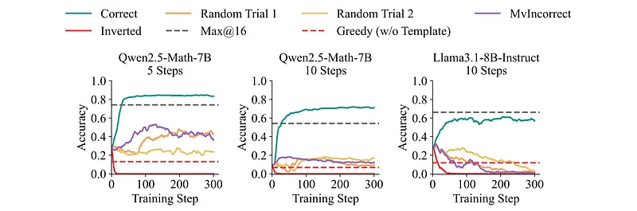

# Papers Explained 423 - Reasoning or Memorization

This study centers on four representative checkpoints: Qwen2.5–7B, Qwen2.5–7B-Instruct, Qwen2.5-Math-7B, and Qwen2.5-Math-7B-Instruct. For a controlled comparison, Llama3.1–8B and Llama3.1–8B-Instruct, which possess comparable parameter counts, are also evaluated. This comparison helps isolate model-specific differences in behavior.

This page ingests the source article into the wiki and connects it to [[Papers Explained Corpus]], [[Reasoning Models]], [[Evaluation and Benchmarks]], [[Reinforcement Learning Topic]], [[Large Language Models]], [[Reinforcement Learning]].

## Source Metadata

- Source file: `raw/2025-08-04_Papers-Explained-423--Reasoning-or-Memorization-29b5c073ed55.md`
- Source title: Papers Explained 423: Reasoning or Memorization
- Published: 2025-08-04
- Canonical: [https://medium.com/@ritvik19/papers-explained-423-reasoning-or-memorization-29b5c073ed55](https://medium.com/@ritvik19/papers-explained-423-reasoning-or-memorization-29b5c073ed55)

## Key Ideas

- This study centers on four representative checkpoints: Qwen2.5–7B, Qwen2.5–7B-Instruct, Qwen2.5-Math-7B, and Qwen2.5-Math-7B-Instruct.
- Performance is assessed with two metrics:
- ROUGE (Recall-Oriented Understudy for Gisting Evaluation) is a family of metrics commonly used to evaluate automatic summarization and text generation systems.
- ROUGE-N: Measures n-gram overlap. ROUGE-1 and ROUGE-2 refer to unigram and bigram recall respectively.
- ROUGE-L: Measures the longest common subsequence (LCS) between the generated and reference text, capturing fluency and sentence-level structure.

## Notes

This work challenges the recent claims of significant LLM reasoning improvements via reinforcement learning, even with noisy rewards, particularly on the Qwen2.5 model family and mathematical benchmarks. It empirically shows that Qwen2.5’s superior performance is likely due to data contamination in widely used benchmarks like MATH-500, and using a new, leakage-free synthetic dataset (RandomCalculation), it demonstrates that only accurate reward signals yield genuine improvements in mathematical reasoning, recommending future evaluations on uncontaminated benchmarks across various model series.

## Experimental Setup

This study centers on four representative checkpoints: Qwen2.5–7B, Qwen2.5–7B-Instruct, Qwen2.5-Math-7B, and Qwen2.5-Math-7B-Instruct. For a controlled comparison, Llama3.1–8B and Llama3.1–8B-Instruct, which possess comparable parameter counts, are also evaluated. This comparison helps isolate model-specific differences in behavior.

### Memorization Capability

Performance is assessed with two metrics:

Partial-Prompt Completion Rate

ROUGE (Recall-Oriented Understudy for Gisting Evaluation) is a family of metrics commonly used to evaluate automatic summarization and text generation systems. It measures the overlap between the generated text and one or more reference texts, focusing primarily on recall. The most frequently used variants include:

- ROUGE-N: Measures n-gram overlap. ROUGE-1 and ROUGE-2 refer to unigram and bigram recall respectively.

- ROUGE-L: Measures the longest common subsequence (LCS) between the generated and reference text, capturing fluency and sentence-level structure.

- ROUGE-Lsum: A variant of ROUGE-L adapted for multi-sentence summarization evaluation.

In this work, average ROUGE-L score is used to measure the model’s ability to reconstruct the remaining parts of a problem based on partial prefixes, serving as an indicator of the model’s memorization capacity.

Exact Match (EM) is a binary accuracy metric that checks whether the model’s continuation exactly reproduces the reference. For each instance, let ydenote the model-generated continuation and y∗denote the ground-truth continuation. if y= y∗, EM = 1; otherwise EM = 0.

First the ROUGE -L score between the yand the y∗ is computed, then:

The final EM score is obtained by averaging over all test instances. Because ROUGE-L = 1 implies an exact, character-level match, higher EM values directly indicate a greater proportion of partial-prompts that the model recalls verbatim.

Partial-Prompt Answer Accuracy

Answer-Match Accuracy: For each question, the model is supplied with only a truncated prompt (e.g., the first 60% of the original problem) and allowed to generate an unconstrained continuation. After generation, the completion is checked for the presence of the ground-truth answer. If the answer is present, the instance is scored as correct. Answer-Match Accuracy is defined as the fraction of prompts for which the model’s continuation embeds the correct answer. A high accuracy indicates that the model frequently “recovers” the answer even from a partial problem, which in turn may signal data contamination.

### RLVR Based Evaluation

Group Relative Policy Optimization (GRPO) is adopted as the RLVR algorithm.

The ground-truth answers to the randomly generated arithmetic problems often contain high-precision decimals. When the standard RLVR framework supplies only binary feedback (0 or 1), the model almost never receives positive reinforcement, making training highly unstable and prone to divergence. To address this limitation, a continuous reward that ranges from 0 to 1 is designed and jointly penalizes both absolute and relative errors between the model prediction and the reference answer. This denser signal greatly stabilizes reinforcement learning.

Let a be the model output, b be the reference answer, and ϵ = 10e-6 be a small constant for numerical stability. The reward r is computed as: :

The following rewards are considered:

- Correct: assigns 1 to a correct answer and 0 otherwise.

- Random: assigns 1 with probability γand 0 otherwise (γ = 0.5 in experiments).

- Inverted: flips the correct signal, i.e., 1−correct, so that correct solutions receive 0 and incorrect ones 1.

- Mv-incorrect: retains only majority-voted incorrect labels and assigns 1 when the model output matches an incorrect label, and 0 otherwise.

## Results

### Spurious Rewards On MATH-500

To replicate and analyze the performance of Qwen2.5-Math-7B and Llama3.1–8B-Instruct on the MATH-500 benchmark under various reward signal configurations.

*Figure: Accuracy (%) of Qwen and Llama models on the MATH-500 dataset under different generation configurations, using original questions as prompts.*

*Figure: Accuracy (%) of Qwen and Llama models on the MATH-500 dataset under different generation configurations, using varying proportions of questions as prompts.*

- Differential Impact of Spurious Rewards: Random and mv-incorrect rewards significantly boost accuracy for Qwen2.5-Math-7B, but have little to adverse effects on Llama3.1–8B-Instruct.

- RLVR Sensitivity of Qwen Variants: RLVR gains for Qwen2.5-Math-7B-Instruct are marginal compared to Qwen2.5-Math-7B, indicating that the two Qwen variants exhibit differential sensitivity to RLVR.

- Negative Impact of Chat Templates on Qwen Base Models: Applying the official chat template substantially degrades the performance of Qwen base models (Qwen-2.5–7B and Qwen-2.5-Math-7B), causing pronounced drops in accuracy regardless of sampling method.

- Reinterpretation of “RL Gains”: The apparent “RL gains” for Qwen-Math-7B largely reflect adaptation to the template format and merely converge to the “Greedy (w/o Template)” baseline, suggesting memory recall rather than genuine mathematical generalization.

- Persistent Effects of Spurious Rewards: Despite the template adaptation, spurious rewards (e.g., random and mv-incorrect) continue to boost the accuracy of Qwen base models and maintain the performance of Qwen instruct models, while eventually degrading Llama-Instruct performance.

### Analysis of Memorization Capability Results

To verify the hypothesis that the Qwen series’ divergent RLVR behavior from Llama models is due to inadvertent data contamination of evaluation sets (like MATH-500) within Qwen’s massive training data. The study aims to probe memorization capabilities on widely used mathematical-reasoning benchmarks.

*Figure: Accuracy (%) of different base models on various math datasets under Greedy (w/o Template) configuration with varying proportions of problem prefixes used as prompts.*

*Figure: Accuracy (Exact Match, EM) and ROUGE-L scores on several datasets (lower scores in gray ) under different prompt prefix ratios in greedy decoding mode without applying chat template, namely Greedy (w/o Template) configuration.*

- Data Contamination Evidence: The Qwen2.5 series models show strong signs of data contamination when evaluated on common benchmarks like MATH-500, AMC, and AIME2024.

- High Completion Rates: Qwen2.5-Math-7B demonstrated high reconstruction capabilities:

- With only 60% of questions provided, it accurately reconstructed over half (54.6%) of the remaining problems on MATH-500.

- Even with just 40% of questions shown, it recovered 39.2% of unseen problems on MATH-500.

- Similar patterns were observed on AMC and AIME2024, indicating that these evaluation benchmarks for Qwen2.5 may suffer from data contamination.

- Remarkably High Accuracy with Partial Prompts: Qwen2.5 models achieved high answer accuracy on MATH-500 even when provided with only partial questions. For instance, Qwen2.5-Math-7B reached 63.8% accuracy on MATH-500 with 80% of the questions, and 41.2% accuracy with only 40% of the questions.

- Structured Solutions and Memorization: The model’s responses sometimes contained coherent reasoning chains and syntactically valid Python code (though not executed), even when only partial questions were given.

### Spurious Rewards On RandomCalculation

To support the hypothesis that the anomalous performance surge of Qwen2.5-Math-7B on the MATH-500 benchmark is primarily due to data contamination, not intrinsic mathematical reasoning ability.

A new, uncontaminated evaluation benchmark called RandomCalculation is constructed. It consists of randomly generated mathematical expressions (1 to 20 steps) using integers (0–100), fractions, squares, cubes, and four basic arithmetic operations. It comprises 20 sub-datasets, each with 1,000 unique problems.

*Figure: Math reasoning performance of the Qwen2.5 series models on the RandomCalculation datasets under different generation configurations.*

- Initial Qwen2.5 Performance: When tested zero-shot on RandomCalculation, Qwen2.5 models showed degraded mathematical reasoning ability as computation steps increased (with chat templates), or peaked at three steps before declining (without chat templates), indicating significant room for improvement in multi-step calculations.

*Figure: Training performance of Qwen2.5-Math-7B and Llama3.1–8B-Instruct using the RLVR algorithm on the RandomCalculation dataset.*

- Under correct reward signals, Qwen2.5-Math-7B’s performance steadily improved throughout training.

- With random or incorrect rewards, training became unstable and inconsistent.

- Under inverted rewards, the model collapsed rapidly.

- Conclusion: For problems not leaked during pretraining, only correct reward signals can effectively guide the model toward improved reasoning performance.

- Comparison with Llama3.1–8B-Instruct: Llama3.1–8B-Instruct showed consistent findings, with only accurate reward signals yielding stable performance gains.

## Paper

Reasoning or Memorization? Unreliable Results of Reinforcement Learning Due to Data Contamination [2507.10532](https://arxiv.org/abs/2507.10532)

## Figures

Figures from the Medium HTML export (`raw/2025-08-04_Papers-Explained-423--Reasoning-or-Memorization-29b5c073ed55.md`); local copies under `wiki/assets/papers-explained-423-reasoning-or-memorization/` when download succeeded.

| Figure | Caption |
|--------|---------|
|  | Title card: Reasoning or Memorization. |
|  | First the ROUGE -L score between the yand the y∗ is computed, then. |
|  | Let a be the model output, b be the reference answer, and ϵ = 10e-6 be a small constant for numerical stability. The reward r is computed as. |
|  | Accuracy (%) of Qwen and Llama models on the MATH-500 dataset under different generation configurations, using original questions as prompts. |
|  | Accuracy (%) of Qwen and Llama models on the MATH-500 dataset under different generation configurations, using varying proportions of questions as prompts. |
|  | Accuracy (%) of different base models on various math datasets under Greedy (w/o Template) configuration with varying proportions of problem prefixes used as prompts. |
|  | Accuracy (Exact Match, EM) and ROUGE-L scores on several datasets (lower scores in gray ) under different prompt prefix ratios in greedy decoding mode without applying chat template, namely Greedy (w/o Template) configuration. |
|  | The following rewards are considered:: A new, uncontaminated evaluation benchmark called RandomCalculation is constructed. |
|  | Math reasoning performance of the Qwen2.5 series models on the RandomCalculation datasets under different generation configurations. |
|  | Training performance of Qwen2.5-Math-7B and Llama3.1–8B-Instruct using the RLVR algorithm on the RandomCalculation dataset. |
## Related

- [[Papers Explained Corpus]]
- [[Reasoning Models]]
- [[Evaluation and Benchmarks]]
- [[Reinforcement Learning Topic]]
- [[Large Language Models]]
- [[Reinforcement Learning]]
- [[Papers Explained 422 - MDocAgent]]
- [[Papers Explained 424 - One Token to Fool LLM-as-a-Judge]]

#summary #topic
