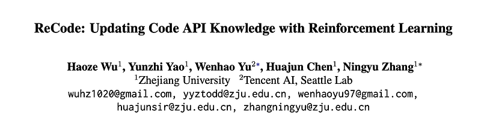
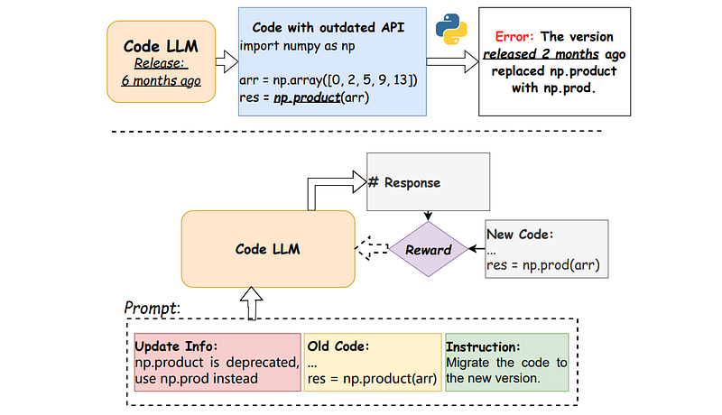
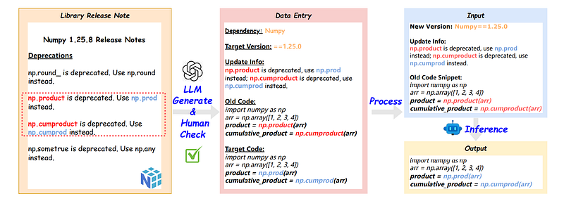
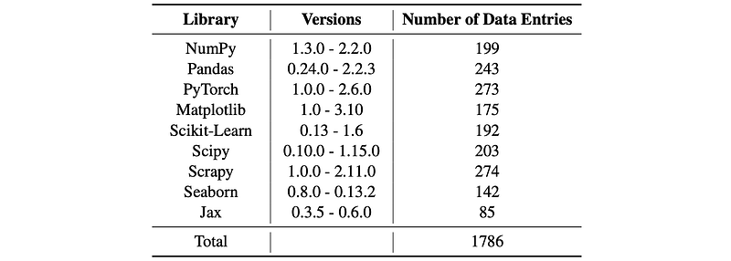
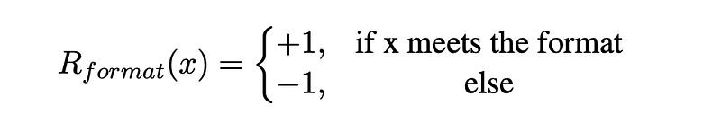
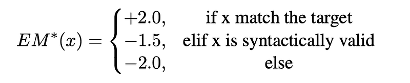
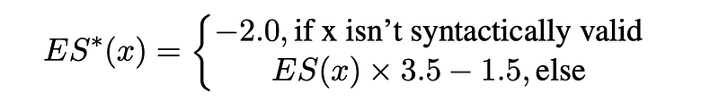
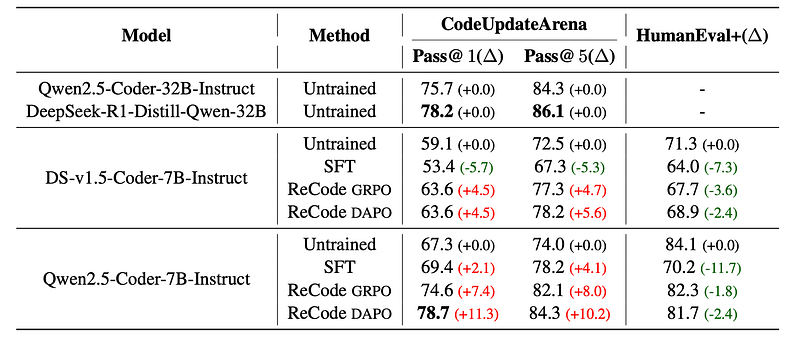

# Papers Explained 425 - ReCode

LLMs struggle to adapt to frequent API updates due to reliance on outdated knowledge. ReCode (rule-based Reinforcement learning for Code Update) is a novel framework that mimics human programmer adaptation to API changes.

This page ingests the source article into the wiki and connects it to [[Papers Explained Corpus]], [[Code Models]], [[Reinforcement Learning Topic]], [[Synthetic Data]], [[Large Language Models]], [[Embedding and Retrieval]], [[Reinforcement Learning]], [[Verifier-Bounded Learning]].

## Source Metadata

- Source file: `raw/2025-08-06_Papers-Explained-425--ReCode-a0a63c7705fe.html`
- Source title: Papers Explained 425: ReCode
- Published: 2025-08-06
- Canonical: [https://medium.com/@ritvik19/papers-explained-425-recode-a0a63c7705fe](https://medium.com/@ritvik19/papers-explained-425-recode-a0a63c7705fe)

## Key Ideas

- LLMs accumulate code knowledge during pre-training, but their parameters (θ) remain static, preventing the incorporation of subsequent API updates. This leads to the generation of code containing outdated APIs.
- A basic strategy to address this is embedding updated API information (c_update) directly into the prompt.
- CodeUpdateArena is a synthetic dataset, generated with LLM assistance, designed to evaluate LLMs’ capability to handle API updates. It comprises 670 program synthesis tasks and covers updates to 54 functions across seven different Python packages.
- Each entry in the dataset includes at least three directly executable test cases for verification.
- Models are trained to perform version migration based on updated information.

## Notes

LLMs struggle to adapt to frequent API updates due to reliance on outdated knowledge. ReCode (rule-based Reinforcement learning for Code Update) is a novel framework that mimics human programmer adaptation to API changes.

## Problem Formulation

LLMs accumulate code knowledge during pre-training, but their parameters (θ) remain static, preventing the incorporation of subsequent API updates. This leads to the generation of code containing outdated APIs.

A basic strategy to address this is embedding updated API information (c_update) directly into the prompt. However, this method can cause conflicts between the model’s internal knowledge (θ) and the external prompt information, potentially leading the model to overlook the provided updates.

### CodeUpdateArena

CodeUpdateArena is a synthetic dataset, generated with LLM assistance, designed to evaluate LLMs’ capability to handle API updates. It comprises 670 program synthesis tasks and covers updates to 54 functions across seven different Python packages.

Each entry in the dataset includes at least three directly executable test cases for verification.

## ReCode

Models are trained to perform version migration based on updated information.

Input (xi): [Dependency, Target Version, Update Info, Old Code] (represented as [di, vi, ui, c(old)i]).

Output (y): Target Code (c(target)i).

```text
System:
You are a helpful coding assistant.
Your task is to transform the old version of the code into the new version specified, based on the update information.
You first thinks about the reasoning process in the mind and then provides the solution.
User:
Dependency di performed an API update in version vi, and the update content includes:
<doc>
update info ui
</doc>
The old version of the code is:
'''python
old code c^old_i
“‘
Show your work in <think> </think> tags.
And return the final code in <answer> </answer>, the code within <answer></answer> should be enclosed in '''python ''' tags.
Assistant:
Let me solve this step by step.
<think>
```

### Training Dataset Construction

*Figure: The pipeline of data collection and training task with a running example.*

- API Update Identification: Access release notes of major data science libraries (e.g., Numpy, Pandas, PyTorch, matplotlib) to find paragraphs detailing specific API updates.

- Code Snippet Generation: GPT-4 is used to generate two code snippets with equivalent functionality: one using the old API and one using the updated API.

- Expert Review: Human experts review these generated code snippets to ensure correct incorporation of the updated API.

- Inclusion: Only code snippets that pass expert review are included in the dataset.

The final dataset contains approximately 2,000 entries. API updates encompass diverse changes, including API renaming, parameter addition, and functionality modification

*Figure: Statistics of our collected dataset.*

### Reward Design

When improving coding skills, code quality can be verified by the pass rate of test cases. However, the pass rate of test cases is not a suitable reward metric for the code migration task. The training objective is to migrate correctly generated code to a new version, with the focus on “migration” rather than the inherent correctness of the code itself.

Format Reward:

To ensure the model’s output adheres to the format: <think>…</think><answer>…</answer>, where the thinking process is within the <think> tag and the target code within the <answer> tag.

Correctness Rewards:

Edit Similarity (ES): ES assesses the similarity between predicted completions and target codes by analyzing the edit operations needed to transform one into the other.

Exact Match (EM): EM calculates the rate at which predicted completions exactly match the target codes after normalizing return values.

### Experiment Setup

Two code models are utilized to evaluate the method: Qwen-2.5-Coder-7B-Instruct and DeepSeek-v1.5-Coder-7B-Instruct.

The DoRA algorithm is used to update the model due to computational limits. The hyperparameters are configured as r=64, α=64.

GRPO and its modified version, DAPO, are selected for training. ReCode is adaptable to any RL algorithm, not limited to GRPO.

## Evaluation

*Figure: The performance results using the GRPO and DAPO algorithms on CodeUpdateArena and HumanEval+.*

- ReCode improves the model’s performance in the CodeUpdateArena, with both GRPO and DAPO contributing to the improvement.

- For the Qwen2.5-Coder-7B-Instruct model, ReCode resulted in a Pass@1 exceeding that of a 32B parameter code instruction-tuned model and a distilled reasoning model with an identical architecture.

- ReCode’s benefits are substantially greater for Qwen2.5-Coder than for DeepSeekCoder-v1.5.

- SFT exhibits limited generalization capabilities when transitioning from code migration to real-world code generation tasks.

- SFT’s performance boost is inferior to ReCode, and in some cases, it may diminish the pre-trained model’s performance.

- ReCode has less impact on the general capabilities of LLMs than SFT, as shown by the HumanEval+ benchmark.

- ReCode is a viable and promising solution for dynamic API scenarios.

## Paper

ReCode: Updating Code API Knowledge with Reinforcement Learning [2506.20495](https://www.arxiv.org/abs/2506.20495)

## Figures

Figures from the Medium HTML export (`raw/2025-08-06_Papers-Explained-425--ReCode-a0a63c7705fe.html`); local copies under `wiki/assets/papers-explained-425-recode/` when download succeeded.

| Figure | Caption |
|--------|---------|
|  | Title card: ReCode. |
|  | LLMs struggle to adapt to frequent API updates due to reliance on outdated knowledge. |
|  | The pipeline of data collection and training task with a running example. |
|  | Statistics of our collected dataset. |
|  | Correctness Rewards. |
|  | Correctness Rewards. |
|  | Exact Match (EM): EM calculates the rate at which predicted completions exactly match the target codes after normalizing return values. |
|  | The performance results using the GRPO and DAPO algorithms on CodeUpdateArena and HumanEval+. |
## Related

- [[Papers Explained Corpus]]
- [[Code Models]]
- [[Reinforcement Learning Topic]]
- [[Synthetic Data]]
- [[Large Language Models]]
- [[Embedding and Retrieval]]
- [[Reinforcement Learning]]
- [[Verifier-Bounded Learning]]
- [[Papers Explained 424 - One Token to Fool LLM-as-a-Judge]]
- [[Papers Explained 426 - Arcee Foundation Models]]

#summary #topic
