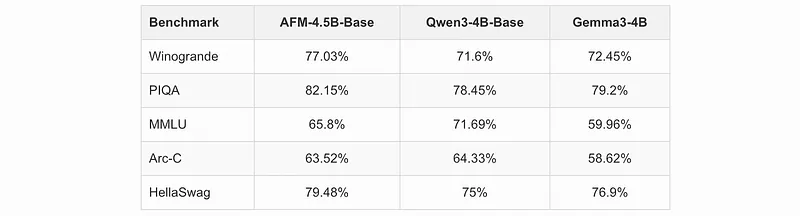
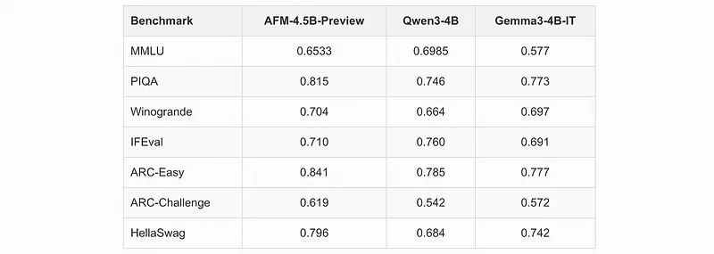
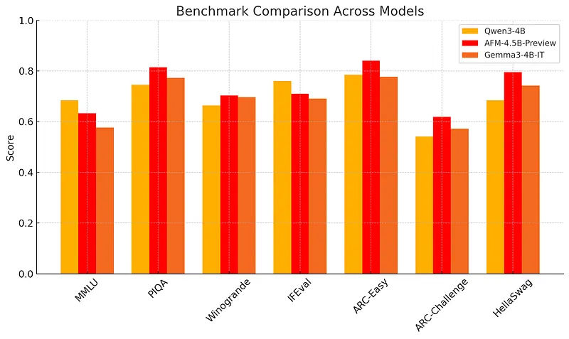

# Papers Explained 426 - Arcee Foundation Models

Arcee Foundation Models is a new family of generative AI models built from the ground up for enterprise reality. Combined with built-in support for function calling and agentic reasoning, AFM-4.5B is ready to automate complex workflows immediately i.e. no fragile prompt engineering required.

This page ingests the source article into the wiki and connects it to [[Papers Explained Corpus]], [[Synthetic Data]], [[Large Language Models]], [[Reasoning Models]], [[Model Compression and Efficiency]], [[Embedding and Retrieval]].

## Source Metadata

- Source file: `raw/2025-08-07_Papers-Explained-426--Arcee-Foundation-Models-5751b562dc7b.md`
- Source title: Papers Explained 426: Arcee Foundation Models
- Published: 2025-08-07
- Canonical: [https://medium.com/@ritvik19/papers-explained-426-arcee-foundation-models-5751b562dc7b](https://medium.com/@ritvik19/papers-explained-426-arcee-foundation-models-5751b562dc7b)

## Key Ideas

- Arcee Foundation Models is a new family of generative AI models built from the ground up for enterprise reality. Combined with built-in support for function calling and agentic reasoning, AFM-4.5B is ready to automate complex workflows immediately i.e.
- The development of Arcee Foundation Model (AFM) was driven by the following issues:
- Performance and Size Gaps: Edge-optimized models weren’t simply reliable enough for demanding tasks. Customers needed a model that could run on modest hardware, yet still deliver top-tier accuracy and robustness.
- Regulatory and Licensing Friction: The most advanced models from major Chinese AI labs (Deepseek, Qwen, GLM, MiniCPM) offered impressive results, but rarely satisfied Western compliance standards, disqualifying them for regulated industries.
- Stagnant Western Alternatives: Models from Meta (Llama) and Mistral, while solid, were quickly becoming outdated in relevance.

## Notes

Arcee Foundation Models is a new family of generative AI models built from the ground up for enterprise reality. Combined with built-in support for function calling and agentic reasoning, AFM-4.5B is ready to automate complex workflows immediately i.e. no fragile prompt engineering required.

The development of Arcee Foundation Model (AFM) was driven by the following issues:

- Performance and Size Gaps: Edge-optimized models weren’t simply reliable enough for demanding tasks. Customers needed a model that could run on modest hardware, yet still deliver top-tier accuracy and robustness.

- Regulatory and Licensing Friction: The most advanced models from major Chinese AI labs (Deepseek, Qwen, GLM, MiniCPM) offered impressive results, but rarely satisfied Western compliance standards, disqualifying them for regulated industries.

- Stagnant Western Alternatives: Models from Meta (Llama) and Mistral, while solid, were quickly becoming outdated in relevance. The 3–10B parameter space was primarily served by models a year old or older, outpaced by newer research, data pipelines, and post-training strategies.

## Pre Training

- Uncompromising Data Quality: Arcee AI partnered with DatologyAI to assemble 6.58 trillion tokens of high-quality, relevant data.

- Data Curation Challenges: Data curation for foundation models is a frontier research and engineering problem, requiring expertise in algorithms, scaling, and implementation.

- DatologyAI’s Pipeline: DatologyAI’s curation pipeline integrates proprietary algorithms, including model-based quality filtering, embedding-based curation, target distribution-matching, source mixing, and synthetic data. These algorithms were customized to generate a strong general-purpose dataset that also targeted the capabilities Arcee AI wanted their model to have.

- Early Results: By 2 trillion tokens, AFM-4.5B was already outperforming competing models trained on dramatically larger, but noisier datasets.

## Post Training

The process begins with midtraining, where the model was infused with high-leverage datasets (math, code, complex reasoning) and carefully selected samples from DatologyAI’s corpus. This step gave the model strong early instincts for precision and clarity. From there, checkpoint merging was performed, consolidating and enhancing intermediate models into a cohesive base. Context length was extended using YaRN, a rotary scaling method that retains performance at scale, and this long-context foundation was refined through advanced merging using MergeKit, which allowed precise control over the model’s composition — layer-wise weighting, residual scaling, and targeted integrations — all of which contributed to consistency across varied tasks.

Next, supervised fine-tuning was conducted, focusing on instruction clarity, diversity, and alignment. Here, the model learned to adapt to a wide range of prompts — from legal analysis to creative writing — while avoiding the overfitting that weakens many instruction-tuned models.

Finally, reinforcement learning was applied using verifiable reward signals, helping the model prefer factual, high-utility responses. Post-RL merges smoothed out inconsistencies, followed by KTO, an alignment method where the model learns directly from trusted reference behavior.

## Evaluations

## Paper

- [Announcing Arcee Foundation Models](https://www.arcee.ai/blog/announcing-the-arcee-foundation-model-family/)

- [Deep Dive: AFM-4.5B, the First Arcee Foundation Model](https://www.arcee.ai/blog/deep-dive-afm-4-5b-the-first-arcee-foundational-model/)

## Figures

Figures from the Medium HTML export (`raw/2025-08-07_Papers-Explained-426--Arcee-Foundation-Models-5751b562dc7b.md`); local copies under `wiki/assets/papers-explained-426-arcee-foundation-models/` when download succeeded.

| Figure | Caption |
|--------|---------|
|  | Title card: Arcee Foundation Models. |
|  | Finally, reinforcement learning was applied using verifiable reward signals, helping the model prefer factual, high-utility responses. |
|  | Finally, reinforcement learning was applied using verifiable reward signals, helping the model prefer factual, high-utility responses. |
|  | Finally, reinforcement learning was applied using verifiable reward signals, helping the model prefer factual, high-utility responses. |
## Related

- [[Papers Explained Corpus]]
- [[Synthetic Data]]
- [[Large Language Models]]
- [[Reasoning Models]]
- [[Model Compression and Efficiency]]
- [[Embedding and Retrieval]]
- [[Papers Explained 425 - ReCode]]
- [[Papers Explained 427 - Paper2Poster]]
- [[Papers Explained: Arcee Trinity]] — the sparse MoE successor to AFM, featuring Trinity Nano/Mini/Large (up to 400B/13B active parameters).

#summary #topic
