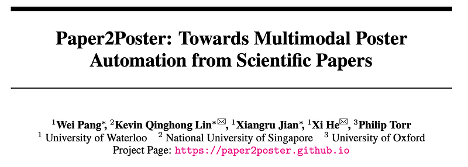
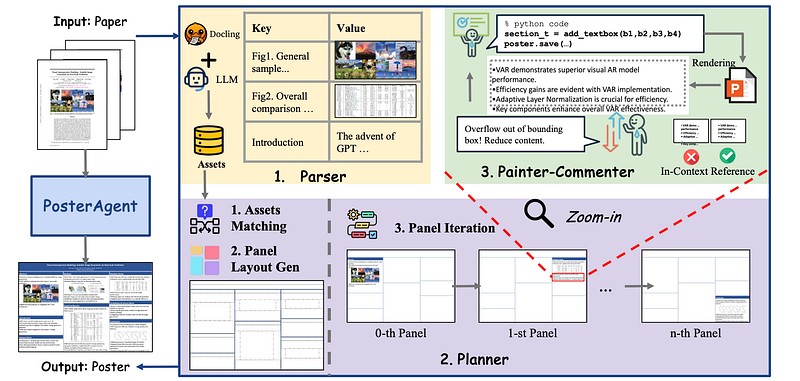
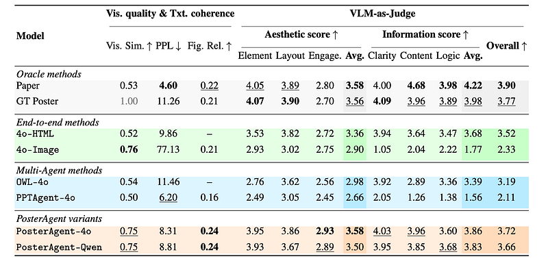
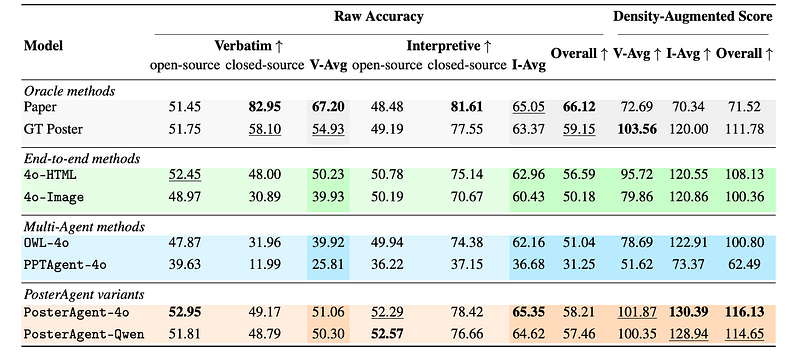

# Papers Explained 427 - Paper2Poster

Given a scientific paper composed of interleaved text, figures, and tables, the goal is to automatically generate a single-page academic poster that faithfully conveys the paper’s core content in a visually coherent and spatially efficient format. This task presents several unique challenges:

This page ingests the source article into the wiki and connects it to [[Papers Explained Corpus]], [[Synthetic Data]], [[Evaluation and Benchmarks]], [[Vision Language Models]], [[Model Compression and Efficiency]], [[Document AI]].

## Source Metadata

- Source file: `raw/2025-08-08_Papers-Explained-427--Paper2Poster-504437bba4cc.html`
- Source title: Papers Explained 427: Paper2Poster
- Published: 2025-08-08
- Canonical: [https://medium.com/@ritvik19/papers-explained-427-paper2poster-504437bba4cc](https://medium.com/@ritvik19/papers-explained-427-paper2poster-504437bba4cc)

## Key Ideas

- The project is available on [GitHub](https://paper2poster.github.io/).
- Given a scientific paper composed of interleaved text, figures, and tables, the goal is to automatically generate a single-page academic poster that faithfully conveys the paper’s core content in a visually coherent and spatially efficient format.
- Based on the initial candidate set, two filtering criteria are applied to curate high-quality data:
- Length Control: longer papers, including supplementary material, are included, selecting PDFs that exceed 15 pages and extend up to 50 pages.
- Latest Version: the most recent PDF version for each paper is manually retrieved to ensure the dataset reflects final camera-ready submissions.

## Notes

PosterAgent is a multi-agent pipeline consisting of a Parser, Planner, and Painter-Commenter loop, which distills the paper, aligns text-visual pairs, and refines panels using VLM feedback. This paper further introduces a new benchmark and metric suite for academic poster generation, addressing the challenge of compressing long research papers into visually coherent posters. The evaluation focuses on visual quality, textual coherence, holistic assessment using a VLM-as-judge, and the poster’s ability to convey core paper content via a “PaperQuiz.”

The project is available on [GitHub](https://paper2poster.github.io/).

## Paper2Poster Benchmark

### Task Definition

Given a scientific paper composed of interleaved text, figures, and tables, the goal is to automatically generate a single-page academic poster that faithfully conveys the paper’s core content in a visually coherent and spatially efficient format. This task presents several unique challenges:

- Long-Context, Long-Horizon Task

- Interleaved Multimodal Inputs

- Layout-Aware Multimodal Outputs

### Data Curation

AI papers are focused for three key reasons: they are relatively recent and undergo rigorous peer review, ensuring high scientific quality; they offer diverse content across subfields — such as image-rich computer vision, text-centric NLP, and theory papers with numerous equations — providing a broad range of input modalities. To support this, the POSTERSUM dataset, which contains a large collection of paper–poster pairs from recent AI conferences including ICML, NeurIPS, and ICLR (2022–2024), is adopted. Specifically, the test split is used to reduce the risk of overlap with training data.

Based on the initial candidate set, two filtering criteria are applied to curate high-quality data:

- Length Control: longer papers, including supplementary material, are included, selecting PDFs that exceed 15 pages and extend up to 50 pages.

- Latest Version: the most recent PDF version for each paper is manually retrieved to ensure the dataset reflects final camera-ready submissions.

From the filtered set, the final Paper2Poster dataset consisting of 100 paper–poster pairs is constructed, stratified by publication year to ensure temporal balance: 33 pairs from 2022, 33 from 2023, and 34 from 2024. To further enhance diversity, the dataset is also stratified by source venue — selecting 35 papers from NeurIPS, 37 from ICML, and 28 from ICLR, ensuring broad coverage across these leading conferences.

### Evaluation Metrics

To systematically measure the quality of generated posters, a comprehensive evaluation framework is established that covers four essential dimensions:

- visual quality

- textual coherence

- quality assessment via VLM (i.e.,VLM-as-judge), and notably

- PaperQuiz which measures how effectively the poster conveys the paper’s core knowledge.

## Poster Agent

*Figure: Illustration of the PosterAgent pipeline.*

PosterAgent is a multi-agent pipeline that adopts a “Top-down” design philosophy. It first globally restructures the entire document into concise, coherent sections, followed by local refinements for fine-grained, panel-level control. The pipeline consists of three key components:

- Parser: Extracts key textual and visual content by tools and LLM-based summarization to build an asset library.

- Planner: Aligns assets and arranges them into coherent layouts, generating panels iteratively with a zoom-in mechanism.

- Painter–Commenter: The Painter produces panel-level bullet points and executable code for rendering, while a VLM as Commenter, ensures layout coherence and avoids overflow.

### Parser

The parser extracts key textual and visual content from the paper. It uses tools like MARKER and DOCLING, along with LLM-based summarization, to build an asset library. It creates two types of assets:

- Text assets capture the document hierarchy, with section headings as keys and paragraph-level synopses as values.

- Visual assets store figure or table captions as keys and the extracted image files as values.

Each page is converted into Markdown, which is then processed by an LLM to generate a structured, JSON-like outline. The raw text is compressed into a compact asset library, preserving essential semantics while reducing size.

```text
System Prompt:
You are a document content divider and extractor specialist, expert in dividing and extracting content from various types of documents and reorganizing it into a two-level json format for later poster generation.
Instruction:
Based on given markdown document, generate a JSON output for later poster generation, make sure the output is concise and focused.
Step-by-Step Instructions:
1. Identify Sections and Subsections in document and identify sections and subsections based on the heading levels and logical structure.
2. Divide Content: Reorganize the content into sections and subsections, ensuring that each subsection contains approximately 500 words.
3. Refine Titles: Create titles for each section with at most 3 words.
4. Remove Unwanted Elements: Eliminate any unwanted elements such as headers, footers, text surrounded by "∼∼" indicating deletion.
5. Refine Text: For content, you should keep as much raw text as possible. Do not include citations.
6. Length: you should control the length of each section, according to their importance according to your understanding of the paper. For important sections, their content should be long.
7. Make sure there is a poster title section at the beginning, and it should contain information like paper title, author, organization etc.
8. The "meta" key contains the meta information of the poster, where the title should be the raw title of the paper and is not summarized.
9. Ther **must** be a section for the poster title.
Example Output:
{
"meta":
{
"poster_title": "raw title of the paper",
"authors": "authors of the paper",
"affiliations": "affiliations of the authors"
},
"sections":
[
{
"title": "Poster Title & Author",
"content": "content of poster title and author"
},
{
"title": "title of section1",
"content": "content of section 1"
},
{
"title": "title of section2",
"content": "content of section 2"
}
]
}
```

```text
System Prompt:
You are an assistant that reviews a poster’s JSON layout (json_content), along with corresponding image_information and table_information.
Your task is to filter out any image or table entries that are irrelevant to the content described in json_content (for instance, if their captions or any provided details do not align with the topics, sections, or content in the poster).
Specifically:
1. Read through the full poster data described in json_content.
2. Examine each entry within image_information and table_information.
3. Decide if each entry is relevant based on its caption, path, or any other information provided.
- For example, if an image has a caption that obviously does not fit into any section or does not relate to the poster’s content outline, deem it “unimportant.”
4. Keep only those images/tables you consider "important" for the poster (i.e., relevant to the topics, sections, or discussions mentioned in json_content).
5. Produce an output containing just two keys:
"image_information" for the filtered images, and "table_information" for the filtered tables.
Each of these keys should map to an array of filtered objects.
You must output valid JSON containing only:
{
"image_information": {...},
"table_information": {...}
}
Instructions:
The user will provide JSON:
1. "json_content": The content of the poster (sections, text, etc.).
2. "image_information": A dict of images (each with caption, path, size constraints).
3. "table_information": A dict of tables (each with caption, path, size constraints).
Your task:
1. Read the poster outline (json_content).
2. Filter image_information and table_information so that only entries relevant to the poster content remain.
- Relevance is determined by matching or relating their captions to the poster’s sections or content.
- If an image or table does not clearly match or support any content in json_content, remove it.
3. Return a JSON with the structure:
{
"image_information": <filtered image information JSON>,
"table_information": <filtered table information JSON>
}
Output Format:
Just return a JSON object with the two keys:
"image_information" and "table_information" — each containing the filtered data.
No additional keys or text.
Both "image_information" and "table_information" should present even if they are empty.
Note:
- If no entries remain for either images or tables, just return an empty dict for that key.
- Keep at most 5 entries in image_information and table_information respectively.
- Make sure the JSON you output is valid.
Please provide only the JSON object as your final output.
```

### Planner

The Planner selects relevant content from the asset library and constructs the poster section by section. It emphasises on layout configuration and an iterative completion process is adopted. Asset matching aligns visual assets with corresponding textual content using an LLM to semantically match each visual asset with its most relevant section, resulting in (section, figure) pairs. Layout generation determines the panel-level layout using a binary-tree layout strategy, which translates hierarchical constraints into panel bounding boxes by estimating content length, maintaining reading order, and preserving aspect ratio. Panel iteration populates each panel with content, condensing each section’s synopsis into concise, hierarchically structured bullet points.

```text
System Prompt:
You are an expert assistant tasked with assigning images or tables to the most relevant poster sections.
You will be given:
• JSON content of the poster outline, including each section’s title and a brief description.
• A list of images (image_information) with captions and size constraints.
• A list of tables (table_information) with captions and size constraints.
Your goal is to produce a JSON mapping of each top-level section to exactly zero or one image/table that best fits that section’s content.
For each top-level section (named in the provided JSON “json_content”), decide:
• Whether an image or table (or none) is most relevant to the section’s theme or description.
• If relevant, select the single most appropriate image or table to assign.
• Base this selection on the conceptual content described in the section (“research methods”, “results”, “conclusion”, etc.) and compare it with the captions of the provided images or tables, choosing whichever fits best.
• If assigning an image, specify “image”: <id>, where <id>is the identifier of the chosen image from “image_information”.
• If assigning a table, specify “table”: <id>, where <id>is the identifier of the chosen table from “table_information”.
• Include an additional “reason” field briefly explaining why this assignment was made (e.g., how the image/table relates to the section content).
• If no image or table is assigned to a given section, omit that section from the final JSON (i.e., only list sections where you actually assign something).
Important Notes:
• The assignment should not be arbitrary. It must be logically consistent with the section’s description and the provided caption for the image or table.
• Do not produce any layout properties or subsections here.
• The final output must be a single JSON object, mapping from section names to the chosen image/table ID plus the “reason” field.
• If multiple images or tables are suitable, select the single best one and assign only that.
• If “image_information” or “table_information” is empty, you may end up assigning nothing to any section.
Instructions:
1. Read and analyze the poster’s top-level sections from {{ json_content }}.
2. Look at {{ image_information }} and {{ table_information }}. Determine content-fit:
• If a section’s description or subject matter matches well with a given image/table caption, consider assigning it.
• If multiple images or tables seem relevant, choose the single best fit.
• If none of the images or tables are relevant, or if none are provided, do not assign anything for that section.
3. Produce a single JSON object. Each key is the exact name of a top-level section (e.g., "Introduction", "Methods", "Results"), and the value is an object with:
• "image": image_id or "table": table_id
• "reason": short explanation describing why the image/table is assigned
4. If no assignment is made for a section, exclude that section from the JSON.
5. No image can be reused for multiple sections. Each image/table can only be assigned to one section.
6. Ensure your final response strictly follows JSON syntax with no extra commentary.
Example Output Format:
{
"Introduction":
{
"image": 1,
"reason": "Image 1 depicts the central concept introduced in this section."
},
"Results":
{
"table": 2,
"reason": "Table 2 summarizes the key metrics discussed in the results."
}
}
```

### Painter–Commenter

Performs local refinement for each panel.

The Painter converts a (section, figure) asset pair into executable code instructions and renders a draft panel image. It uses an LLM to distill the section synopsis into bullet points. A deterministic code generator (python-pptx library) is used to generate presentation code, which is executed and rendered into an image.

The Commenter, a VLM, evaluates the quality of the rendered panel image. It employs a Zoom-in strategy to focus attention on the panel region. It uses an in-context reference prompt with examples of severe overflow and ideal layout. Targeted visual feedback (e.g., “overflow,” “too blank,” “good to go”) is provided to inform the Painter’s next revision.

The Painter-Commenter loop continues until the Commenter signals success or a maximum number of iterations is reached.

```text
System Prompt:
You are an expert assistant tasked with producing bullet-point summaries for a given poster section.
You will be given:
• A JSON object summary_of_section that contains:
{
"title": "<section title>",
"content": "<full text description>"
}
• An integer number_of_textboxes, which can only be 1 or 2.
Your goal is to produce a JSON object representing the bullet-point text for this poster section.
Each “textbox” key (textbox1 or textbox2) maps to a list of bullet-point entries.
Each bulletpoint entry must be a JSON object of the form:
{
"alignment": "left",
"bullet": true,
"level": <indent_level>,
"font_size": <integer>,
"runs": [
{
"text": "<bullet point text>"
# optionally "bold": true or "italic": true if needed
}
]
}
Instructions:
1. If number_of_textboxes = 1, your final output must only have:
{
"title": [ section title ],
"textbox1": [ ... array of bullet items ... ]
}
2. If number_of_textboxes = 2, then you must produce two keys: textbox1 and textbox2, and each must have the same number of bullet items. For example:
{
"title": [ section title ],
"textbox1": [... N bullet items ...],
"textbox2": [... N bullet items ...]
}
where both arrays have identical length.
3. Each bullet point is a JSON object with the structure shown above; you can create as many bullet points as needed (following the constraint about textbox count).
4. Make sure your final output is valid JSON, with no extra keys or additional formatting.
5. Return only the JSON object, nothing else.
Example Output:
Example when number_of_textboxes = 1:
{
"title": [
{
"alignment": "left",
"bullet": false,
"level": 0,
"font_size": 60,
"runs": [
{
"text": "Methodology",
"bold": true
}
]
}
],
"textbox1": [
{
"alignment": "left",
"bullet": true,
"level": 0,
"font_size": 48,
"runs": [
{
"text": "Key point about domain-invariant component analysis."
}
]
},
{
"alignment": "left",
"bullet": true,
"level": 1,
"font_size": 48,
"runs": [
{
"text": "Supporting detail.",
"bold": true
}
]
}
]
}
Example when number_of_textboxes = 2:
{
"title": [
{
"alignment": "left",
"bullet": false,
"level": 0,
"font_size": 60,
"runs": [
{
"text": "Experimental results",
"bold": true
}
]
}
],
"textbox1": [
{
"alignment": "left",
"bullet": true,
"level": 0,
"font_size": 48,
"runs": [
{
"text": "Primary finding, bullet 1."
}
]
},
{
"alignment": "left",
"bullet": true,
"level": 0,
"font_size": 48,
"runs": [
{
"text": "Primary finding, bullet 2."
}
]
}
],
"textbox2": [
{
"alignment": "left",
"bullet": true,
"level": 0,
"font_size": 48,
"runs": [
{
"text": "Additional commentary, bullet 1."
}
]
},
{
"alignment": "left",
"bullet": true,
"level": 0,
"font_size": 48,
"runs": [
{
"text": "Additional commentary, bullet 2."
}
]
}
]
}
```

```text
System Prompt: You are an agent that is given three images:
• Negative Example: This image shows a bounding box with text overflowing outside it (i.e., text crossing or cut off by the box).
• Positive Example: This image shows a bounding box with text that fits completely (i.e., no text crossing or cut off).
• Target Image: This is the final image you must analyze.
From the first two images, you learn to interpret:
1. Whether text is overflowing (text crossing, cut off, or otherwise cannot fully fit in the box).
2. Whether there is too much blank space in the bounding box (i.e., the text is significantly smaller than the box, leaving large unused space).
3. Whether the text and bounding box are generally well-aligned (no overflow, no large blank space).
Then, for the Target Image, you must:
• If there is any overflow text, return "1".
• If there is too much blank space, return "2".
• If the text fits well (no overflow, no large blank space), return "3".
Instructions:
1. You are provided three images (negative example, positive example, and target).
2. Refer to the first two images (negative and positive examples) to understand:
• What text overflow looks like
• What too much blank space in a bounding box means
• How a generally well-fitted bounding box appears
3. Analyze the third (Target) image’s bounding box to check:
• If there is overflow text, return "1".
• If there is too much blank space, return "2".
• Otherwise (if everything looks good), return "3".
```

## Evaluation

PosterAgent (using GPT-4o and Qwen-2.5) is compared against:

- Oracle methods (Paper, GT Poster)

- End-to-end methods (4o-HTML, 4o-Image)

- Multi-agent methods (OWL-4o, PPTAgent-4o)

*Figure: Detailed evaluation of Paper2Poster across four categories of baselines.*

PosterAgent achieves high figure relevance due to visual-semantic-aware asset library construction. PosterAgent-4o achieves an average score comparable to human-designed posters. GPT-4o’s superior visual perception capabilities are highlighted in panel refinement tasks.

*Figure: PaperQuiz Evaluation on Paper2Poster based on 6 different Readers.*

Verbatim questions are more challenging than interpretive questions. GT Poster performs best when brevity penalty is applied. PosterAgent variants consistently achieve the best scores. Performance on open-source reader models is consistently lower than on closed-source ones. PosterAgent-Qwen surpasses more resource-intensive baselines.

## Paper

Paper2Poster: Towards Multimodal Poster Automation from Scientific Papers [2505.21497](https://arxiv.org/abs/2505.21497)

## Figures

Figures from the Medium HTML export (`raw/2025-08-08_Papers-Explained-427--Paper2Poster-504437bba4cc.html`); local copies under `wiki/assets/papers-explained-427-paper2poster/` when download succeeded.

| Figure | Caption |
|--------|---------|
|  | Title card: Paper2Poster. |
|  | Illustration of the PosterAgent pipeline. |
|  | Detailed evaluation of Paper2Poster across four categories of baselines. |
|  | PaperQuiz Evaluation on Paper2Poster based on 6 different Readers. |
## Related

- [[Papers Explained Corpus]]
- [[Synthetic Data]]
- [[Evaluation and Benchmarks]]
- [[Vision Language Models]]
- [[Model Compression and Efficiency]]
- [[Document AI]]
- [[Papers Explained 426 - Arcee Foundation Models]]
- [[Papers Explained 428 - gpt-oss]]

#summary #topic
