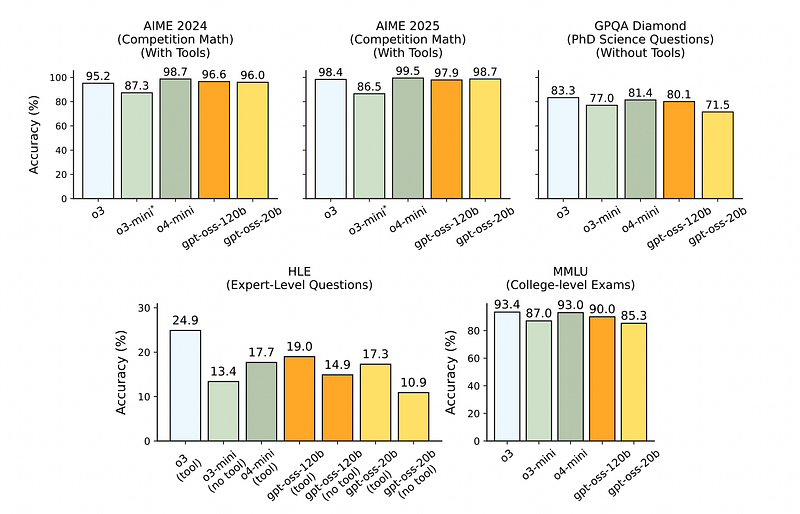
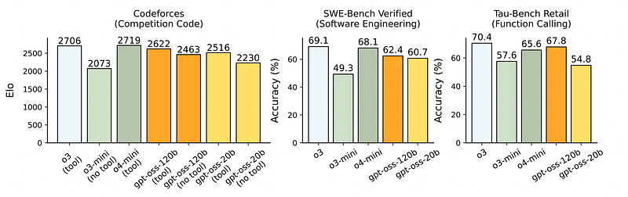
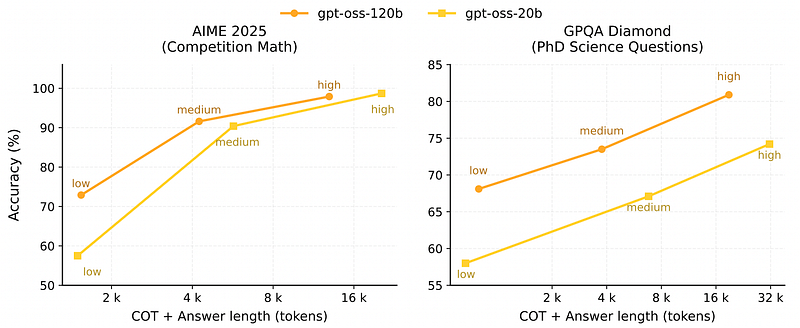
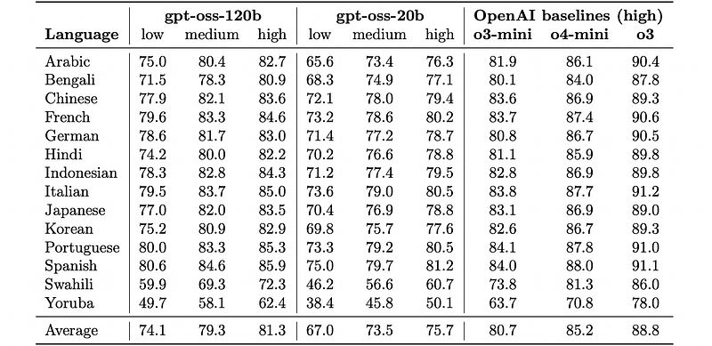
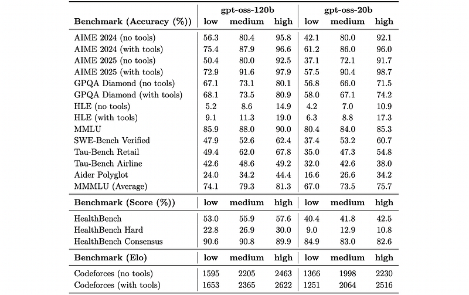
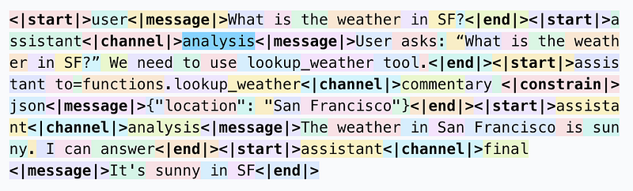
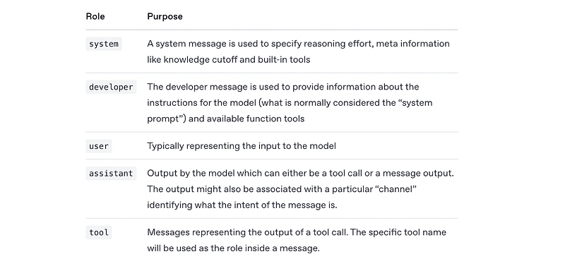
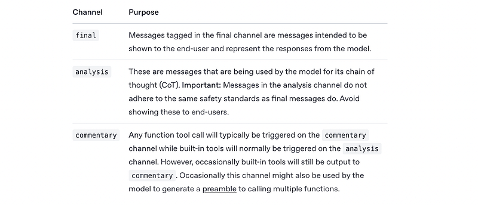
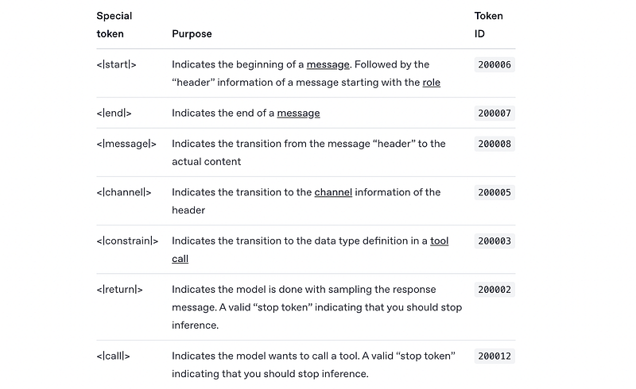

# Papers Explained 428 - gpt-oss

OpenAI’s open-weight language models, including gpt-oss-120b and gpt-oss-20b are designed for reasoning, agentic tasks. They are trained on the harmony response format and offer configurable reasoning effort (low, medium, high), full chain-of-thought access, and fine-tuning capabilities.

This page ingests the source article into the wiki and connects it to [[Papers Explained Corpus]], [[Large Language Models]], [[Mixture of Experts]], [[Reasoning Models]], [[Model Compression and Efficiency]], [[Code Models]], [[Supervised Fine-Tuning]].

A safety-reasoning variant fine-tuned from these models was later released as [[gpt-oss-safeguard]].

## Source Metadata

- Source file: `raw/2025-08-11_Papers-Explained-428--gpt-oss-e1aed3d15afe.html`
- Source title: Papers Explained 428: gpt-oss
- Published: 2025-08-11
- Canonical: [https://medium.com/@ritvik19/papers-explained-428-gpt-oss-e1aed3d15afe](https://medium.com/@ritvik19/papers-explained-428-gpt-oss-e1aed3d15afe)

## Key Ideas

- OpenAI’s open-weight language models, including gpt-oss-120b and gpt-oss-20b are designed for reasoning, agentic tasks.
- The models are available at [HuggingFace](https://huggingface.co/collections/openai/gpt-oss-68911959590a1634ba11c7a4/).
- The gpt-oss models are autoregressive Mixture-of-Experts (MoE) transformers that build upon the GPT-2 and GPT-3 architectures.
- gpt-oss-120b consists of 36 layers (116.8B total parameters and 5.1B “active” parameters per token per forward pass).
- gpt-oss-20b consists of 24 layers (20.9B total and 3.6B active parameters).

## Notes

OpenAI’s open-weight language models, including gpt-oss-120b and gpt-oss-20b are designed for reasoning, agentic tasks. They are trained on the harmony response format and offer configurable reasoning effort (low, medium, high), full chain-of-thought access, and fine-tuning capabilities. The models support agentic capabilities like function calling, web browsing, and Python code execution, and are natively quantized in MXFP4 for efficient deployment.

The models are available at [HuggingFace](https://huggingface.co/collections/openai/gpt-oss-68911959590a1634ba11c7a4/).

## Model architecture

The gpt-oss models are autoregressive Mixture-of-Experts (MoE) transformers that build upon the GPT-2 and GPT-3 architectures.

- gpt-oss-120b consists of 36 layers (116.8B total parameters and 5.1B “active” parameters per token per forward pass).

- gpt-oss-20b consists of 24 layers (20.9B total and 3.6B active parameters).

*Figure: Model parameter counts.*

Both models have a residual stream dimension of 2880, applying root mean square normalization on the activations before each attention and MoE block. Similar to GPT-2, Pre-LN placement is used.

Each MoE block consists of a fixed number of experts (128 for gpt-oss-120b and 32 for gpt-oss-20b), as well as a standard linear router projection which maps residual activations to scores for each expert. For both models, the top-4 experts for each token are selected given by the router, and the output of each expert is weighted by the softmax of the router projection over only the selected experts. The MoE blocks use the gated SwiGLU activation function.

Following GPT-3, attention blocks alternate between banded window and fully dense patterns, where the bandwidth is 128 tokens. Each layer has 64 query heads of dimension 64, and uses Grouped Query Attention (GQA) with 8 key-value heads. Rotary position embeddings are applied and the context length of dense layers is extended to 131,072 tokens using YaRN. Each attention head has a learned bias in the denominator of the softmax, similar to off-by-one attention and attention sinks, which enables the attention mechanism to pay no attention to any tokens.

## Tokenizer

Across all training stages, the o200k_harmony tokenizer is utilized. This Byte Pair Encoding (BPE) extends the o200k tokenizer used for other OpenAI models such as GPT-4o and OpenAI o4-mini with tokens explicitly used for the harmony chat format and has a total of 201,088 tokens.

## Pretraining

The models are trained on a text-only dataset with trillions of tokens, with a focus on STEM, coding, and general knowledge. To improve the safety of the model, the data is filtered for harmful content in pre-training, especially around hazardous biosecurity knowledge, by reusing the CBRN pre-training filters from GPT-4o. The model has a knowledge cutoff of June 2024.

## Post-Training

After pre-training, models are post-trained using similar CoT RL techniques as OpenAI o3. The training dataset consists of a wide range of problems from coding, math, science, and more.

For the models’ training, a custom chat format known as the [harmony chat format](#31fa) is used.

### Variable Effort Reasoning Training

Models are trained to support three reasoning levels: low, medium, and high. These levels are configured in the system prompt by inserting keywords such as “Reasoning: low”. Increasing the reasoning level will cause the model’s average CoT length to increase.

### Agentic Tool Use

During post-training, models are taught to use different agentic tools:

- A browsing tool that allows the model to call search and open functions to interact with the web. This aids factuality and allows the models to fetch info beyond their knowledge cutoff.

```text
<|start|>system<|message|>You are ChatGPT, a large language model trained by OpenAI.
Knowledge cutoff: 2024-06
Current date: 2025-06-28
Reasoning: high
# Tools
## browser
// Tool for browsing.
// The `cursor` appears in brackets before each browsing display: `[{cursor}]`.
// Cite information from the tool using the following format:
// `【{cursor}†L{line_start}(-L{line_end})?】`, for example: `【6†L9-L11】` or `【8†L3】`.
// Do not quote more than 10 words directly from the tool output.
// sources=web (default: web)
namespace browser {
// Searches for information related to `query` and displays `topn` results.
type search = (_: {
query: string,
topn?: number, // default: 10
source?: string,
}) => any;
// Opens the link `id` from the page indicated by `cursor` starting at line number `loc`, showing `num_lines` lines.
// Valid link ids are displayed with the formatting: `【{id}†.*】`.
// If `cursor` is not provided, the most recent page is implied.
// If `id` is a string, it is treated as a fully qualified URL associated with `source`.
// If `loc` is not provided, the viewport will be positioned at the beginning of the document or centered on the most relevant passage, if available.
// Use this function without `id` to scroll to a new location of an opened page.
type open = (_: {
id?: number | string, // default: -1
cursor?: number, // default: -1
loc?: number, // default: -1
num_lines?: number, // default: -1
view_source?: boolean, // default: false
source?: string,
}) => any;
// Finds exact matches of `pattern` in the current page, or the page given by `cursor`.
type find = (_: {
pattern: string,
cursor?: number, // default: -1
}) => any;
} // namespace browser
# Valid channels: analysis, commentary, final. Channel must be included for every message.<|end|>
```

- A python tool, which allows the model to run code in a stateful Jupyter notebook environment.

```text
<|start|>system<|message|>You are ChatGPT, a large language model trained by OpenAI.
Knowledge cutoff: 2024-06
Current date: 2025-06-28
Reasoning: high
# Tools
## python
Use this tool to execute Python code in your chain of thought. The code will not be shown to the user. This tool should be used for internal reasoning, but not for code that is intended to be visible to the user (e.g. when creating plots, tables, or files).
When you send a message containing Python code to python, it will be executed in a stateful Jupyter notebook environment. python will respond with the output of the execution or time out after 120.0 seconds. The drive at '/mnt/data' can be used to save and persist user files. Internet access for this session is UNKNOWN. Depends on the cluster.
# Valid channels: analysis, commentary, final. Channel must be included for every message.<|end|>
```

- Arbitrary developer functions, where one can specify function schemas in a Developer message similar to the OpenAI API. The model can interleave CoT, function calls, function responses, intermediate messages that are shown to users, and final answers.

## Quantization

The models are post-trained with quantization of the MoE weights to MXFP4 format, where weights are quantized to 4.25 bits per parameter. The MoE weights are responsible for 90+% of the total parameter count, and quantizing these to MXFP4 enables the larger model to fit on a single 80GB GPU and the smaller model to run on systems with as little as 16GB memory.

## Evaluation

*Figure: Main capabilities evaluations.*

- The gpt-oss models are strong at math in particular, which is because they can use very long CoTs effectively, e.g., gpt-oss-20b uses over 20k CoT tokens per problem on average for AIME.

- On more knowledge-related tasks such as GPQA, the gpt-oss-20b model lags behind due to its smaller size.

*Figure: Coding and tool use results.*

- The gpt-oss models have particularly strong performance on coding and tool-use tasks.

- gpt-oss-120b comes close to OpenAI’s o4-mini in performance.

- Log-linear returns are observed on most tasks where longer CoTs provide higher accuracy at a relatively large increase in final response latency and cost.

*Figure: Health performance.*

- The gpt-oss models at reasoning level high perform competitively to the best closed models, including OpenAI o3, and outperform some frontier models. In particular,

- gpt-oss-120b nearly matches OpenAI o3 performance on HealthBench and HealthBench Hard, and outperforms GPT-4o, OpenAI o1, OpenAI o3-mini, and OpenAI o4-mini by significant margins.

*Figure: MMMLU evaluation.*

- gpt-oss-120b at high reasoning comes close to OpenAI o4-mini-high in performance.

*Figure: Evaluations across multiple benchmarks and reasoning levels*

## Harmony Chat Format

The Harmony chat format, structures conversations with special tokens and roles (system, developer, user, assistant, tool) to define message types, reasoning effort, instructions, and available tools, while utilizing channels (final, analysis, commentary) to separate user-facing responses from internal reasoning and tool calls, ensuring proper model behavior and safety.

### Roles

Every message that the model processes has a role associated with it. The model knows about three types of roles:

These roles also represent the information hierarchy that the model applies in case there are any instruction conflicts: system > developer > user > assistant > tool.

### Channels

Assistant messages can be output in three different “channels”. These are being used to separate between user-facing responses and internal facing messages.

### Special Tokens

The model uses a set of special tokens to identify the structure of your input.

### Message format

The harmony response format consists of “messages” with the model potentially generating multiple messages in one go. The general structure of a message is as follows:

```text
<|start|>{header}<|message|>{content}<|end|>
```

The {header} contains a series of meta information including the role. <|end|> represents the end of a fully completed message but the model might also use other stop tokens such as <|call|> for tool calling and <|return|> to indicate the model is done with the completion.

### System message format

The system message is used to provide general information to the system. This is different to what might be considered the “system prompt” in other prompt formats. The system message is used to define:

- The identity of the model: This should always stay as You are ChatGPT, a large language model trained by OpenAI.

- Meta dates: Specifically the Knowledge cutoff: and the Current date:

- The reasoning effort: As specified on the levels high, medium, low

- Available channels: For the best performance this should map to analysis, commentary, and final.

- Built-in tools: The model has been trained on both a python and browser tool.

### Developer message format

The developer message represents what is commonly considered the “system prompt”. It contains the instructions that are provided to the model and optionally a list of function tools available for use or the output format you want the model to adhere to for structured outputs.

### Function Calling

All functions that are available to the model should be defined in the developer message in a dedicated Tools section.

To define the functions a TypeScript-like type syntax is used and the functions are wrapped into a dedicated functions namespace.

- Define every function as a type {function_name} = () => any if it does not receive any arguments

- For functions that receive an argument name the argument _ and inline the type definition

- Add comments for descriptions in the line above the field definition

- Always use any as the return type

- Keep an empty line after each function definition

- Wrap your functions into a namespace, generally functions is the namespace you should use to not conflict with other tools that the model might have been trained on.

```text
<|start|>system<|message|>You are ChatGPT, a large language model trained by OpenAI.
Knowledge cutoff: 2024-06
Current date: 2025-06-28
Reasoning: high
# Valid channels: analysis, commentary, final. Channel must be included for every message.
Calls to these tools must go to the commentary channel: 'functions'.<|end|><|start|>developer<|message|># Instructions
Use a friendly tone.
# Tools
## functions
namespace functions {
// Gets the location of the user.
type get_location = () => any;
// Gets the current weather in the provided location.
type get_current_weather = (_: {
// The city and state, e.g. San Francisco, CA
location: string,
format?: "celsius" | "fahrenheit", // default: celsius
}) => any;
// Gets the current weather in the provided list of locations.
type get_multiple_weathers = (_: {
// List of city and state, e.g. ["San Francisco, CA", "New York, NY"]
locations: string[],
format?: "celsius" | "fahrenheit", // default: celsius
}) => any;
} // namespace functions<|end|><|start|>user<|message|>What is the weather like in SF?<|end|><|start|>assistant
```

### Receiving tool calls

If the model decides to call a tool it will define a recipient in the header of the message using the format to={name}. For example, if it decides to trigger the get_current_weather function from above it would specify to=functions.get_current_weather in the header and commentary as the channel as specified in the system message. The recipient might be defined in the role or channel section of the header.

The model might also specify a <|constrain|> token to indicate the type of input for the tool call. In this case since it’s being passed in as JSON the <|constrain|> is set to json.

```text
<|channel|>analysis<|message|>Need to use function get_weather.<|end|><|start|>assistant<|channel|>commentary to=functions.get_weather <|constrain|>json<|message|>{"location":"San Francisco"}<|call|>
```

### Handling tool calls

After the function call was handled the output needs to be provided back to the model by specifying a new tool message with the output after the call message. A tool message has the following format:

```text
<|start|>{toolname} to=assistant<|channel|>commentary<|message|>{output}<|end|>
```

So in the example above

```text
<|start|>functions.get_weather to=assistant<|channel|>commentary<|message|>{"sunny": true, "temperature": 20}<|end|>
```

Once the output has been gathered for the tool calls, inference can be run with the complete content:

```text
<|start|>system<|message|>You are ChatGPT, a large language model trained by OpenAI.
Knowledge cutoff: 2024-06
Current date: 2025-06-28
Reasoning: high
# Valid channels: analysis, commentary, final. Channel must be included for every message.
Calls to these tools must go to the commentary channel: 'functions'.<|end|><|start|>developer<|message|># Instructions
Use a friendly tone.
# Tools
## functions
namespace functions {
// Gets the location of the user.
type get_location = () => any;
// Gets the current weather in the provided location.
type get_current_weather = (_: {
// The city and state, e.g. San Francisco, CA
location: string,
format?: "celsius" | "fahrenheit", // default: celsius
}) => any;
// Gets the current weather in the provided list of locations.
type get_multiple_weathers = (_: {
// List of city and state, e.g. ["San Francisco, CA", "New York, NY"]
locations: string[],
format?: "celsius" | "fahrenheit", // default: celsius
}) => any;
} // namespace functions<|end|><|start|>user<|message|>What is the weather like in SF?<|end|><|start|>assistant<|channel|>analysis<|message|>Need to use function get_weather.<|end|><|start|>assistant<|channel|>commentary to=functions.get_weather <|constrain|>json<|message|>{"location":"San Francisco"}<|call|> <|start|>functions.get_weather to=assistant<|channel|>commentary<|message|>{"sunny": true, "temperature": 20}<|end|><|start|>assistant
```

### Structured output

To control the output behavior of the model, a response format can be defined at the end of the developer message with the following structure:

```text
# Response Formats
## {format name}
// {description or context}
{schema}<|end|>
```

As an example, here’s a developer message that defines a schema for a shopping list:

```text
<|start|>developer<|message|># Instructions
You are a helpful shopping assistant
# Response Formats
## shopping_list
{"properties":{"items":{"type":"array","description":"entries on the shopping list","items":{"type":"string"}}},"type":"object"}<|end|><|start|>user<|message|>I need to buy coffee, soda and eggs<|end|><|start|>assistant
```

## Paper

[gpt-oss-120b & gpt-oss-20b Model Card](https://cdn.openai.com/pdf/419b6906-9da6-406c-a19d-1bb078ac7637/oai_gpt-oss_model_card.pdf)

[OpenAI Harmony Response Format](https://cookbook.openai.com/articles/openai-harmony#developer-message-format)

## Figures

Figures from the Medium HTML export (`raw/2025-08-11_Papers-Explained-428--gpt-oss-e1aed3d15afe.html`); local copies under `wiki/assets/papers-explained-428-gpt-oss/` when download succeeded.

| Figure | Caption |
|--------|---------|
|  | Title card: gpt-oss. |
|  | Model parameter counts. |
|  | Main capabilities evaluations. |
|  | Coding and tool use results. |
|  | The models are post-trained with quantization of the MoE weights to MXFP4 format, where weights are quantized to 4.25 bits per parameter. |
|  | Health performance. |
|  | MMMLU evaluation. |
|  | Evaluations across multiple benchmarks and reasoning levels. |
|  | The models are post-trained with quantization of the MoE weights to MXFP4 format, where weights are quantized to 4.25 bits per parameter. |
|  | Every message that the model processes has a role associated with it. The model knows about three types of roles. |
|  | Assistant messages can be output in three different “channels”. |
|  | The model uses a set of special tokens to identify the structure of your input. |
## HF Blog Cross-References

- [Welcome GPT OSS, the new open-source model family from OpenAI!](https://huggingface.co/blog/welcome-openai-gpt-oss) (2025-08-05) — Hugging Face's launch-day integration guide for the same gpt-oss-120b/20b models described above, covering Inference Providers API access, local inference (Transformers with Flash Attention 3, AMD ROCm, llama.cpp, vLLM, `transformers serve`), fine-tuning, deployment on Azure/Dell, and chat-template/tool-use walkthroughs for the harmony format.

## Related

- [[Papers Explained Corpus]]
- [[Large Language Models]]
- [[Mixture of Experts]]
- [[Reasoning Models]]
- [[Model Compression and Efficiency]]
- [[Code Models]]
- [[Supervised Fine-Tuning]]
- [[Papers Explained 427 - Paper2Poster]]
- [[Papers Explained 429 - GPT-5]]
- [[Controlling Reasoning Effort in LLMs]]
- [[Reasoning Effort]]

#summary #topic
