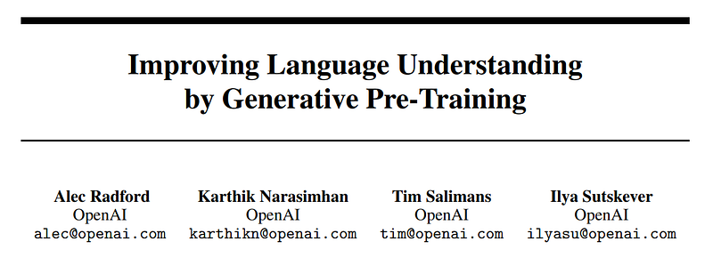
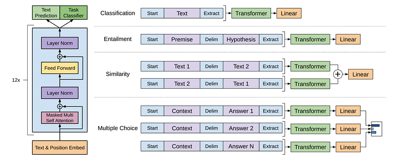
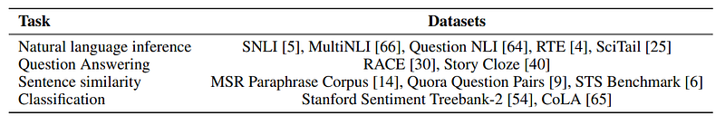
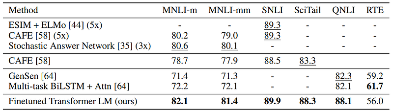
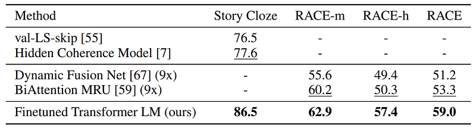
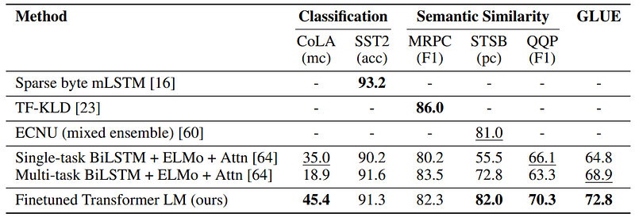

# Papers Explained 43 - GPT

GPT demonstrates that large gains on Natural language understanding tasks can be realized by generative pre-training of a language model on a diverse corpus of unlabeled text, followed by discriminative fine-tuning on each specific task.

This page ingests the source article into the wiki and connects it to [[Papers Explained Corpus]], [[Large Language Models]], [[Long Context]], [[Synthetic Data]], [[Embedding and Retrieval]], [[Supervised Fine-Tuning]].

## Source Metadata

- Source file: `raw/2023-04-24_Papers-Explained-43--GPT-30b6f1e6d226.html`
- Source title: Papers Explained 43: GPT
- Published: 2023-04-24
- Canonical: [https://medium.com/@ritvik19/papers-explained-43-gpt-30b6f1e6d226](https://medium.com/@ritvik19/papers-explained-43-gpt-30b6f1e6d226)

## Key Ideas

- The training procedure consists of two stages. The first stage is learning a high-capacity language model on a large corpus of text. This is followed by a fine-tuning stage, where we adapt the model to a discriminative task with labeled data.
- Given an unsupervised corpus of tokens U = {u1, . . . , un}, we use a standard language modeling objective to maximize the following likelihood:
- where k is the size of the context window, and the conditional probability P is modeled using a neural network with parameters Θ.
- After pre-training the model, we adapt the parameters to the supervised target task. We assume a labeled dataset C, where each instance consists of a sequence of input tokens, x 1 , . . . , xm, along with a label y.
- This gives us the following objective to maximize:

## Notes

GPT demonstrates that large gains on Natural language understanding tasks can be realized by generative pre-training of a language model on a diverse corpus of unlabeled text, followed by discriminative fine-tuning on each specific task. In contrast to previous approaches, we make use of task-aware input transformations during fine-tuning to achieve effective transfer while requiring minimal changes to the model architecture.

*Figure: (left) Transformer architecture and training objectives used in this work. (right) Input transformations for fine-tuning on different tasks. We convert all structured inputs into token sequences to be processed by our pre-trained model, followed by a linear+softmax layer.*

## Framework

The training procedure consists of two stages. The first stage is learning a high-capacity language model on a large corpus of text. This is followed by a fine-tuning stage, where we adapt the model to a discriminative task with labeled data.

### Unsupervised pre-training

Given an unsupervised corpus of tokens U = {u1, . . . , un}, we use a standard language modeling objective to maximize the following likelihood:

where k is the size of the context window, and the conditional probability P is modeled using a neural network with parameters Θ.

### Supervised fine-tuning

After pre-training the model, we adapt the parameters to the supervised target task. We assume a labeled dataset C, where each instance consists of a sequence of input tokens, x 1 , . . . , xm, along with a label y. The inputs are passed through our pre-trained model to obtain the final transformer block’s activation h m l , which is then fed into an added linear output layer with parameters Wy to predict y:

This gives us the following objective to maximize:

We additionally found that including language modeling as an auxiliary objective to the fine-tuning helped learning by (a) improving generalization of the supervised model, and (b) accelerating convergence. Specifically, we optimize the following objective (with weight λ):

Overall, the only extra parameters we require during fine-tuning are Wy, and embeddings for delimiter tokens.

## Task-specific input transformations

In our experiments, we use a multi-layer Transformer decoder. For some tasks, like text classification, we can directly fine-tune our model as described above. Certain other tasks, like question answering or textual entailment, have structured inputs such as ordered sentence pairs, or triplets of document, question, and answers. Since our pre-trained model was trained on contiguous sequences of text, we require some modifications to apply it to these tasks.

- Textual entailment For entailment tasks, we concatenate the premise p and hypothesis h token sequences, with a delimiter token ($) in between.

- Similarity For similarity tasks, there is no inherent ordering of the two sentences being compared. To reflect this, we modify the input sequence to contain both possible sentence orderings (with a delimiter in between) and process each independently to produce two sequence representations h m l which are added element-wise before being fed into the linear output layer.

- Question Answering and Commonsense Reasoning For these tasks, we are given a context document z, a question q, and a set of possible answers {ak}. We concatenate the document context and question with each possible answer, adding a delimiter token in between to get [z; q; $; ak]. Each of these sequences is processed independently with our model and then normalized via a softmax layer to produce an output distribution over possible answers.

## Experiment Setup

*Figure: A list of the different tasks and datasets used in our experiments*

### Unsupervised pre-training

We use the BooksCorpus dataset for training the language model. It contains over 7,000 unique unpublished books from a variety of genres including Adventure, Fantasy, and Romance. Crucially, it contains long stretches of contiguous text, which allows the generative model to learn to condition on long-range information.

### Model specifications

Our model largely follows the original transformer work. We trained a 12-layer decoder-only transformer with masked self-attention heads (768 dimensional states and 12 attention heads). For the position-wise feed-forward networks, we used 3072 dimensional inner states.

## Supervised fine-tuning Results

*Figure: Experimental results on natural language inference tasks, comparing our model with current state-of-the-art methods. 5x indicates an ensemble of 5 models. All datasets use accuracy as the evaluation metric.*

*Figure: Results on question answering and commonsense reasoning, comparing our model with current state-of-the-art methods.. 9x means an ensemble of 9 models.*

*Figure: Semantic similarity and classification results, comparing our model with current state-of-theart methods. All task evaluations in this table were done using the GLUE benchmark. (mc= Mathews correlation, acc=Accuracy, pc=Pearson correlation)*

## Paper

[Improving Language Understanding by Generative Pre-Training](https://s3-us-west-2.amazonaws.com/openai-assets/research-covers/language-unsupervised/language_understanding_paper.pdf)

## Figures

Figures from the Medium HTML export (`raw/2023-04-24_Papers-Explained-43--GPT-30b6f1e6d226.html`); local copies under `wiki/assets/papers-explained-43-gpt/` when download succeeded.

| Figure | Caption |
|--------|---------|
|  | Title card: GPT. |
|  | (left) Transformer architecture and training objectives used in this work. (right) Input transformations for fine-tuning on different tasks. We convert all structured inputs into token sequences to be processed by our pre-trained model, followed by a linear+softmax layer. |
|  | Given an unsupervised corpus of tokens U = {u1,..., un}, we use a standard language modeling objective to maximize the following likelihood. |
|  | This gives us the following objective to maximize. |
|  | This gives us the following objective to maximize. |
|  | This gives us the following objective to maximize:: Overall, the only extra parameters we require during fine-tuning are Wy, and embeddings for delimiter tokens. |
|  | A list of the different tasks and datasets used in our experiments. |
|  | Experimental results on natural language inference tasks, comparing our model with current state-of-the-art methods. 5x indicates an ensemble of 5 models. All datasets use accuracy as the evaluation metric. |
|  | Results on question answering and commonsense reasoning, comparing our model with current state-of-the-art methods.. 9x means an ensemble of 9 models. |
|  | Semantic similarity and classification results, comparing our model with current state-of-theart methods. All task evaluations in this table were done using the GLUE benchmark. (mc= Mathews correlation, acc=Accuracy, pc=Pearson correlation). |
## Related

- [[Papers Explained Corpus]]
- [[Large Language Models]]
- [[Long Context]]
- [[Synthetic Data]]
- [[Embedding and Retrieval]]
- [[Supervised Fine-Tuning]]
- [[Papers Explained 42 - UDOP]]
- [[Papers Explained 44 - T5]]

#summary #topic
