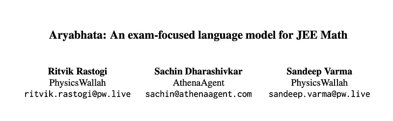
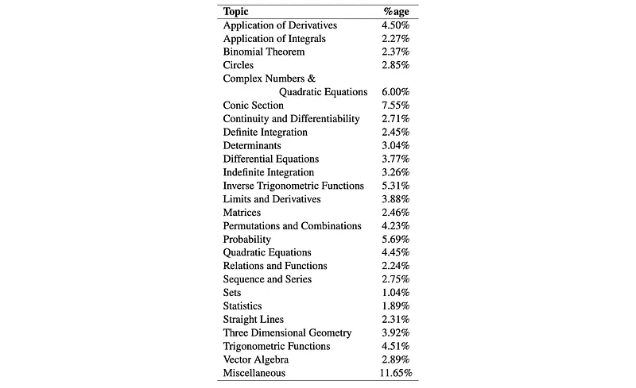
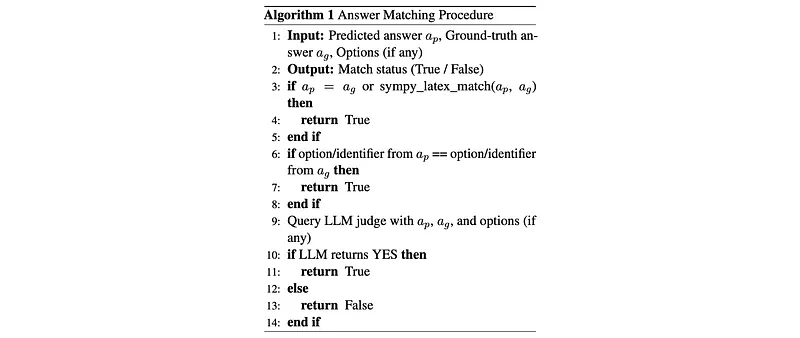
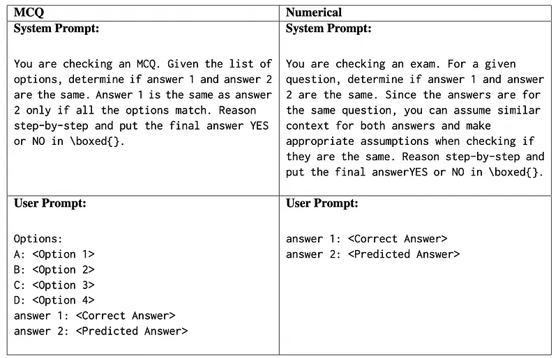
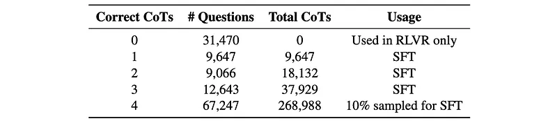
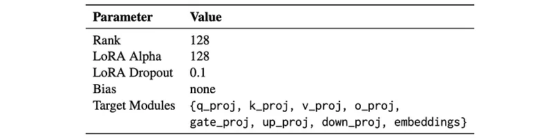
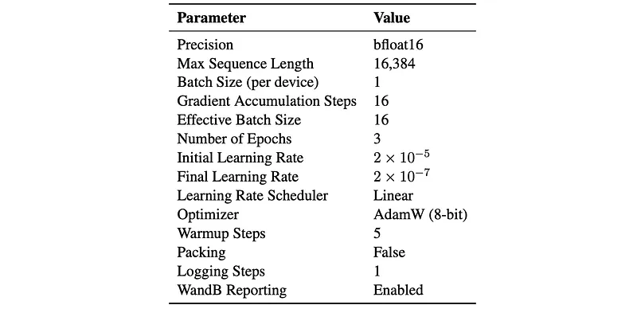
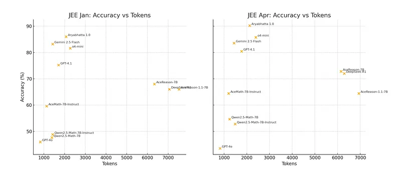
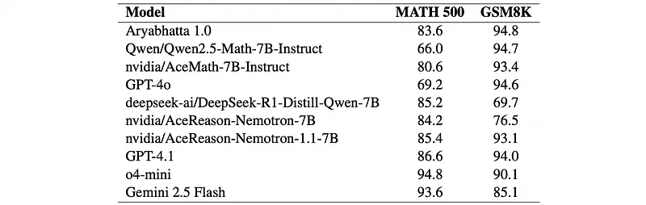

# Papers Explained 433 - Aryabhata 1.0

Aryabhata 1.0 is a 7B parameter math reasoning model optimized for the Indian Joint Entrance Examination (JEE). It achieves an accuracy of 86.0% on the January session and 90.2% on the April session of JEE 2025.

This page ingests the source article into the wiki and connects it to [[Papers Explained Corpus]], [[Reasoning Models]], [[Large Language Models]], [[Safety and Alignment]], [[Model Compression and Efficiency]], [[Mixture of Experts]], [[Supervised Fine-Tuning]].

## Source Metadata

- Source file: `raw/2025-08-18_Papers-Explained-433--Aryabhata-1-0-302d2eb383cc.md`
- Source title: Papers Explained 433: Aryabhata 1.0
- Published: 2025-08-18
- Canonical: [https://medium.com/@ritvik19/papers-explained-433-aryabhata-1-0-302d2eb383cc](https://medium.com/@ritvik19/papers-explained-433-aryabhata-1-0-302d2eb383cc)

## Key Ideas

- To combine the advantages of System 1 (fluent, low-latency answers) and System 2 (deliberate, self-correcting reasoning) models, while addressing inefficiencies like verbose CoT traces.
- Qwen2.5-Math-7B-Instruct: A strong open-source mathematical LLM providing baseline capabilities and math fluency.
- AceMath-7B-Instruct: A version of Qwen 2.5 Math fine-tuned by NVIDIA for enhanced accuracy on mathematical benchmarks.
- DeepSeek-R1-Distill-Qwen-7B: A long-form reasoning model derived by fine-tuning Qwen 2.5 Math on reasoning traces distilled from DeepSeek R1.
- Linear merging is applied using the MergeKit framework. The merged parameters (θmerged) are computed as a weighted sum of the individual model parameters (θ1, θ2, θ3 for Qwen, Ace, and DeepSeek respectively):

## Notes

Aryabhata 1.0 is a 7B parameter math reasoning model optimized for the Indian Joint Entrance Examination (JEE). It achieves an accuracy of 86.0% on the January session and 90.2% on the April session of JEE 2025. Compared to both open-weight and proprietary models, Aryabhata outperforms all baselines in accuracy while remaining competitive in inference cost.

## Model Merging

To combine the advantages of System 1 (fluent, low-latency answers) and System 2 (deliberate, self-correcting reasoning) models, while addressing inefficiencies like verbose CoT traces. Three distinct LLMs sharing the same base architecture (Qwen 2.5 Math) are selected:

- Qwen2.5-Math-7B-Instruct: A strong open-source mathematical LLM providing baseline capabilities and math fluency.

- AceMath-7B-Instruct: A version of Qwen 2.5 Math fine-tuned by NVIDIA for enhanced accuracy on mathematical benchmarks.

- DeepSeek-R1-Distill-Qwen-7B: A long-form reasoning model derived by fine-tuning Qwen 2.5 Math on reasoning traces distilled from DeepSeek R1.

Linear merging is applied using the MergeKit framework. The merged parameters (θmerged) are computed as a weighted sum of the individual model parameters (θ1, θ2, θ3 for Qwen, Ace, and DeepSeek respectively):

Weights (α, β, γ) are empirically selected based on held-out math reasoning tasks, aiming to favor quick solutions for simpler problems and methodical, multi-step analysis for complex ones.

## Data Curation

A proprietary corpus consisting of approximately 250,000 raw questions curated by subject matter experts and educators at PhysicsWallah, ensuring alignment with Indian Joint Entrance Examination (JEE) standards is used.

To ensure syntactic coherence and semantic relevance, the following steps are applied:

- Removed diagram-based questions, as current text-only models do not support multimodal reasoning.

- Filtered out non-English or poorly formatted questions.

- Stripped all answer options to frame the task as open-ended generation rather than classification.

- Removed questions that relied on options to be answered (e.g., “which of the following is true”).

A structured prompt was designed and used with OpenAI o4-mini to extract the core question, normalize the answer format, identify dependencies, and detect the question language.

This excercise yielded a clean dataset of around 130,000 questions suitable for Chain-of-Thought (CoT) generation.

*Figure: Topic-wise Question Distribution.*

## Rejection Sampling and Supervised Fine-Tuning with Curriculum Learning

Best-of-4 rejection sampling is employed using the merged model. For each curated question (x), four CoT responses ({y1, y2, y3, y4}) are sampled. Only those completions whose final answer matched the known correct answer (GT(x)) are selected.

*Figure: Prompts used for Answer Matching.*

Approximately 350,000 verified CoTs across around 100,000 questions are obtained and sampled to serve as the core training corpus for SFT. Cases where none of the four generations are correct (0/4) are retained for downstream (RLVR) to improve coverage and robustness in challenging problem spaces.

*Figure: Chain-of-Thought generation outcomes from best-of-4 sampling.*

Questions are grouped based on how many of the four generations led to correct answers (e.g., 4/4, 3/4, 2/4, 1/4 correct). Supervised fine-tuning begins with easier samples (e.g., 4/4 correct) and gradually introduces harder examples, stabilizing early learning and improving generalization using LoRA.

*Figure: PEFT configuration using LoRA.*

*Figure: Training configuration used for supervised fine-tuning.*

## Reinforcement Learning with Verifiable Rewards

The RLVR methodology extends the original RLVR by integrating group-based advantage estimation within an Advantage Actor-Critic (A2C) framework.

Specifically it optimizes an A2C objective with group-relative advantage estimation, defined as:

This objective is optimized over G sampled response sequences (α_i), applying length-normalized gradients weighted by sequence-level advantages (A~i) computed through group-relative advantage estimation.

A simple binary reward structure is employed to provide unambiguous feedback for mathematical reasoning tasks:

The advantage function is computed using group-relative normalization:

Several adaptive exploration strategies are incorporated:

Adaptive Group Sizing:

Unlike standard GRPO implementations with fixed group sizes, group size is dynamically adjusted based on problem difficulty. Starting with 8 for simpler problems, scales up to 64 for harder problems.

This adaptive scaling improves sampling diversity and advantage estimation stability for challenging problems while efficiently allocating computational resources.

Progressive Temperature Scaling

The sampling temperature is continuously increased from 0.6 to 1.0 to balance exploitation and exploration:

- Initial Phase (Low Temperature: 0.6): Promotes training stability through conservative sampling.

- Progressive Increase: Temperature gradually rises, encouraging more diverse solution exploration.

- Final Phase (High Temperature: 1.0): Enables much more exploration of the action space compared to lower temperatures.

Curriculum-Based Sampling

Training samples are filtered to focus on an optimal difficulty range, removing both trivial and intractable problems:

- Too Easy Problems: Provide minimal learning signal due to high success rates.

- Too Hard Problems: Introduce noise through consistently low performance.

The filtering uses a difficulty assessment function:

This curriculum approach concentrates computational resources on problems that maximize learning progress.

The model operates within a maximum context length of 4,096 tokens, providing sufficient capacity for complex multi-step mathematical reasoning while maintaining computational tractability.

## Evaluation

Model-generated solutions are evaluated using pass@1 accuracy, with solutions generated via greedy decoding (temperature = 0).

*Figure: Accuracy vs. Tokens for JEE Jan and JEE Apr.*

In-distribution performance: Aryabhata 1.0 achieved high accuracy on the JEE Main 2025 exam, with 86.0% on the January session and 90.2% on the April session, while maintaining token efficiency (approximately ~2K tokens per response).

*Figure: Performance comparison on MATH 500 and GSM8K benchmarks.*

Out-of-distribution generalization: Aryabhata demonstrated competitive generalization to unseen tasks (MATH 500 and GSM8K), outperforming its base models on both benchmarks.

## Paper

Aryabhata: An exam-focused language model for JEE Math [2508.08665](https://arxiv.org/abs/2508.08665)

## Figures

Figures from the Medium HTML export (`raw/2025-08-18_Papers-Explained-433--Aryabhata-1-0-302d2eb383cc.md`); local copies under `wiki/assets/papers-explained-433-aryabhata-1-0/` when download succeeded.

| Figure | Caption |
|--------|---------|
|  | Title card: Aryabhata 1.0. |
|  | Linear merging is applied using the MergeKit framework. |
|  | Topic-wise Question Distribution. |
|  | Best-of-4 rejection sampling is employed using the merged model. |
|  | Prompts used for Answer Matching. |
|  | Chain-of-Thought generation outcomes from best-of-4 sampling. |
|  | PEFT configuration using LoRA. |
|  | Training configuration used for supervised fine-tuning. |
|  | Specifically it optimizes an A2C objective with group-relative advantage estimation, defined as. |
|  | A simple binary reward structure is employed to provide unambiguous feedback for mathematical reasoning tasks. |
|  | The advantage function is computed using group-relative normalization. |
|  | The filtering uses a difficulty assessment function. |
|  | Accuracy vs. Tokens for JEE Jan and JEE Apr. |
|  | Performance comparison on MATH 500 and GSM8K benchmarks. |
## Related

- [[Papers Explained Corpus]]
- [[Reasoning Models]]
- [[Large Language Models]]
- [[Safety and Alignment]]
- [[Model Compression and Efficiency]]
- [[Mixture of Experts]]
- [[Supervised Fine-Tuning]]
- [[Papers Explained - GloVe 2024]]
- [[Papers Explained 434 - Voxtral]]

#summary #topic
