# Papers Explained 434 - Voxtral

Voxtral Mini and Voxtral Small are multimodal audio chat models trained to comprehend both spoken audio and text documents. These models were pretrained on a large-scale corpus of audio and text documents and subsequently instruction tuned on real and synthetic data.

This page ingests the source article into the wiki and connects it to [[Papers Explained Corpus]], [[Audio Models]], [[Synthetic Data]], [[Model Compression and Efficiency]], [[Vision Language Models]], [[Long Context]].

## Source Metadata

- Source file: `raw/2025-08-19_Papers-Explained-434--Voxtral-d178cdc242ca.md`
- Source title: Papers Explained 434: Voxtral
- Published: 2025-08-19
- Canonical: [https://medium.com/@ritvik19/papers-explained-434-voxtral-d178cdc242ca](https://medium.com/@ritvik19/papers-explained-434-voxtral-d178cdc242ca)

## Key Ideas

- Voxtral Mini and Voxtral Small are multimodal audio chat models trained to comprehend both spoken audio and text documents.
- The models are available on HuggingFace: [Mini](https://huggingface.co/mistralai/Voxtral-Mini-3B-2507), [Small](https://huggingface.co/mistralai/Voxtral-Small-24B-2507).
- Voxtral is based on the Transformer architecture, consisting of three components:
- An audio encoder to process speech inputs
- An adapter layer to downsample audio embeddings

## Notes

Voxtral Mini and Voxtral Small are multimodal audio chat models trained to comprehend both spoken audio and text documents. These models were pretrained on a large-scale corpus of audio and text documents and subsequently instruction tuned on real and synthetic data. With a 32K token context window, Voxtral is capable of processing audio files up to 40 minutes long.

The models are available on HuggingFace: [Mini](https://huggingface.co/mistralai/Voxtral-Mini-3B-2507), [Small](https://huggingface.co/mistralai/Voxtral-Small-24B-2507).

## Modeling

*Figure: Voxtral Architecture.*

Voxtral is based on the Transformer architecture, consisting of three components:

- An audio encoder to process speech inputs

- An adapter layer to downsample audio embeddings

- A language decoder to reason and generate text outputs.

### Audio Encoder

The audio encoder is based on Whisper large-v3. A raw audio waveform is first mapped to a log-Mel spectrogram with 128 Mel-bins and 160 hop-length.

Within the Whisper encoder, the spectrogram passes through a convolutional stem. This stem downsamples the temporal resolution by a factor of two. After the stem, it is fed into a stack of bidirectional self-attention layers. The resulting audio embeddings have a frame rate of 50 Hz.

Whisper has a fixed receptive field of 30 seconds. To accommodate audio sequences longer than 30 seconds, the log-Mel spectrogram is computed for the entire audio. The encoder then independently processes each 30-second chunk of the audio. Absolute positional encodings are reset for each chunk. Chunks from the same audio are partitioned into a batch axis. This approach is functionally equivalent to chunk-wise attention, which helps mitigate computational overhead for longer inputs and enhances length generalization. The embeddings computed from each chunk are concatenated at the output stage to form a unified representation of the complete audio sequence.

Due to Whisper’s fixed receptive field, it pads short audio to 30 seconds. Attempts to remove this padding requirement to allow continuous audio lengths resulted in a decline in performance, even with encoder tuning. Consequently, the practice of padding all audio inputs to the next multiple of 30 seconds is maintained.

### Adapter Layer

The high frame-rate of the audio encoder would result in long sequence-lengths through the language decoder. For example, a 30 minute audio at 50Hz has a sequence length of 90k tokens, leading to high memory and slow inference. To circumvent this, an additional MLP layer is appended at the audio encoder outputs that is responsible for downsampling the audio embeddings. A downsampling factor of 4x yields the best trade-off between sequence-length and performance. This results in an effective frame-rate of 12.5Hz, enabling Voxtral to gracefully handle audios up to 40 minutes with a context-length of 32k tokens.

### Language Decoder

Voxtral Mini is built on top of Ministral 3B, an edge-focused model that delivers competitive performance with a small memory footprint.

Voxtral Small leverages the Mistral Small 3.1 24B backbone, giving strong performance across a range of knowledge and reasoning tasks.

*Figure: Parameter Counts.*

## Methodology

### Pretraining

The pretraining stage of Voxtral is designed to introduce speech to the language decoder, complementary to the existing modality of text. Given an audio dataset with text transcriptions, audio is first chunked into short segments together with their corresponding transcription, forming parallel audio-text pairs: (A1, T1), (A2, T2), . . . , (AN , TN ). The segmentation boundaries are defined by upstream voice activity detection and diarization models. If transcripts are unavailable, audio is pseudo-labeled with an ASR model.

Two patterns combine audio and text into training samples for the model:

- The audio-to-text repetition pattern is defined as an audio segment An followed by the corresponding transcription Tn. A training sample consists of a single audio-text pair (An, Tn). This formulation mimics speech recognition and is used to explicitly teach the model speech-to-text alignment.

- The cross-modal continuation pattern is designed to implicitly align the speech and text modalities through modality-invariant context modeling. Specifically, for each audio segment An, the corresponding text is the proceeding text segment in the sequence Tn+1. In addition, a training sample is composed by interleaving audio and text for multiple consecutive segments: (A1, T2, A3, T4, . . . , AN−1, TN ). This structure resembles tasks like QA or conversation, where the model must maintain discourse continuity across modalities.

*Figure: Pretraining patterns.*

Since two different data patterns are used, the proceeding text segment for a given audio segment is ambiguous; both repeat and continuation are valid. To eliminate ambiguity, two special tokens are introduced to specify the expected output: <repeat> for repetition and <next> for continuation. These tokens are used for pattern indication during training and as part of the prompt during inference to control model behavior. Each audio-transcription pair is treated as a standalone sequence wrapped with / without previous context.

During pretraining, the two patterns are balanced evenly. This balanced approach is essential:

- The audio-to-text repetition pattern drives transcription performance.

- The cross-modal continuation pattern prepares the model for speech understanding tasks that require deeper reasoning and context integration, such as audio-based QA or dialogue.

To preserve text capabilities, text pretraining data is also included in the data mixture.

For the first pass over the data mixture, the audio encoder and language decoder are frozen, training only the adapter. This warm-up stage was found beneficial for speech understanding evaluations, whereas speech recognition results are similar with and without warm-up.

One pretraining run is also performed on the Mini scale with just the audio-to-text repetition pattern. This model is called Voxtral Mini Transcribe.

### Supervised Finetuning

Speech understanding data used in this phase falls into two main categories:

- Tasks where audio is provided as context and the assistant responds to text queries.

- Tasks where the assistant responds directly to audio inputs.

Audio Context, Text Query

The data is primarily synthetic and created as follows:

- Long-form audio data (up to approximately 40 minutes) with corresponding transcripts and language identification metadata.

- Transcripts are paired with tailored prompts.

- These are fed into an LLM (Mistral Large).

- The LLM generates question-answer pairs related to the audio content.

- Prompts explicitly instruct the LLM to frame both questions and answers as if they arise from auditory comprehension, not text analysis, to encourage natural responses from the audio model.

- Question types are varied, including factual inquiries, “needle-in-haystack” retrieval tasks, and reasoning-intensive problems.

- To minimize repetitive question styles, the LLM generates multiple candidate Q&A pairs per audio segment, from which only one is sampled for the dataset.

- While Q&A pairs typically match the original audio/transcript language, Mistral Large is occasionally instructed to produce pairs in different languages to enable cross-lingual QA.

- A portion of long-form audio data is also allocated for synthetic summarization and translation tasks. For translation, language identification metadata is used to select a target language different from the original audio.

- To mitigate overfitting to a narrow range of user message patterns, a large, manually curated set of plausible user requests is sampled.

Audio-Only Input

- Existing text supervised finetuning data, including function calling datasets, are adapted by converting text user messages into synthetic audio using a text-to-speech (TTS) model.

- Sole reliance on TTS-generated audio leads to poor generalization to genuine human speech, especially accented voices, often resulting in erroneous transcription rather than appropriate continuation.

- Questions are extracted from long-form ASR data that can be answered using general world knowledge (requiring no additional audio context).

- Audio excerpts containing these questions are isolated.

- Corresponding text answers are generated using Mistral Large.

- This process yields datasets consisting of genuine human speech questions paired with text answers.

- A dedicated “transcribe mode” is introduced, signaled via a new special token. This mode explicitly instructs the model to perform transcription tasks, eliminating the need for a text prompt.

### Preference Alignment

DPO and Online DPO are applied to both Voxtral Mini and Small. For each example, two candidate responses are sampled from the current policy with a temperature of T=0.5. To rank responses, the entire conversation is taken, the audio is replaced with its transcription, and a text-based reward model is leveraged. Although the reward model only has access to the audio transcription — rather than the raw audio itself — it is able to capture semantics, style, and factual coherence from this information, attributes that transfer to the generated text response. The Online DPO implementation utilizes the sampling and reward infrastructure that powered the Magistral series.

## Evaluation

### Speech Recognition

*Figure: Speech Recognition Benchmarks.*

- Voxtral Small achieves state-of-the-art transcription results on English Short-Form and MCV, outperforming all open and closed-source models. Voxtral Mini Transcribe performs competitively with larger closed-source models, surpassing GPT-4o mini Transcribe and Gemini 2.5 Flash across all tasks.

### Speech Translation

*Figure: FLEURS Translation.*

- Voxtral Small achieves state-of-the-art translation scores on the FLEURS Speech Translation benchmark for every source/target language combination.

### Speech Understanding

*Figure: Speech Understanding Benchmarks.*

- Voxtral Small performs competitively with closed-source models on Speech QA benchmarks, surpassing GPT-4o mini Audio on three of the seven tasks.

### Text Benchmarks

*Figure: Text-Only Benchmarks.*

- Voxtral Small maintains performance across text benchmarks, performing comparably to Mistral Small 3.1.

## Analysis

### To Pad or Not To Pad

*Figure: Effect of Padding.*

- Disabling padding resulted in almost no penalty on FLEURS English ASR but a 0.5% WER degradation on FLEURS French.

- Speech understanding (Llama QA) remained comparable with or without padding.

- Conclusion: To achieve optimal ASR scores without compromising speech understanding, maintaining padding in the audio encoder is preferred.

### Adapter Downsampling

*Figure: : Effect of Downsampling.*

- Frame-rates of 25 Hz and 12.5 Hz showed minimal degradation on ASR benchmarks.

- A 6.25 Hz frame-rate incurred over 1% WER penalty on FLEURS French.

- Notably, 12.5 Hz surpassed the 50 Hz baseline on Llama QA by 1.5%, suggesting superior speech understanding performance, hypothesized to be due to similar information density between audio and text embeddings at this rate.

- Conclusion: 12.5 Hz was selected as the optimal frame-rate for Voxtral, balancing sequence-length, ASR, and speech-understanding performance.

### Pre-Training Patterns

*Figure: Pattern Proportions.*

- Using only the audio-to-text repetition pattern yielded strong ASR performance but nearly zero performance on Llama QA.

- Conversely, training solely on the cross-modal continuation pattern resulted in strong Llama QA performance but a high WER (nearly 60%) on ASR.

- Balancing the two tasks with equal ratios achieved ASR and Llama QA performance comparable to runs with a single pattern.

- Conclusion: Sampling each pre-training pattern with equal probability is optimal for achieving balanced ASR and speech understanding performance.

### DPO and Online DPO

*Figure: Response Improvements with Online DPO.*

- Voxtral Mini: Both DPO and Online DPO improved response quality metrics (LLM Judge, Grade) relative to the SFT baseline. Qualitative inspection indicated the Online DPO variant delivered crisper grounding, fewer hallucinations, and more helpful responses.

- Voxtral Mini Conclusion: The Voxtral Mini Online DPO variant is being released as the public checkpoint due to its superior performance.

- Voxtral Small: DPO and Online DPO showed substantial gains in response quality on the SU Benchmark, but these were accompanied by a slight regression on English short-form ASR benchmarks.

- Voxtral Small Conclusion: The default checkpoint for Voxtral Small remains the SFT model due to the ASR regression. An Online DPO Voxtral Small model without ASR regression is planned for future release.

## Paper

Voxtral [2507.13264](https://arxiv.org/abs/2507.13264)

## Figures

Figures from the Medium HTML export (`raw/2025-08-19_Papers-Explained-434--Voxtral-d178cdc242ca.md`); local copies under `wiki/assets/papers-explained-434-voxtral/` when download succeeded.

| Figure | Caption |
|--------|---------|
|  | Title card: Voxtral. |
| 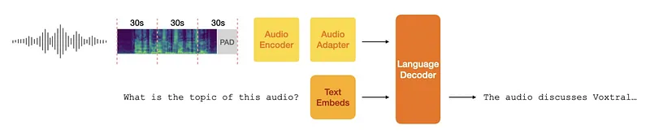 | Voxtral Architecture. |
| 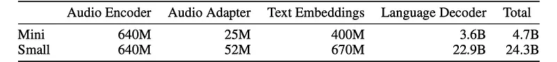 | Parameter Counts. |
| 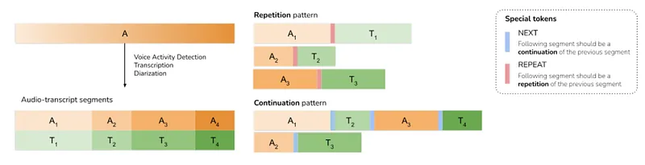 | Pretraining patterns. |
| 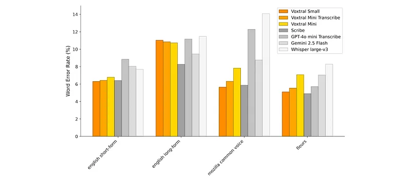 | Speech Recognition Benchmarks. |
| 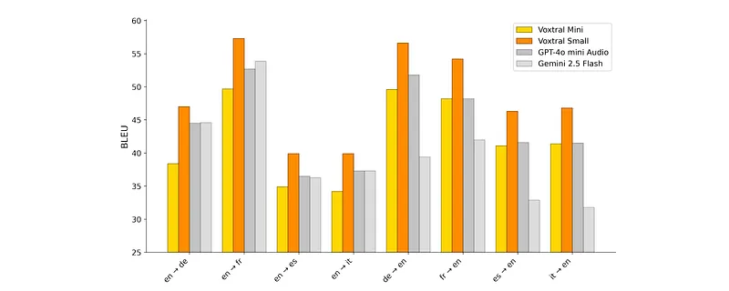 | FLEURS Translation. |
| 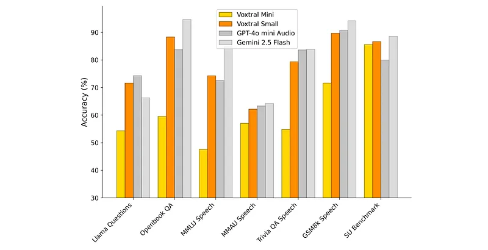 | Speech Understanding Benchmarks. |
| 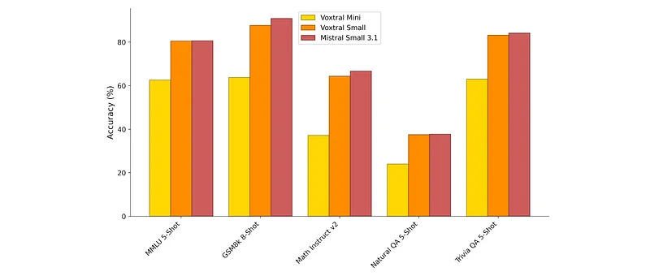 | Text-Only Benchmarks. |
| 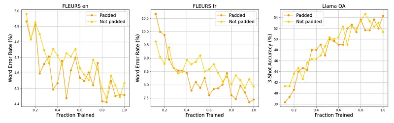 | Effect of Padding. |
| 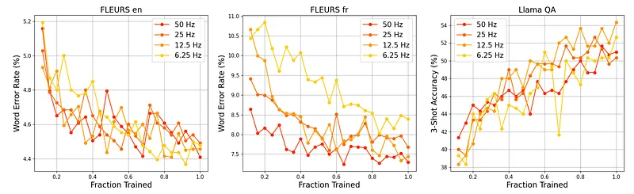 | Effect of Downsampling. |
| 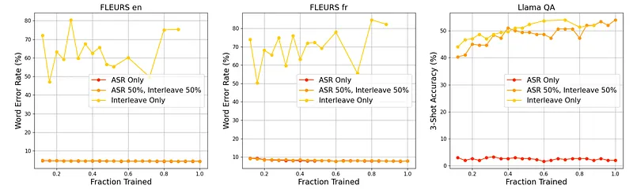 | Pattern Proportions. |
| 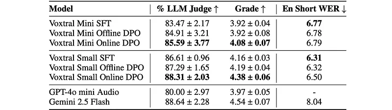 | Response Improvements with Online DPO. |
## Related

- [[Voxtral]] — official Mistral AI Voxtral speech understanding launch blog.
- [[Papers Explained Corpus]]
- [[Audio Models]]
- [[Synthetic Data]]
- [[Model Compression and Efficiency]]
- [[Vision Language Models]]
- [[Long Context]]
- [[Papers Explained 433 - Aryabhata 1.0]]
- [[Papers Explained 435 - MegaScience]]

#summary #topic
