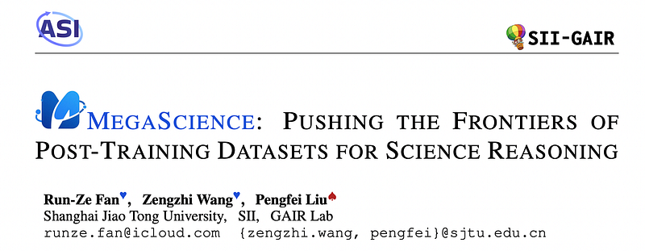
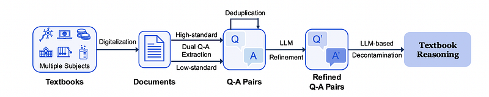
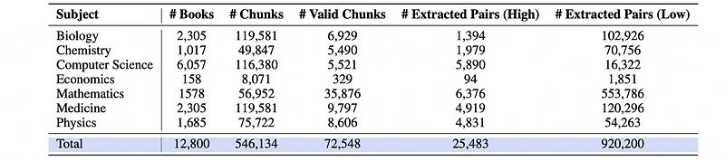
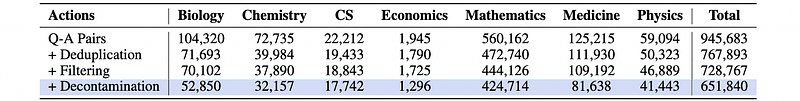
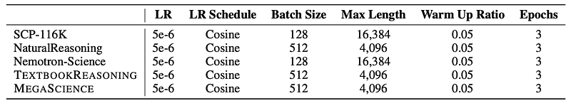
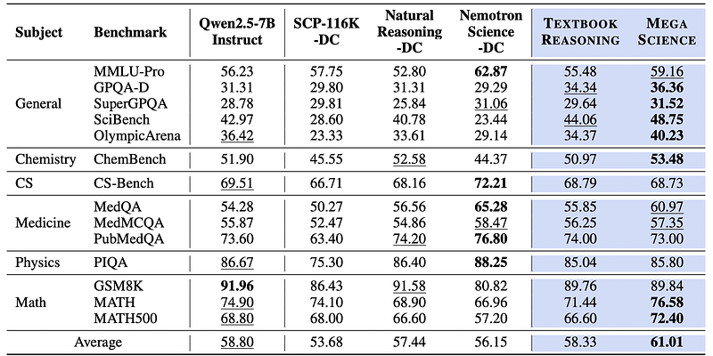
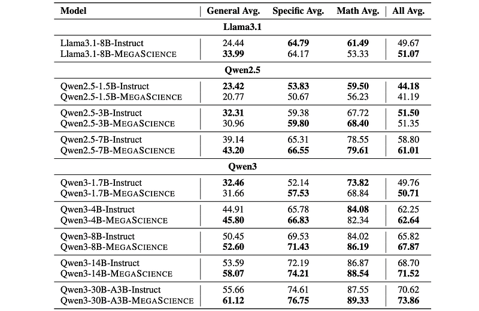

# Papers Explained 435 - MegaScience

The open-source community has primarily focused on mathematics and coding while neglecting the scientific domain, largely due to the absence of open, large-scale, high-quality, verifiable scientific reasoning datasets.

This page ingests the source article into the wiki and connects it to [[Papers Explained Corpus]], [[Synthetic Data]], [[Reasoning Models]], [[Evaluation and Benchmarks]], [[Document AI]], [[Code Models]], [[Verifier-Bounded Learning]].

## Source Metadata

- Source file: `raw/2025-08-20_Papers-Explained-435--MegaScience-ffe3fe3a8040.html`
- Source title: Papers Explained 435: MegaScience
- Published: 2025-08-20
- Canonical: [https://medium.com/@ritvik19/papers-explained-435-megascience-ffe3fe3a8040](https://medium.com/@ritvik19/papers-explained-435-megascience-ffe3fe3a8040)

## Key Ideas

- To bridge this gap, TextBookReasoning, an open dataset featuring truthful reference answers extracted from 12k university-level scientific textbooks, comprising 650k reasoning questions spanning 7 scientific disciplines, is presented.
- MegaScience, a large-scale mixture of high-quality open-source datasets totaling 1.25 million instances, is also introduced.
- A comprehensive evaluation system covering diverse subjects and question types across 15 benchmarks, incorporating comprehensive answer extraction strategies to ensure accurate evaluation metrics, is built.
- All the artifacts are available on [HuggingFace](https://huggingface.co/MegaScience/).
- A large corpus of books was collected by crawling PDF documents from the web. Llama3.3–70B-Instruct was then employed to automatically classify each book’s subject area and academic level.

## Notes

The open-source community has primarily focused on mathematics and coding while neglecting the scientific domain, largely due to the absence of open, large-scale, high-quality, verifiable scientific reasoning datasets.

To bridge this gap, TextBookReasoning, an open dataset featuring truthful reference answers extracted from 12k university-level scientific textbooks, comprising 650k reasoning questions spanning 7 scientific disciplines, is presented.

MegaScience, a large-scale mixture of high-quality open-source datasets totaling 1.25 million instances, is also introduced. MegaScience was developed through systematic ablation studies that evaluate various data selection methodologies to identify the optimal subset for each publicly available scientific dataset.

A comprehensive evaluation system covering diverse subjects and question types across 15 benchmarks, incorporating comprehensive answer extraction strategies to ensure accurate evaluation metrics, is built.

All the artifacts are available on [HuggingFace](https://huggingface.co/MegaScience/).

## TextBookReasoning Data Curation

*Figure: The pipeline of TextBookReasoning data curation.*

A large corpus of books was collected by crawling PDF documents from the web. Llama3.3–70B-Instruct was then employed to automatically classify each book’s subject area and academic level. Materials below university level were excluded to ensure appropriate difficulty. olmOCR was used to convert PDF documents into machine-readable text.

A dual-extraction strategy with both high-standard and low-standard criteria was designed to comprehensively mine complete Q-A pairs from the text, ensuring content across varying levels of clarity and structure was captured. Textbooks were segmented into 4,096-token chunks and each chunk was processed through Llama3.3–70B-Instruct to extract Q-A pairs using two distinct criteria. The high-standard criterion requires that questions demand multi-step reasoning rather than simple definition or concept recall, and that source documents contain comprehensive solutions with all necessary procedural steps. In contrast, the low-standard criterion requires only complete questions and answers. Finally, 945k extracted Q-A pairs were acquired.

*Figure: Q-A Extraction Statistics*

To eliminate redundant questions from the dataset, locality-sensitive min-hashing techniques that operate at the word level are implemented.

DeepSeek-V3 is employed to refine the extracted Q-A pairs given the relevant source documents. The LLM ensures that refined questions incorporate all necessary contextual information and that refined answers provide comprehensive explanations with clear reasoning processes.

Llama3.3–70B-Instruct is used to identify question-answer pairs that lack reasoning processes, and subsequently DeepSeek-V3 is applied to add explanations and reformat the answers.

After refinement, some questions still reference external sources, while others contain answers with contradictory reasoning, missing information, or invalid responses. Llama3.3–70B-Instruct is used to filter out these defective Q-A pairs.

To mitigate benchmark contamination, the examination of potential overlap between TextBookReasoning and widely-used downstream benchmarks for evaluating LLMs’ scientific reasoning capabilities, including MMLU, GPQA, MMLU-Pro, SuperGPQA, SciBench, OlympicArena, ChemBench, CS-Bench, MedQA, MedMCQA, PubMedQA, GSM8K, and MATH is conducted.

LLM-based decontamination is deployed through two main steps:

- For each question, embedding similarity search (using BGE-large-en-v1.5) is used to identify the top-k (k = 5) most similar test examples from all benchmark datasets

- Question pairs are created by matching each question with these top-k test examples. Then, Llama3.3–70B-Instruct is deployed to evaluate whether any of these pairs constitute paraphrases via zero-shot prompting. If any of the k pairs is determined to be a paraphrase, the question is removed from the dataset.

*Figure: The numerical changes during TextBookReasoning curation*

## MegaScience Data Curation

*Figure: The overall of MegaScience data recipe.*

NaturalReasoning, Nemotron-Science, and TextBookReasoning are selected as the source datasets. SCP-116K is excluded due to its inferior performance in scientific reasoning tasks. Question deduplication and LLM-based question decontamination are applied to NaturalReasoning and Nemotron-Science.

Data Selection Methods

Three primary methods were designed and tested:

Random Selection: Questions are selected randomly from the dataset.

Response Length Selection: Questions are annotated using Qwen2.5–72B-Instruct. Only questions with the longest responses are retained.

Difficulty Selection: It consists of two steps:

Reference Answer Annotation:

- TextBookReasoning: Llama3.3–70B-Instruct is used to generate reference answers for each question-answer pair.

- NaturalReasoning: The provided original reference answers are directly utilized.

- Nemotron-Science: The summary portion of DeepSeek-R1’s response is used as the reference answer.

Difficulty Evaluation: 16 responses are sampled from Qwen2.5–7B-Instruct. Qwen2.5–32B-Instruct scores each sampled response on a scale of 0–10 relative to the reference answer. The average score across all sampled responses is computed as the question’s difficulty score. A lower average score indicates higher difficulty.

Samples are filtered out if they are:

- Overly easy (average score > 9).

- Potentially noisy (average score < 1).

The optimal data selection method for each dataset was chosen by conducting supervised fine-tuning on Qwen2.5–7B.

- NaturalReasoning: Random selection proved most effective.

- Nemotron-Science: Difficulty selection achieved optimal performance.

- TextBookReasoning: No single data selection method matched the performance of using the complete TextBookReasoning dataset. This suggested that TextBookReasoning contains minimal low-quality instances.

*Figure: Statistics of the MegaScience dataset.*

For TextBookReasoning, the refined solution is retained. For NaturalReasoning, DeepSeek-V3 is utilized to annotate step-by-step solutions due to the lower quality of the original responses generated by Llama3.3–70B-Instruct. For Nemotron-Science, DeepSeek-R1 generates excessively lengthy responses even for relatively simple questions. To address this challenge, DeepSeek-V3 is utilized to annotate step-by-step solutions. Responses exceeding 4,096 tokens are filtered out. This step removes approximately 8,000 instances from the dataset.

## Evaluation

Supervised fine-tuning is conducted to verify the effectiveness of TextBookReasoning and MegaScience. Datasets are compared to other scientific reasoning datasets, including SCP-116K, NaturalReasoning, and Nemotron-Science. Base models, including Qwen2.5, Qwen3, and Llama3 series, are fine-tuned on the datasets and baselines.

*Figure: Hyperparameters of supervised finetuning.*

*Figure: The main results for scientific reasoning.*

*Figure: Comparison between models trained on MegaScience and official instruction-tuned
models.*

- TextBookReasoning outperforms other open-source datasets across most benchmarks, particularly in computational reasoning (SciBench and OlympicArena).

- MegaScience achieves state-of-the-art performance, securing the best results on 7 out of 14 benchmarks.

- MegaScience demonstrates an overall average improvement of 2.21% over the baseline Qwen2.5–7B-Instruct.

- Training with MegaScience improves performance across different model families and scales, demonstrating its effectiveness in pushing the frontier in the science domain.

- MegaScience exhibits greater effectiveness for larger and stronger models, suggesting a scaling benefit for scientific instruction tuning.

- Mathematical reasoning requires sufficient model capacity to benefit from the MegaScience dataset, with improvements observed only in stronger base models (Qwen2.5–7B and Qwen3–8B).

## Paper

MegaScience: Pushing the Frontiers of Post-Training Datasets for Science Reasoning [2507.16812](https://arxiv.org/abs/2507.16812)

## Figures

Figures from the Medium HTML export (`raw/2025-08-20_Papers-Explained-435--MegaScience-ffe3fe3a8040.html`); local copies under `wiki/assets/papers-explained-435-megascience/` when download succeeded.

| Figure | Caption |
|--------|---------|
|  | Title card: MegaScience. |
|  | The pipeline of TextBookReasoning data curation. |
|  | Q-A Extraction Statistics. |
|  | The numerical changes during TextBookReasoning curation. |
|  | The overall of MegaScience data recipe. |
|  | Statistics of the MegaScience dataset. |
|  | Hyperparameters of supervised finetuning. |
|  | The main results for scientific reasoning. |
|  | Comparison between models trained on MegaScience and official instruction-tuned models. |
## Related

- [[Papers Explained Corpus]]
- [[Synthetic Data]]
- [[Reasoning Models]]
- [[Evaluation and Benchmarks]]
- [[Document AI]]
- [[Code Models]]
- [[Verifier-Bounded Learning]]
- [[Papers Explained 434 - Voxtral]]
- [[Papers Explained 436 - CoT-Self-Instruct]]

#summary #topic
