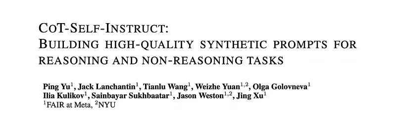
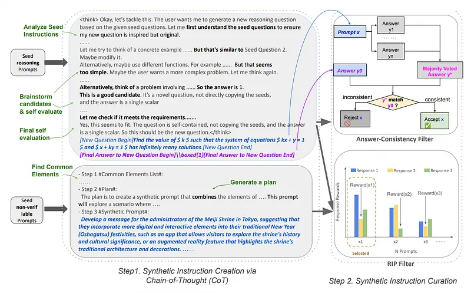
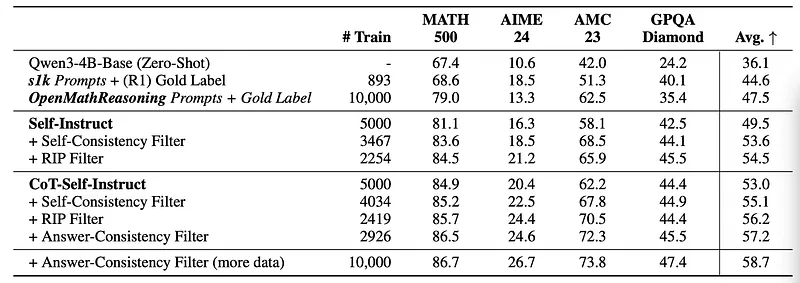
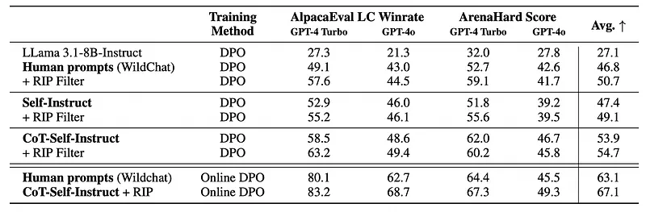

# Papers Explained 436 - CoT-Self-Instruct

CoT-Self-Instruct is a synthetic data generation method that instructs LLMs to first reason and plan via Chain-of-Thought (CoT) based on the given seed tasks, and then to generate a new synthetic prompt of similar quality and complexity for use in LLM training, followed by filtering for high-quality data with automatic metrics.

This page ingests the source article into the wiki and connects it to [[Papers Explained Corpus]], [[Synthetic Data]], [[Reasoning Models]], [[Reinforcement Learning Topic]], [[Large Language Models]], [[Evaluation and Benchmarks]], [[Verifier-Bounded Learning]], [[Reinforcement Learning]].

## Source Metadata

- Source file: `raw/2025-08-21_Papers-Explained-436--CoT-Self-Instruct-7c95400ef23c.md`
- Source title: Papers Explained 436: CoT-Self-Instruct
- Published: 2025-08-21
- Canonical: [https://medium.com/@ritvik19/papers-explained-436-cot-self-instruct-7c95400ef23c](https://medium.com/@ritvik19/papers-explained-436-cot-self-instruct-7c95400ef23c)

## Key Ideas

- CoT-Self-Instruct is a synthetic data generation method that instructs LLMs to first reason and plan via Chain-of-Thought (CoT) based on the given seed tasks, and then to generate a new synthetic prompt of similar quality and complexity for use in LLM...
- Assuming access to a language model and a small amount of high-quality human-annotated seed data, both verifiable reasoning domains and non-verifiable general instruction following are considered. The approach involves two stages:
- Synthetic Instruction Creation with Chain-of-Thought (CoT): Given sample human-annotated seed instructions, the LLM is instructed to reason step by step to come up with instructions of similar complexity and domain.
- Synthetic Instruction Curation: The generated synthetic data is curated to keep only high-quality instructions for self-training.
- LLMs are then trained using the generated high-quality synthetic instructions.

## Notes

CoT-Self-Instruct is a synthetic data generation method that instructs LLMs to first reason and plan via Chain-of-Thought (CoT) based on the given seed tasks, and then to generate a new synthetic prompt of similar quality and complexity for use in LLM training, followed by filtering for high-quality data with automatic metrics.

## CoT-Self-Instruct

*Figure: CoT-Self-Instruct.*

Assuming access to a language model and a small amount of high-quality human-annotated seed data, both verifiable reasoning domains and non-verifiable general instruction following are considered. The approach involves two stages:

- Synthetic Instruction Creation with Chain-of-Thought (CoT): Given sample human-annotated seed instructions, the LLM is instructed to reason step by step to come up with instructions of similar complexity and domain.

- Synthetic Instruction Curation: The generated synthetic data is curated to keep only high-quality instructions for self-training.

LLMs are then trained using the generated high-quality synthetic instructions.

### Synthetic Instruction Creation Via CoT

Multiple instructions are sampled at random from the instruction pool, and then used to few-shot prompt a language model to generate a series of intermediate reasoning steps, followed by a new instruction. Unlike standard Self-Instruct which directly prompts the model to write new instructions given a list of seed instructions, the LLM analyzes the given seed instructions, considering factors like domain, complexity, and purpose. It reflects on what makes the seed instructions high quality and develops a plan to generate a new, self-contained instruction of similar quality and complexity.

- For Verifiable reasoning tasks, the LLM is instructed to use reasoning to generate both an instruction and the verifiable target.

```text
You are a reasoning question generator assistant. Your goal is to create a novel, and challenging
reasoning question. You are provided the following seed questions:
Seed Question 1: {INSTRUCTION 1}
Seed Question 2: {INSTRUCTION 2}
Your task is to:
1. Write a brand-new, self-contained reasoning question that meets the following requirements:
(a) The question draws inspiration from the seed question without copying it verbatim, remaining novel
and of comparable difficulty.
(b) The question’s final answer should be a single, unambiguous scalar value (e.g., an integer, reduced
fraction, exact radical), or another answer type that can be verified in one step (e.g., ‘yes/no,’ a choice
from A to D).
2. Then reason step by step, solve the new question and format your output as follows:
[New Question Begin]{your generated question}[New Question End]
[Final Answer to New Question Begin]\boxed{your final answer}[Final Answer to New Question End]
```

- For General instruction following tasks, the LLM is directed to use reasoning to generate only the instruction, not the response itself. In these instances, later during training on this synthetic data, a reward model is utilized to assess the responses, eliminating the need for a reference answer.

```text
You are a prompt generator assistant. Your goal is to create diverse and creative synthetic prompts.
Please follow the steps below to create synthetic prompts.
Step 1: Carefully read #Prompt 1# and #Prompt 2#. Identify and list all the common elements
between these two prompts. If no common elements are found, list the main elements from each
prompt.
Step 2: Develop a comprehensive plan based on the #Common Elements List# or #Main Elements List# from Step 1. This plan will guide the generation of new synthetic prompts that are similar
to the original prompts.
Step 3: Execute the plan step by step and provide one #Synthetic Prompt#.
Please reply strictly in the following format:
- Step 1 #Common Elements List# or #Main Elements List#:
- Step 2 #Plan#:
- Step 3 #Synthetic Prompt#:
#Prompt 1#:
{INSTRUCTION 1}
#Prompt 2#:
{INSTRUCTION 2}
```

Self-Instruct prompt generation template for non-verifiable instruction following tasks:

```text
Below are sample tasks from user.
1. <begin>{INSTRUCTION 1}</end>
2. <begin>{INSTRUCTION 2}</end>
Come up with one new task, wrapped with <begin>and </end>
```

Short CoT prompt generation template for non-verifiable instruction following tasks:

```text
Below are sample tasks from user.
1. <begin>{INSTRUCTION 1}</end>
2. <begin>{INSTRUCTION 2}</end>
Come up with one new task, wrapped with <begin>and </end>. Please provide your Chainof-Thought first and then provide the new generated task.
```

Self-Instruct (standard, without CoT) prompt generation template for verifiable reasoning tasks:

```text
You are a reasoning question generator assistant. Your goal is to create a novel, and challenging
reasoning question. You are provided the following seed questions:
Seed Question 1: {INSTRUCTION 1}
Seed Question 2: {INSTRUCTION 2}
Your task is to write a brand-new, self-contained reasoning question that meets the following requirements:
1. The question draws inspiration from the seed question without copying it verbatim, remaining novel
and of comparable difficulty.
2. The question’s final answer should be a single, unambiguous scalar value (e.g., an integer, reduced
fraction, exact radical), or another answer type that can be verified in one step (e.g., ‘yes/no,’ a choice
from A to D).
3. Do not include any solution, hint, or answer-—only the question statement itself.
Please put your generated problem strictly in the format of
[New Question Begin]{your generated question}[New Question End]
```

CoT-Self-Instruct (No-Solve) prompt generation template for verifiable reasoning tasks without answering (i.e., generate a question only):

```text
You are a reasoning question generator assistant. Your goal is to create a novel, and challenging
reasoning question. You are provided the following seed questions:
Seed Question 1: {INSTRUCTION 1}
Seed Question 2: {INSTRUCTION 2}
Your task is to write a brand-new, self-contained reasoning question that meets the following requirements:
1. The question draws inspiration from the seed question without copying it verbatim, remaining novel
and of comparable difficulty.
2. The question’s final answer should be a single, unambiguous scalar value (e.g., an integer, reduced
fraction, exact radical), or another answer type that can be verified in one step (e.g., ‘yes/no,’ a choice
from A to D).
3. Do not include any solution, hint, or answer-—only the question statement itself.
Please reason step by step and put your generated problem strictly in the format of
[New Question Begin]{your generated question}[New Question End]
```

Self-Instruct-Then-Solve (i.e. No CoT) prompt generation template for verifiable reasoning tasks:

```text
You are a reasoning question generator assistant. Your goal is to create a novel, and challenging
reasoning question. You are provided the following seed questions:
Seed Question 1: {INSTRUCTION 1}
Seed Question 2: {INSTRUCTION 2}
Your task is to:
1. Write a brand-new, self-contained reasoning question that meets the following requirements:
(a) The question draws inspiration from the seed question without copying it verbatim, remaining novel
and of comparable difficulty.
(b) The question’s final answer should be a single, unambiguous scalar value (e.g., an integer, reduced
fraction, exact radical), or another answer type that can be verified in one step (e.g., ‘yes/no,’ a choice
from A to D).
2. Then solve the new question and format your output as follows:
[New Question Begin]{your generated question}[New Question End]
[Final Answer to New Question Begin]\boxed{your final answer}[Final Answer to New Question End]
```

### Synthetic Instruction Curation

A curation step is applied to select higher quality synthetic instructions from the pool of generated data for final post-training with RL.

- For verifiable reasoning tasks, Answer-Consistency is proposed to filter and retain only high-quality data. Given the task instruction, the LLM is first instructed to generate K responses and take the majority response. The data example is then rejected and removed from the training pool if the majority response does not match the target answer in the synthetic data example generated by CoT-Self-Instruct.

- For general instruction following tasks, the Rejecting Instruction Preferences (RIP) method is employed. In this method, for a given task instruction, K responses are generated, and each response is evaluated using a reward model (RM), resulting in a score for each response. The filtering process is then based on the distribution of these scores. The lowest score among these K responses is used to represent the score of the synthetic prompt. The data is then filtered by selecting only those prompts with the higher scores.

### Self-Training With Synthetic Data

The performance of self-trained LLMs is compared with models trained on human-annotated data and on seed instructions in reasoning and non-reasoning domains respectively. For verifiable reasoning tasks, GRPO is used, and for general instruction following both offline DPO and online DPO are considered.

## Experimental Setup

### Reasoning

Seed Instructions:

The s1k dataset consists of 1000 high-quality, diverse and difficult reasoning prompts. To conduct self-training with verifiable rewards a subset of s1k consisting of 893 verifiable reasoning instructions is selected by filtering out theorem-proving questions.

Prompt Generation:

To evaluate how CoT-Self-Instruct compares to baseline Self Instruct for generating verifiable reasoning tasks, these methods are applied to Qwen3–4B-Base models, Qwen3–4B models with Think mode and Qwen3–4B models with NoThink mode. Temperature = 0.7 and top-p=0.8 are used for Qwen3–4B-Base and Qwen3–4B (NoThink mode), and temperature = 0.6 and top-p=0.95 are used for Qwen3–4B (Think mode).

RLVR Training:

All the reasoning experiments use GRPO training initialized from Qwen3–4B-Base.

### Non-Verifiable Instruction Following

Seed Instructions:

The Wildchat-RIP-Filtered-by-8b-Llama dataset, which includes 4k high-quality prompts filtered from 20k raw wildchat prompts, is used as seed prompts. All seed data is categorized into 8 distinct categories: Writing & Storytelling, Technical & Programming, Creative & Design, Data & Analysis, Education & Research, Communication & Support, Business & Marketing, and Miscellaneous. During sampling, 2 seed prompts from the same category are selected to serve as few-shot prompts.

Prompt Generation:

The performance of CoT-Self-Instruct is evaluated in comparison to baselines for generating non-verifiable instruction-following tasks. This evaluation utilizes LLama 3.1–8B-Instruct and applies the methods using the Athene-RM-8B model reward model over 32 responses for RIP filtering.

DPO Training:

Training is conducted via DPO starting from LLama 3.1–8B-Instruct. For each prompt, 64 responses are generated. These responses are then annotated with Athene-RM-8B to select pairs. Synthetic prompts tend to be more complex compared to human prompts, resulting in longer average response lengths, which can lead to length explosion. During DPO training, the evaluation judge often favors longer responses, potentially causing response lengths to increase over time. To mitigate this, the reward score is combined with length information to determine the preferred response. This method ensures that shorter responses are selected when scores are similar. A length normalization coefficient of 0.2 for the length-normalized reward is applied. This is applied for all methods, in each case sampling 5k DPO pairs.

## Evaluation

*Figure: CoT-Self-Instruct results on reasoning tasks.*

- CoT-Self-Instruct outperforms Self-Instruct in generating synthetic instructions for reasoning tasks (53.0% vs 49.5% accuracy without filtering).

- Applying filtering methods improves both CoT-Self-Instruct and Self-Instruct.

- CoT-Self-Instruct maintains its advantage over Self-Instruct even after filtering. For example, with Self-Consistency Filtering, CoT-Self-Instruct improves to 55.1% accuracy, while Self-Instruct improves to 53.6%.

- High-quality synthetic prompts generated by CoT-Self-Instruct significantly outperform seed instructions (s1k) and other publicly available reasoning prompts.

- Filtering CoT-Self-Instruction to the same training size as s1k still yields significantly higher performance.

- CoT-Self-Instruction outperforms using 10K OpenMath-Reasoning instructions with gold labels (57.2% vs 47.5%).

- Increasing the CoT-Self-Instruction with Answer-Consistency filtering data to 10k improves results further with an average of 58.7%.

*Figure: CoT-Self-Instruct results on general instruction following tasks.*

- CoT-Self-Instruct significantly enhances the quality of synthetic data compared to Self-Instruct (53.9 vs. 47.4 average over AlpacaEval 2 and ArenaHard).

- Longer CoT reasoning chains provide more gains when producing synthetic data.

- RIP filtering improves results for both CoT-Self-Instruct (53.9 → 54.7) and Self-Instruct (47.4 → 49.1).

- RIP filtering provides a larger boost to human prompts from WildChat (46.8 → 50.7), likely due to the relative noisiness of human data.

- CoT-Self-Instruct with RIP data filtering (54.7) outperforms models trained on LLama 3.1–8B-Instruct (27.1) or human prompts from WildChat with (46.8) or without RIP data filtering (50.7).

- Online DPO further improves results, with CoT-Self-Instruct+RIP (67.1) outperforming human prompts from WildChat (63.1).

- CoT-Self-Instruct with RIP filtering yields the best performance overall compared to existing datasets or synthetic data construction methods tested.

## Paper

CoT-Self-Instruct: Building high-quality synthetic prompts for reasoning and non-reasoning tasks [2507.23751](https://arxiv.org/abs/2507.23751)

## Figures

Figures from the Medium HTML export (`raw/2025-08-21_Papers-Explained-436--CoT-Self-Instruct-7c95400ef23c.md`); local copies under `wiki/assets/papers-explained-436-cot-self-instruct/` when download succeeded.

| Figure | Caption |
|--------|---------|
|  | Title card: CoT-Self-Instruct. |
|  | CoT-Self-Instruct. |
|  | CoT-Self-Instruct results on reasoning tasks. |
|  | CoT-Self-Instruct results on general instruction following tasks. |
## Related

- [[Papers Explained Corpus]]
- [[Synthetic Data]]
- [[Reasoning Models]]
- [[Reinforcement Learning Topic]]
- [[Large Language Models]]
- [[Evaluation and Benchmarks]]
- [[Verifier-Bounded Learning]]
- [[Reinforcement Learning]]
- [[Papers Explained 435 - MegaScience]]
- [[Papers Explained 437 - Vision-Guided Chunking]]

#summary #topic
