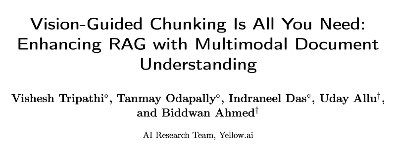
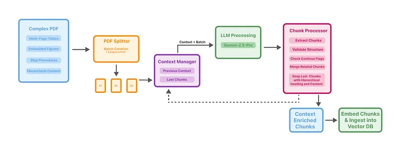

# Papers Explained 437 - Vision-Guided Chunking

Traditional document chunking methods, such as fixed-size or sliding-window approaches, suffer from several fundamental limitations:

This page ingests the source article into the wiki and connects it to [[Papers Explained Corpus]], [[Document AI]], [[Vision Language Models]], [[Embedding and Retrieval]].

## Source Metadata

- Source file: `raw/2025-08-22_Papers-Explained-437--Vision-Guided-Chunking-882220193e09.md`
- Source title: Papers Explained 437: Vision-Guided Chunking
- Published: 2025-08-22
- Canonical: [https://medium.com/@ritvik19/papers-explained-437-vision-guided-chunking-882220193e09](https://medium.com/@ritvik19/papers-explained-437-vision-guided-chunking-882220193e09)

## Key Ideas

- They often break coherent content like multi-page tables, step-by-step procedures, and cross-referential relationships across chunk boundaries.
- Text-only extraction completely disregards crucial visual information (figures, charts, document layout), which is vital for understanding.
- Contextual incompleteness arises because semantic relationships spanning page boundaries are not preserved.
- The logical flow and dependencies within a document, including nested sections and procedural sequences, are typically lost, hindering RAG systems.
- Traditional Approach: For a PDF document D with n pages (D = {p1, p2, . . . , pn}), traditional text-only chunking produces chunks C = {c1, c2, . . . , cm} where each ci contains only textual content.

## Notes

Traditional document chunking methods, such as fixed-size or sliding-window approaches, suffer from several fundamental limitations:

- They often break coherent content like multi-page tables, step-by-step procedures, and cross-referential relationships across chunk boundaries.

- Text-only extraction completely disregards crucial visual information (figures, charts, document layout), which is vital for understanding.

- Contextual incompleteness arises because semantic relationships spanning page boundaries are not preserved.

- The logical flow and dependencies within a document, including nested sections and procedural sequences, are typically lost, hindering RAG systems.

### Problem Formulation

Traditional Approach: For a PDF document D with n pages (D = {p1, p2, . . . , pn}), traditional text-only chunking produces chunks C = {c1, c2, . . . , cm} where each ci contains only textual content.

Multimodal Approach: The proposed multimodal approach processes D in batches B = {B1, B2, . . . , Bk}.

- Each batch Bi contains up to b consecutive pages (typically b = 4).

- For each batch Bi, contextually-aware chunks Ci are generated using a Large Multimodal Model M: Ci = M (Bi, contexti−1, prompt). Here, contexti−1 represents relevant context carried over from previous batches.

## Multimodal Batch Processing

*Figure: Multimodal Document Chunking Architecture.*

Documents are split into batches of b pages. This ensures that related content spanning multiple pages can be processed together, preserving contextual relationships.

Each batch is processed through a vision-guided pipeline that maintains contextual relationships across page boundaries.

To maintain continuity and prevent loss of semantic relationships across batch boundaries, a context mechanism is implemented:

- The context for batch Bi (contexti) is constructed from: {last_chunk i−1, heading_hierarchy i−1}.

- last_chunk i−1: The final chunks from the previous batch, crucial for handling content that spans across batch boundaries.

- heading_hierarchy i−1: The maintained heading hierarchy from the previous batch, ensuring consistent organization. This mechanism ensures that information from preceding batches informs the processing of subsequent ones.

## Intelligent Chunk Generation

### Hierarchical Heading Structure

A consistent 3-level heading hierarchy is enforced based on empirical analysis. A 2-level hierarchy lost important contextual granularity, while 4+ levels introduced unnecessary fragmentation. The 3-level structure provides an optimal balance between semantic granularity and retrieval efficiency.

Heading Levels:

- Level 1: Represents the document or product title, including full details like location and context information.

- Level 2: Captures major sections (e.g., “Features”, “Procedures”, “Specifications”).

- Level 3: Identifies specific subtopics (e.g., “Step 1”, “Table Row”, detailed subsections).

This structure ensures each chunk maintains its contextual position within the overall document, improving retrieval and understanding in RAG.

### Content Preservation Rules

Critical rules are applied to maintain document integrity:

- Step Preservation: All numbered steps or procedures remain within the same chunk to prevent fragmentation of instructional content.

- Table Integrity: Each table row becomes a separate chunk, while preserving headers for context.

- List Continuity: Related list items are kept together as coherent units.

- Multi-page Structures: Content spanning across page boundaries (e.g., large tables or figures) is properly merged. These rules are implemented through careful parsing of the multimodal model output and post-processing validation.

### Continuation Flags

Each generated chunk is tagged with a continuation flag for intelligent post-processing. The flag system uses three categories:

- [CONTINUES]True[/CONTINUES]: Indicates that the chunk continues from previous content.

- [CONTINUES]False[/CONTINUES]: Indicates that the chunk represents new content.

- [CONTINUES]Partial[/CONTINUES]: Used for uncertain continuation relationships. This tagging system facilitates automated merging of related content during post-processing, ensuring semantically related chunks are combined appropriately while maintaining clear boundaries between distinct topics.

```text
Extract text from the provided PDF and segment it into contextual chunks for knowledge retrieval while following these comprehensive requirements:
EXTRACTION PHASE
Process the PDF page by page, make sure you go through each page, don’t skip any page, extracting all content while:
1. Read all data content carefully and understand the structure of the document.
2. Infer logical headings and topics based on the content itself.
3. Always generate a 3-level heading structure for every chunk:
• First-level heading = Document or product title
• Second-level heading = the major section inside the document
• Third-level heading = the specific subtopic within that section
• Important: if heading is missing, inherit from the parent heading level.
Use your best judgment to logically assign headings based on the content and fully—never paraphrase or shorten.
The headings hierarchy should always follow this pattern: Main Title > Section Title > Chunk Title for headings.
4. SKIP TABLE OF CONTENTS AND INDEXES: Do not create chunks from tables of contents or indexes.
5. Do not include page headers, footers and page numbers in the chunks.
6. Do not create or extract chunks from LAST CHUNKS. Use it only as guidance for heading inference. All chunks must originate directly from the image.
7. DO NOT alter, paraphrase, shorten, or skip any content. All text, formatting, and elements must remain exactly as in the original Image and present in the output.
CRITICAL: STEP/LIST CHUNKING RULES - HIGHEST PRIORITY
KEEP ALL RELATED CONTENT TOGETHER - This is the highest priority rule:
• NEVER EVER split numbered steps, instructions, or procedures across different chunks
• ALL steps in a set of instructions MUST stay together in the same chunk
• ALL items in a numbered or bulleted list MUST stay together in one chunk
• If a list or set of steps spans multiple images, they MUST still be kept in a single chunk
• If a list or steps continue from a previous batch, merge and create a combined chunk
• Consider related steps or instructions as one inseparable unit of content
• Steps that are part of the same procedure/process must ALWAYS be kept together
• Even if a set of steps is very long, do NOT split them - they must remain in a single chunk
• Prioritize keeping steps together over any other chunking considerations
• If you encounter steps that seem to be part of the same process but are separated by other content, analyze carefully to determine if they are truly part of the same procedure and should be combined
9. Avoid chunks under 3 lines; merge them with adjacent content and heading.
10. Exclude menus, cookie notices, privacy policies, and terms sections.
11. For all heading levels (first, second, and third), ensure complete preservation of details:
• First-level heading: Include full document title, all location details, and audience roles if any.
• Second-level heading: Capture complete section names with any qualifying details or descriptions
• Third-level heading: Retain all subtopic specifics including numbers, dates, and descriptive text
• Never truncate or abbreviate any heading content at any level.
12. Multilingual Support (CRITICAL)
• Multilingual content must be processed with the exact same rules as monolingual content.
• Do not skip, paraphrase, or translate non-English content—all languages must be preserved and chunked.
13. MULTI-PAGE CONTEXT HANDLING
• Ensure contextual continuity between pages during processing
• When content splits across pages, maintain coherence and proper flow
• Handle page breaks within paragraphs, lists, or other content blocks seamlessly
• Track and preserve semantic relationships across page boundaries
14. LAYOUT ELEMENTS
• Remove page headers and footers consistently across all pages
• Preserve footnotes and endnotes with proper linking to their references
• Maintain paragraph spacing and indentation
• Handle multi-column layouts by properly sequencing the content
• Preserve bulleted and numbered lists with their hierarchical structure
15. SPECIAL CONTENT TYPES
• Process scanned pages with OCR-extracted text while maintaining formatting
• Preserve the structural integrity of content when images appear within text
• Extract and describe flowcharts, diagrams, and other visual elements
• If a Flowchart, describe step by step the flow
• Extract text from images embedded in the PDF if relevant to surrounding content
• If the Image is a screenshot, exclude it
• Include appropriate alt text or descriptions for non-extractable visual elements
16. FAQ Separation
When encountering FAQ content, split question-answer pairs into individual chunks rather than grouping them into single large chunks.
When working with tables:
1. Format using proper table syntax (pipes | and hyphens -).
2. Maintain table structure across images if a table spans multiple images.
3. When a table continues from a previous chunk (indicated in LAST CHUNKS), strictly maintain the same column structure, width, and formatting as established in the previous chunk for consistency.
4. VERY IMPORTANT: Create a separate chunk for EACH ROW of the table. Every table row chunk must include the table headers mentioned in the previous chunk or in the image followed by just that single row of data.
5. For each table row chunk, repeat the full table headers to ensure context is maintained independently.
6. If you find a row which is continuing from LAST CHUNKS, continue segmenting without including the content of the previous chunk.
HOW TO IDENTIFY STEPS AND INSTRUCTIONS:
• Look for bulleted lists that describe a process
• Look for content with clear sequencing words (First, Next, Then, Finally)
• Look for any content that describes how to perform a task or procedure
• Look for sections titled "Instructions," "Procedure," "How to," "Guide," etc.
• Look for multiple paragraphs that clearly belong to the same process
Flag for Content Continuation
ADD A CONTINUES FLAG TO EACH CHUNK:
For each chunk, you must add a CONTINUES flag:
• [CONTINUES]True[/CONTINUES]: This chunk is a continuation of the previous chunk OR is part of the same process, instruction set, or procedure.
• [CONTINUES]False[/CONTINUES]: This chunk starts new content and is not a continuation.
• [CONTINUES]Partial[/CONTINUES]: This chunk might be related to the previous chunk, but you are not sure.
Flag Rules for Table Rows:
• For table row chunks, set the CONTINUES flag specifically as follows:
– [CONTINUES]True[/CONTINUES]: ONLY if the cell content continues from an incomplete cell in the previous chunk/call
– [CONTINUES]False[/CONTINUES]: When the row contains complete cell content, NOT continuing from previous chunk
– The flag should be based on the CONTENT INSIDE THE CELLS, not on whether the table itself continues
Flag Rules for Steps and Instructions:
• For chunks containing numbered steps, instructions, procedures, or lists:
– When processing steps/instructions that span multiple pages or images:
∗ If steps continue from LAST CHUNKS, use [CONTINUES]True[/CONTINUES]
– When identifying if steps are complete:
∗ Look for clear indications like "Final Step" or concluding language
– ALL subsequent chunks containing ANY steps from the same procedure MUST use [CONTINUES]True[/CONTINUES]
– The only time a chunk containing steps should use [CONTINUES]False[/CONTINUES] is when it’s a completely different procedure with no relation to previous steps
Flag Rules for Other Content:
• Use CONTINUES=True for content that directly continues from the previous chunk
• For general content not falling into the above categories, use your best judgment based on context
Output Requirements:
1. Output a list of chunks where each chunk starts with a full 3-level heading and remove all empty or no finding chunks.
2. Use this exact format:
[CONTINUES]True|False|Partial[/CONTINUES][HEAD]main_heading > section_heading > chunk_heading[/HEAD]chunk_content
3. Separate chunks like this:
[CONTINUES]True|False|Partial[/CONTINUES]
[HEAD]main_heading > section_heading > chunk_heading[/HEAD]
chunk1
[CONTINUES]True|False|Partial[/CONTINUES]
[HEAD]main_heading > section_heading > chunk_heading[/HEAD]
chunk2
FINAL CHECK BEFORE SUBMITTING:
• Have you kept ALL numbered steps together in the same chunk? This is critical!
• Have you separated FAQ question-answer pairs into individual chunks instead of grouping them together?
• Have you identified all step sequences correctly and combined them, even if they span multiple pages?
• Have you identified and skipped all table of contents and indexes?
• Have you preserved and included all non-English/multilingual content, treating it with the same importance as English?
• If tables exist, did you follow the special instructions for tables, creating a separate chunk for EACH ROW with headers?
• Have you applied the correct flag rules for table rows (based on cell content completeness)?
• Have you kept ALL related procedures together?
• Have you maintained ALL lists as single units?
• Have you preserved the integrity of ALL instructional sequences?
• Have you properly handled content that continues from a previous batch?
• Have you indicated content that continues to the next batch?
• Have you added the [CONTINUES] flag to each chunk with appropriate values?
If you find ANY instances where related steps are split across chunks, recombine them immediately before submitting your final answer.
Ensure every chunk is clear, fully contextual, and no data is missing.
```

## Experiment Setup

The proposed multimodal batch processing framework is used with Gemini-2.5-Pro to process PDF documents in batches of 4 pages, ensuring context preservation, semantic coherence, document structure, table integrity, and cross-page relationships.

Document chunks were embedded using OpenAI text-embedding-3-small, stored in an Elasticsearch vector database, retrieved using top-k similarity search (k=10), and responses generated by GPT-4.1. GPT-4.1-mini was used for evaluation.

A comprehensive dataset was curated from multiple domains (technical manuals, financial reports, research publications, regulatory documents, business presentations) to test document structure complexity, content diversity, and visual elements.

Manually developed realistic queries to assess factual information extraction, cross-table analysis, procedural understanding, multi-section reasoning, and structural comprehension, ensuring balanced coverage across difficulty levels.

RAG performance was primarily evaluated using accuracy, with GPT-4.1-mini serving as an automated judge. Chunk quality was assessed through manual qualitative analysis focusing on semantic coherence, structural preservation, and information completeness.

## Evaluation

*Figure: RAG System Performance Comparison*

- RAG System Performance Improvement: The vision-guided chunking approach led to substantial improvements in RAG pipeline performance compared to traditional methods.

- Enhanced Chunk Quality: Manual inspection revealed significant improvements in semantic coherence and structural preservation with the vision-guided approach. Key qualitative improvements include complete preservation of multi-page tables with proper header repetition, intact cross-reference systems, maintained procedural sequences, and proper handling of nested organizational structures.

- Increased Chunk Granularity and Observability: The vision-guided approach produced approximately 5 times more chunks than traditional vanilla parsing, demonstrating more systematic and contextually appropriate segmentation. This increased granularity enhances chunk observability and enables more precise retrieval.

## Paper

Vision-Guided Chunking Is All You Need: Enhancing RAG with Multimodal Document Understanding [2506.16035](https://arxiv.org/abs/2506.16035)

## Figures

Figures from the Medium HTML export (`raw/2025-08-22_Papers-Explained-437--Vision-Guided-Chunking-882220193e09.md`); local copies under `wiki/assets/papers-explained-437-vision-guided-chunking/` when download succeeded.

| Figure | Caption |
|--------|---------|
|  | Title card: Vision-Guided Chunking. |
|  | Multimodal Document Chunking Architecture. |
|  | RAG System Performance Comparison. |
## Related

- [[Papers Explained Corpus]]
- [[Document AI]]
- [[Vision Language Models]]
- [[Embedding and Retrieval]]
- [[Papers Explained 436 - CoT-Self-Instruct]]
- [[Papers Explained 438 - MiroMind-M1]]

#summary #topic
