# Papers Explained 438 - MiroMind-M1

The project is available on [GitHub](https://github.com/MiroMindAsia/MiroMind-M1).

This page ingests the source article into the wiki and connects it to [[Papers Explained Corpus]], [[Reasoning Models]], [[Code Models]], [[Synthetic Data]], [[Large Language Models]], [[Model Compression and Efficiency]], [[Supervised Fine-Tuning]], [[Model Distillation]].

## Source Metadata

- Source file: `raw/2025-08-25_Papers-Explained-438--MiroMind-M1-d2206c0b1b1e.md`
- Source title: Papers Explained 438: MiroMind-M1
- Published: 2025-08-25
- Canonical: [https://medium.com/@ritvik19/papers-explained-438-miromind-m1-d2206c0b1b1e](https://medium.com/@ritvik19/papers-explained-438-miromind-m1-d2206c0b1b1e)

## Key Ideas

- R1 distillation data, is collected from four public sources:
- OpenR1: Contains approximately 400K math problems from AI-MO/NuminaMath-1.5. Each question has 1–8 reasoning traces from DeepSeek-R1. Only traces with correct answers, verified by MathVerify and an LLM-based judge, are retained.
- OpenThoughts: Includes 114K questions from math, science, coding, and puzzles. Only the math-related questions were retained, resulting in approximately 56K question-response pairs. Reasoning traces are generated by DeepSeek-R1.
- Light-R1: Sources math questions from OpenR1-Math-220K, OpenThoughts-114K, LIMO, OpenMathInstruct-2, s1K, Omni-MATH, Hendrycks_Math, and AIME (up to 2023). It is decontaminated against common reasoning benchmarks.
- Synthetic-1: A large-scale dataset for supervised fine-tuning, featuring reasoning traces produced by DeepSeek-R1. It covers Math, Algorithmic Coding, Real-World Software Engineering, Open-Ended STEM Q&A, and Synthetic Code Understanding.

## Notes

The MiroMind-M1 series is a set of fully open-source RLMs built on the Qwen-2.5 backbone. These models are trained in two stages: supervised fine-tuning (SFT) on a carefully curated corpus of 719K math-reasoning problems with verified chain-of-thought (CoT) trajectories. The second stage involves reinforcement learning with verifiable reward (RLVR) on 62K challenging and verifiable problems. To enhance the robustness and efficiency of the RLVR process, Context-Aware Multi-Stage Policy Optimization (CAMPO) is introduced. CAMPO is an algorithm that integrates length-progressive training with an adaptive repetition penalty to encourage context-aware RL training.

The project is available on [GitHub](https://github.com/MiroMindAsia/MiroMind-M1).

## Supervised Fine Tuning

### Data Curation

R1 distillation data, is collected from four public sources:

- OpenR1: Contains approximately 400K math problems from AI-MO/NuminaMath-1.5. Each question has 1–8 reasoning traces from DeepSeek-R1. Only traces with correct answers, verified by MathVerify and an LLM-based judge, are retained.

- OpenThoughts: Includes 114K questions from math, science, coding, and puzzles. Only the math-related questions were retained, resulting in approximately 56K question-response pairs. Reasoning traces are generated by DeepSeek-R1.

- Light-R1: Sources math questions from OpenR1-Math-220K, OpenThoughts-114K, LIMO, OpenMathInstruct-2, s1K, Omni-MATH, Hendrycks_Math, and AIME (up to 2023). It is decontaminated against common reasoning benchmarks. Reasoning traces are generated using DeepSeek-R1. The final datasets include 76k and 3k challenging problems for stage 1 and stage 2 training, respectively.

- Synthetic-1: A large-scale dataset for supervised fine-tuning, featuring reasoning traces produced by DeepSeek-R1. It covers Math, Algorithmic Coding, Real-World Software Engineering, Open-Ended STEM Q&A, and Synthetic Code Understanding. The math questions are derived from NuminaMath and undergo LLM-driven postprocessing. The math portion contains 247k problems.

Data Deduplication: To ensure data quality, duplicate question-response pairs are first removed by computing N-gram overlaps on the concatenated query and response text.

Data Decontamination: An N-gram overlap filter is applied to remove any training samples whose questions match those in Math500, AIME24, or AIME25.

*Figure: Statistics of math-focused datasets used for SFT*

### Training

The Qwen-2.5-Math-7B model is trained for 3 epochs with a maximum context length of 32,768 extended using Linear RoPE scaling. A no-packing strategy is adopted for training because of its empirical advantages.

### Evaluation

- The model achieved 60.5 on AIME24, 45 on AIME25, and 94.6 on MATH-500.

- No-packing outperforms packing and neat-packing strategies.

- Packing followed by no-packing can save time without significant performance drop (performance on math 500 is 90.4 and 89.6, respectively).

- Longer trajectories are a strong metric for sample selection, consistently outperforming random selection.

## Reinforcement Learning

### Data Curation

The dataset includes NuminaMath-1.5 with 896K problems; Skywork-OR1-RL-Data containing 105K problems, Big-Math, comprising 50K problems from both reformulated content and HARP and DAPO-Math-17K, a carefully curated collection of 17K high-quality math problems.

A series of filtering steps are performed to refine the candidate set, as part of the overall data processing pipeline.

*Figure: Overview of the filtering strategy.*

- The collected math problems are first filtered based on style and format. Proof-based questions that are non-verifiable are removed. To ensure linguistic consistency, the dataset is restricted to English-language problems.

- Math problems that are exact duplicates are removed. Near-duplicates are then eliminated by applying a 10-gram similarity threshold, which helps filter out semantically similar problems that may differ only in surface form.

- For each math problem, five rollouts are generated using Deepseek-R1-Distill-Qwen-32B (with temperature set to 1.0 and a maximum output length of 32K tokens). Extreme cases, such as those with fully correct or fully incorrect responses, are excluded. The focus is on problems that are neither trivial nor unsolvable.

- Including relatively simple problems (e.g., those with a pass rate of 0.8) is beneficial. These examples reinforce the model’s existing knowledge and help prevent divergence during training. This stabilizing effect is particularly valuable when KL regularization is not applied, as such problems act as anchors that support steady learning. In contrast, always presenting harder problems with lower success rates may overly emphasize exploration, potentially leading the model away from already-correct reasoning patterns.

- Target answers longer than 20 characters are excluded as they are more prone to linguistic variability and harder to verify reliably.

Through the above process, 94% of the candidates are eliminated, yielding a curated training set of 62K math problems that are both challenging and reliably verifiable.

### Preliminaries of Reinforcement Learning

Given an LLM policy πθ(·|·), let o be an LLM-generated response to q, and r(·,·) is a predefined reward function that quantifies whether the response o yields a. RL-based fine-tuning aims to maximize this expected reward over D.

Proximal policy optimization (PPO) is one of the most popular actor-critic RL algorithms for LLM policy optimization. PPO trains both the target LLM policy πθ (actor) and a value model Vϕ (critic), which estimates the quality of responses generated by πθ.

ri,t(θ)≜πθ(oi,t∣q,oi,<t) / πθold(oi,t∣q,oi,<t) is the likelihood ratio between current and old policies

Aˆ i,t(ϕ) is the gated advantage estimator (GAE) estimated from Vϕ(oi,t|q, oi.

Group relative policy optimization (GRPO) is an efficient PPO variant that eliminates the critic and GAE, reducing memory and computation costs. GRPO normalizes rewards within each rollout group to lower variance and combines likelihood ratio clipping with a KL-divergence penalty to keep πθ close to the initial SFT LLM.

Aˆ i,t ≜ (r(oi , a) − mean({r(oi , a)} G i=1))/std({r(oi , a)} G i=1) is the group-normalized reward

Decoupled clip and dynamic sampling policy optimization (DAPO) identifies key issues in GRPO, including entropy collapse, training instability, and length bias from sample-level loss. To address these DAPO decouples εinto εlow and εhigh to prevent entropy collapse, enforces diverse rollouts for stable gradients, and averages loss over all tokens to remove length bias.

### Context-Aware Multi-Stage Policy Optimization (CAMPO)

CAMPO enhances training by incorporating awareness of both context length and content. Specifically, multi-stage training with gradually increasing context length improves efficiency, while a repetition penalty encourages redundancy-aware learning and promotes more effective reasoning. Training progresses to the next stage once the response length saturates.

Where, s denotes the training stage, ϕlow(s) and ϕhigh(s) represent the corresponding decoupled clipping distributions for different stages. f(oi) measures repetition in oi and outputs a score between 0 and 1, depending on how early the repetition occurs. Specifically, f(oi) returns the proportion of the whole token sequence that lies inside the detected repeating loop.

Efficiency-Aware Perspective on Multi-Stage Training

The high computational cost associated with long rollouts in RL training slows down training and reduces sampling efficiency. A multi-stage RL training strategy, inspired by DeepScaleR and Skywork-OR1 is adopted.

The maximum permitted response length is progressively increased across training stages.

Rollouts exceeding the permitted length are assigned zero reward, providing a clear training signal.

Initially shorter response limits constrain the model’s output space, reducing rollout length, and accelerating feedback cycles.

Treating over-length responses as failures encourages concise and refined outputs.

Stabilizing Training with Repetition Penalty

RL training can be unstable and prone to sudden collapse, especially when the model generates a narrow set of low-diversity outputs. Omitting KL loss to encourage long reasoning patterns can cause the trained model to drift from the original policy, leading to suboptimal behaviors. A repetition penalty is introduced.

Promotes output diversity and discourages repetitive patterns, preventing the policy from collapsing into a narrow output space.

The repetition score ranges from 0 to 1, with earlier repetitions incurring heavier penalties, allowing dynamic adaptation to the model’s repetition behavior.

### MiroMind-M1-RL-32B

Training is initialized from DeepSeek-R1-Distill-Qwen-32B with a maximum response length of 16,384 in Stage 1, then progressively increased to 32,768 and 49,152 in Stages 2 and 3, respectively. The KL loss is omitted to allow more flexibility in model learning. A clipping ratio of 0.2 is used. During rollouts, the temperature is set to 1.0 for more diverse sampling, and each data sample is rolled out 16 times.

*Figure: Comparison of our 7B and 32B model performance across benchmark datasets.*

- CAMPO significantly improves performance on math benchmarks (AIME24 and AIME25) when finetuning from a strong initialization checkpoint.

- MiroMind-M1-RL-32B achieves a 6.7% improvement on AIME24 and a 13.5% improvement on AIME25.

- MiroMind-M1-RL-32B lags behind some SOTA models like Skywork-OR1–32B-Preview on AIME25 (by 2.6%).

*Figure: Comparison of MiroMind-M1-RL-32B and Skywork-OR1–32B-Preview on AIME24 and AIME25 across different maximum response lengths.*

- CAMPO leads to more token-efficient reasoning behavior.

### MiroMind-M1-RL-7B

Starting from the Qwen2.5–7B-Math-Base checkpoint, the model is first fine-tuned via SFT to reach MiroMind-M1-SFT-7B, then further optimized with RL to enhance its mathematical reasoning capabilities. A two-stage training strategy is adopted. In the first stage, the maximum rollout length is capped at 16K tokens, discarding samples that fail to produce a complete answer within this limit. After 1200 steps, the maximum rollout length per sample is updated to 32K tokens and training continues with the same model checkpoint and optimizers.

*Figure: The model’s performance steadily improves throughout the training process.*

- The RL process significantly improved model performance, yielding over a 15% accuracy improvement on both AIME24 and AIME25.

- The model achieved state-of-the-art (SOTA) math capabilities among all models derived from the Qwen2.5 series.

- The model outperformed MiMo-7B-RL, a model trained from scratch with a comparable SFT sample size.

*Figure: Response length trend during two-stage training.*

- The two-stage training strategy influenced response length:

- During the initial 16K token cap phase, response length compressed and stabilized between 8K and 9K tokens.

- After transitioning to the 32K limit, the average maximum length significantly increased, extending beyond 13K tokens.

- It is hypothesized that the initial constraint helps establish a strong foundation for reasoning, leading to more stable and effective optimization in the longer sequence regime.

*Figure: Performance trend of the model trained using a single-stage 32K max context length schema.*

- While single-stage training can achieve competitive performance, the two-stage method offers key advantages:

- Faster training: Starting with shorter sequences reduces memory and computational overhead.

- Potentially better performance when the output token budget is limited.

## Paper

MiroMind-M1: An Open-Source Advancement in Mathematical Reasoning via Context-Aware Multi-Stage Policy Optimization [2507.14683](https://arxiv.org/abs/2507.14683)

## Figures

Figures from the Medium HTML export (`raw/2025-08-25_Papers-Explained-438--MiroMind-M1-d2206c0b1b1e.md`); local copies under `wiki/assets/papers-explained-438-miromind-m1/` when download succeeded.

| Figure | Caption |
|--------|---------|
| 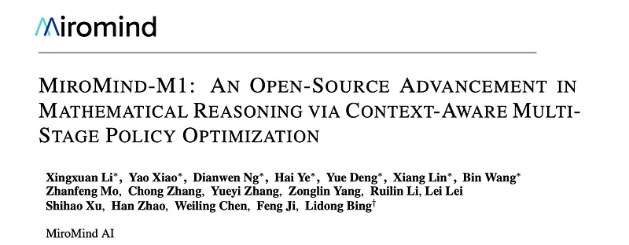 | Title card: MiroMind-M1. |
| 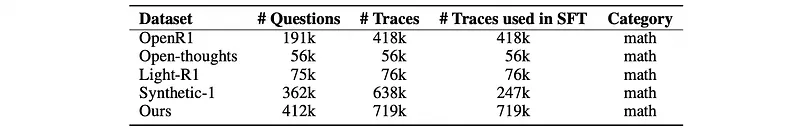 | Statistics of math-focused datasets used for SFT. |
| 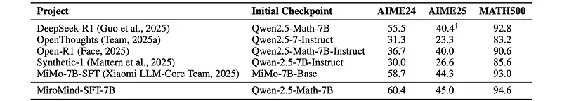 | The Qwen-2.5-Math-7B model is trained for 3 epochs with a maximum context length of 32,768 extended using Linear RoPE scaling. |
|  | The Qwen-2.5-Math-7B model is trained for 3 epochs with a maximum context length of 32,768 extended using Linear RoPE scaling. |
|  | The Qwen-2.5-Math-7B model is trained for 3 epochs with a maximum context length of 32,768 extended using Linear RoPE scaling. |
| 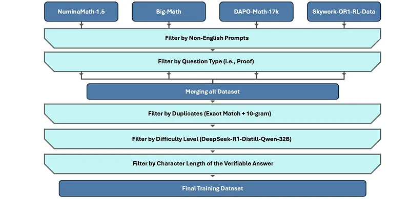 | Overview of the filtering strategy. |
|  | Proximal policy optimization (PPO) is one of the most popular actor-critic RL algorithms for LLM policy optimization. |
| 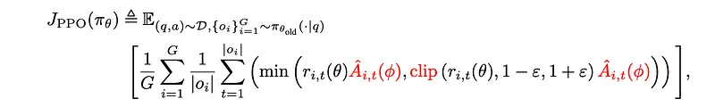 | Proximal policy optimization (PPO) is one of the most popular actor-critic RL algorithms for LLM policy optimization. |
| 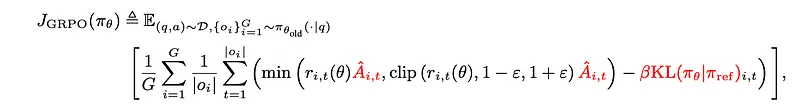 | Group relative policy optimization (GRPO) is an efficient PPO variant that eliminates the critic and GAE, reducing memory and computation... |
| 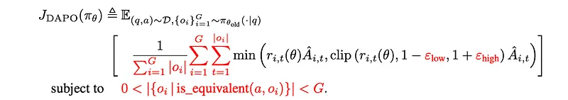 | Preliminaries of Reinforcement Learning. |
| 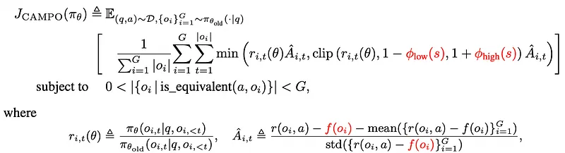 | CAMPO enhances training by incorporating awareness of both context length and content. |
| 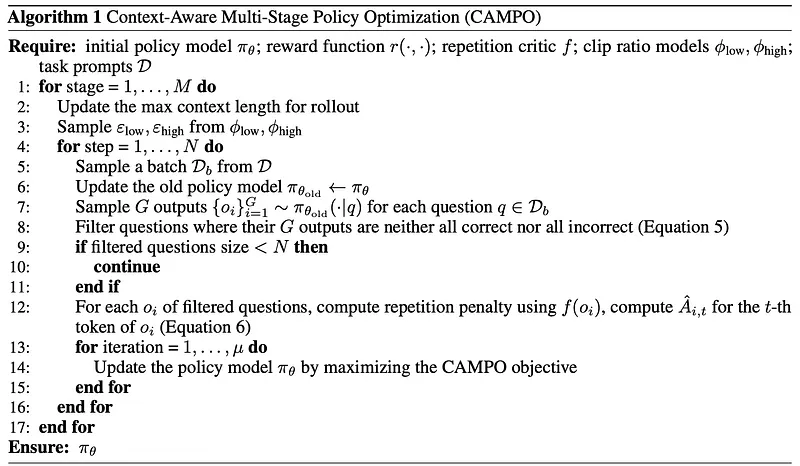 | Efficiency-Aware Perspective on Multi-Stage Training. |
| 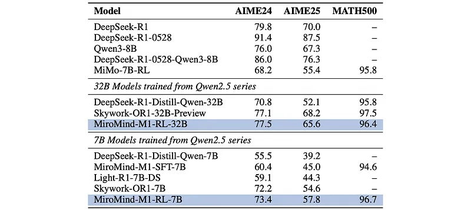 | Comparison of our 7B and 32B model performance across benchmark datasets. |
| 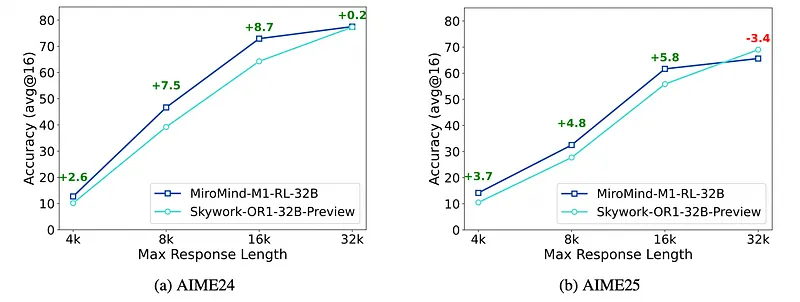 | Comparison of MiroMind-M1-RL-32B and Skywork-OR1–32B-Preview on AIME24 and AIME25 across different maximum response lengths. |
| 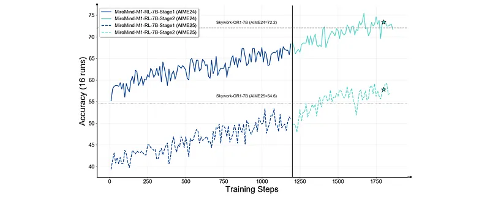 | The model’s performance steadily improves throughout the training process. |
| 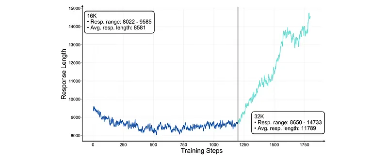 | Response length trend during two-stage training. |
| 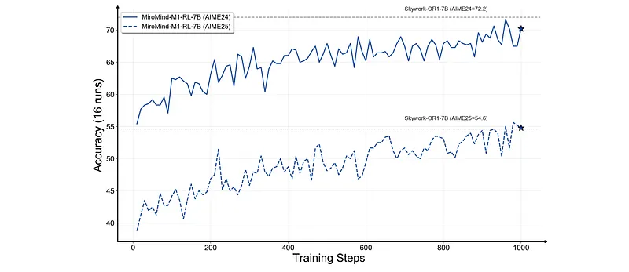 | Performance trend of the model trained using a single-stage 32K max context length schema. |
## Related

- [[Papers Explained Corpus]]
- [[Reasoning Models]]
- [[Code Models]]
- [[Synthetic Data]]
- [[Large Language Models]]
- [[Model Compression and Efficiency]]
- [[Supervised Fine-Tuning]]
- [[Model Distillation]]
- [[Papers Explained 437 - Vision-Guided Chunking]]
- [[Papers Explained 439 - Reinforcement Learning with Calibration Rewards (RLCR)]]

#summary #topic
