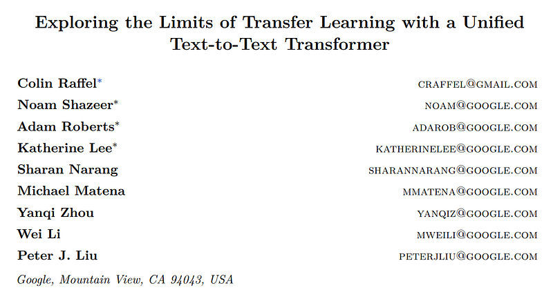
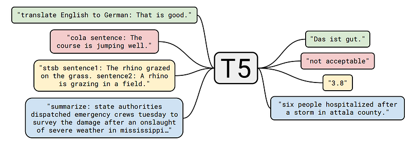
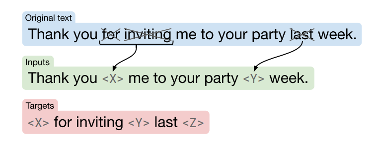
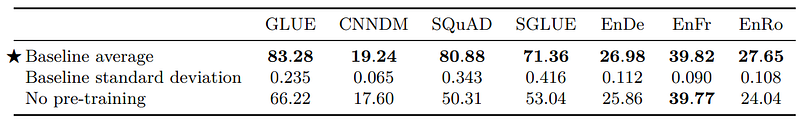

# Papers Explained 44 - T5

T5 explores the landscape of transfer learning techniques for NLP by introducing a unified framework that converts all text-based language problems into a text-to-text format.

This page ingests the source article into the wiki and connects it to [[Papers Explained Corpus]], [[Large Language Models]], [[Multilingual Models]], [[Embedding and Retrieval]].

## Source Metadata

- Source file: `raw/2023-05-01_Papers-Explained-44--T5-9d974a3b7957.html`
- Source title: Papers Explained 44: T5
- Published: 2023-05-01
- Canonical: [https://medium.com/@ritvik19/papers-explained-44-t5-9d974a3b7957](https://medium.com/@ritvik19/papers-explained-44-t5-9d974a3b7957)

## Key Ideas

- T5 model is roughly equivalent to the original Transformer with the exception of removing the Layer Norm bias, placing the layer normalization outside the residual path, and using a different position embedding scheme.
- Common Crawl is a publicly-available web archive that provides “web extracted text” by removing markup and other non-text content from the scraped HTML files. This process produces around 20TB of scraped text data each month.
- To assemble our base data set, we downloaded the web-extracted text from April 2019 and applied the aforementioned filtering.
- GLUE and SuperGLUE text classification meta-benchmarks
- CNN/Daily Mail abstractive summarization

## Notes

T5 explores the landscape of transfer learning techniques for NLP by introducing a unified framework that converts all text-based language problems into a text-to-text format.

T5 model is roughly equivalent to the original Transformer with the exception of removing the Layer Norm bias, placing the layer normalization outside the residual path, and using a different position embedding scheme.

*Figure: A diagram of our text-to-text framework. Every task we consider — including translation, question answering, and classification — is cast as feeding our model text as input and training it to generate some target text. This allows us to use the same model, loss function, hyperparameters, etc. across our diverse set of tasks. It also provides a standard testbed for the methods included in our empirical survey. “T5” refers to our model, which we dub the “Text-to-Text Transfer Transformer”.*

### The Colossal Clean Crawled Corpus

Common Crawl is a publicly-available web archive that provides “web extracted text” by removing markup and other non-text content from the scraped HTML files. This process produces around 20TB of scraped text data each month. Unfortunately, the majority of the resulting text is not natural language. To address this issue, we used several heuristics for cleaning up Common Crawl’s web-extracted text.

To assemble our base data set, we downloaded the web-extracted text from April 2019 and applied the aforementioned filtering. This produces a collection of text that is not only orders of magnitude larger than most data sets used for pre-training (about 750 GB) but also comprises reasonably clean and natural English text. We dub this data set the “Colossal Clean Crawled Corpus” (or C4 for short) and release it.

### Downstream Tasks

We measure performance on the:

- GLUE and SuperGLUE text classification meta-benchmarks

- CNN/Daily Mail abstractive summarization

- SQuAD question answering

- WMT English to German, French, and Romanian translation.

GLUE and SuperGLUE each comprise a collection of text classification tasks meant to test general language understanding abilities:

- Sentence acceptability judgment (CoLA)

- Sentiment analysis (SST-2)

- Paraphrasing/sentence similarity (MRPC, STS-B, QQP )

- Natural language inference (MNLI, QNLI, RTE, CB)

- Coreference resolution (WNLI and WSC)

- Sentence completion (COPA)

- Word sense disambiguation (WIC)

- Question answering (MultiRC, ReCoRD, BoolQ)

### Input and Output Format

In order to train a single model on the diverse set of tasks described above, we cast all of the tasks we consider into a “text-to-text” format — that is, a task where the model is fed some text for context or conditioning and is then asked to produce some output text. To specify which task the model should perform, we add a task-specific (text) prefix to the original input sequence before feeding it to the model.

## Experiments

We pre-train a standard Transformer using a simple denoising objective and then separately fine-tune on each of our downstream tasks.

Our baseline model is designed so that the encoder and decoder are each similar in size and configuration to a “BERT BASE” stack. Specifically, both the encoder and decoder consist of 12 blocks (each block comprising self-attention, optional encoder-decoder attention, and a feed-forward network).

For regularization, we use a dropout probability of 0.1 everywhere dropout is applied in the model.

### Vocabulary

We use SentencePiece to encode text as WordPiece tokens. For all experiments, we use a vocabulary of 32,000 wordpieces. Since we ultimately fine-tune our model on English to German, French, and Romanian translation, we also require that our vocabulary covers these non-English languages. To address this, we classified pages from the Common Crawl scrape used in C4 as German, French, and Romanian. Then, we trained our SentencePiece model on a mixture of 10 parts of English C4 data with 1 part each of data classified as German, French, or Romanian. This vocabulary was shared across both the input and output of our model.

### Unsupervised Objectives

*Figure: Schematic of the objective we use in our baseline model. In this example, we process the sentence “Thank you for inviting me to your party last week.” The words “for”, “inviting” and “last” (marked with an ×) are randomly chosen for corruption. Each consecutive span of corrupted tokens is replaced by a sentinel token (shown as and ) that is unique over the example. Since “for” and “inviting” occur consecutively, they are replaced by a single sentinel. The output sequence then consists of the dropped-out spans, delimited by the sentinel tokens used to replace them in the input plus a final sentinel token.*

Inspired by BERT’s “masked language modeling” objective and the “word dropout” regularization technique, we design an objective that randomly samples and then drops out 15% of tokens in the input sequence. All consecutive spans of dropped-out tokens are replaced by a single sentinel token. Each sentinel token is assigned a token ID that is unique to the sequence.

The target then corresponds to all of the dropped-out spans of tokens, delimited by the same sentinel tokens used in the input sequence plus a final sentinel token to mark the end of the target sequence.

## Results

*Figure: The average and standard deviation of scores achieved by our baseline model and training procedure. For comparison, we also report performance when training on each task from scratch (i.e. without any pre-training) for the same number of steps used to fine-tune the baseline model.*

## T5 v1.1

The T5 v1.1 model, is an enhanced version of the original T5 model. Compared to the original T5 model, T5 v1.1 incorporates several notable enhancements:

- GEGLU Activation: T5 v1.1 replaces the ReLU activation function in the feed-forward hidden layer with the GEGLU (Gated Linear Unit) activation. This modification aims to improve the model’s performance.

- Dropout during Pre-training: Dropout, a regularization technique, was turned off during the pre-training phase of T5 v1.1. This decision was made to enhance the quality of the pre-training process. However, it is recommended to re-enable dropout during fine-tuning.

- Pre-training on C4: T5 v1.1 was exclusively pre-trained on the C4 dataset, without incorporating any downstream tasks. This approach differs from the original T5 model, which involved mixing in downstream tasks during pre-training.

- No Parameter Sharing: Unlike the original T5 model, T5 v1.1 does not share parameters between the embedding and classifier layers. This change allows for more flexibility and potentially improved performance.

- Model Shape: T5 v1.1 introduces new model shapes denoted as “xl” and “xxl,” replacing the “3B” and “11B” designations. These new shapes feature a larger d_model (model dimension) and smaller num_heads (number of attention heads) and d_ff (feed-forward dimension).

It is important to note that T5 v1.1 was solely pre-trained on the C4 dataset without any supervised training. Consequently, before utilizing this model for downstream tasks, it must undergo fine-tuning. Unlike the original T5 model, which could be used without fine-tuning, T5 v1.1 requires fine-tuning to be effective.

During single-task fine-tuning, there is no significant advantage to using a task prefix since T5 v1.1 was pre-trained unsupervisedly. However, in the case of multi-task fine-tuning, it is recommended to employ a task prefix.

## Paper

Exploring the Limits of Transfer Learning with a Unified Text-to-Text Transformer [1910.10683](https://arxiv.org/abs/1910.10683)

## Figures

Figures from the Medium HTML export (`raw/2023-05-01_Papers-Explained-44--T5-9d974a3b7957.html`); local copies under `wiki/assets/papers-explained-44-t5/` when download succeeded.

| Figure | Caption |
|--------|---------|
|  | Title card: T5. |
|  | A diagram of our text-to-text framework. Every task we consider — including translation, question answering, and classification — is cast as feeding our model text as input and training it to generate some target text. This allows us to use the same model, loss function, hyperparameters, etc. across our diverse set of tasks. It also provides a standard testbed for the methods included in our empirical survey. “T5” refers to our model, which we dub the “Text-to-Text Transfer Transformer”. |
|  | Schematic of the objective we use in our baseline model. In this example, we process the sentence “Thank you for inviting me to your party last week.” The words “for”, “inviting” and “last” (marked with an ×) are randomly chosen for corruption. Each consecutive span of corrupted tokens is replaced by a sentinel token (shown as and ) that is unique over the example. Since “for” and “inviting” occur consecutively, they are replaced by a single sentinel. The output sequence then consists of the dropped-out spans, delimited by the sentinel tokens used to replace them in the input plus a final sentinel token. |
|  | The average and standard deviation of scores achieved by our baseline model and training procedure. For comparison, we also report performance when training on each task from scratch (i.e. without any pre-training) for the same number of steps used to fine-tune the baseline model. |
## Related

- [[Papers Explained Corpus]]
- [[Large Language Models]]
- [[Multilingual Models]]
- [[Embedding and Retrieval]]
- [[Papers Explained 43 - GPT]]
- [[Papers Explained 45 - Codex]]

#summary #topic
