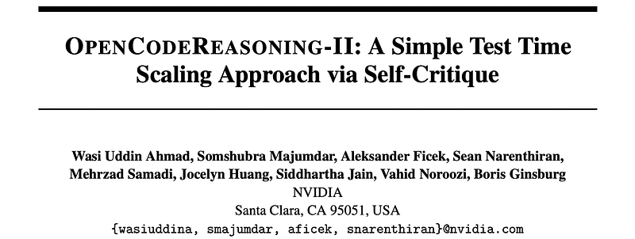
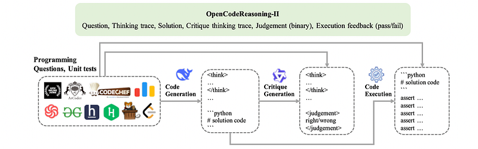
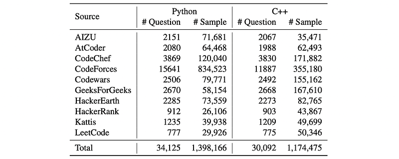
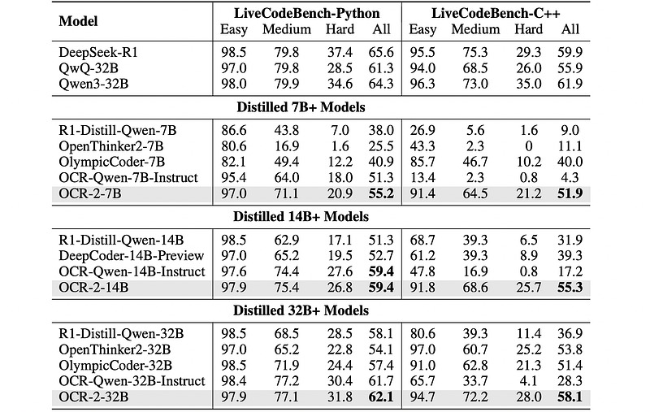
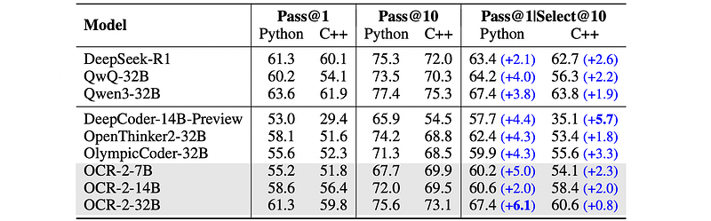
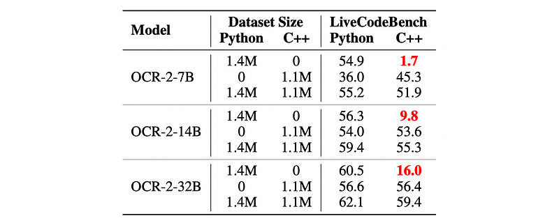

# Papers Explained 440 - OpenCodeReasoning-II

The dataset is available on [HuggingFace](https://huggingface.co/datasets/nvidia/OpenCodeReasoning-2/).

This page ingests the source article into the wiki and connects it to [[Papers Explained Corpus]], [[Synthetic Data]], [[Code Models]], [[Reasoning Models]], [[Evaluation and Benchmarks]].

## Source Metadata

- Source file: `raw/2025-08-27_Papers-Explained-440--OpenCodeReasoning-II-c1e27ef6fb5e.html`
- Source title: Papers Explained 440: OpenCodeReasoning-II
- Published: 2025-08-27
- Canonical: [https://medium.com/@ritvik19/papers-explained-440-opencodereasoning-ii-c1e27ef6fb5e](https://medium.com/@ritvik19/papers-explained-440-opencodereasoning-ii-c1e27ef6fb5e)

## Key Ideas

- The construction of the OpenCodeReasoning-II dataset involved a four-stage approach:
- To create the dataset, problems were drawn from the TACO corpus, the APPS benchmark, the CodeContests collection, and CodeForces problems through the OpenR1 initiative.
- Multiple solutions for each question were generated leveraging DeepSeek-R1 in Python and C++. Nucleus Sampling was used, with a temperature of 0.6 and top-p of 0.95, for a maximum output sequence length of 32k tokens.
- Each response was checked for reasoning traces enclosed by the <think> and </think> tags. The solution segments were then extracted, separating the reasoning traces from the rest of the response. The presence of code blocks delimited by ```python . .
- QwQ-32B was prompted to generate critiques for programming questions and their corresponding code solutions. Temperature-based nucleus sampling with a maximum output length of 24k tokens was used for generation.

## Notes

This work introduces OpenCodeReasoning-II, a dataset consisting of 2.5M question-solution-critique triples (≈35K unique programming questions). A two-stage supervised fine-tuning strategy is employed. The first stage focuses on fine-tuning for code generation, while the second stage involves the joint training of models for both code generation and critique. The resulting fine-tuned Qwen2.5-Instruct models achieve performance in code generation that either exceeds or equals the best prior open-weight distilled models.

The dataset is available on [HuggingFace](https://huggingface.co/datasets/nvidia/OpenCodeReasoning-2/).

## Development of OpenCodeReasoning-II

*Figure: Overview of the OpenCodeReasoning-II development stages.*

The construction of the OpenCodeReasoning-II dataset involved a four-stage approach:

### Programming Questions Collection

To create the dataset, problems were drawn from the TACO corpus, the APPS benchmark, the CodeContests collection, and CodeForces problems through the OpenR1 initiative. A fuzzy matching-based de-duplication method was applied, leading to a final set of 34,799 unique questions of diverse difficulty.

*Figure: Number of questions and corresponding samples in OpenCodeReasoning-II.*

To ensure the integrity of OpenCodeReasoning-II, potential data leakage between the collected programming questions and major code generation evaluation suites was rigorously investigated. The methodology involved computing the cosine similarity (with a cutoff of 0.7) to identify the closest counterpart within the benchmark datasets for every distinct question in OpenCodeReasoning-II. Llama-3.3–70B-Instruct was used as a judge to assess semantic similarity, and it identified 674 questions that potentially overlap with evaluation benchmarks. Following this decontamination, solutions were generated for the remaining 34,125 programming questions.

### Solution Generation using DeepSeek-R1

Multiple solutions for each question were generated leveraging DeepSeek-R1 in Python and C++. Nucleus Sampling was used, with a temperature of 0.6 and top-p of 0.95, for a maximum output sequence length of 32k tokens.

[ FIG 6 PROMPT ]

Each response was checked for reasoning traces enclosed by the <think> and </think> tags. The solution segments were then extracted, separating the reasoning traces from the rest of the response. The presence of code blocks delimited by ```python . . .``` or ```cpp . . .``` was confirmed. Finally, Tree Sitter was used to validate the syntactic correctness of these code blocks. These filtering procedures led to the removal of a very few responses.

### Critique Generation using QwQ-32B

QwQ-32B was prompted to generate critiques for programming questions and their corresponding code solutions. Temperature-based nucleus sampling with a maximum output length of 24k tokens was used for generation. A post-processing and filtering approach similar to solution generation was employed. Responses were retained only if their final judgment was binary: either right or wrong. Otherwise, they were discarded.

[ FIG 7 PROMPT ]

### Verifying Solutions with Unit Tests

Generated code solutions were executed against their corresponding unit tests, which were collected alongside the questions from public benchmarks. A subsample of OpenCodeReasoning-II was selected where each question had at least 5 unit tests, with a maximum of 50 randomly selected if more were available. This subsample comprised 60% of OpenCodeReasoning-II.

## Extending LiveCodeBench for C++

LiveCodeBench aims to provide a contamination-free evaluation of LLMs for code. Its limitation to Python hindered the ability to assess LLMs on C++, a widely used language in competitive coding. To address this, LiveCodeBench was extended to include C++. Problems were selected from release_v5 within the date range of 2408 to 2502, resulting in 279 problems (175 from AtCoder and 104 from LeetCode). AtCoder problems utilize standard input/output for testing, whereas LeetCode problems provide starter code, requiring function invocation for evaluation. The C++ starter code for LeetCode problems was collected and their test cases were adapted to enable evaluation in the extended benchmark.

The dataset is publicly available at [HuggingFace](https://huggingface.co/datasets/nvidia/LiveCodeBench-CPP).

## A Simple Test-time Scaling Approach via Self-Critique

The Qwen2.5-Instruct models spanning parameter counts of 7B, 14B, and 32B were fine-tuned in two stages. Stage I involved fine-tuning for code generation, followed by Stage II where the models were jointly fine-tuned for both code generation and self-critique. The same prompts used for data generation were employed for fine-tuning. The models underwent three epochs of fine-tuning in Stage I and one epoch in Stage II.

At inference time, the fine-tuned models are prompted to first produce a solution to a programming question and then to critique their own output (self-critique). This process facilitates parallel scaling, where multiple solutions are generated concurrently, and the best is chosen as the final result.

## Evaluation

*Figure: Performance comparison of reasoning models on LiveCodeBench.*

- Scaling the quantity of synthetic solutions significantly benefits smaller models.

*Figure: Performance comparison of reasoning models under test-time scaling setup.*

- Applying self-critique at test-time yields significant improvements in Pass@1 scores.

*Figure: Pass@1 scores of OCR-2 models trained individually on Python and C++ vs. jointly using OpenCodeReasoning-II.*

- Cross-language transfer does occur.

- Combining Python and C++ data during training improves overall performance on both languages.

- There’s an asymmetry in transfer: C++-trained models perform noticeably on Python, but Python-trained models experience a significant accuracy drop on C++.

- The asymmetry isn’t solely due to dataset size, and further research is needed to understand the cause.

## Paper

OpenCodeReasoning-II: A Simple Test Time Scaling Approach via Self-Critique [2507.09075](https://arxiv.org/abs/2507.09075)

## Figures

Figures from the Medium HTML export (`raw/2025-08-27_Papers-Explained-440--OpenCodeReasoning-II-c1e27ef6fb5e.html`); local copies under `wiki/assets/papers-explained-440-opencodereasoning-ii/` when download succeeded.

| Figure | Caption |
|--------|---------|
|  | Title card: OpenCodeReasoning-II. |
|  | Overview of the OpenCodeReasoning-II development stages. |
|  | Number of questions and corresponding samples in OpenCodeReasoning-II. |
|  | Performance comparison of reasoning models on LiveCodeBench. |
|  | Performance comparison of reasoning models under test-time scaling setup. |
|  | Pass@1 scores of OCR-2 models trained individually on Python and C++ vs. jointly using OpenCodeReasoning-II. |
## Related

- [[Papers Explained Corpus]]
- [[Synthetic Data]]
- [[Code Models]]
- [[Reasoning Models]]
- [[Evaluation and Benchmarks]]
- [[Papers Explained 439 - Reinforcement Learning with Calibration Rewards (RLCR)]]
- [[Papers Explained 441 - Multi-Domain Reasoning via Reinforcement Learning]]

#summary #topic
