# Papers Explained 441 - Multi-Domain Reasoning via Reinforcement Learning

This study investigates multi-domain reasoning within the RLVR framework, addressing the gap in understanding the interplay among different reasoning skills under reinforcement learning, focusing on three primary reasoning domains: mathematical reasoning, code generation, and logical puzzle solving.

This page ingests the source article into the wiki and connects it to [[Papers Explained Corpus]], [[Reasoning Models]], [[Reinforcement Learning Topic]], [[Code Models]], [[Large Language Models]], [[Evaluation and Benchmarks]], [[Reinforcement Learning]], [[Supervised Fine-Tuning]], [[Verifier-Bounded Learning]].

## Source Metadata

- Source file: `raw/2025-08-28_Papers-Explained-441--Multi-Domain-Reasoning-via-Reinforcement-Learning-71568a744ecd.md`
- Source title: Papers Explained 441: Multi-Domain Reasoning via Reinforcement Learning
- Published: 2025-08-28
- Canonical: [https://medium.com/@ritvik19/papers-explained-441-multi-domain-reasoning-via-reinforcement-learning-71568a744ecd](https://medium.com/@ritvik19/papers-explained-441-multi-domain-reasoning-via-reinforcement-learning-71568a744ecd)

## Key Ideas

- This study investigates multi-domain reasoning within the RLVR framework, addressing the gap in understanding the interplay among different reasoning skills under reinforcement learning, focusing on three primary reasoning domains: mathematical reasoning...
- The study utilizes the GRPO algorithm and the Qwen-2.5–7B model family for its evaluations.
- Single-Domain Training Analysis: Evaluation of models’ in-domain improvements and cross-domain generalization capabilities when trained exclusively on single-domain datasets.
- Combined Cross-Domain Training Interactions: Examination of the intricate interactions, including mutual enhancements and conflicts, that emerge during combined training across multiple domains.
- Influence of Supervised Fine-Tuning (SFT): Analysis and comparison of performance differences between base and instruct models under identical RL configurations to understand SFT’s impact on RL.

## Notes

This study investigates multi-domain reasoning within the RLVR framework, addressing the gap in understanding the interplay among different reasoning skills under reinforcement learning, focusing on three primary reasoning domains: mathematical reasoning, code generation, and logical puzzle solving.

The study utilizes the GRPO algorithm and the Qwen-2.5–7B model family for its evaluations.

Key Aspects of the Study:

- Single-Domain Training Analysis: Evaluation of models’ in-domain improvements and cross-domain generalization capabilities when trained exclusively on single-domain datasets.

- Combined Cross-Domain Training Interactions: Examination of the intricate interactions, including mutual enhancements and conflicts, that emerge during combined training across multiple domains.

- Influence of Supervised Fine-Tuning (SFT): Analysis and comparison of performance differences between base and instruct models under identical RL configurations to understand SFT’s impact on RL.

- RL Training Details Exploration: Systematic exploration of the impacts of various critical RL training details, such as curriculum learning strategies, variations in reward design, and language-specific factors (e.g., Chinese vs. English datasets).

Overall takeaways:

- Puzzle and math data provide mutual support. Logical reasoning and mathematical capabilities complement each other and enhance overall model performance.

- Code reasoning has mixed cross-domain effects. It strengthens reasoning transfer for the instruct model but may constrain the base model’s reasoning capacity.

- Cross-domain data leads to more robust performance. Combining diverse data often results in stronger or more balanced model capabilities, but requires more sophisticated design to address conflicts that may arise between different domains.

- SFT boosts the effectiveness of RL. Incorporating an SFT stage before RL leads to substantial improvements in model performance.

- Template consistency is critical. Misalignment between training and evaluation templates can significantly degrade performance, which also indicates that the robustness of RLVR’s generalization ability is challenged when trained on specific domains.

- Policy refresh Benefits. Periodic updates to the reference model and optimizer state in curriculum learning can somewhat improve model stability and performance.

- Reward design should adapt to difficulty. Tailoring reward settings to how the model performs on the training data can improve learning efficiency.

- RLVR is language-sensitive. Models trained in Chinese underperform those trained in English with a consistent performance gap.

The project is available on [GitHub](https://github.com/Leey21/A-Data-Centric-Study/).

## Experiment Setup

Data:

*Figure: Datasets for multi-domain training.*

Rewards:

The LPB dataset stands out for its higher difficulty: models often fail to produce correct answers in a single attempt at the start of training. To address this, LPB uses a proportional 0–1 reward based on the fraction of correctly predicted cells, while all other datasets adopt a simpler binary 0–1 reward based solely on final answer correctness, without additional format checks.

Template:

Training templates play a crucial role in both the training and testing phases. Hence, the standard R1-template is used:

```text
A conversation between the User and Assistant.
The User asks a question, and the Assistant solves it.
The Assistant first thinks about the reasoning process internally and then provides the User with the answer.
The reasoning process and the answer are enclosed within <think> </think> and <answer> </answer> tags, respectively, i.e., <think> reasoning process here </think> <answer> answer here </answer>.
User: {prompt}.
Assistant:
```

### Evaluation Settings

Math Domain:

- Benchmarks: MATH500, AIME241, and CountDown.

- MATH500: Strict 0-shot evaluation (no prior examples).

- CountDown: Follows TinyZero split, augmented with a 24-game dataset (1.36k), evaluated 0-shot.

Code Domain:

- Benchmarks: HumanEval and MBPP.

- MBPP: 3-shot prompting.

- HumanEval: 0-shot evaluation.

Puzzle Domain:

- Benchmarks: KK (test set) and ZebraLogicBench (Zebra).

- Evaluation: 0-shot configuration.

## Performance with Single-Domain Data

Models trained on the DSR dataset using the Base model and the Instruct model are represented by the notation Base-DSR and Instruct-DSR, respectively. The same naming convention applies to other datasets.

### Math Domain

*Figure: Model performance (%) after training in the math domain.*

- RLVR enhances in-domain performance. Models trained with RLVR consistently showed improved average performance on math tasks. For example, Base-DSR model increases MATH500 accuracy by 19.60 over the base model’s 56.40, while the Base-CD model boosts CountDown accuracy by 75.56, far surpassing the base model’s 1.05.

- Math training improves puzzle-solving performance but impairs coding skills. Models trained on math tasks showed improved performance on puzzle-solving but a decline in coding performance. For instance, the Base-CD model’s code performance drops to 29.59 from 67.46.

- The base model struggles with instruction following, specifically the requirement to use all numbers exactly once in the CountDown dataset.

### Code Domain

- Both the base and instruct models showed substantial improvements in in-domain performance on Humaneval and MBPP after RL training.

- The base model’s Humaneval score increased significantly from 70.12 to 80.49, and its MBPP score improved from 64.80 to 67.40.

- The instruct model consistently achieved the highest performance, reaching 84.15 on Humaneval and 68.40 on MBPP.

*Figure: Model performance (%) after training in the code domain.*

- The instruct model generally showed gains across most OOD benchmarks, while the base model showed performance drops on most OOD tasks.

### Puzzle Domain

*Figure: Model performance (%) after training in the puzzle domain.*

- Puzzle task performance is significantly enhanced by training on puzzle-specific datasets (KK and LPB). Exclusive KK training excels in KK accuracy, while LPB training improves Zebra scores. Combining KK and LPB results in more balanced performance but slightly lower peak accuracy, suggesting limited gains from mixed-dataset training beyond single-source specialization.

- Puzzle training has an inconsistent impact on coding performance. Training on individual datasets often reduces coding scores, but combining KK&LPB helps mitigate this decline, likely due to increased data diversity.

## Performance with Combined-Domain Data

### Dual-Domain Combinations

*Figure: Performance (%) of the RL model with ∆ compared to Base.*

- Synergistic Benefits: Joint training with specific domain pairs can lead to clear synergistic benefits, improving performance in individual domains (e.g., Math + Puzzle improved Math performance to 49.72% from 47.48% Math-only)..

- Generalization Challenges/Negative Transfer: Adding an extra domain does not always lead to better performance and may introduce new generalization challenges. For the Puzzle task, all configurations involving additional domains performed worse than the Puzzle-only setting.

- Domain Specificity: The Puzzle task requires a high degree of specialization, and increased data diversity can hinder the model’s ability to specialize in solving puzzles.

- Specific Negative Impact: The Math + Puzzle configuration significantly dropped Code task performance below both Math-only and Puzzle-only baselines, possibly due to the unique characteristics of the Code task.

- Optimal Dual-Domain: Among all dual combinations, only Puzzle + Code achieved overall strong performance, with an overall improvement of 19.39%.

- Dual-domain training can yield non-trivial benefits and better task balance in specific settings, but its effectiveness depends on how domains are combined and how training data is allocated, necessitating careful design choices.

### Combinations of Triple Domains

*Figure: Performance comparison of tripledomain and optimal dual-domain data.*

- Overall Performance Enhancement: Combining data from all three domains (Math + Code + Puzzle) further enhanced overall performance (56.57%), surpassing the previous best dual-domain configuration (Puzzle + Code, 50.89%).

- Task-Specific Negative Transfer: While overall accuracy improved, negative transfer occurred on specific tasks; Puzzle task performance dropped (49.73%) compared to the Puzzle + Code setting (55.15%), reinforcing the observation that the Puzzle domain demands high specialization.

- Impact of Data Diversity: Enhanced data diversity generally contributes to further model performance improvements, showing a positive trend in overall performance as domain combinations increase (excluding an outlier observed with Puzzle-only data).

- Improved Performance Balance: The triple-domain combination improved performance balance across tasks compared to certain dual-domain configurations (e.g., Math + Puzzle’s significant performance degradation on Code tasks), maintaining strong and consistent performance on Code tasks.

## Evaluating Template Variations in Reinforcement Learning

Base and instruct models were trained on the KK dataset using an R1-style template. Model performance was subsequently evaluated using various templates, including R1-style, Qwen, and a blank/base template.

```text
<|im start|>system
Please reason step by step, and put your final answer within \\boxed{}.<|im end|>
<|im start |>user
{question}<|im end|>
<|im start|> assistant
```

```text
{question}
```

*Figure: Model performance under different templates.*

- A mismatch between training and testing templates significantly degrades both base and instruct model performance across diverse tasks.

- For example, the base model’s scores dropped to 0, 3.00, and 31.29 on Countdown, MBPP, and KK respectively, with a mismatched base template.

- Similarly, the instruct model experienced performance drops to 1.80 on MATH500 and 0.29 on Countdown with a mismatched Qwen template.

*Figure: The average test performance of base and instruct models on different templates.*

- Matched templates consistently lead to optimal or enhanced average model performance.

- The R1 template, when matched, produced average scores of 47.84 for base models and 54.56 for instruct models, outperforming mismatched conditions.

## The Role of Curriculum Learning in Reinforcement Learning

*Figure: Model performance on the KK dataset with different curriculum settings.*

- Curriculum learning improves the upper bound of model performance, achieving accuracies of 97.29 and 99.71, respectively, which significantly surpass the 94.29 accuracy obtained under mixed training.

- Policy refresh further improves the performance and convergence rate of curriculum learning, achieving 97.43 accuracy at 6PPL — already exceeding the latter’s final score of 97.29.

- Policy refresh model nearly reaches perfect accuracy, even surpassing the final result of the instruct model under mixed training (99.14).

## Impact of Reward Styles on Model Performance

The study compares four primary reward schemes:

Binary Reward (R1): Grants credit only for fully correct responses.

Partial Reward (R2): Based on the fraction of correctly filled blanks.

Format Reward (R3): Incorporates a format reward using the <think> tag to promote intermediate reasoning.

Rescaled Reward (R4): Extends the reward range to [-1, 1] to penalize incorrect responses.

Formally, for the KK dataset, the reward function R(response) are defined as follows:

The reward function for the LPB dataset is defined as follows:

### Impact on In-Domain Performance

*Figure: Performance on KK.*

- Binary Reward (R1): Excels on the KK dataset, achieving the best final performance by providing clear, direct signals.

- Partial Reward (R2): Underperforms on KK, showing no advantage over R1 and degrading performance by injecting noisy learning signals.

- Format Reward (R3) and Rescaled Reward (R4): Fall short on KK compared to R1, indicating their added complexity does not pay off in domains favoring binary signals.

*Figure: Performance on LPB.*

- Binary Reward (R1): Fails consistently on the LPB dataset due to extreme reward sparsity, leading to training collapse.

- Partial Reward (R2): Offers a viable baseline on LPB, providing initial promise and avoiding R1’s collapse, but its gains are not sustained due to its inability to accurately penalize specific erroneous cells.

- Format Reward (R3) and Rescaled Reward (R4): Excel on LPB, eventually surpassing R2 by providing more informative signals (R3 stabilizes training via well-formed outputs, and R4 amplifies behavioral differences for better optimization).

### Impact on Out-of-Domain (OOD) Generalization:

*Figure: KK-impact of reward configurations.*

*Figure: LPB-impact of reward configurations (base model shown with dashed lines).*

- For mathematical reasoning tasks, reward schemes yield different outcomes depending on the training data: KK-trained models show similar performance across rewards (R3 offers no clear advantage), while LPB-trained models show significant impact (R2 achieves highest accuracies, R1 leads to substantial declines).

- For code generation tasks, KK training is relatively sensitive to reward design (most rewards generally degrade performance, R3 mitigates), while LPB training is less sensitive (most rewards excluding R1 perform similarly, R1 suffers significantly).

Overall Takeaway: Reward design should match task complexity (binary rewards for simpler tasks, partial rewards for complex tasks), and designing more fine-grained partial reward signals is a promising direction for further improvement.

## Influence of Training Language

- Translated the DeepScaleR dataset into Chinese using GPT-4.

- Performed Reinforcement Learning (RL) training using the Chinese dataset with the same hyperparameters as the English version.

- Used the “langid” package to detect the language of each rollout trajectory during training.

- Implemented a reward function that only gives a reward of 1 if the language is Chinese and the final answer is correct; otherwise, the reward is 0. This was done to force the model to reason in Chinese.

*Figure: The effect of different training language.*

- Models trained to reason in Chinese consistently perform worse than models trained in English.

- This highlights the need for more advanced post-training algorithms to improve cross-lingual generalization for complex reasoning tasks.

## Paper

Can One Domain Help Others? A Data-Centric Study on Multi-Domain Reasoning via Reinforcement Learning [2507.17512](https://arxiv.org/abs/2507.17512)

## Figures

Figures from the Medium HTML export (`raw/2025-08-28_Papers-Explained-441--Multi-Domain-Reasoning-via-Reinforcement-Learning-71568a744ecd.md`); local copies under `wiki/assets/papers-explained-441-multi-domain-reasoning-via-reinforcement-learning/` when download succeeded.

| Figure | Caption |
|--------|---------|
|  | Title card: Multi-Domain Reasoning via Reinforcement Learning. |
| 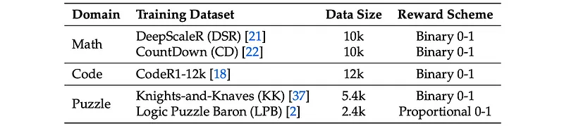 | Datasets for multi-domain training. |
| 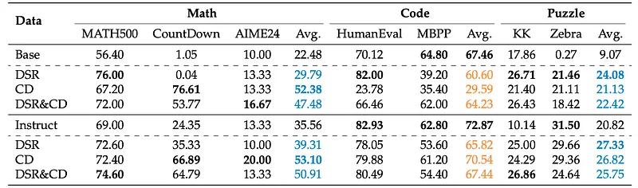 | Model performance (%) after training in the math domain. |
| 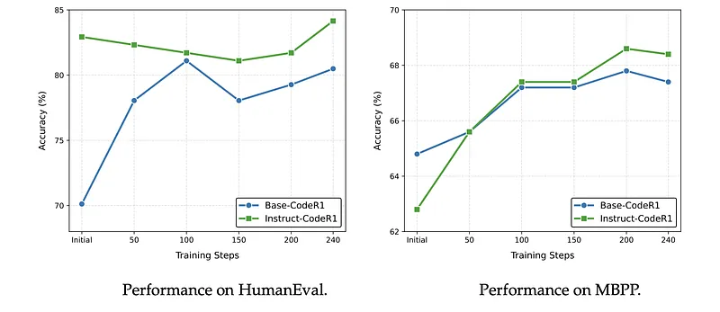 | Models trained on the DSR dataset using the Base model and the Instruct model are represented by the notation Base-DSR and Instruct-DSR,... |
| 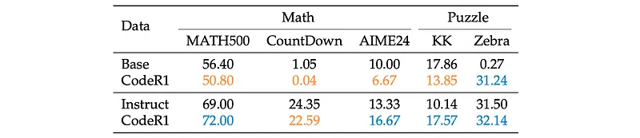 | Model performance (%) after training in the code domain. |
| 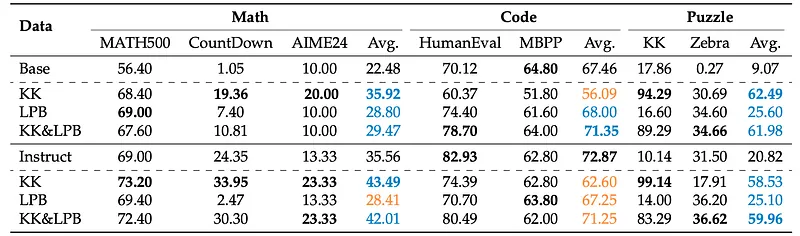 | Model performance (%) after training in the puzzle domain. |
| 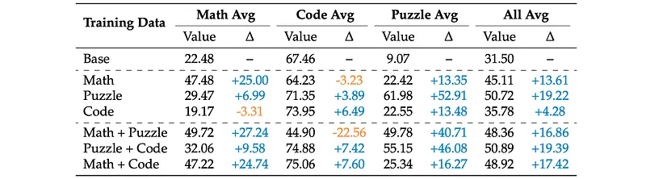 | Performance (%) of the RL model with ∆ compared to Base. |
| 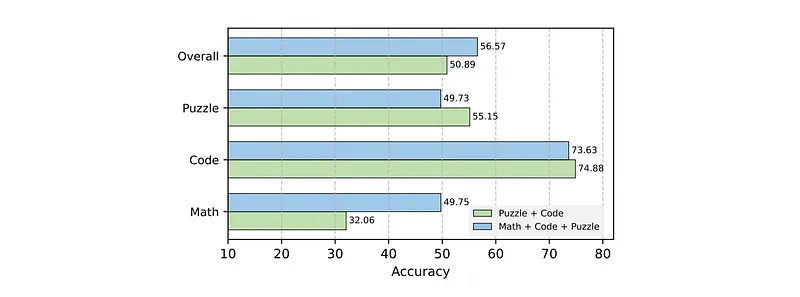 | Performance comparison of tripledomain and optimal dual-domain data. |
| 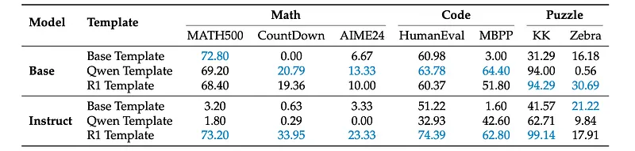 | Model performance under different templates. |
| 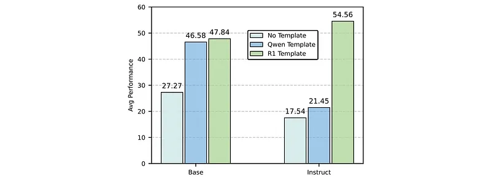 | The average test performance of base and instruct models on different templates. |
| 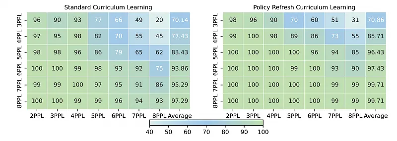 | Model performance on the KK dataset with different curriculum settings. |
| 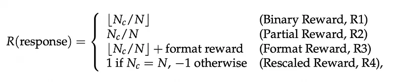 | Formally, for the KK dataset, the reward function R(response) are defined as follows. |
| 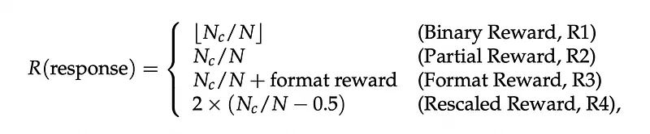 | The reward function for the LPB dataset is defined as follows. |
| 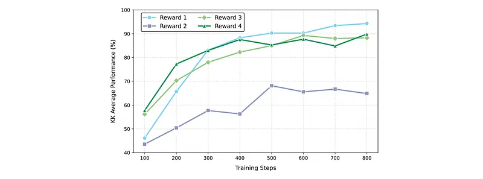 | Performance on KK. |
| 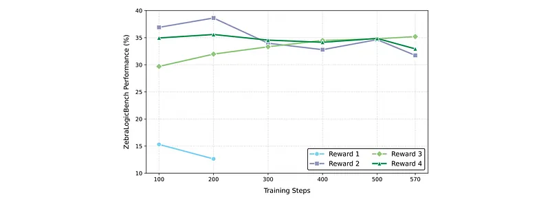 | Performance on LPB. |
| 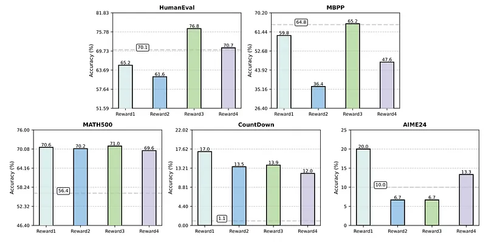 | KK-impact of reward configurations. |
| 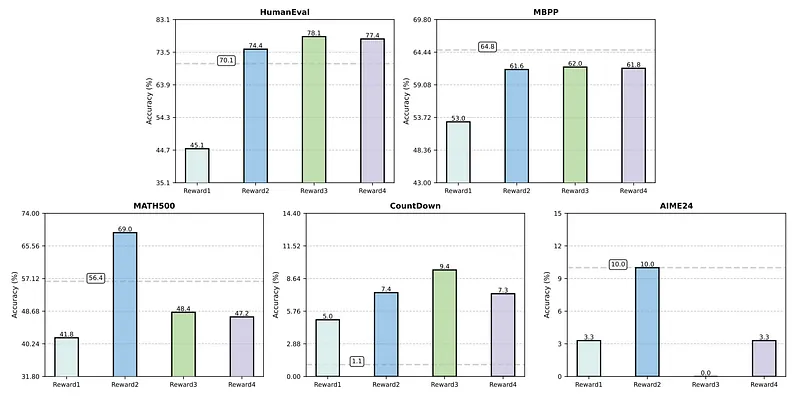 | LPB-impact of reward configurations (base model shown with dashed lines). |
| 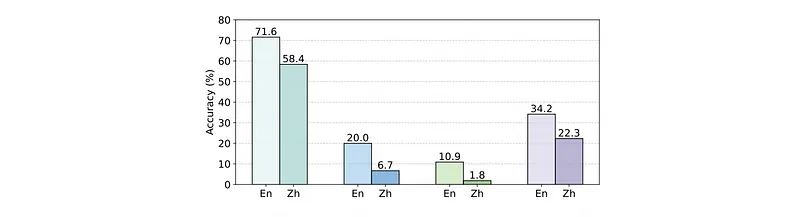 | The effect of different training language. |
## Related

- [[Papers Explained Corpus]]
- [[Reasoning Models]]
- [[Reinforcement Learning Topic]]
- [[Code Models]]
- [[Large Language Models]]
- [[Evaluation and Benchmarks]]
- [[Reinforcement Learning]]
- [[Supervised Fine-Tuning]]
- [[Verifier-Bounded Learning]]
- [[Papers Explained 440 - OpenCodeReasoning-II]]
- [[Papers Explained 442 - Examining Citation Relationships using LLMs]]

#summary #topic
