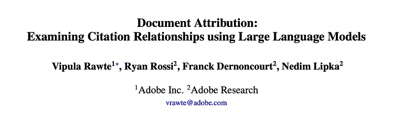
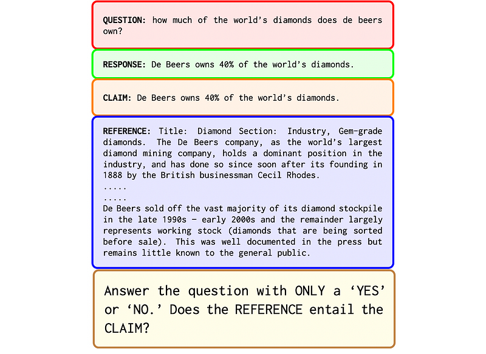
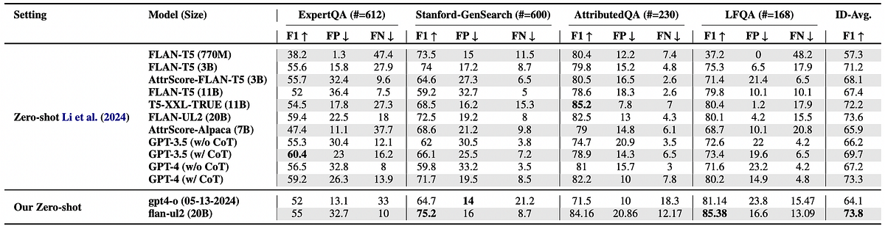
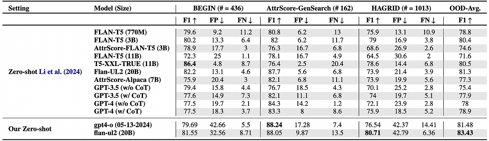
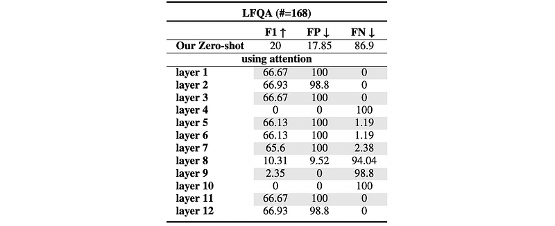

# Papers Explained 442 - Examining Citation Relationships using LLMs

This paper addresses the challenge of ensuring the trustworthiness and interpretability of LLMs when applied to document-based tasks such as summarization, question answering, and information extraction.

This page ingests the source article into the wiki and connects it to [[Papers Explained Corpus]], [[Large Language Models]], [[Document AI]], [[Evaluation and Benchmarks]], [[Synthetic Data]], [[Model Compression and Efficiency]].

## Source Metadata

- Source file: `raw/2025-08-29_Papers-Explained-442--Examining-Citation-Relationships-using-LLMs-cfc3e9bda93f.html`
- Source title: Papers Explained 442: Examining Citation Relationships using LLMs
- Published: 2025-08-29
- Canonical: [https://medium.com/@ritvik19/papers-explained-442-examining-citation-relationships-using-llms-cfc3e9bda93f](https://medium.com/@ritvik19/papers-explained-442-examining-citation-relationships-using-llms-cfc3e9bda93f)

## Key Ideas

- The paper proposes and evaluates two techniques: a zero-shot approach framing attribution as textual entailment (using flan-ul2) and an attention-based binary classification technique (using flan-t5-small).
- The attribution task is defined as a binary classifica- tion problem, where the objective is to determine whether a given claim is attributable to its associated references.
- This attribution task is framed as a textual entailment problem to ensure simplicity and efficiency.
- Here, S1 entails S2 if the meaning of S1 logically supports or guarantees the truth of S2.
- Experiments are designed using the flan-t5-small model, to analyze attention layers in addressing the attribution task. Attention weights from each layer were utilized as input to a fully connected layer for binary attribution classification.

## Notes

This paper addresses the challenge of ensuring the trustworthiness and interpretability of LLMs when applied to document-based tasks such as summarization, question answering, and information extraction. The focus is on attribution, which involves tracing the generated outputs back to their source documents to verify the information’s provenance and ensure accuracy and reliability.

The paper proposes and evaluates two techniques: a zero-shot approach framing attribution as textual entailment (using flan-ul2) and an attention-based binary classification technique (using flan-t5-small).

## Method and Experimental Setup

The attribution task is defined as a binary classifica- tion problem, where the objective is to determine whether a given claim is attributable to its associated references.

### Zero-shot Textual Entailment

This attribution task is framed as a textual entailment problem to ensure simplicity and efficiency. Textual entailment refers to the relationship between two text fragments, typically a premise and a hypothesis, where the goal is to determine whether the premise entails the hypothesis. Formally, given two sentences S1 (premise) and S2 (hypothesis), textual entailment can be defined as a binary relation Entail(S1, S2), where:

Here, S1 entails S2 if the meaning of S1 logically supports or guarantees the truth of S2. The task is to model this relation using techniques, such as deep learning models, to predict this entailment relationship based on a large corpora of annotated text pairs. In this problem formulation, the LLM is tasked with a textual entailment problem.

### Attention-based attribution

Experiments are designed using the flan-t5-small model, to analyze attention layers in addressing the attribution task. Attention weights from each layer were utilized as input to a fully connected layer for binary attribution classification. This was done for all 12 layers.

## Result and Analysis

- The proposed zero-shot method outperforms the baseline in both ID and OOD settings.

*Figure: In distribution zero shot approach on AttributionBench.*

- Flan-ul2 performs better with F1 accuracy metrics in Stanford-GenSearch and the LFQA sub-dataset for ID data.

*Figure: Out ofdistribution zero shot approach on AttributionBench.*

- Flan-ul2 also performs best for OOD tasks, specifically for the AttrScore-GenSearch and HAGRID sub-datasets.

*Figure: Using Attention Layers.*

- Using attention layers on the LFQA attribution subset, F1 scores generally outperform the baseline across nearly all layers, except for layers 4 and 8 to 11.

## Paper

Document Attribution: Examining Citation Relationships using Large Language Models [2505.06324](https://www.arxiv.org/abs/2505.06324)

## Figures

Figures from the Medium HTML export (`raw/2025-08-29_Papers-Explained-442--Examining-Citation-Relationships-using-LLMs-cfc3e9bda93f.html`); local copies under `wiki/assets/papers-explained-442-examining-citation-relationships-using-llms/` when download succeeded.

| Figure | Caption |
|--------|---------|
|  | Title card: Examining Citation Relationships using LLMs. |
|  | This attribution task is framed as a textual entailment problem to ensure simplicity and efficiency. |
|  | Here, S1 entails S2 if the meaning of S1 logically supports or guarantees the truth of S2. |
|  | In distribution zero shot approach on AttributionBench. |
|  | Out ofdistribution zero shot approach on AttributionBench. |
|  | Using Attention Layers. |
## Related

- [[Papers Explained Corpus]]
- [[Large Language Models]]
- [[Document AI]]
- [[Evaluation and Benchmarks]]
- [[Synthetic Data]]
- [[Model Compression and Efficiency]]
- [[Papers Explained 441 - Multi-Domain Reasoning via Reinforcement Learning]]
- [[Papers Explained 443 - Hermes 4]]

#summary #topic
