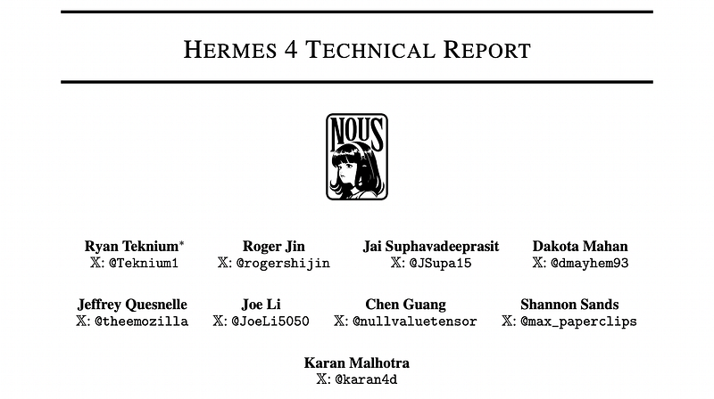
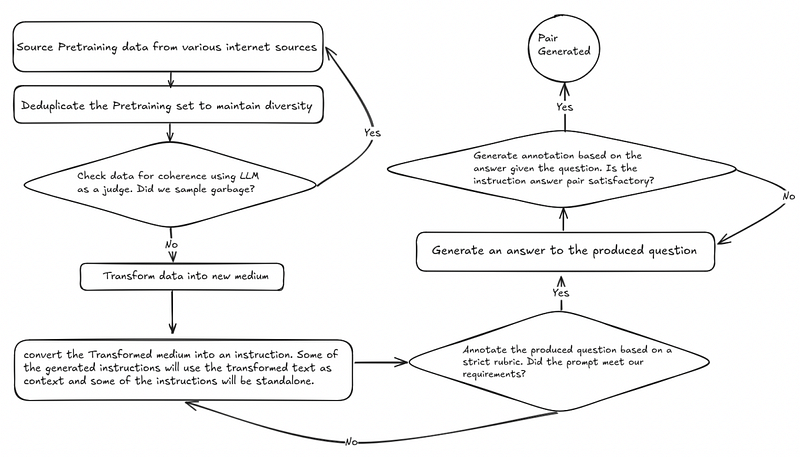
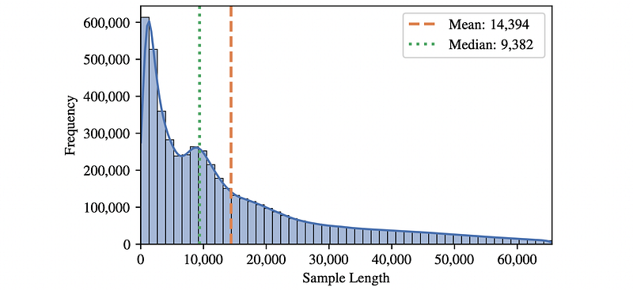
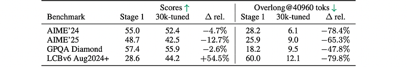
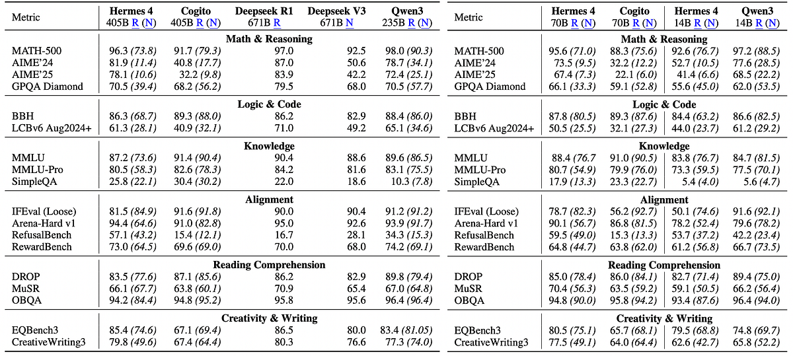

# Papers Explained 443 - Hermes 4

Hermes 4 is a family of hybrid reasoning models that combine structured, multi-step reasoning with broad instruction-following ability. This paper describes the challenges encountered during data curation, synthesis, training, and evaluation, and outlines the solutions employed to address these challenges at scale.

This page ingests the source article into the wiki and connects it to [[Papers Explained Corpus]], [[Reasoning Models]], [[Synthetic Data]], [[Reinforcement Learning Topic]], [[Evaluation and Benchmarks]], [[Model Compression and Efficiency]], [[Reinforcement Learning]].

## Source Metadata

- Source file: `raw/2025-09-01_Papers-Explained-443--Hermes-4-2fba381f0c0a.html`
- Source title: Papers Explained 443: Hermes 4
- Published: 2025-09-01
- Canonical: [https://medium.com/@ritvik19/papers-explained-443-hermes-4-2fba381f0c0a](https://medium.com/@ritvik19/papers-explained-443-hermes-4-2fba381f0c0a)

## Key Ideas

- Hermes 4 is a family of hybrid reasoning models that combine structured, multi-step reasoning with broad instruction-following ability.
- DataForge is a graph-based synthetic data generator used to process pre-training seed data. It is inspired by AgentInstruct and specializes in generating conversational data across a wide variety of tasks.
- DataForge operates via a random walk through a directed acyclic graph (DAG). Each node in the DAG implements a struct → struct map, specifically the Planning Domain Definition Language action interface. Nodes define:
- Preconditions: Requirements that must be met for data to flow into the node.
- Postconditions: Guarantees about the data after it has been processed by the node.

## Notes

Hermes 4 is a family of hybrid reasoning models that combine structured, multi-step reasoning with broad instruction-following ability. This paper describes the challenges encountered during data curation, synthesis, training, and evaluation, and outlines the solutions employed to address these challenges at scale.

## Post-training Data

The Hermes 4 dataset consists primarily of newly synthesized reasoning and non-reasoning data, totaling approximately 5 million samples and 19 billion tokens. The data strategy focused on a hybrid approach, combining a substantial volume of reasoning-focused data with a diverse set of non-reasoning instructions. The dataset is a composite of 3.5 million reasoning samples and 1.6 million non-reasoning samples. A significant portion of the Hermes 3 dataset was retained to ensure continuity in the model’s capabilities. The reasoning samples were intentionally token-heavy, with an average of five times more tokens per sample than their non-reasoning counterparts, accommodating thinking traces up to 16 thousand tokens long.

### DataForge

DataForge is a graph-based synthetic data generator used to process pre-training seed data. It is inspired by AgentInstruct and specializes in generating conversational data across a wide variety of tasks.

DataForge operates via a random walk through a directed acyclic graph (DAG). Each node in the DAG implements a struct → struct map, specifically the Planning Domain Definition Language action interface. Nodes define:

- Preconditions: Requirements that must be met for data to flow into the node.

- Postconditions: Guarantees about the data after it has been processed by the node.

Edges in the DAG are implicit. A directed edge exists from node A to node B if and only if the postconditions guaranteed by node A satisfy the preconditions of node B. This design allows for declarative construction of agent graphs, which facilitates the specification of large and complex structures.

Seed data is drawn from a biased sample of DCLM and FineWeb, with a preference for more recent samples. The data undergoes semantic deduplication using ModernBert [55] embeddings, with a cosine similarity threshold of 0.7. After deduplication, the data is passed through an LLM judge to filter out incomplete or ill-formatted passages.

### Rejection Sampling

Rejection sampling was performed against around a thousand task-specific verifiers using Atropos, an open-source reinforcement learning environment microservice manager. This created a large corpus of verified reasoning trajectories. Following the recipe presented in OpenThoughts, multiple unique trajectories were included to the same verified result. Some are environments are:

Answer Format Training

Generates trajectories rewarded for presenting the final answer succinctly in the user’s requested format. It explicitly decouples format compliance from semantic correctness. A binary reward (1.0 for a valid format, 0.0 for an invalid one). The correctness of the response’s content does not influence this reward.

It strictly enforces the use of <think> and </think> delimiters at the beginning and end of the assistant’s generation.

Examples: Placing math answers in a \boxed{} LaTeX section. Over 150 output formats are sampled.

Instruction Following

Leverages the RLVR-IFEval set of verifiable tasks to create a large set of constraint instructions, such as “Every Nth word of your response must be in French.” These tasks measure types of instruction following evaluated by the IFEval benchmark.

Although the environment implements an adaptive online curriculum training method, for the purpose of this dataset, its use is limited to rejection sampling successful trajectories.

Internbootcamp

Internbootcamp was reformulated into an Atropos environment. Multiple solution trajectories were generated for each task using DeepHermes [50] and larger models. Winning paths were selected based on correctness and adherence to a defined token budget.

The tasks are highly diverse, making this environment ideal for teaching models to approach problems methodically, produce well-structured solutions, and develop general reasoning capabilities.

Schema Adherence

Two Primary Tasks:

- Generation: The model produces a valid JSON object from a natural language prompt and a given schema.

- Editing: The model must identify and correct validation errors within a malformed JSON object.

A key feature is its ability to compile Pydantic models on-the-fly from executable Python code provided in each dataset entry, rather than relying on a fixed set of schemas.

Error Introduction System (for Editing): Programmatically injects a wide range of realistic validation failures, including:

- Type mismatches

- Constraint violations (e.g., string length, numeric bounds)

- Format errors

- Inclusion of extraneous fields

Reward Signal is derived directly from programmatic validation. A binary score of 1.0 is awarded if the model’s output successfully instantiates the target Pydantic model without error, and 0.0 otherwise. A supplemental penalty is applied for excessive length.

Tool Use

Facilitates agentic behavior by training the model to generate interleaved reasoning and tool use. Multiple tool interactions can occur within a single <think> block.

The environment, seeded with tasks from Hermes-function-calling-dataset-v1, intercepts a special <tool_call> token. It executes the specified tool (e.g., a Python interpreter). The result is appended to the context with <tool_response>. The model is then prompted to resume its generation from this new state, allowing it to process the tool’s output and potentially invoke further tools before closing the <think> block. The entire multi-step interaction is contained within a single assistant turn.

Reward is primarily determined by the programmatic verification of the final answer. A small positive reward bonus is explicitly applied for each correctly executed tool call that contributes to the successful answer.

### Finding a covering set

Two techniques are used for generating tasks that cover a target domain:

Taxonomies

It involves generating a hierarchical taxonomy of subdomains and subsubdomains (and so on), where the ultimate leaves of this taxonomy are individual prompts. It is particularly useful for data-scarce domains.

A depth-first-search style recursion is used. An LLM is prompted to enumerate ’n’ subdomains of a given domain, ensuring these subdomains form a partition of the parent domain. The process then recursively delves into these newly identified subdomains. The recursion stops either when a maximum depth is reached or when the LLM determines that a subdomain is indivisible. At these leaf nodes (max depth or indivisible subdomains), the LLM is then prompted to list example prompts relevant to that specific subdomain.

PersonaHub

This technique is applied to domains that involve users or participants. It simulates human behavior by creating and utilizing synthetic personas.

Synthetic personas (e.g., from FinePersonas) are used to generate a variety of application and script implementation tasks. Following task generation, a reasoning trace and an answer can then be synthesized using models like Deepseek-R1 or Deepseek-R1–0528.

## Training

Llama 3.1 405B and 70B are used as base models alongwith Qwen3 14B.

*Figure: Length distribution of samples in the Hermes 4 dataset.*

The final training dataset exhibited a highly heterogeneous distribution of sample lengths. To optimize the efficiency per batch, samples are packed ahead of time using the First-Fit Decreasing method, which achieves a > 99.9% batch efficiency. Flex Attention is used to ensure that attention is restricted to within each sample of the packed batch, and only tokens generated by the “assistant” role contribute to the final cross-entropy loss objective.

### Controlling reasoning length

The 14B model, when evaluated in reasoning mode on LiveCodeBench, reached its maximum context of 40,960 tokens 60% of the time. A second supervised fine-tuning (SFT) stage was implemented. The goal was to teach the model to stop reasoning at 30,000 tokens and then generate an answer.

Synthetic Reasoning Traces are generated from the current policy. A </think> token was inserted at the 30,000-token mark within these traces. The learning signal was concentrated entirely on this single </think> token, not on the preceding reasoning chain. This selective supervision avoids the risks of model collapse (distribution narrowing and quality degradation) identified in synthetic data literature, which can occur from recursive training on full self-generated outputs. Gradient updates were solely concentrated on learning when to emit </think>, leaving the model-generated reasoning tokens untouched. The model essentially learns a “counting behavior” (“after N tokens, stop”) without altering its underlying reasoning distribution. This focused intervention ensures that the effects are minimal and targeted, teaching only the termination criterion rather than new reasoning patterns.

- At a cost of up to 12.7% relative performance reduction in reasoning benchmarks, overlong rates on these same benchmarks are reduced by at least 48.8%.

## Evaluation

An RL environment is an implementation of an evaluation. This duality between RL and evaluation is exploited to implement several of the benchmarks used in Atropos with the following design principles:

Single-file evaluations:

- Each evaluation is implemented as a self-contained Python script.

- These scripts include the core logic, scoring metrics, and configuration defaults.

- While this may lead to some duplication, it significantly enhances transparency and modifiability, allowing researchers to inspect, understand, and adapt an evaluation without navigating a large codebase.

Detailed sample-level logging:

- Atropos provides fine-grained logging of parsing and grading behavior for individual samples.

- These logs explicitly record which span of a model’s output was extracted as the candidate answer, how it was scored, and which competing candidates were rejected.

- This detailed logging aids reproducibility and helps researchers diagnose discrepancies between automated grading and human or LLM-as-a-judge evaluations.

- For example, in internal benchmarking in June 2025, Atropos found a 7.3% disagreement between a popular open-source evaluation framework’s GPQA parser and GPT-4o grading.

Performance-conscious execution:

- Many evaluation frameworks separate execution into a batch inference stage followed by a batch scoring stage, which can cause significant cost overhead, especially for evaluations with lengthy scoring stages (e.g., code generation evaluations with many test cases like LiveCodeBench).

- Atropos does not enforce a specific execution pattern, allowing inference and scoring to be overlapped, thereby improving performance.

A minimal OpenAI client:

- Atropos uses a deliberately lightweight OpenAI-compatible client.

- It prioritizes transparency and predictability over providing a feature-rich abstraction layer spanning many providers.

- This design minimizes the risk of caching or configuration artifacts, making the effects of configuration changes (e.g., temperature, top-p) more directly observable and reducing the likelihood of silent caching errors or unintended query de-duplication.

Explicit error semantics:

- If a request exceeds timeout or retry settings, Atropos defaults to surfacing the error and halting execution, rather than silently scoring the item as incorrect.

- This design choice emphasizes clarity and alerts users to potential deployment bottlenecks.

- Researchers have the option to explicitly override this default if their evaluation requires different semantics.

Hackable configurations:

- Atropos employs pydantic-cli to automatically generate command-line interfaces (CLIs) and YAML configurations from Python dataclass definitions.

- This ensures that extending or modifying evaluations (e.g., adding new configuration parameters like the number of samples per problem) requires only a minimal code change.

- The resulting CLIs are concise, self-documenting, and encourage researcher-driven customization.

Beyond quantitative benchmarks, Hermes 4 demonstrates a level of behavioral plasticity that distinguishes it from other large open-weight models. Its responses are more readily shaped by system-level cues and template modifications, enabling consistent persona embodiment and reduced sycophancy when explicitly instructed.

## Paper

Hermes 4 Technical Report [2508.18255](https://arxiv.org/abs/2508.18255)

## Figures

Figures from the Medium HTML export (`raw/2025-09-01_Papers-Explained-443--Hermes-4-2fba381f0c0a.html`); local copies under `wiki/assets/papers-explained-443-hermes-4/` when download succeeded.

| Figure | Caption |
|--------|---------|
|  | Title card: Hermes 4. |
|  | Seed data is drawn from a biased sample of DCLM and FineWeb, with a preference for more recent samples. |
|  | Length distribution of samples in the Hermes 4 dataset. |
|  | Synthetic Reasoning Traces are generated from the current policy. |
|  | Hackable configurations. |
## Related

- [[Papers Explained Corpus]]
- [[Reasoning Models]]
- [[Synthetic Data]]
- [[Reinforcement Learning Topic]]
- [[Evaluation and Benchmarks]]
- [[Model Compression and Efficiency]]
- [[Reinforcement Learning]]
- [[Papers Explained 442 - Examining Citation Relationships using LLMs]]
- [[Papers Explained 444 - POLARIS]]

#summary #topic
