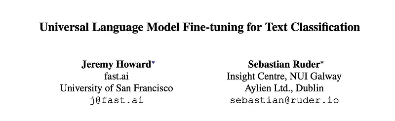
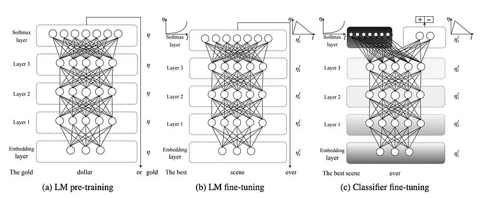
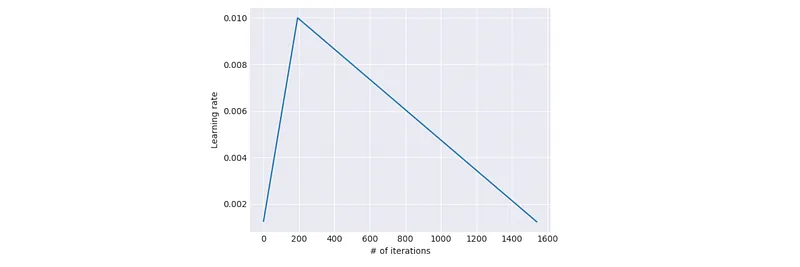
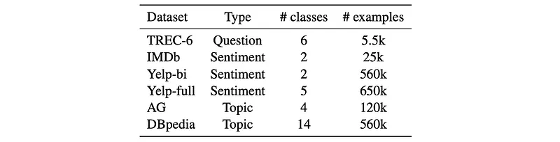
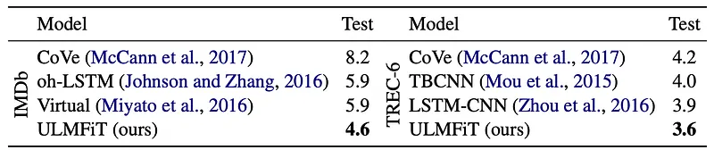
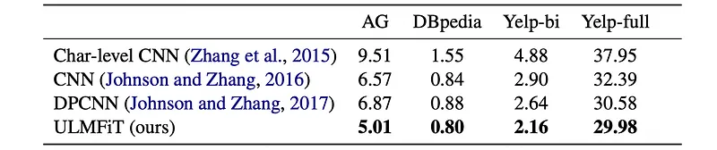

# Papers Explained 447 - ULMFiT

Universal Language Model Fine-tuning (ULMFiT) is an effective transfer learning method that can be applied to any task in NLP. The paper further introduces techniques that are key for fine-tuning a language model.

This page ingests the source article into the wiki and connects it to [[Papers Explained Corpus]], [[Large Language Models]], [[Document AI]], [[Supervised Fine-Tuning]].

## Source Metadata

- Source file: `raw/2025-09-05_Papers-Explained-447--ULMFiT-acc076afe367.md`
- Source title: Papers Explained 447: ULMFiT
- Published: 2025-09-05
- Canonical: [https://medium.com/@ritvik19/papers-explained-447-ulmfit-acc076afe367](https://medium.com/@ritvik19/papers-explained-447-ulmfit-acc076afe367)

## Key Ideas

- ULMFiT pretrains a language model on a large general-domain corpus and fine-tunes it on the target task using novel techniques. The method is universal in the sense that it meets these practical criteria:
- It works across tasks varying in document size, number, and label type
- It uses a single architecture and training process
- It requires no custom feature engineering or preprocessing
- It does not require additional in-domain documents or labels

## Notes

Universal Language Model Fine-tuning (ULMFiT) is an effective transfer learning method that can be applied to any task in NLP. The paper further introduces techniques that are key for fine-tuning a language model.

## Universal Language Model Fine-tuning

Given a static source task T_S and any target task T_T with T_S ̸= T_T, the goal is to improve performance on T_T. Language modeling can be seen as the ideal source task and a counterpart of ImageNet for NLP: It captures many facets of language relevant for downstream tasks, such as long-term dependencies, hierarchical relations, and sentiment. In contrast to tasks like MT and entailment, it provides data in near-unlimited quantities for most domains and languages. Additionally, a pretrained LM can be easily adapted to the specific characteristics of a target task, which significantly improves performance. Formally, language modeling induces a hypothesis space H that should be useful for many other NLP tasks.

ULMFiT pretrains a language model on a large general-domain corpus and fine-tunes it on the target task using novel techniques. The method is universal in the sense that it meets these practical criteria:

- It works across tasks varying in document size, number, and label type

- It uses a single architecture and training process

- It requires no custom feature engineering or preprocessing

- It does not require additional in-domain documents or labels

In the experiments, the state-of-the-art language model AWD-LSTM is used, a regular LSTM (with no attention, short-cut connections, or other sophisticated additions) with various tuned dropout hyperparameters.

ULMFiT consists of the following steps:

- General-domain LM pretraining

- Target task LM fine-tuning

- Target task classifier fine-tuning

### General-domain LM pretraining

An ImageNet-like corpus for language should be large and capture general properties of language. The language model is pretrained on Wikitext-103, consisting of 28,595 preprocessed Wikipedia articles and 103 million words. Pretraining is most beneficial for tasks with small datasets and enables generalization even with 100 labeled examples. While this stage is the most expensive, it only needs to be performed once and improves performance and convergence of downstream models.

### Target task LM fine-tuning

Given a pretrained general-domain LM, the fine tuning stage converges faster as it only needs to adapt to the characteristics of the target data, and it allows us to train a robust LM even for small datasets. Discriminative fine-tuning and slanted triangular learning rates are proposed for fine-tuning the LM.

Discriminative fine-tuning

As different layers capture different types of information, they should be fine-tuned to different extents. To this end, instead of using a single learning rate for all layers, discriminative fine-tuning assigns a different learning rate (ηl) to each layer (θl) of the model. The SGD update for the l-th layer becomes:

Empirical Rule: The learning rate for the last layer (ηL) is chosen first, and then learning rates for lower layers are set as ηl-1 = ηl / 2.6.

Slanted triangular learning rates

To enable the model to quickly converge to a suitable region of the parameter space early in training and then refine its parameters, using the same learning rate (LR) or an annealed learning rate throughout training is not the best way to achieve this behaviour. Instead, slanted triangular learning rates (STLR) first linearly increase the learning rate and then linearly decay it according to the following update schedule.

Where T is the total number of training iterations, cut_frac is the fraction of iterations for LR increase, cut is the iteration where LR switches from increasing to decreasing, p is the fraction of iterations within the increase/decrease phase, ratio specifies how much smaller the lowest LR is from the maximum LR ηmax, and ηt is the learning rate at iteration t.

Generally, cut_frac = 0.1, ratio = 32, and ηmax = 0.01.

*Figure: The slanted triangular learning rate.*

### Target task classifier fine-tuning

For fine-tuning the classifier, the pretrained language model is augmented with two additional linear blocks. Following standard practice for CV classifiers, each block uses batch normalization and dropout, with ReLU activations for the intermediate layer and a softmax activation that outputs a probability distribution over target classes at the last layer.

Concat Pooling

In text classification, crucial information can be contained in a few words anywhere in the document. Relying only on the last hidden state (hT) might lead to information loss, especially for long documents.

The input to the first linear layer of the classifier is a concatenation of the last hidden state (hT) with both the max-pooled and mean-pooled representations of all hidden states (H = {h1, …, hT}) over as many time steps as fit in GPU memory. The concatenated representation is hc = [hT, maxpool(H), meanpool(H)].

Gradual Unfreezing

Fine-tuning all layers at once risks “catastrophic forgetting” of the general language knowledge learned during pretraining. Lower layers tend to contain more general knowledge, while higher layers contain more task-specific knowledge.

Instead of unfreezing all layers simultaneously, layers are gradually unfrozen starting from the last layer (which contains the least general knowledge). The process involves:

- Unfreezing the last layer.

- Fine-tuning all currently unfrozen layers for one epoch.

- Unfreezing the next lower frozen layer.

- Repeating steps 2 and 3 until all layers are unfrozen and fine-tuned until convergence.

BPTT for Text Classification (BPT3C)

To make fine-tuning a classifier feasible for large documents, given that language models are trained with backpropagation through time (BPTT), Documents are divided into fixed-length batches (size b). At the beginning of each batch, the model is initialized with the final state of the previous batch. Hidden states are tracked for mean and max-pooling. Gradients are back-propagated to all batches whose hidden states contributed to the final prediction. In practice, variable length backpropagation sequences are used.

Bidirectional Language Model:

ULMFiT is not limited to unidirectional LMs. For experiments, both a forward and a backward LM are pretrained. A classifier is fine-tuned independently for each LM using BPT3C, and their predictions are then averaged to produce the final output.

## Experiments

The method was evaluated on six widely-studied datasets:

*Figure: Text classification datasets.*

Pre-processing involved standard techniques from earlier work, with additional special tokens for upper-case words, elongation, and repetition to enhance the language model’s capture of relevant aspects.

- On IMDb, the method dramatically reduced the error rate by 43.9% compared to CoVe and 22% compared to the state-of-the-art, notably achieving this with a simpler regular LSTM architecture and dropout, unlike more complex existing models.

- The fine-tuning techniques demonstrated a significant benefit in transferring knowledge from a large corpus, achieving a lower error rate (4.6%) on IMDb compared to another language model fine-tuning approach (7.64%).

- While the improvement on TREC-6 was not statistically significant due to the small test set size, the competitive performance indicated the model’s effectiveness across different dataset sizes and document lengths (ranging from single sentences to several paragraphs).

- The method consistently outperformed CoVe on both IMDb and TREC-6, despite being pretrained on significantly less data (more than two orders of magnitude less) than CoVe.

- On larger datasets, the method achieved significant error reductions compared to the state-of-the-art: 23.7% on AG, 4.8% on DBpedia, 18.2% on Yelp-bi, and 2.0% on Yelp-full.

- The strong performance on IMDb, which is reflective of real-world datasets with multi-paragraph documents and sentiment analysis tasks, highlights the method’s practical applicability for commercial applications.

## Paper

Universal Language Model Fine-tuning for Text Classification [1801.06146](https://arxiv.org/abs/1801.06146)

## Figures

Figures from the Medium HTML export (`raw/2025-09-05_Papers-Explained-447--ULMFiT-acc076afe367.md`); local copies under `wiki/assets/papers-explained-447-ulmfit/` when download succeeded.

| Figure | Caption |
|--------|---------|
|  | Title card: ULMFiT. |
|  | ULMFiT consists of the following steps. |
|  | As different layers capture different types of information, they should be fine-tuned to different extents. |
|  | Slanted triangular learning rates. |
|  | The slanted triangular learning rate. |
|  | Text classification datasets. |
|  | Bidirectional Language Model. |
|  | Bidirectional Language Model. |
## Related

- [[Papers Explained Corpus]]
- [[Large Language Models]]
- [[Document AI]]
- [[Supervised Fine-Tuning]]
- [[Papers Explained 446 - Unary Feedback as Observation]]
- [[Papers Explained 448 - Sparsely-Gated Mixture-of-Experts Layer]]

#summary #topic
