# Papers Explained 448 - Sparsely-Gated Mixture-of-Experts Layer

Computation is saved based on the sparsity of the output of G(x). Wherever G(x)i = 0, Ei(x) need not be computed. If the number of experts is very large, the branching factor can be reduced by using a two-level hierarchical MoE.

This page ingests the source article into the wiki and connects it to [[Papers Explained Corpus]], [[Mixture of Experts]], [[Large Language Models]], [[Model Compression and Efficiency]].

## Source Metadata

- Source file: `raw/2025-09-08_Papers-Explained-448--Sparsely-Gated-Mixture-of-Experts-Layer-e3462e8c0232.html`
- Source title: Papers Explained 448: Sparsely-Gated Mixture-of-Experts Layer
- Published: 2025-09-08
- Canonical: [https://medium.com/@ritvik19/papers-explained-448-sparsely-gated-mixture-of-experts-layer-e3462e8c0232](https://medium.com/@ritvik19/papers-explained-448-sparsely-gated-mixture-of-experts-layer-e3462e8c0232)

## Key Ideas

- Softmax Gating: A simple choice of non-sparse gating function is to multiply the input by a trainable weight matrix Wg and then apply the Softmaxfunction.
- Noisy Top-K Gating: Two components are added to the Softmax gating network: sparsity and noise.
- Large batch sizes are crucial for computational efficiency on modern CPUs and GPUs to amortize the overhead of parameter loads and updates. However, in MoE models, the gating network selects a subset of experts for each example.
- Mixing Data Parallelism and Model Parallelism:
- Standard layers and the gating network are distributed using data parallelism. Only one shared copy of each expert is maintained. Each expert receives a combined batch consisting of relevant examples from all data-parallel input batches.

## Notes

The capacity of a neural network to absorb information is limited by its number of parameters. Conditional computation, where parts of the network are active on a per-example basis, has been proposed in theory as a way of dramatically increasing model capacity without a proportional increase in computation. A Sparsely-Gated Mixture-of-Experts layer (MoE) is introduced, consisting of up to thousands of feed-forward sub-networks. A trainable gating network determines a sparse combination of these experts to use for each example. Model architectures in which a MoE with up to 137 billion parameters is applied convolutionally between stacked LSTM layers are presented.

## The Structure of Mixture-of-Experts Layer

*Figure: A Mixture of Experts (MoE) layer embedded within a recurrent language model.*

The Mixture-of-Experts (MoE) layer consists of a set of n “expert networks” E1,···,En, and a “gating network” G whose output is a sparse n-dimensional vector. The experts are themselves neural networks, each with their own parameters. Although in principle the experts only require acceptance of the same sized inputs and production of the same-sized outputs, initial investigations restrict the models to feed-forward networks with identical architectures but separate parameters. Denote by G(x) and Ei(x) the output of the gating network and the output of the i-th expert network for a given input x. The output y of the MoE module can be written as follows:

Computation is saved based on the sparsity of the output of G(x). Wherever G(x)i = 0, Ei(x) need not be computed. If the number of experts is very large, the branching factor can be reduced by using a two-level hierarchical MoE. In a hierarchical MoE, a primary gating network chooses a sparse weighted combination of “experts”, each of which is itself a secondary mixture-of-experts with its own gating network.

### Gating Network

Softmax Gating: A simple choice of non-sparse gating function is to multiply the input by a trainable weight matrix Wg and then apply the Softmaxfunction.

Noisy Top-K Gating: Two components are added to the Softmax gating network: sparsity and noise. Before taking the softmax function, tunable Gaussian noise is added, then only the top k values are kept, setting the rest to −∞ (which causes the corresponding gate values to equal 0). The sparsity serves to save computation. The amount of noise per component is controlled by a second trainable weight matrix Wnoise.

## Addressing Performance Challenges

### The Shrinking Batch Problem

Large batch sizes are crucial for computational efficiency on modern CPUs and GPUs to amortize the overhead of parameter loads and updates. However, in MoE models, the gating network selects a subset of experts for each example. This results in each expert receiving a much smaller batch, especially as the number of experts increases, leading to inefficiency.

Mixing Data Parallelism and Model Parallelism:

Standard layers and the gating network are distributed using data parallelism. Only one shared copy of each expert is maintained. Each expert receives a combined batch consisting of relevant examples from all data-parallel input batches. If the model is distributed over d devices, and each device processes a batch of size b, each expert receives a batch of approximately kbd/n examples, achieving a factor of d improvement in expert batch size.

In hierarchical MoEs, the primary gating network uses data parallelism, and secondary MoEs use model parallelism, with each secondary MoE residing on one device. This allows increasing the number of experts (and parameters) by proportionally increasing the number of devices.

Taking Advantage of Convolutionality:

In language models, the same MoE is applied to each time step of the previous layer. By waiting for the previous layer to finish, the MoE can be applied to all time steps together as one large batch, increasing the input batch size to the MoE layer by a factor of the number of unrolled time steps.

Increasing Batch Size for a Recurrent MoE:

For recurrent MoEs (e.g., replacing weight matrices in LSTMs with MoEs), the convolutional trick is not applicable because the input to the MoE at one timestep depends on the output of the MoE at the previous timestep.

### Network Bandwidth

Communication overhead, especially sending inputs and outputs of experts across the network, can limit performance.

To this end, the ratio of an expert’s computation to the size of its input and output is ensured to excees the ratio of computational to network capacity of the computing device. Computational efficiency is increased by using a larger hidden layer or more hidden layers within the experts. The ratio of computation to input and output is equal to the size of the hidden layer.

## Balancing Expert Utilization

The gating network tends to converge to a state where it always produces large weights for the same few experts. This imbalance is self-reinforcing, as the favored experts are trained more rapidly and thus are selected even more by the gating network.

The importance of an expert relative to a batch of training examples is defined as the batchwise sum of the gate values for that expert. An additional loss, Limportance, is added to the overall loss function for the model. This loss is equal to the square of the coefficient of variation of the set of importance values, multiplied by a hand-tuned scaling factor wimportance. This additional loss encourages all experts to have equal importance.

While this loss function can ensure equal importance, experts may still receive very different numbers of examples. For example, one expert may receive a few examples with large weights, and another may receive many examples with small weights. This can cause memory and performance problems on distributed hardware. To solve this problem, a second loss function, Lload, is introduced, which ensures balanced loads.

The number of examples received by an expert is a discrete quantity, so it cannot be used in back-propagation. Instead, a smooth estimator Load(X) of the number of examples assigned to each expert for a batch X of inputs is defined. The smoothness allows back-propagation of gradients through the estimator. This is the purpose of the noise term in the gating function. P(x,i) is defined as the probability that G(x)i is nonzero, given a new random choice of noise on element i, but keeping the already-sampled choices of noise on the other elements. To compute P(x,i), it is noted that G(x)i is nonzero if and only if H(x)i is greater than the kth-greatest element of H(x) excluding itself. The probability works out to be:

Where kth_excluding(v, k, i) means the kth highest component of v, excluding component i. Simplifying:

Where Φ is the CDF of the standard normal distribution.

The load loss can now be defined to be the square of the coefficient of variation of the load vector, multiplied by a hand-tuned scaling factor wload.

To avoid out-of-memory errors, it is necessary to initialize the network in a state of approximately equal expert load (since the soft constraints need some time to work). To accomplish this, the matrices Wg and Wnoise are initialized to all zeros, which yields no signal and some noise.

## Evaluation

### Language Modeling (1 Billion Word Benchmark)

Model Architecture: MoE models generally consist of two stacked LSTM layers with a MoE layer between them.

*Figure: Model comparison on 1-Billion-Word Language-Modeling Benchmark.*

- MoE models with similar computational budgets demonstrated significant quality improvements with increased capacity; the largest model (4096 experts) achieved 24% lower perplexity on the test set compared to computationally matched baselines.

- High-capacity MoE models (4 billion parameters) with varied computational budgets consistently outperformed the best previously published LSTM results. Even the fastest MoE model beat the previous state-of-the-art while requiring only 6% of the computation (when controlling for training epochs).

- Computational efficiency for MoE models ranged from 0.74 to 1.56 TFLOPS/GPU, with the highest-computation MoE model being the most efficient.

### Language Modeling (100 Billion Word Google News Corpus)

Trained MoE models with similar computational costs (~8 million ops/timestep) and a wider range of experts (32 to 131072, up to 137 billion parameters).

*Figure: Language modeling on a 100 billion word corpus.*

- On the larger corpus, test perplexity improved significantly up to 65536 experts (68 billion parameters), achieving a 39% reduction compared to the computationally matched baseline.

- Increased model capacity proved more beneficial on larger training sets.

- Performance degraded at 131072 experts, possibly due to excessive sparsity.

- Computational efficiency remained respectable (0.72 TFLOPS/GPU) even with high sparsity (99.994% layer sparsity at 65536 experts).

### Machine Translation (Single Language Pair)

Modified the GNMT model by reducing LSTM layers and inserting MoE layers in both encoder and decoder (up to 2048 experts, adding ~8 billion total parameters).

*Figure: Results on WMT’14 En→ Fr newstest2014.*

*Figure: Results on WMT’14 En → De newstest2014.*

*Figure: Results on the Google Production En→ Fr dataset.*

- MoE models achieved state-of-the-art BLEU scores on WMT’14 En→Fr (40.56) and En→De (26.03), representing significant gains (1.34 and 1.12 BLEU points respectively) over strong GNMT baselines without RL refinement. Perplexity scores were also improved.

- On the Google Production En→Fr dataset, the MoE model achieved a 1.01 higher test BLEU score despite training for only one-sixth of the time compared to the GNMT baseline.

### Multilingual Machine Translation

Trained a single MoE-augmented model on a large combined dataset of twelve language pairs, processing approximately 3 billion sentence pairs.

*Figure: Multilingual Machine Translation.*

- A single MoE-augmented model significantly outperformed the multilingual GNMT model, achieving 19% lower perplexity and higher BLEU scores on 11 of 12 language pairs (up to 5.84 points improvement).

- The MoE model even surpassed monolingual GNMT models on 8 of 12 language pairs, despite a lower computational budget and shorter training time. (Table 5 provides multilingual machine translation results).

- Poor performance on English → Korean was observed, attributed to severe overtraining for rarer language pairs.

## Paper

Outrageously Large Neural Networks: The Sparsely-Gated Mixture-of-Experts Layer [1701.06538](https://arxiv.org/abs/1701.06538)

## Figures

Figures from the Medium HTML export (`raw/2025-09-08_Papers-Explained-448--Sparsely-Gated-Mixture-of-Experts-Layer-e3462e8c0232.html`); local copies under `wiki/assets/papers-explained-448-sparsely-gated-mixture-of-experts-layer/` when download succeeded.

| Figure | Caption |
|--------|---------|
| 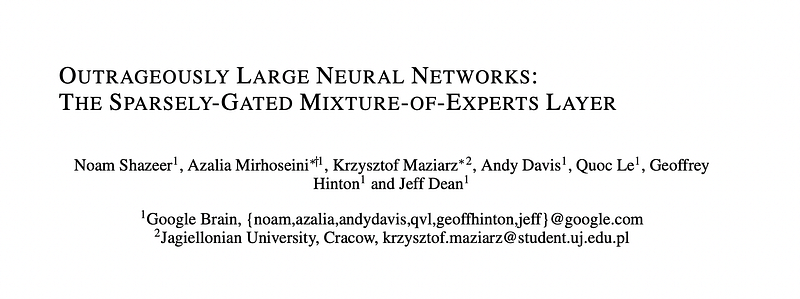 | Title card: Sparsely-Gated Mixture-of-Experts Layer. |
| 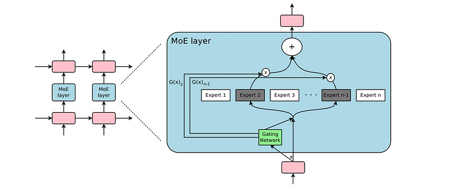 | A Mixture of Experts (MoE) layer embedded within a recurrent language model. |
|  | Computation is saved based on the sparsity of the output of G(x). |
|  | Noisy Top-K Gating: Two components are added to the Softmax gating network: sparsity and noise. |
| 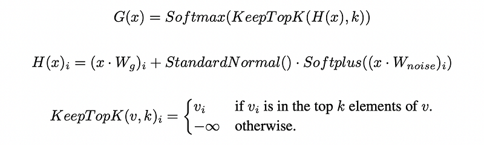 | Noisy Top-K Gating: Two components are added to the Softmax gating network: sparsity and noise. |
| 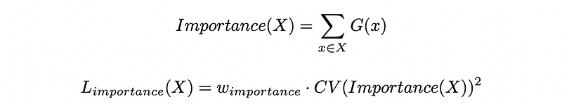 | The importance of an expert relative to a batch of training examples is defined as the batchwise sum of the gate values for that expert. |
| 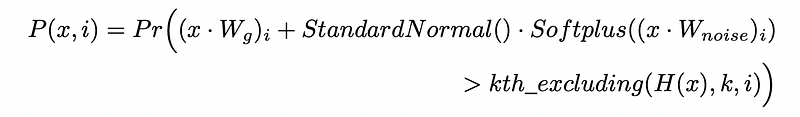 | Where kth_excluding(v, k, i) means the kth highest component of v, excluding component i. Simplifying. |
|  | Where kth_excluding(v, k, i) means the kth highest component of v, excluding component i. Simplifying. |
|  | Increasing Batch Size for a Recurrent MoE. |
|  | The load loss can now be defined to be the square of the coefficient of variation of the load vector, multiplied by a hand-tuned scaling... |
| 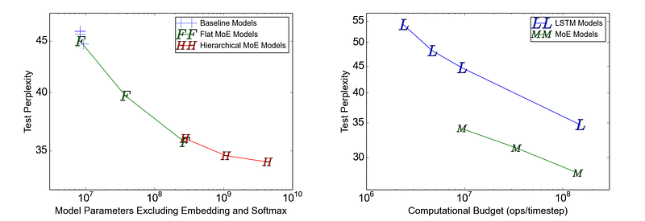 | Model comparison on 1-Billion-Word Language-Modeling Benchmark. |
| 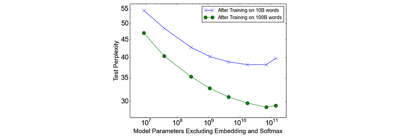 | Language modeling on a 100 billion word corpus. |
| 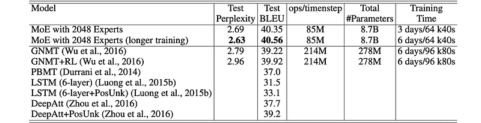 | Results on WMT’14 En→ Fr newstest2014. |
| 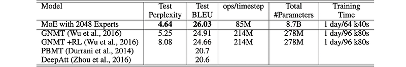 | Results on WMT’14 En → De newstest2014. |
| 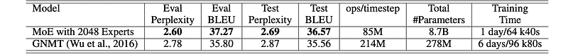 | Results on the Google Production En→ Fr dataset. |
| 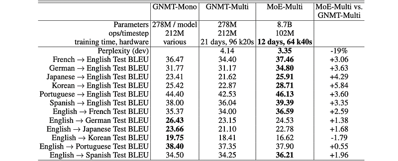 | Multilingual Machine Translation. |
## Related

- [[Papers Explained Corpus]]
- [[Mixture of Experts]]
- [[Large Language Models]]
- [[Model Compression and Efficiency]]
- [[Papers Explained 447 - ULMFiT]]
- [[Papers Explained 449 - Switch Transformers]]

#summary #topic
