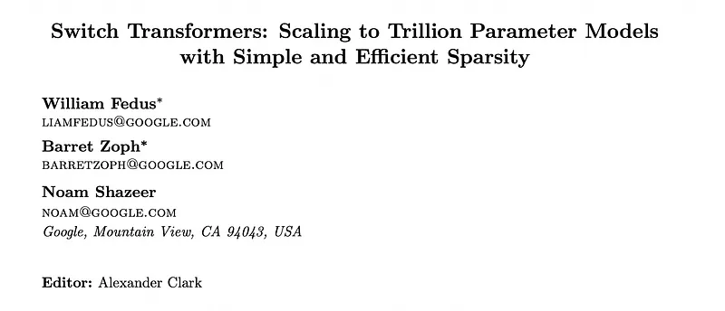
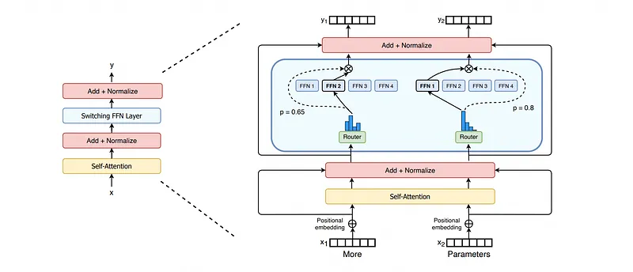
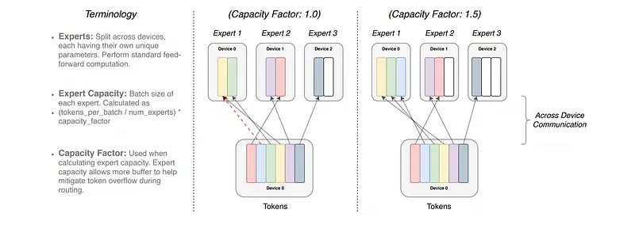
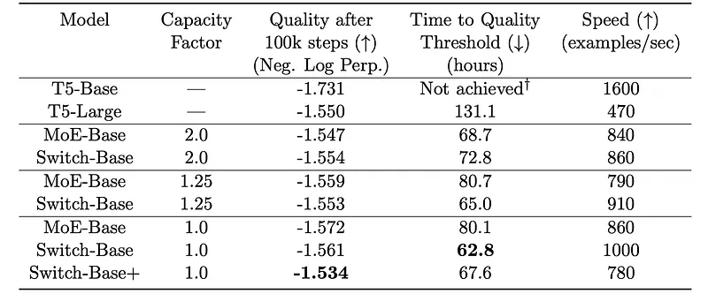
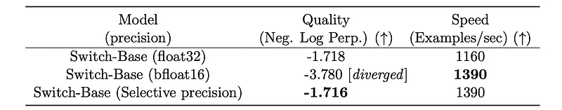
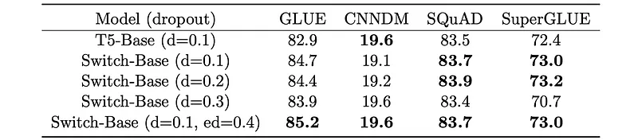
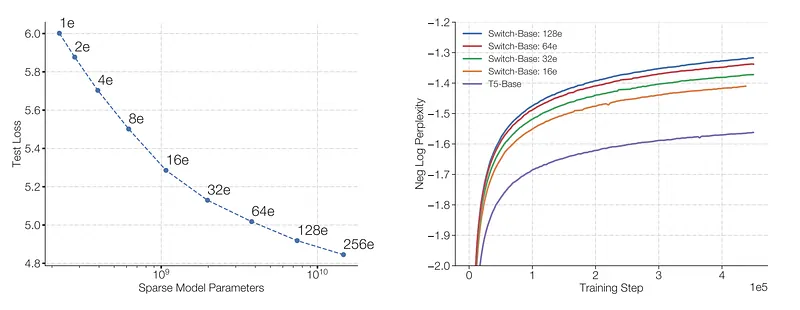
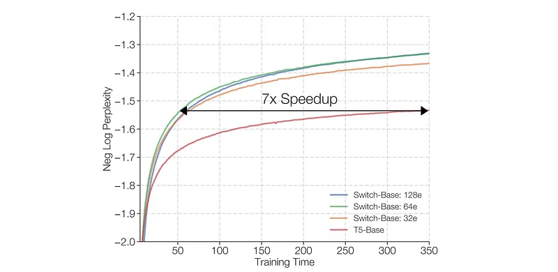
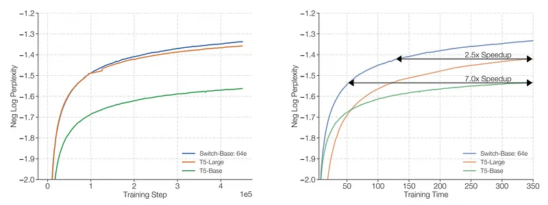

# Papers Explained 449 - Switch Transformers

The core idea behind Switch Transformers is to maximize the number of parameters while keeping the FLOPs per example constant. To achieve this, Switch Transformers employ a sparsely activated model. The Switch Transformer rethinks the “Sparsely-Gated Mixture-of-Experts Layer”.

This page ingests the source article into the wiki and connects it to [[Papers Explained Corpus]], [[Mixture of Experts]], [[Large Language Models]].

## Source Metadata

- Source file: `raw/2025-09-09_Papers-Explained-449--Switch-Transformers-5c3d3d877fb7.md`
- Source title: Papers Explained 449: Switch Transformers
- Published: 2025-09-09
- Canonical: [https://medium.com/@ritvik19/papers-explained-449-switch-transformers-5c3d3d877fb7](https://medium.com/@ritvik19/papers-explained-449-switch-transformers-5c3d3d877fb7)

## Key Ideas

- The core idea behind Switch Transformers is to maximize the number of parameters while keeping the FLOPs per example constant. To achieve this, Switch Transformers employ a sparsely activated model.
- An MoE layer takes a token representation x and routes it to the “best” determined top-k experts from a set of N experts.
- Previous work conjectured that routing to k > 1 experts was necessary for non-trivial gradients to the routing functions, and higher k-values in lower layers were important for models with many routing layers.
- Contrary to prior beliefs, Switch Transformers simplify the routing strategy by routing to only a single expert (k=1). This is referred to as a “Switch layer”. The gate value pi(x) still permits differentiability of the router, even with k=1.
- Reduced Router Computation: Only routing a token to a single expert significantly reduces the computational overhead of the router.

## Notes

Despite several notable successes of MoE, widespread adoption has been hindered by complexity, communication costs, and training instability. These issues are addressed by simplifying the MoE routing algorithm and designing intuitive improved models with reduced communication and computational costs. Proposed training techniques mitigate the instabilities, and large sparse models may be trained, for the first time, with lower precision (bfloat16) formats. Models based off T5-Base and T5-Large are designed to obtain up to 7x increases in pre-training speed with the same computational resources. These improvements extend into multilingual settings where gains are measured over the mT5-Base version across all 101 languages. Finally, the current scale of language models is advanced by pre-training up to trillion parameter models on the “Colossal Clean Crawled Corpus”, achieving a 4x speedup over the T5-XXL model.

## Switch Transformer

*Figure: Illustration of a Switch Transformer encoder block.*

The core idea behind Switch Transformers is to maximize the number of parameters while keeping the FLOPs per example constant. To achieve this, Switch Transformers employ a sparsely activated model. The Switch Transformer rethinks the “Sparsely-Gated Mixture-of-Experts Layer”.

### Mixture-of-Experts (MoE) Routing

An MoE layer takes a token representation x and routes it to the “best” determined top-k experts from a set of N experts. A router variable Wr produces logits h(x) = Wr · x, which are then normalized via a softmax distribution to get gate values pi(x) for each expert. The output is a linearly weighted combination of each selected expert’s computation on the token, weighted by its gate value.

Previous work conjectured that routing to k > 1 experts was necessary for non-trivial gradients to the routing functions, and higher k-values in lower layers were important for models with many routing layers.

### Switch Routing (k=1)

Contrary to prior beliefs, Switch Transformers simplify the routing strategy by routing to only a single expert (k=1). This is referred to as a “Switch layer”. The gate value pi(x) still permits differentiability of the router, even with k=1.

Benefits of k=1 Routing:

- Reduced Router Computation: Only routing a token to a single expert significantly reduces the computational overhead of the router.

- Halved Expert Batch Size: The batch size (expert capacity) of each expert can be at least halved because each token is routed to only one expert.

- Simplified Implementation & Reduced Communication: The overall routing implementation is simplified, leading to reduced communication costs.

*Figure: Illustration of token routing dynamics.*

### Efficient Sparse Routing

Expert Capacity

A critical technical consideration is setting the expert capacity, which is the number of tokens each expert computes.

A value greater than 1.0 creates a buffer to accommodate situations where tokens are not perfectly balanced across experts.

If too many tokens are routed to an expert, exceeding its capacity, computation for these “dropped tokens” is skipped, and their representation is passed directly to the next layer via a residual connection.

While a higher capacity factor reduces dropped tokens, it can lead to wasted computation and memory. Empirically, ensuring lower rates of dropped tokens (typically <1%) is crucial for scaling sparse expert models.

### Differentiable Load Balancing Loss

To encourage a balanced distribution of tokens across experts and prevent some experts from being underutilized or overloaded, an auxiliary load balancing loss is added to the total model loss during training.

- fi: Fraction of tokens dispatched to expert i.

- Pi: Fraction of the router probability allocated for expert i.

This loss is minimized when both f and P vectors have values of 1/N, indicating uniform routing.

The loss is multiplied by the expert count N to keep its magnitude consistent regardless of the number of experts.

A multiplicative coefficient (typically 10^-2) balances the load balancing objective with the primary training objective (e.g., cross-entropy). It’s chosen to be large enough to ensure load balancing but small enough not to overwhelm the main loss.

## Pre-training and Performance Comparison

The first test of the Switch Transformer starts with pre-training on the “Colossal Clean Crawled Corpus” (C4). For the pre-training objective, a masked language modeling task is used. In the pre-training setting, 15% of tokens are dropped out and then the masked sequence is replaced with a single sentinel token. The Switch Transformer model is FLOP-matched to ‘T5-Base’. The MoE Transformer, using top-2 routing, has two experts which each apply a separate FFN to each token and thus its FLOPS are larger. All models were trained for the same number of steps on identical hardware.

*Figure: Benchmarking Switch versus MoE.*

- Switch Transformers outperform both carefully tuned dense models and MoE Transformers on a speed-quality basis. For a fixed amount of computation and wall-clock time, Switch Transformers achieve the best result.

- The Switch Transformer has a smaller computational footprint than the MoE counterpart. If we increase its size to match the training speed of the MoE Transformer, we find this outperforms all MoE and Dense models on a per step basis as well.

- Switch Transformers perform better at lower capacity factors (1.0, 1.25). Smaller expert capacities are indicative of the scenario in the large model regime where model memory is very scarce and the capacity factor will want to be made as small as possible.

## Improved Training and Fine-Tuning Techniques

### Selective Precision with Large Sparse Models

Model instability often forces training with float32 precision throughout, which is computationally expensive.

*Figure: Selective precision.*

The router inputs are selectively cast to float32 precision only within the router function. The resulting dispatch and combine tensors are then recast to bfloat16. This approach provides the stability benefits of float32 for critical router computations without incurring the high communication costs of broadcasting large float32 tensors, achieving nearly equal speed to full bfloat16 training.

### Regularizing Large Sparse Models: Expert Dropout

Switch Transformers have significantly more parameters than FLOP-matched dense baselines, leading to more severe overfitting on smaller fine-tuning tasks.

*Figure: Fine-tuning regularization results.*

A smaller dropout rate (e.g., 0.1) is used at non-expert layers, while a much larger dropout rate (e.g., 0.4) is applied at expert layers. This targeted dropout strategy leads to performance improvements on various downstream tasks, whereas simply increasing dropout across all layers can worsen performance.

## Scaling Properties

To study the scaling properties of the Switch Transformer architecture during pre-training by increasing the number of experts, which keeps the computational cost approximately fixed per token (router computation cost is O(dmodel × num experts)). Scaling properties were analyzed on both a step-basis and a time-basis, maintaining a fixed computational budget.

*Figure: Scaling properties of the Switch Transformer.*

- Consistent Scaling Benefits (Step-Basis): Increasing the number of experts consistently improves performance when training models for a fixed number of steps. More parameters (experts) speed up training while keeping FLOPS per token fixed.

- Improved Sample Efficiency (Step-Basis): Increasing the number of experts leads to more sample-efficient models, meaning they learn more quickly for a fixed number of observed tokens.

- The Switch-Base 64 expert model achieved the same performance as the T5-Base model at 60,000 steps, whereas T5-Base required 450,000 steps, representing a 7.5x speedup in terms of step time.

*Figure: Speed advantage of Switch Transformer.*

- Significant Speed Advantage (Time-Basis): For a fixed training duration and computational budget, Switch Transformers significantly outperform dense Transformer baselines, despite incurring additional communication and routing costs.

*Figure: Scaling Transformer models with Switch layers or with standard dense model scaling.*

- Superiority Over Larger Dense Models: Switch-Base models are more sample efficient and faster even when compared to larger dense models that apply significantly more FLOPs per token.

## Paper

Switch Transformers: Scaling to Trillion Parameter Models with Simple and Efficient Sparsity [2101.03961](https://arxiv.org/abs/2101.03961)

## Figures

Figures from the Medium HTML export (`raw/2025-09-09_Papers-Explained-449--Switch-Transformers-5c3d3d877fb7.md`); local copies under `wiki/assets/papers-explained-449-switch-transformers/` when download succeeded.

| Figure | Caption |
|--------|---------|
|  | Title card: Switch Transformers. |
|  | Illustration of a Switch Transformer encoder block. |
|  | Illustration of token routing dynamics. |
|  | A critical technical consideration is setting the expert capacity, which is the number of tokens each expert computes. |
|  | Expert Capacity. |
|  | Expert Capacity. |
|  | Expert Capacity: This loss is minimized when both f and P vectors have values of 1/N, indicating uniform routing. |
|  | Benchmarking Switch versus MoE. |
|  | Selective precision. |
|  | Fine-tuning regularization results. |
|  | Scaling properties of the Switch Transformer. |
|  | Speed advantage of Switch Transformer. |
|  | Scaling Transformer models with Switch layers or with standard dense model scaling. |
## Related

- [[Papers Explained Corpus]]
- [[Mixture of Experts]]
- [[Large Language Models]]
- [[Papers Explained 448 - Sparsely-Gated Mixture-of-Experts Layer]]
- [[Papers Explained 450 - GLaM]]

#summary #topic
