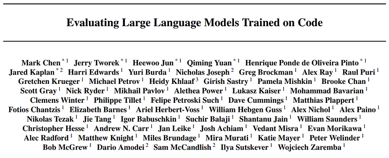
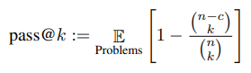
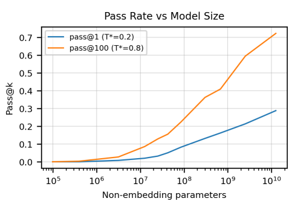
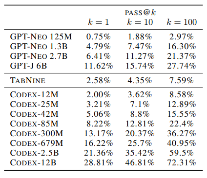
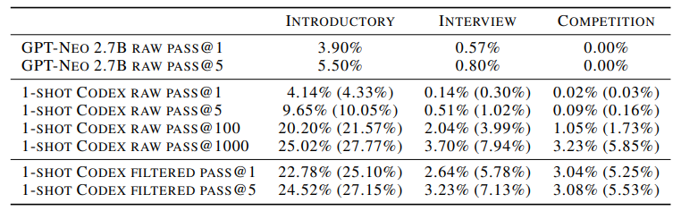
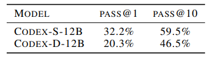

# Papers Explained 45 - Codex

Codex is a GPT language model finetuned on publicly available code from GitHub. A distinct production version of Codex powers GitHub Copilot.

This page ingests the source article into the wiki and connects it to [[Papers Explained Corpus]], [[Code Models]], [[Large Language Models]], [[Synthetic Data]], [[Evaluation and Benchmarks]], [[Multilingual Models]].

## Source Metadata

- Source file: `raw/2023-05-08_Papers-Explained-45--Codex-caca940feb31.html`
- Source title: Papers Explained 45: Codex
- Published: 2023-05-08
- Canonical: [https://medium.com/@ritvik19/papers-explained-45-codex-caca940feb31](https://medium.com/@ritvik19/papers-explained-45-codex-caca940feb31)

## Key Ideas

- Fundamentally, match-based metrics are unable to account for the large and complex space of programs functionally equivalent to a reference solution.
- We evaluate functional correctness using the pass@k metric, where k code samples are generated per problem, a problem is considered solved if any sample passes the unit tests, and the total fraction of problems solved is reported.
- We evaluate functional correctness on a set of 164 handwritten programming problems, which we call the HumanEval dataset. Each problem includes a function signature, docstring, body, and several unit tests, with an average of 7.7 tests per problem.
- Since publicly available programs have unknown intent and generated programs are often incorrect, executing these programs poses a security risk. Indeed, GitHub is known to contain malicious programs that alter or change their environments.
- Therefore, we developed a sandbox environment to safely run untrusted programs against unit tests. Our goals were to prevent these programs from modifying, gaining persistence on, accessing sensitive resources on, or exfiltrating data from a host or network.

## Notes

Codex is a GPT language model finetuned on publicly available code from GitHub. A distinct production version of Codex powers GitHub Copilot. On HumanEval, a new evaluation set we release to measure functional correctness for synthesizing programs from docstrings, our model solves 28.8% of the problems, while GPT-3 solves 0% and GPT-J solves 11.4%.

## Evaluation Framework

### Functional Correctness

Fundamentally, match-based metrics are unable to account for the large and complex space of programs functionally equivalent to a reference solution. As a consequence, recent works in unsupervised code translation and pseudocode-to-code translation have turned to functional correctness instead, where a sample is considered correct if it passes a set of unit tests.

We evaluate functional correctness using the pass@k metric, where k code samples are generated per problem, a problem is considered solved if any sample passes the unit tests, and the total fraction of problems solved is reported. However, computing pass@k in this way can have high variance. Instead, to evaluate pass@k, we generate n ≥ k samples per task (in this paper, we use n = 200 and k ≤ 100), count the number of correct samples c ≤ n which pass unit tests, and calculate the unbiased estimator.

### HumanEval: Hand-Written Evaluation Set

We evaluate functional correctness on a set of 164 handwritten programming problems, which we call the HumanEval dataset. Each problem includes a function signature, docstring, body, and several unit tests, with an average of 7.7 tests per problem. The dataset can be found at https://www.github.com/openai/human-eval.

### Sandbox for Executing Generated Programs

Since publicly available programs have unknown intent and generated programs are often incorrect, executing these programs poses a security risk. Indeed, GitHub is known to contain malicious programs that alter or change their environments.

Therefore, we developed a sandbox environment to safely run untrusted programs against unit tests. Our goals were to prevent these programs from modifying, gaining persistence on, accessing sensitive resources on, or exfiltrating data from a host or network.

## Code Fine-Tuning

We fine-tune GPT models containing up to 12B parameters on code to produce Codex. In contrast with GPT, Codex displays non-trivial performance on the HumanEval dataset.

### Data Collection

Our training dataset was collected in May 2020 from 54 million public software repositories hosted on GitHub, containing 179 GB of unique Python files under 1 MB. We filtered out files that were likely auto-generated, had an average line length greater than 100, had a maximum line length greater than 1000, or contained a small percentage of alphanumeric characters. After filtering, our final dataset totaled 159 GB.

### Methods

Since Codex is evaluated on natural language prompts, we hypothesized that it would be beneficial to fine-tune from the GPT-3 model family, which already contains strong natural language representations.

Surprisingly, we did not observe improvements when starting from a pre-trained language model, possibly because the finetuning dataset is so large. Nevertheless, models fine-tuned from GPT converge more quickly, so we apply this strategy for all subsequent experiments.

### Results

*Figure: Using the optimal temperatures 0.2 and 0.8 for pass@1 and pass@100, we plot these two metrics as a function of model size. Performance appears to scale smoothly as a sigmoid in logparameters.*

*Figure: Codex, GPT-Neo, & TabNine evaluations for HumanEval. We find that GPT-J pass@1 is between Codex-85M and Codex300M performance.*

*Figure: Finetuned GPT-Neo numbers from the APPS paper. For Codex-12B, the number of passing programs that timeout on some test is in the bracket. We used temperature 0.6 for sampling to cover all k in pass@k, so raw pass@1 results could be improved with lower temperature.*

## Supervised Fine-Tuning

In addition to standalone functions, Python code found on GitHub contains class implementations, configuration files, scripts, and even files used to store data. This code is seemingly unrelated to synthesizing functions from docstrings, and we hypothesize that the distribution mismatch reduces HumanEval performance.

In order to adapt Codex to the distribution of the task of interest, we construct a set of training problems from correctly implemented standalone functions and use them for additional supervised fine-tuning.

We call the supervised fine-tuned models Codex-S.

### Problems from Competitive Programming

We collected problem statements, function signatures, and solutions from several popular programming contests and interview preparation websites. We then assembled these into programming tasks similar to HumanEval, using the problem description as the docstring. Since complete test suites are often hidden, we created unit tests from examples found in the problem statements or extracted additional test cases by submitting incorrect solutions. In total, we curated 10,000 problems in this way.

### Problems from Continuous Integration

We curated programming problems from open-source projects. Taking advantage of sys.setprofile, we were able to trace and collect inputs and outputs for all functions called during integration tests. This data could then be used to create unit tests for the functions.

Projects that employ continuous integration (CI) are ideal candidates for tracing. We follow the commands in the CI configuration files, which contain build and test commands, to set up the virtual environments, install dependencies, and run integration tests.

We considered GitHub repos using travis and tox as their CI frameworks, as they are two of the most popular CI tools. We additionally used publicly available source code from pip packages found in the Python package index (PyPI).

While there are millions of potential functions to curate problems from, we only collected about 40,000 because not all functions accept inputs and return outputs.

## Docstring Generation

Generating code from docstrings is possible with Codex because code typically follows after a docstring, but it is not easy to induce Codex to generate docstrings from code.

For each training problem, we assemble a training example by concatenating the function signature, the reference solution, and then the docstring. Just as we train Codex-S by minimizing the negative log-likelihood of the reference solution, we train the docstring generating models Codex-D by minimizing the negative log-likelihood of the docstring.

*Figure: Pass rates for our docstring generating model Codex-D, which is evaluated by hand-grading 10 samples per task due to the lack of a ground-truth automatic evaluation. We find similar but lower pass-rates compared to Codex-S.*

## Paper

Evaluating Large Language Models Trained on Code [2107.03374](https://arxiv.org/abs/2107.03374)

## Figures

Figures from the Medium HTML export (`raw/2023-05-08_Papers-Explained-45--Codex-caca940feb31.html`); local copies under `wiki/assets/papers-explained-45-codex/` when download succeeded.

| Figure | Caption |
|--------|---------|
|  | Title card: Codex. |
|  | Functional Correctness. |
|  | Using the optimal temperatures 0.2 and 0.8 for pass@1 and pass@100, we plot these two metrics as a function of model size. Performance appears to scale smoothly as a sigmoid in logparameters. |
|  | Codex, GPT-Neo, & TabNine evaluations for HumanEval. We find that GPT-J pass@1 is between Codex-85M and Codex300M performance. |
|  | Finetuned GPT-Neo numbers from the APPS paper. For Codex-12B, the number of passing programs that timeout on some test is in the bracket. We used temperature 0.6 for sampling to cover all k in pass@k, so raw pass@1 results could be improved with lower temperature. |
|  | Pass rates for our docstring generating model Codex-D, which is evaluated by hand-grading 10 samples per task due to the lack of a ground-truth automatic evaluation. We find similar but lower pass-rates compared to Codex-S. |
## Related

- [[Papers Explained Corpus]]
- [[Code Models]]
- [[Large Language Models]]
- [[Synthetic Data]]
- [[Evaluation and Benchmarks]]
- [[Multilingual Models]]
- [[Papers Explained 44 - T5]]
- [[Papers Explained 46 - FLAN]]

#summary #topic
