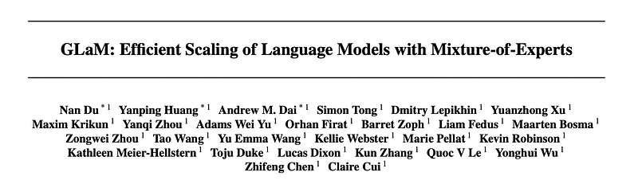
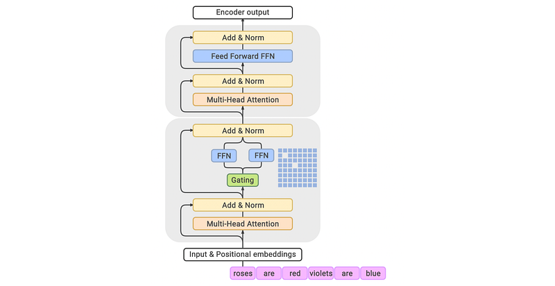
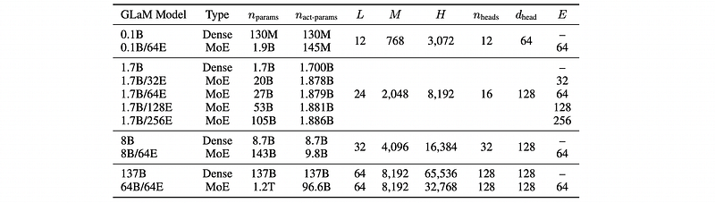
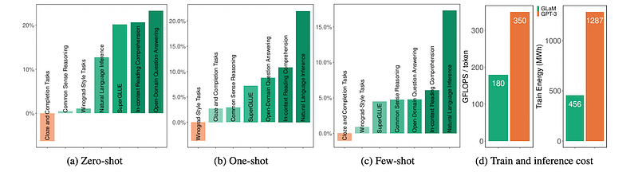
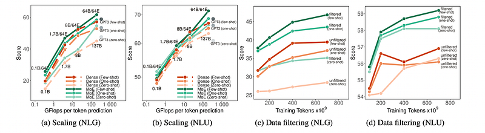
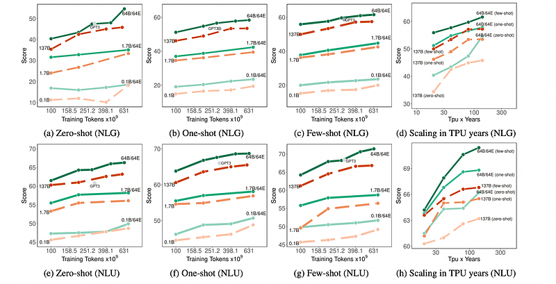

# Papers Explained 450 - GLaM

GLaM (Generalist Language Model) is a family of language models that utilizes a sparsely activated mixture-of-experts architecture to scale model capacity while reducing training costs compared to dense models.

This page ingests the source article into the wiki and connects it to [[Papers Explained Corpus]], [[Large Language Models]], [[Mixture of Experts]], [[Synthetic Data]], [[Model Compression and Efficiency]], [[Embedding and Retrieval]].

## Source Metadata

- Source file: `raw/2025-09-10_Papers-Explained-450--GLaM-c02044027ba0.html`
- Source title: Papers Explained 450: GLaM
- Published: 2025-09-10
- Canonical: [https://medium.com/@ritvik19/papers-explained-450-glam-c02044027ba0](https://medium.com/@ritvik19/papers-explained-450-glam-c02044027ba0)

## Key Ideas

- The model was trained on a high-quality dataset of 1.6 trillion tokens, designed to be representative of a wide range of natural language use cases.The dataset primarily consists of web pages, supplemented with books, Wikipedia pages, forums, news pages, and...
- A text quality classifier was developed to filter web pages, distinguishing between curated text (Wikipedia, books, selected websites) and other web pages. This classifier uses a feature hash based linear classifier for inference speed.
- A Pareto distribution was used to sample web pages based on their quality score, allowing inclusion of some lower-quality pages to prevent systematic biases in the classifier.
- Additional modifications to the original Transformer architecture include replacing the standard positional embedding with per-layer relative positional bias.
- Several variants of GLaM are trained to study the behavior of MoE and dense models ranging from 130 million parameters to 1.2 trillion parameters on the same training data.

## Notes

GLaM (Generalist Language Model) is a family of language models that utilizes a sparsely activated mixture-of-experts architecture to scale model capacity while reducing training costs compared to dense models. The largest GLaM has 1.2 trillion parameters, approximately 7x larger than GPT-3, but consumes only 1/3 of the energy and requires half the computation FLOPs for inference.

## Training Dataset

The model was trained on a high-quality dataset of 1.6 trillion tokens, designed to be representative of a wide range of natural language use cases.The dataset primarily consists of web pages, supplemented with books, Wikipedia pages, forums, news pages, and public domain social media conversations.

A text quality classifier was developed to filter web pages, distinguishing between curated text (Wikipedia, books, selected websites) and other web pages. This classifier uses a feature hash based linear classifier for inference speed.

A Pareto distribution was used to sample web pages based on their quality score, allowing inclusion of some lower-quality pages to prevent systematic biases in the classifier.

*Figure: Data and mixture weights in GLaM training set.*

## Model Architecture

*Figure: GLaM model architecture.*

Leveraging sparsely activated Mixture-of-Experts (MoE) in GLaM models involves replacing the feed-forward component of every other Transformer layer with an MoE layer. Each MoE layer consists of a collection of independent feed-forward networks as the ‘experts’. A gating function then uses a softmax activation function to model a probability distribution over these experts. This distribution indicates how well each expert is able to process the incoming input. Each MoE layer’s learnable gating network is trained to use its input to activate the best two experts for each token of an input sequence.

Additional modifications to the original Transformer architecture include replacing the standard positional embedding with per-layer relative positional bias. In the non-MoE Transformer feed-forward sub-layers, the first linear projection and the activation function are replaced with the Gated Linear Unit, which computes the component-wise product of two linear transformations of the input, followed by a Gaussian Error Linear Unit activation function.

Several variants of GLaM are trained to study the behavior of MoE and dense models ranging from 130 million parameters to 1.2 trillion parameters on the same training data.

*Figure: Sizes and architectures of both MoE and dense models trained in the experiments.*

## Evaluation

*Figure: An overview of the percentage change in predictive performance of GLaM (64B/64E) versus GPT-3 (175B).*

- Superior Performance with Higher Efficiency: The GLaM (64B/64E) model achieves performance competitive with or better than the much larger GPT-3 (175B) model across most task categories, while using only half the compute FLOPs during inference.

- Advanced Knowledge Capacity: On the challenging TriviaQA open-domain task, GLaM’s one-shot performance significantly surpasses previous fine-tuned state-of-the-art models and few-shot GPT-3, indicating that its large total parameter count is effective for knowledge absorption.

*Figure: Average zero, one and few-shot performance of GLaM MoE models versus GLaM dense models for similar effective FLOPs per token over the 8 NLG task.*

- Data Quality is Crucial: Training on a high-quality, filtered dataset leads to consistently better performance on both Natural Language Generation (NLG) and Natural Language Understanding (NLU) tasks. The improvement is particularly significant for NLG tasks.

- Effective Scaling of MoE Models: Sparsely activated GLaM MoE models scale more effectively than dense models, outperforming them at larger scales for a similar amount of computation per token.

*Figure: Learning efficiency comparison.*

- Greater Training Efficiency: GLaM models are more data-efficient, requiring significantly fewer tokens to achieve performance comparable to dense models. They also consume far less energy for training; GLaM reached GPT-3’s performance level using only 1/6 of the energy.

## Paper

GLaM: Efficient Scaling of Language Models with Mixture-of-Experts [2112.06905](https://arxiv.org/abs/2112.06905)

## Figures

Figures from the Medium HTML export (`raw/2025-09-10_Papers-Explained-450--GLaM-c02044027ba0.html`); local copies under `wiki/assets/papers-explained-450-glam/` when download succeeded.

| Figure | Caption |
|--------|---------|
|  | Title card: GLaM. |
|  | Data and mixture weights in GLaM training set. |
|  | GLaM model architecture. |
|  | Sizes and architectures of both MoE and dense models trained in the experiments. |
|  | An overview of the percentage change in predictive performance of GLaM (64B/64E) versus GPT-3 (175B). |
|  | Evaluation. |
|  | Average zero, one and few-shot performance of GLaM MoE models versus GLaM dense models for similar effective FLOPs per token over the 8 NLG task. |
|  | Learning efficiency comparison. |
## Related

- [[Papers Explained Corpus]]
- [[Large Language Models]]
- [[Mixture of Experts]]
- [[Synthetic Data]]
- [[Model Compression and Efficiency]]
- [[Embedding and Retrieval]]
- [[Papers Explained 449 - Switch Transformers]]
- [[Papers Explained 451 - Kimi K2]]

#summary #topic
