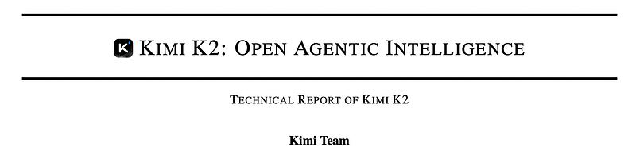
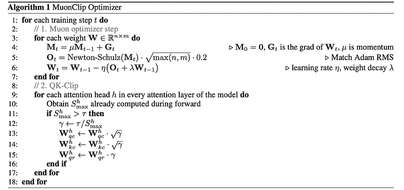
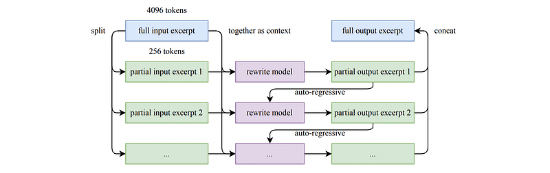
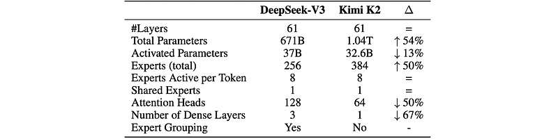
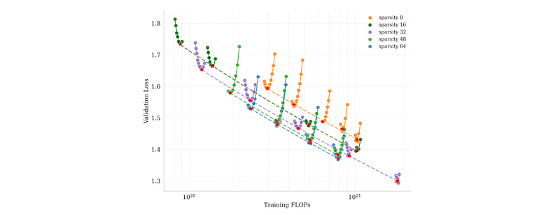
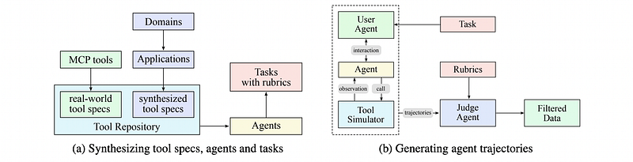
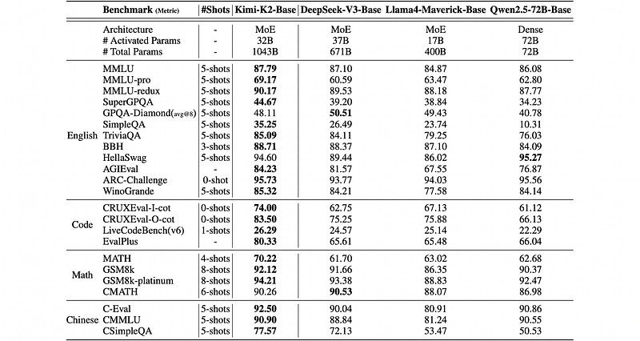
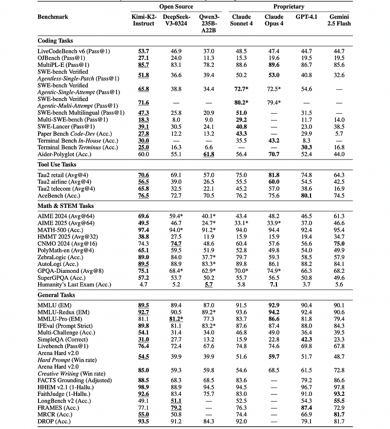

# Papers Explained 451 - Kimi K2

The base and instruct models are available at [HuggingFace](https://huggingface.co/collections/moonshotai/kimi-k2-6871243b990f2af5ba60617d).

This page ingests the source article into the wiki and connects it to [[Papers Explained Corpus]], [[Large Language Models]], [[Vision Language Models]], [[Mixture of Experts]], [[Model Compression and Efficiency]].

## Source Metadata

- Source file: `raw/2025-09-11_Papers-Explained-451--Kimi-K2-05663a5ee4aa.html`
- Source title: Papers Explained 451: Kimi K2
- Published: 2025-09-11
- Canonical: [https://medium.com/@ritvik19/papers-explained-451-kimi-k2-05663a5ee4aa](https://medium.com/@ritvik19/papers-explained-451-kimi-k2-05663a5ee4aa)

## Key Ideas

- Under the same compute budget and model size and therefore the same amount of training data, Muon substantially outperforms AdamW. Despite its efficiency, scaling up Muon training reveals a challenge: training instability due to exploding attention logits.
- The core idea of QK-Clip is to rescale Wk,Wq whenever S^h_max exceeds a target threshold τ. Importantly, this operation does not alter the forward/backward computation in the current step.
- A naïve implementation clips all heads at the same time:
- where γ = min(1,τ/S_max) with S_max = max_h S^h_max, and α is a balancing parameter typically set to 0.5, applying equal scaling to queries and keys.
- However, in practice, only a small subset of heads exhibit exploding logits. To minimize intervention on model training, a per-head scaling factor γh = min(1,τ/S^h_max) is determined and per-head QK-Clip is opted for.

## Notes

Kimi K2 is a Mixture-of-Experts (MoE) large language model with 32 billion activated parameters and 1 trillion total parameters. The MuonClip optimizer is proposed, which improves upon Muon with a novel QK-clip technique to address training instability while enjoying the advanced token efficiency of Muon. During post-training, K2 undergoes a multi-stage post-training process, highlighted by a large-scale agentic data synthesis pipeline and a joint reinforcement learning (RL) stage, where the model improves its capabilities through interactions with real and synthetic environments.

The base and instruct models are available at [HuggingFace](https://huggingface.co/collections/moonshotai/kimi-k2-6871243b990f2af5ba60617d).

## Pretraining

The base model of Kimi K2 is a trillion-parameter mixture-of-experts (MoE) transformer model, pre-trained on 15.5 trillion high-quality tokens. Given the increasingly limited availability of high-quality human data, token efficiency is emerging as a critical coefficient in the scaling of large language models. To address this, a suite of pre-training techniques explicitly designed for maximizing token efficiency is introduced. Specifically, the token-efficient Muon optimizer is employed and its training instabilities are mitigated through the introduction of QK-Clip. Additionally, synthetic data generation is incorporated to further squeeze the intelligence out of available high-quality tokens. The model architecture follows an ultra-sparse MoE with multi-head latent attention (MLA) similar to DeepSeek-V3, derived from empirical scaling law analysis.

### MuonClip: Stable Training with Weight Clipping

Under the same compute budget and model size and therefore the same amount of training data, Muon substantially outperforms AdamW. Despite its efficiency, scaling up Muon training reveals a challenge: training instability due to exploding attention logits. To address this issue, a novel weight-clipping mechanism QK-Clip is proposed to explicitly constrain attention logits. QK-Clip works by rescaling the query and key projection weights post-update to bound the growth of attention logits.

The core idea of QK-Clip is to rescale Wk,Wq whenever S^h_max exceeds a target threshold τ. Importantly, this operation does not alter the forward/backward computation in the current step. The max logit is merely used as a guiding signal to determine the strength to control the weight growth.

Where S^h_max:

A naïve implementation clips all heads at the same time:

where γ = min(1,τ/S_max) with S_max = max_h S^h_max, and α is a balancing parameter typically set to 0.5, applying equal scaling to queries and keys.

However, in practice, only a small subset of heads exhibit exploding logits. To minimize intervention on model training, a per-head scaling factor γh = min(1,τ/S^h_max) is determined and per-head QK-Clip is opted for. Such clipping is straightforward for regular multi-head attention (MHA). For MLA, clipping is applied only on unshared attention head components:

- qC and kC (head-specific components): each scaled by √γh

- qR (head-specific rotary): scaled by γh,

- kR (shared rotary): left untouched to avoid effect across heads.

Muon is integrated with weight decay, consistent RMS matching, and QK-Clip into a single optimizer. This optimizer is referred to as MuonClip.

### Pre-training Data: Improving Token Utility with Rephrasing

Token efficiency in pre-training refers to how much performance improvement is achieved for each token consumed during training. A naive approach to increasing token utility is through repeated exposure to the same tokens, which can lead to overfitting and reduced generalization. A key advancement in the pre-training data of Kimi K2 over Kimi K1.5 is the introduction of a synthetic data generation strategy to increase token utility. Specifically, a carefully designed rephrasing pipeline is employed to amplify the volume of high-quality tokens without inducing significant overfitting.

- To enhance linguistic diversity while maintaining factual integrity, a range of carefully engineered prompts are applied. These prompts guide a large language model to generate faithful rephrasings of the original texts in varied styles and from different perspectives.

- To preserve global coherence and avoid information loss in long documents, a chunk-based autoregressive rewriting strategy is adopted. Texts are divided into segments, rephrased individually, and then stitched back together to form complete passages.

*Figure: Auto-regressive chunk-wise rephrasing pipeline for long input excerpts.*

- To ensure consistency between original and rewritten content, fidelity checks are performed that compare the semantic alignment of each rephrased passage with its source. This serves as an initial quality control step prior to training.

*Figure: SimpleQA Accuracy under three rephrasing-epoch configurations.*

- To enhance mathematical reasoning capabilities, high-quality mathematical documents are rewritten into a “learning-note” style. Data diversity is increased by translating high-quality mathematical materials from other languages into English.

The Kimi K2 pre-training corpus comprises 15.5 trillion tokens of curated, high-quality data spanning four primary domains: Web Text, Code, Mathematics, and Knowledge. Most data processing pipelines follow the methodologies outlined in Kimi K1.5.

## Model Architecture

Kimi K2 is a 1.04 trillion-parameter Mixture-of-Experts (MoE) transformer model with 32 billion activated parameters. The architecture follows a similar design to DeepSeek-V3, employing Multi-head Latent Attention (MLA) as the attention mechanism, with a model hidden dimension of 7168 and an MoE expert hidden dimension of 2048. Scaling law analysis reveals that continued increases in sparsity yield substantial performance improvements, which motivated the increase of the number of experts to 384, compared to 256 in DeepSeek-V3. To reduce computational overhead during inference, the number of attention heads was cut to 64, as opposed to 128 in DeepSeek-V3.

*Figure: Architectural comparison between Kimi K2 and DeepSeek-V3.*

Sparsity Scaling Law

A sparsity scaling law tailored for the Mixture-of-Experts (MoE) model family is developed using Muon. Under a fixed number of activated parameters (i.e., constant FLOPs) increasing the total number of experts (i.e., increasing sparsity) consistently lowers both the training and validation loss, thereby enhancing overall model performance. Though increasing sparsity leads to better performance, this gain comes with increased infrastructure complexity. To balance model performance with cost, a sparsity of 48 for Kimi K2 is adopted, activating 8 out of 384 experts per forward pass.

*Figure: Sparsity Scaling Law.*

The model was pre-trained with a 4,096-token context window using the MuonClip optimizer and the WSD learning rate schedule, processing a total of 15.5T tokens. The first 10T tokens were trained with a constant learning rate of 2e-4 after a 500-step warm-up, followed by 5.5T tokens with a cosine decay from 2e-4 to 2e-5. Weight decay was set to 0.1 throughout. Towards the end of pre-training, an annealing phase followed by a long-context activation stage was conducted. The learning rate decayed from 2e-5 to 7e-6. In this phase, the model was trained on 400 billion tokens with a 4k sequence length, followed by an additional 60 billion tokens with a 32k sequence length. To extend the context window to 128k, the YaRN method was employed.

## Supervised Fine-Tuning

The Muon optimizer is employed in post-training and is recommended for fine-tuning with K2.

A suite of data generation pipelines is developed, tailored to different task domains, utilizing a combination of Human annotation, Prompt engineering, Verification processes.

Candidate responses for various tasks are generated using K1.5 and other in-house domain-specialized expert models. Subsequently, LLMs or human-based judges perform automated quality evaluation and filtering. For agentic data specifically, a dedicated data synthesis pipeline is created to teach models multi-step, interactive reasoning for tool-use capabilities.

Large-Scale Agentic Data Synthesis for Tool Use Learning

Building on advances in synthetic data generation (e.g., AgentInstruct, Self-Instruct, StableToolBench, ZeroSearch) and inspired by ACEBench, a pipeline was developed to simulate real-world tool-use scenarios at scale. This pipeline generates tens of thousands of diverse and high-quality training examples.

The data synthesis pipeline consists of three stages:

- Tool spec generation: A large repository of tool specifications is constructed from both real-world and LLM-synthetic tools.

- Agent and task generation: For each tool-set sampled from the repository, an agent is generated to use that tool-set, along with corresponding tasks.

- Trajectory generation: For each generated agent and task, trajectories are generated where the agent completes the task by invoking tools.

*Figure: Data synthesis pipeline for tool use.*

Domain Evolution and Tool Generation:

- Real-world tools: Over 3000 real MCP (Model Context Protocol) tools are fetched directly from GitHub repositories.

- Synthetic tools: Over 20,000 synthetic tools are systematically evolved through a hierarchical domain generation process. This starts with key categories (e.g., financial trading, software applications, robot control), then evolves multiple specific application domains within each category, and finally synthesizes specialized tools with clear interfaces, descriptions, and operational semantics for each domain.

Agent Diversification:

- Thousands of distinct agents are generated by synthesizing various system prompts and equipping them with different combinations of tools from the repository.

- This creates a diverse population of agents with varied capabilities, areas of expertise, and behavioral patterns, ensuring broad coverage of potential use cases.

Rubric-Based Task Generation:

- Tasks, ranging from simple to complex operations, are generated for each agent configuration.

- Each task is paired with an explicit rubric that specifies success criteria, expected tool-use patterns, and evaluation checkpoints, ensuring consistent and objective evaluation of agent performance.

Multi-turn Trajectory Generation:

- User Simulation: LLM-generated user personas with distinct communication styles and preferences engage in multi-turn dialogues with agents, creating naturalistic interaction patterns.

- Tool Execution Environment: A sophisticated tool simulator (functionally equivalent to a world model) executes tool calls and provides realistic feedback. It maintains and updates state after each tool execution, enabling complex multi-step interactions with persistent effects. It also introduces controlled stochasticity to produce varied outcomes, including successes, partial failures, and edge cases.

Quality Evaluation and Filtering:

- An LLM-based judge evaluates each generated trajectory against the task rubrics.

- Only trajectories that meet the success criteria are retained for training, ensuring high-quality data while allowing natural variation in task-completion strategies.

Hybrid Approach with Real Execution Environments:

- To address the inherent limitation of simulation fidelity, simulated environments are complemented with real execution sandboxes. This is particularly crucial for scenarios like coding and software engineering tasks.

- These real sandboxes execute actual code, interact with genuine development environments, and provide ground-truth feedback through objective metrics such as test suite pass rates.

- This combination ensures models learn from both the diversity of simulated scenarios and the authenticity of real executions, significantly strengthening practical agent capabilities.

## Reinforcement Learning

Reinforcement learning (RL) is believed to have better token efficiency and generalization than SFT. A Gym-like extensible framework is developed that facilitates RL across a wide range of scenarios. The framework is extended with a large number of tasks with verifiable rewards. For tasks that rely on subjective preferences, such as creative writing and open-ended question answering, a self-critic reward is introduced in which the model performs pairwise comparisons to judge its own outputs.

### Verifiable Rewards Gym

Math, STEM and Logical Tasks

The RL data preparation for these domains adheres to two principles: diverse coverage and moderate difficulty.

Diverse Coverage:

- Math and STEM: High-quality QA pairs are collected using expert annotations, internal QA extraction pipelines, and open datasets. A tagging system is used to increase coverage of under-covered domains.

- Logical Tasks: The dataset includes various formats such as structured data tasks (e.g., multi-hop tabular reasoning, cross-table aggregation) and logic puzzles (e.g., the 24-game, Sudoku, riddles, cryptarithms, and Morse-code decoding).

Moderate Difficulty:

- The RL prompt-set is designed to be neither too easy nor too hard to ensure sufficient signal for learning.

- Difficulty is assessed using the SFT model’s pass@k accuracy, and only problems of moderate difficulty are selected.

Complex Instruction Following

Effective instruction following requires understanding explicit constraints, navigating implicit requirements, handling edge cases, and maintaining consistency in dialogues.

Hybrid Verification Framework: Addresses these challenges by combining automated verification with adversarial detection and a scalable curriculum generation pipeline.

Hybrid Rule Verification: Employs two mechanisms:

- Deterministic evaluation via code interpreters for verifiable outputs (e.g., length, style constraints).

- LLM-as-judge evaluation for instructions requiring nuanced understanding.

- An additional “hack-check” layer detects adversarial behaviors where models claim instruction fulfillment without actual compliance.

Multi-Source Instruction Generation: Three distinct strategies ensure comprehensive coverage for training data:

- Expert-crafted complex conditional prompts and rubrics.

- Agentic instruction augmentation (inspired by AutoIF).

- A fine-tuned model specialized for generating instructions that probe specific failure modes or edge cases.

Faithfulness

Faithfulness is crucial for agentic models in scenarios like multi-turn tool use, self-generated reasoning chains, and open-environment interactions.

- A sentence-level faithfulness judge model, inspired by FACTS Grounding, is trained to perform automated verification.

- This judge model detects factual claims without supporting evidence in context and serves as a reward model to enhance overall faithfulness.

Coding & Software Engineering

To enhance capabilities in competition-level programming problems and software engineering tasks:

- Competition-level problems: Problems and their judges are gathered from open-source datasets and synthetic sources. High-quality human-written unit tests from pre-training data are incorporated to ensure synthetic data diversity and reward signal correctness.

- Software engineering tasks: A vast amount of pull requests and issues from GitHub are collected to build a software development environment consisting of user prompts/issues and executable unit tests. This environment is built on a robust sandbox infrastructure powered by Kubernetes, supporting over 10,000 concurrent sandbox instances with stable performance.

Safety

Efforts to enhance safety begin with a human-curated set of seed prompts covering prevalent risk categories (e.g., violence, fraud, discrimination).

An automated prompt evolution pipeline simulates sophisticated jailbreak attempts (e.g., role-playing, literary narratives, academic discourse) with three key components:

- Attack Model: Iteratively generates adversarial prompts to elicit unsafe responses.

- Target Model: Produces responses to these prompts, simulating potential vulnerabilities.

- Judge Model: Evaluates the interaction using a task-specific rubric to determine if the adversarial prompt successfully bypasses safety mechanisms, providing a binary success/failure label.

### Beyond Verification: Self-Critique Rubric Reward

This framework extends model alignment beyond tasks with verifiable rewards to subjective human preferences.

- Purpose: To align LLMs with nuanced human preferences such as helpfulness, creativity, depth of reasoning, factuality, and safety, by extending capabilities learned from verifiable scenarios.

- Mechanism: The Self-Critique Rubric Reward mechanism involves the model evaluating its own outputs to generate preference signals.

- Bootstrapping K2 as a Judge: K2’s critic capability is initialized in the SFT stage using a curated mixture of open-source and in-house preference datasets.

Self-Critiqued Policy Optimization

This is the first core process of the learning loop:

- The K2 actor generates responses for general prompts covering a wide range of use cases.

- The K2 critic then ranks all results by performing pairwise evaluations against a combination of rubrics:

- Core rubrics: Represent fundamental values of the AI assistant.

- Prescriptive rubrics: Aim to eliminate reward hacking.

- Human-annotated rubrics: Crafted for specific instructional contexts.

- K2 can weigh these rubrics against its internal priors, allowing for dynamic and continuous alignment with its evolving on-policy behavior, ensuring coherence with its core identity while adapting to specific instructions.

Closed-Loop Critic Refinement and Alignment

- During RL training, the critic model undergoes continuous refinement:

- The critic model is refined using verifiable signals from on-policy rollouts generated from verifiable-reward prompts.

- This process distills objective performance signals from RLVR directly into the evaluation model, acting as transfer learning.

- This grounds the critic’s more subjective judgments in verifiable data, allowing performance gains from verifiable tasks to enhance its judgment on complex tasks lacking explicit reward signals.

- This closed-loop process ensures the critic continuously recalibrates its evaluation standards in lockstep with the policy’s evolution, leading to robust and scalable alignment with complex, non-verifiable human objectives.

- This holistic alignment yields comprehensive performance improvements across domains like user intent understanding, creative writing, complex reasoning, and nuanced language comprehension.

### RL Algorithm

K2 adopts the policy optimization algorithm introduced in K1.5 as its foundation.

Objective Function: For each problem x, K responses {y1,…,yk} are sampled from the previous policy πold, and the model πθ is optimized with respect to the objective:

where r̄(x) = (1/k) * Σ(i=1 to k) r(x,yi) is the mean reward of sampled responses, and τ > 0 is a regularization parameter for stable learning.

The Muon optimizer is employed to minimize this objective.

To achieve consistent performance improvements across all domains when scaling RL training, several additions are introduced to the RL algorithm:

Budget Control

RL often leads to a substantial increase in the length of model-generated responses, which may not justify inference costs in non-reasoning domains.

A per-sample maximum token budget is enforced throughout RL training, determined by the task type.

Responses exceeding this budget are truncated and assigned a penalty. This significantly enhances the model’s token efficiency, encouraging concise yet effective solutions across all domains.

PTX Loss

During joint RL training there is a potential forgetting of valuable, high-quality data.

A dataset of hand-selected, high-quality samples is curated and integrated into the RL objective through an auxiliary PTX loss. This leverages the advantages of high-quality data, mitigates the risk of overfitting to the limited set of tasks in the training regime, and substantially improves the model’s generalization across a broader range of domains.

Temperature Decay

Initial Stages: A high sampling temperature is used to promote exploration, crucial for tasks like creative writing and complex reasoning. This allows for diverse and innovative responses, facilitating the discovery of effective strategies and reducing premature convergence to suboptimal solutions.

Later Stages/Evaluation: Retaining a high temperature becomes detrimental, introducing excessive randomness and compromising reliability and consistency.

Hence a temperature decay schedule is employed to shift from exploration to exploitation throughout training. This ensures the model leverages exploration when most beneficial, while ultimately converging on stable and high-quality outputs.

## Evaluation

### Pre-training Evaluations

*Figure: Performance comparison of Kimi-K2-Base.*

- Kimi-K2-Base achieves state-of-the-art performance across the majority of evaluated tasks, establishing it as a leading foundation model in the open-source landscape.

- It achieves state-of-the-art performance on 10 out of 12 English language benchmarks, significantly outperforming all baselines in general language understanding.

- Kimi-K2-Base sets new standards with leading performance across all coding metrics, demonstrating superior code generation and comprehension abilities.

- Kimi-K2-Base exhibits exceptional mathematical capabilities, leading on three out of four benchmarks.

- The model demonstrates superior multilingual capabilities, achieving state-of-the-art results across all Chinese language benchmarks.

### Post-training Evaluations

*Figure: Performance comparison of Kimi-K2-Instruct.*

- Kimi-K2-Instruct achieved state-of-the-art open-source performance on real-world SWE tasks, outperforming most baselines on SWE-bench Verified, SWE-bench Multilingual, and SWE-lancer.

- It also leads among all models on competitive coding benchmarks like LiveCodeBench v6 and OJBench.

- On multi-turn tool-use benchmarks, it sets a new standard, substantially outperforming all baselines on τ2-Bench and ACEBench.

- It exhibits strong, balanced performance across general knowledge, math, instruction following, and long-context tasks, surpassing open-source peers on SimpleQA, MMLU, and MMLU-Redux, and leading all models on instruction benchmarks like IFEval and Multi-Challenge.

- Kimi-K2-Instruct achieves top-tier scores in math and STEM, and remains competitive on long-context factuality and retrieval.

- Kimi-K2-Instruct ranks as the top-1 open-source model and 5th overall on the LMSYS Arena leaderboard.

## Paper

Kimi K2: Open Agentic Intelligence [2507.20534](https://arxiv.org/abs/2507.20534)

## Figures

Figures from the Medium HTML export (`raw/2025-09-11_Papers-Explained-451--Kimi-K2-05663a5ee4aa.html`); local copies under `wiki/assets/papers-explained-451-kimi-k2/` when download succeeded.

| Figure | Caption |
|--------|---------|
|  | Title card: Kimi K2. |
|  | Where S^h_max. |
|  | A naïve implementation clips all heads at the same time. |
|  | Muon is integrated with weight decay, consistent RMS matching, and QK-Clip into a single optimizer. |
|  | Auto-regressive chunk-wise rephrasing pipeline for long input excerpts. |
|  | SimpleQA Accuracy under three rephrasing-epoch configurations. |
|  | Architectural comparison between Kimi K2 and DeepSeek-V3. |
|  | Sparsity Scaling Law. |
|  | Data synthesis pipeline for tool use. |
|  | Closed-Loop Critic Refinement and Alignment. |
|  | Performance comparison of Kimi-K2-Base. |
|  | Performance comparison of Kimi-K2-Instruct. |
## Related

- [[Papers Explained Corpus]]
- [[Large Language Models]]
- [[Vision Language Models]]
- [[Mixture of Experts]]
- [[Model Compression and Efficiency]]
- [[Papers Explained 450 - GLaM]]
- [[Papers Explained 452 - Apriel-Nemotron-15B-Thinker]]

#summary #topic
