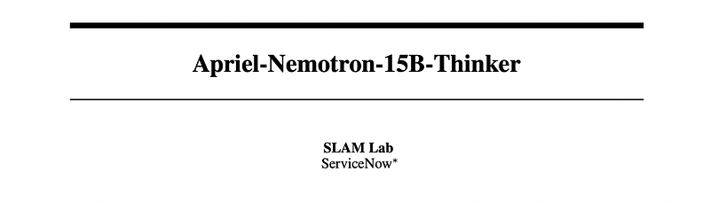
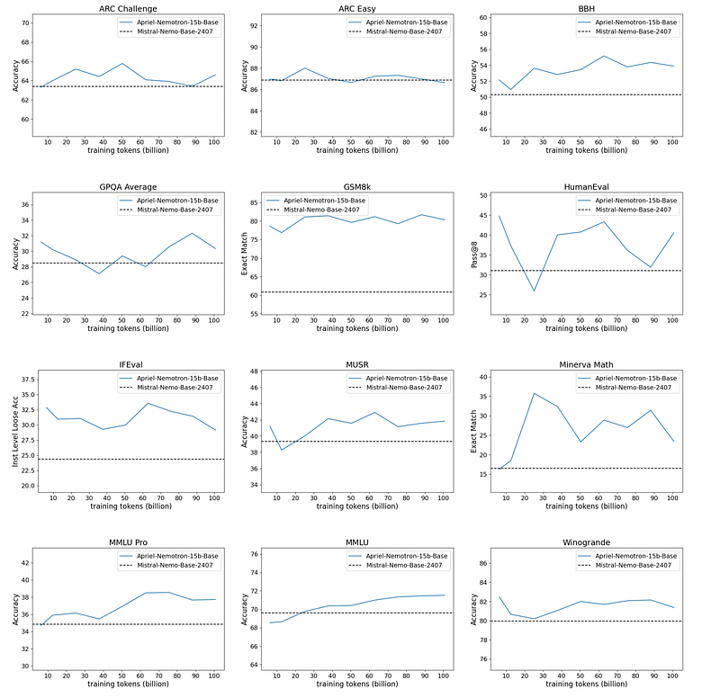
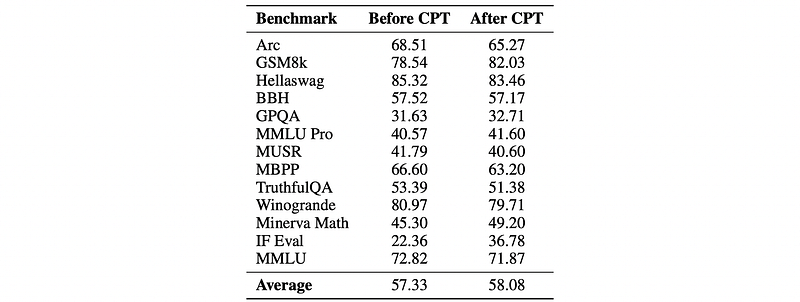
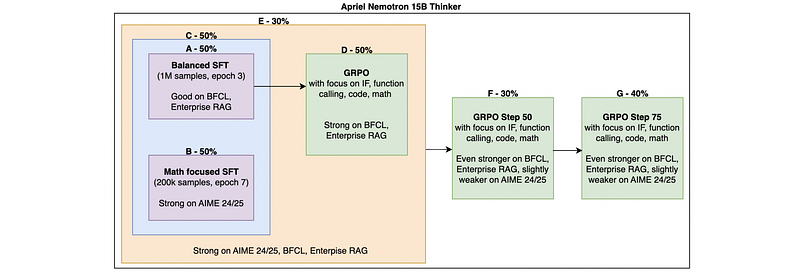
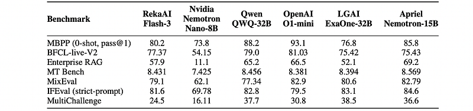
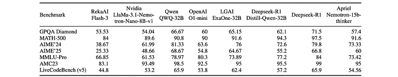
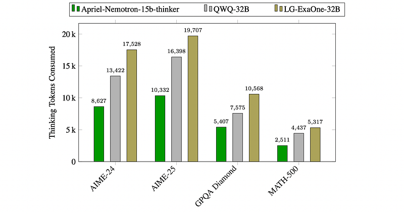

# Papers Explained 452 - Apriel-Nemotron-15B-Thinker

Apriel-Nemotron-15B-Thinker is a 15B parameter model in the ServiceNow Apriel SLM series. It is trained in a four stage training pipeline including

This page ingests the source article into the wiki and connects it to [[Papers Explained Corpus]], [[Large Language Models]], [[Synthetic Data]], [[Reasoning Models]], [[Code Models]], [[Supervised Fine-Tuning]].

## Source Metadata

- Source file: `raw/2025-09-12_Papers-Explained-452--Apriel-Nemotron-15B-Thinker-463f8f4b5045.html`
- Source title: Papers Explained 452: Apriel-Nemotron-15B-Thinker
- Published: 2025-09-12
- Canonical: [https://medium.com/@ritvik19/papers-explained-452-apriel-nemotron-15b-thinker-463f8f4b5045](https://medium.com/@ritvik19/papers-explained-452-apriel-nemotron-15b-thinker-463f8f4b5045)

## Key Ideas

- The lower bound of the model size capable of advanced reasoning required for the complex enterprise tasks is empirically found to be 15B parameters.
- Starting with the Mistral-Nemo-Base-2407 base model (12B parameters), two strategies are experimented with to increase the model parameters: width-upscaling and depth-upscaling.
- For width-upscaling, additional parameters are introduced along the width dimension by making the MLP intermediate dimension wider.
- For depth-upscaling, additional transformer layers are created using various approaches including averaging, max-pooling, averaging alternative layers, and duplicating layers.
- It is observed that duplication of intermediate layers allows the model to start with the lowest training loss, making it the preferred method for training stability.

## Notes

Apriel-Nemotron-15B-Thinker is a 15B parameter model in the ServiceNow Apriel SLM series. It is trained in a four stage training pipeline including

- Base Model upscaling

- Continual Pre-training

- Supervised Fine-tuning (SFT)

- Reinforcement Learning using GRPO

## Model Upscaling

The lower bound of the model size capable of advanced reasoning required for the complex enterprise tasks is empirically found to be 15B parameters.

Starting with the Mistral-Nemo-Base-2407 base model (12B parameters), two strategies are experimented with to increase the model parameters: width-upscaling and depth-upscaling.

- For width-upscaling, additional parameters are introduced along the width dimension by making the MLP intermediate dimension wider.

- For depth-upscaling, additional transformer layers are created using various approaches including averaging, max-pooling, averaging alternative layers, and duplicating layers.

It is observed that duplication of intermediate layers allows the model to start with the lowest training loss, making it the preferred method for training stability. Conversely, width-upscaling started out highly unstable, so this experimentation is deferred to future work.

Upscaling model parameters necessitates continual pretraining or fine-tuning to achieve better results. Since the training dataset for Mistral-Nemo-Base-2407 is not released, an existing open-source corpus is used as proxy replay data (50%). This is combined with a diverse dataset sourced from:

- High-quality web content

- Scientific and technical literature

- Referenced works

- Programming code (from different languages)

- Mathematical problem sets

- StackExchange

The impact of training data scale (up to 100B tokens) on model performance is evaluated across 12 diverse benchmarks, with Mistral-Nemo-Base-2407 as the baseline. Three distinct patterns of improvement are observed:

- Substantial Gains: Mathematical reasoning, code generation, and knowledge-intensive tasks (GSM8K, HumanEval, BBH, MMLU).

- Moderate Improvements with Steady Gains: Reasoning tasks (ARC Challenge, ARC Easy), knowledge evaluations (IFEval, MUSR), and MMLU Pro.

- Minimal Improvement or High Variability: WinoGrande, GPQA Average, Minerva Math.

The improvement patterns varied significantly across benchmarks (continuous, early saturation, non-monotonic). However, the Apriel-Nemoxtron-15b-Base model consistently outperformed the Mistral-Nemo-Base-2407 baseline across 11 of the 12 benchmarks, demonstrating the effectiveness of increased training data scale for improving model capabilities.

## Mid Training

The midtraining phase enhances the reasoning abilities and consists of two stages — continual pretraining (CPT) and supervised fine-tuning (SFT) — with model merging applied in both stages.

### Continual Pretraining (CPT)

The model is continually pretrained using a diverse corpus that includes reasoning samples across domains like math, science, coding, and instruction-following. This is supplemented with Chain-of-Thought (CoT) data in the same domains and generic pretraining-style content as replay from the upscaling stage, ensuring the model maintains its foundational capabilities while developing improved reasoning abilities. The training mixture consisted of 60% reasoning samples, 25% CoT samples, and 15% pretraining-style samples.

During continual pretraining, no chat template elements are used. For reasoning samples, the complete sequence of input, intermediate reasoning steps, and target outputs are concatenated into a single string with newline separators. Loss is computed on all tokens throughout the sequence.

Three equally spaced checkpoints from the CPT run are averaged to prepare the final model for the next stage of training.

*Figure: Benchmark performance comparison before and after continual pretraining (CPT).*

- Improvements are observed in math, science, and instruction-following benchmarks, while commonsense reasoning performance dips slightly.

### Supervised Fine Tuning (SFT)

Supervised Fine-Tuning (SFT) is performed to develop the model into a full-fledged reasoner. Attempting to learn multiple tasks concurrently had some negative interference that prevented optimal performance across all the tasks being learned. However, some beneficial cross-domain transfer effects are observed, where training on one domain (such as math) improves performance on other domains (such as coding). To balance between negative interference and positive transfer, specialized models are trained maintaining a common core of training data while varying the domain-specific portions. The models are then merged by averaging the weights of the specialized models in specified proportions. This approach also helped address the uneven availability of reasoning samples across domains.

*Figure: Reasoning benchmark performance after supervised fine-tuning (SFT) on a 15B model before and after continual pretraining (CPT).*

Observations from Training Specialized Models:

Function Calling and RAG:

- Best results achieved with a balanced SFT data mix.

- Mix included a slight over-representation of data from instruction following, function calling, RAG, coding, and multi-turn conversations.

- Approximately 1 million samples in total, trained for 3 epochs.

Advanced Math (AIME24, AIME25):

- Significant improvements observed by training for a large number of steps with data containing multiple responses for a single prompt (likely preventing overfitting).

- Approximately 200K samples with an over-representation of math data.

- Each math prompt had at least 3–4 generations.

- Training Duration: 8 epochs.

Other Benchmarks (MATH500, MBPP, IF-Eval, MT-Bench):

- MATH500 (high-school level math): Consistent performance across multiple checkpoints, comparable to best models, suggesting sufficient mathematical reasoning capabilities are developed during the CPT stage.

- A smaller SFT (15k reasoning samples) performed similarly on MATH500 but scored lower on more advanced math benchmarks (AIME24, AIME25).

- Similar trends are observed for MBPP (Python coding), IF-Eval (instruction following), and MT-Bench, with capabilities further enhanced in post-training stages.

## Post training

The RL phase is designed to significantly improve the overall performance and robustness of the model in a wide range of use cases.

- The model is expected to include both its reasoning process and the final response, each enclosed within predefined tags. For every prompt, the output is first verified to conform to this expected tag structure.

- To improve the model’s mathematical reasoning capabilities, eight candidate solutions are generated for each of approximately 100,000 prompts using the SFT model. A targeted subset of 18,000 prompts is curated, for which the model produced at least one correct solution and at least three incorrect ones. This subset is used to train the model with a focus on improving its ability to distinguish correct reasoning paths from common failure modes.

- Verifiable compositional instructions (14,000) that constrain responses in terms of content, format, length, and structure are employed. This significantly improves the model’s ability to interpret and adhere to user directives.

- Additionally, 30,000 verifiable Python and JavaScript code samples, each accompanied by multiple test cases, are included. The reward is determined by the percentage of test cases in which the model output passes.

- The RL training stage also includes approximately 32,000 single-turn agentic scenarios that require the invocation of one or more tools.

To construct Apriel Nemotron 15B Thinker, a staged training and merging strategy that integrates both SFT and GRPO is employed.

*Figure: Construction of the final Apriel Nemotron 15B Thinker checkpoint from the SFT and GRPO stages.*

Checkpoints A and B correspond to SFT-trained models: a balanced SFT model (A), trained on 1M samples for 3 epochs, exhibiting strong performance on BFCL and Enterprise RAG; and a math-focused SFT model (B), trained on 200k samples for 8 epochs, which performs well on AIME 24/25. These were merged in equal proportion to form checkpoint C. Separately, checkpoint D was obtained via GRPO on top of checkpoint A and then merged in equal proportions with C to produce checkpoint E. Continued GRPO training on top of E yielded checkpoints F and G, which further improved performance on BFCL and Enterprise RAG while introducing a slight regression on AIME 24/25. The final model was obtained by merging checkpoints E, F, and G in proportions of 30%, 30%, and 40%, respectively, to balance the gains from the GRPO run with the slightly stronger math performance of the base SFT checkpoint.

## Evaluation

*Figure: Performance comparison of various LLMs across enterprise-oriented benchmarks.*

Enterprise Performance: APRIEL-NEMOTRON-15B-THINKER delivers top-tier performance on enterprise-oriented benchmarks despite its mid-sized footprint, leading on MT Bench and IFEval, placing second on MixEval and MBPP, and holding its own in reasoning (BFCL-live) and RAG.

*Figure: Evaluation (pass@1) on academic research oriented and competitive benchmarks.*

Academic Performance: The model excels in advanced mathematical and logical reasoning and punches above its weight in general domain understanding; however, generating correct, executable Python remains a relative bottleneck.

*Figure: Thinking Token Consumption by Model Across Academic Reasoning Tasks.*

Token Utilization Efficiency: APRIEL-NEMOTRON-15B-THINKER’s lightweight architecture is significantly more efficient in token consumption across academic reasoning tasks compared to larger models (QWQ-32B and LG-ExaOne-32B), which expend substantially more tokens. This highlights a favorable trade-off between computational “thinking” cost and model scale for APRIEL-NEMOTRON-15B-THINKER.

## Paper

Apriel-Nemotron-15B-Thinker [2508.10948](https://arxiv.org/abs/2508.10948)

## Figures

Figures from the Medium HTML export (`raw/2025-09-12_Papers-Explained-452--Apriel-Nemotron-15B-Thinker-463f8f4b5045.html`); local copies under `wiki/assets/papers-explained-452-apriel-nemotron-15b-thinker/` when download succeeded.

| Figure | Caption |
|--------|---------|
|  | Title card: Apriel-Nemotron-15B-Thinker. |
|  | Upscaling model parameters necessitates continual pretraining or fine-tuning to achieve better results. |
|  | Benchmark performance comparison before and after continual pretraining (CPT). |
|  | Reasoning benchmark performance after supervised fine-tuning (SFT) on a 15B model before and after continual pretraining (CPT). |
|  | Construction of the final Apriel Nemotron 15B Thinker checkpoint from the SFT and GRPO stages. |
|  | Performance comparison of various LLMs across enterprise-oriented benchmarks. |
|  | Evaluation (pass@1) on academic research oriented and competitive benchmarks. |
|  | Thinking Token Consumption by Model Across Academic Reasoning Tasks. |
## Related

- [[Papers Explained Corpus]]
- [[Large Language Models]]
- [[Synthetic Data]]
- [[Reasoning Models]]
- [[Code Models]]
- [[Supervised Fine-Tuning]]
- [[Papers Explained 451 - Kimi K2]]
- [[Papers Explained 453 - Nemotron-H]]

#summary #topic
