# Papers Explained 453 - Nemotron-H

To ensure that technical pages in Common Crawl retain their mathematical content, the recipe and code base from OpenWebMath are leveraged. It is also found essential to apply this recipe to other high-quality data sources such as Wikipedia.

This page ingests the source article into the wiki and connects it to [[Papers Explained Corpus]], [[Large Language Models]], [[Synthetic Data]], [[Code Models]].

## Source Metadata

- Source file: `raw/2025-09-15_Papers-Explained-453--Nemotron-H-bc40f4b899cb.html`
- Source title: Papers Explained 453: Nemotron-H
- Published: 2025-09-15
- Canonical: [https://medium.com/@ritvik19/papers-explained-453-nemotron-h-bc40f4b899cb](https://medium.com/@ritvik19/papers-explained-453-nemotron-h-bc40f4b899cb)

## Key Ideas

- Building upon previous work on Nemotron-4, the number of tokens in markup and configuration languages such as HTML, Markdown, YAML, CSS, JSON, and Makefile are reduced.
- Rephrasing text by LLMs is found to be an effective way to reduce noise and errors in low-quality crawl data, and produce additional variants of high-quality data with new unique tokens. Five prompts were used to generate synthetic data.
- medium Wikipedia prompt from “Rephrasing the Web”
- Diverse question-answer (QA) pairs. Ask questions in various forms (e.g., yes/no question, open-ended question, multi-choice question) about factual information in the text.
- Distill. Rewrite the text into a concise and clear passage.

## Notes

Nemotron-H is a family of 8B and 56B/47B hybrid Mamba-Transformer models designed to reduce inference cost for a given accuracy level. This is achieved by replacing the majority of self-attention layers in the common Transformer model architecture with Mamba layers that perform constant computation and require constant memory per generated token. To further increase inference speed and reduce the memory required at inference time, Nemotron-H-47B-Base is created from the 56B model using a new compression via pruning and distillation technique called MiniPuzzle. Nemotron-H-47B-Base achieves similar accuracy to the 56B model, but is 20% faster to infer.

## Model Architecture

*Figure: Nemotron-H-8B/56B model architectures.*

*Figure: Summary of the Nemotron-H hybrid Mamba-Transformer architectures.*

Nemotron-H models consist of a mixture of Mamba-2, self-attention, and FFN layers. The number of attention layers is roughly 8% of the total number of layers and evenly dispersed throughout the model. This amounts to 4 self-attention layers (out of 52 layers) for Nemotron-H-8B and 10 for Nemotron-H-56B (out of 118 layers). The rest of the layers consist of an even split between FFN and Mamba-2 layers. The first layer in the model is a Mamba-2 layer, the last layer is a FFN layer, and self-attention layers always precede FFN layers.

A hidden dimension of 4096 is used for Nemotron-H-8B and 8192 for Nemotron-H-56B. For the smaller model, a FFN hidden dimension of 21504, 32 attention query heads, and a Mamba-2 state dimension of 128 are used; for the larger model, a FFN hidden dimension of 32768, 64 attention query heads, and a Mamba-2 state dimension of 256 are used. Both models use Grouped-Query Attention with 8 key-value heads, 8 Mamba-2 groups, and squared ReLU activation for FFN layers. No position embeddings are used. For Mamba-2 layers, the default values for head dimension (64), expansion factor (2), and window size for convolution (4) are retained. RMSNorm is used for normalization, separate embedding and output layer weights, and no dropout. No bias weights are used for linear layers. A residual skip connection is included around each Mamba-2, self-attention, and FFN layer in the architecture.

Nemotron-T-8B Transformer baseline: To compare Nemotron-H-8B-Base to a Transformer model in an apples-to-apples fashion, Nemotron-T-8B-Base was trained on exactly the same data. The Nemotron-T-8B architecture follows the style of GPT-3. It uses 32 Transformer layers (each has a self-attention layer followed by a FFN layer). A hidden dimension of 4096, 32 query heads, GQA with 8 key-value heads, a FFN hidden dimension of 21504, squared ReLU activation, RMSNorm, no bias weights for linear layers, no dropout, and separate parameters for model embeddings and output layer weights are used. RoPE is used for position embeddings.

## Pre-Training Data

### Curated Data

Web crawl data

For Nemotron-H, several key innovations were made in the processing of English CommonCrawl data compared to Nemotron-4. The process begins with HTML-to-text extraction, language filtering, global fuzzy de-duplication, and exact substring de-duplication. At this stage, an ensemble of three model-based classifiers is employed to bucket each document into five quality categories. To retain as many high-quality tokens as possible, heuristic and perplexity filters are applied to the low, medium-low, and medium quality buckets. Low-quality tokens are also rephrased to boost their quality. The resulting dataset consists of 6.3 trillion tokens, including 4.4 trillion globally de-duplicated “real” tokens and 1.9 trillion tokens of rephrased synthetic data.

*Figure: Quality distribution of the 6.3 trillion English Common Crawl tokens.*

Math data

To ensure that technical pages in Common Crawl retain their mathematical content, the recipe and code base from OpenWebMath are leveraged. It is also found essential to apply this recipe to other high-quality data sources such as Wikipedia.

Code data

Building upon previous work on Nemotron-4, the number of tokens in markup and configuration languages such as HTML, Markdown, YAML, CSS, JSON, and Makefile are reduced.

Academic data

The Nemotron-H pre-training dataset contains additional tokens gathered from “high information” English texts, including permissively-licensed books and articles. As the original data formats of these documents range widely — including EPuB, HTML, XML, plain text, PDF, LaTeX, and markdown. Custom functions are written to parse text from the input format into a standardized output format. Appropriate formatting is maintained in markdown or LaTeX for complex segments like tables, lists, and equations. Éclair is utilized for PDF-to-text extraction. Specialized heuristic filters are also developed to remove extraneous information contained within headers or footers of pages. The Nemotron-4 heuristic and perplexity filters are then applied to remove low-quality documents from the set of documents used for pre-training.

### Synthetically-Generated Data

Web crawl data

Rephrasing text by LLMs is found to be an effective way to reduce noise and errors in low-quality crawl data, and produce additional variants of high-quality data with new unique tokens. Five prompts were used to generate synthetic data.

- medium Wikipedia prompt from “Rephrasing the Web”

- Diverse question-answer (QA) pairs. Ask questions in various forms (e.g., yes/no question, open-ended question, multi-choice question) about factual information in the text.

- Distill. Rewrite the text into a concise and clear passage.

- Extract knowledge. Rewrite knowledge from the text and disregard uninformative content.

- Knowledge list. Extract key information from the text as an organized list.

Math data

OpenWebMath is expanded from 14 billion to over 100 billion tokens using Nemotron-4–340B. Technical pre-training documents from Common Crawl are leveraged. Nemotron-4–340B generates dialogues where a knowledgeable persona guides a less-experienced one (e.g., an interaction between student and teacher). By structuring content as learning interactions, the method distills broad knowledge from public language models without overfitting to benchmarks.

Code data

Mixtral 8x22B was prompted to generate a programming problem inspired by sampled pieces of source code from a curated code dataset. The samples range from 1 to 15 lines of code (LOC), and typically are just a small function. Mixtral 8x22B was also prompted to solve the generated problems. Clearly invalid solutions were removed on a minimal-effort basis. For example, the Python code generated by the model was extracted and attempted to be parsed into an abstract syntax tree (AST). Samples which fail to parse were discarded. Finally, to form a sample for training, the generated problem and answer were combined into a single sample which is a mix of natural language instruction, generated code (typically enclosed in a markdown code block), and usually an explanation of the approach.

SFT-style data

Synthetic SFT-style data is added to the pre-training corpus to improve the ability of base models to follow instructions. The Qwen2.5 series, Mixtral 8x22B, Nemotron-4–340B, and DeepSeek-R1 (only for 56B) models are used to produce these datasets. Math abilities are improved following the pipeline presented in OpenMathInstruct-2 using carefully curated seed data such as AoPS2. Code data is also synthesized using the approach proposed in Genetic Instruct, with tigerbot-leetcode3 and the-stack-v24 as seed data. In total, 230 billion synthetic SFT-style tokens (174 billion math tokens, 35 billion code tokens, and 21 billion tokens with general knowledge) are added to the training corpus.

### Data Mixture and Ordering

*Figure: Data mixtures for each phase of Nemotron-H pre-training.*

A phased data-blending approach is used to pre-train both Nemotron-H base models. In the first phase, a data mixture that promotes diversity in data is used. In the second and third phases, high-quality datasets (e.g., Wikipedia) are primarily used. The switch to the second phase occurs at the 60% point of training, and to the third phase at the 80% point of training. The fourth phase is performed for the last 380 billion training tokens.

## Pre-Training Recipe

Nemotron-H-56B-Base was pre-trained using layer-wise mixed precision. All linear layers in the model (including both linear layers in FFN blocks and the QKV / output projection in the attention block) were computed in FP8 precision, except the first 4 and last 4 layers, which were kept in BF16. Both the forward and backward passes of the linear layers were quantized.

Nemotron-H-8B-Base is trained 15 trillion tokens while Nemotron-H-56B-Base on 20 trillion tokens for a sequence length of 8192.

## Compression and Distillation

A novel model compression framework called MiniPuzzle that combines the simplicity of Minitron with the versatility of Puzzle is introduced. MiniPuzzle’s optimization process:

- Estimate layer and FFN importance scores

- Search for the best model candidates using the conditional Neural Architecture Search (NAS) framework

- Select the best candidate with lightweight distillation and recover the accuracy lost due to pruning with longer distillation.

*Figure: MiniPuzzle’s optimization process.*

### Importance Estimation

MiniPuzzle first collects importance or sensitivity scores for each model component (e.g., layers, FFN neurons) to help decide which components to remove.

Layer importance: The scoring method from Puzzle is used to estimate the importance of each layer in the model. Layer importance is computed as the Mean Squared Error (MSE) between the intermediate activation tensor just before the LM head of the full model and the same activation tensor for a model with the particular layer removed. These rankings are averaged over a small random subset of the training data (128 samples in this case) to obtain a reliable estimate of importance that takes into account sample variability.

*Figure: Layer importance.*

- The most important layers are concentrated at the beginning and end of the model.

- Some self-attention layers are ranked among the least important, particularly the 84th (7th self-attention layer).

- However, layers 40, 51, 62 and 73 seem to be more important compared to the other layers in their immediate vicinity.

FFN importance: FFN layers internally are composed of two linear operators with a non-linear activation in between:

Here, X denotes the input, and 𝑊 1 and 𝑊 2 are the two associated weight matrices in the FFN layer.

Following the same procedure as Minitron, the importance of each neuron in the first linear operator of each FFN layer is computed by examining the set of outputs it produces. A small calibration dataset of 1024 samples is used for this purpose. Formally, each neuron’s importance score is computed by aggregating its outputs given an input batch 𝑋.

Here, 𝑊𝑖1 refers to the 𝑖th row of the weight matrix 𝑊1. Aggregation is performed along the batch and sequence dimensions using mean and l2-norm aggregation functions. ∑︀B,S refers to aggregation along the batch and sequence dimensions.

### Conditional NAS

MiniPuzzle’s conditionalNAS utilizes the importance scores of every layer and FFN neuron to identify architectures that meet memory constraints while preserving the most critical components. It consists of three steps:

Pruned candidate enumeration:

- Iterates over a grid of possible layer counts for each layer type (self-attention, FFN, and Mamba-2 layers) and FFN hidden dimension (24576, 25600, …, 32768).

- For each target layer count and FFN hidden dimension size, it selects the top layers and neurons based on their importance scores.

- Realizes the corresponding architecture by dropping irrelevant layers and pruning all FFN layers to the same target width.

- Retains only architectures that meet the target memory constraint of less than 31.7 GiB (computed for FP4 inference on a context of size 1 million tokens), resulting in around 400 candidate architectures.

Architecture ranking:

- Scores the candidate architectures using a lightweight metric that compares them to the parent model (Nemotron-H-56B-Base) on a small validation corpus with 1 million tokens.

- Uses two different scores to estimate the quality of each candidate model:

- Next-token accuracy: Computes how often the child model correctly predicts the next ground-truth token.

- Next-token parent agreement: Computes how often the child model agrees with the parent model about the greedy prediction of the next token.

- Ranks all candidate architectures using both scoring metrics and retains the top 130 performers.

Candidate selection:

- Refines the set of ranked architectures from 130 to a manageable 3 by benchmarking them on a subset of evaluation tasks.

- Uses the average scores across all these tasks for evaluation.

- Candidates 1 and 2 achieve the highest benchmark scores and drop similar layers. Candidate 3 drops a slightly different set of layers and performs significantly worse after pruning, but is included to study the extent to which distillation can compensate for the loss.

### Retraining with Distillation

To recover the accuracy lost due to pruning, the model undergoes continued training. Logit-based distillation for continued training is adopted, employing forward KL divergence loss exclusively during the accuracy recovery phase. Following the initial candidate selection process, short distillation of the top 3 candidates using ∼7B tokens is performed, with the 56B model as the teacher. The most accurate candidate (averaged across all benchmarks) of the three is chosen for an extended distillation run using 63 billion tokens to produce the final 47B model. All distillation runs use FP8 precision, a softmax temperature of 1.0, which controls the softness of the probability distribution during knowledge distillation, sequence length of 8192.

*Figure: Comparison of benchmark scores for pruned candidates before and after lightweight distillation.*

## Results

*Figure: MMLU-Pro accuracy versus per-GPU inference throughput for Nemotron-H-56B/47B-Base compared to existing similarly-sized Transformer models.*

*Figure: Accuracy of Nemotron-H-56B-Base (and its distilled version Nemotron-H-47B-Base) versus existing SoTA models.*

*Figure: Accuracy of Nemotron-H-8B-Base versus existing SoTA models and a Transformer (Nemotron-T-8B-Base) trained on exactly the same data.*

- Accuracy of Nemotron-H Base Models: Nemotron-H base models (56B and 8B) achieve comparable or better accuracy relative to similarly-sized state-of-the-art Transformer models.

- Nemotron-H-8B-Base (hybrid) reached higher accuracy than Nemotron-T-8B-Base (pure Transformer trained on the same data) on 7 out of 15 tasks, and was within one point on an additional 4 tasks, indicating that hybrid models can achieve equal or better accuracy compared to Transformer models at state-of-the-art scales.

- Inference Speedups: Nemotron-H models provide significant inference-time speedups compared to alternative Transformer models due to reduced self-attention layers, constant computation in Mamba-2 layers, and lower memory footprint facilitating higher batch sizes.

- Impact of MiniPuzzle Compression: The MiniPuzzle approach efficiently compressed the 56B model to 47B parameters, resulting in a 1.2x faster inference on long contexts and near-lossless accuracy on benchmarks, while requiring significantly fewer tokens for training.

Nemotron-H-56B-Base Performance:

- Outperformed Qwen-2.5–72B-Base and Llama-3.1–70B-Base on 9 out of 17 tasks.

- Outperformed Llama-3.1–70B-Base on all but one task (Winogrande).

- Remained competitive with much larger models (DeepSeek-V3–671B-Base and Llama-3.1–405B-Base), outperforming them on 4 and 5 out of 10 overlapping tasks, respectively.

Nemotron-H-8B-Base Performance:

- Achieved the highest accuracy on 7 out of 15 tasks compared to Qwen-2.5–7B-Base (8 tasks) and Llama-3.1–8B-Base (0 tasks).

- Particularly strong on commonsense understanding tasks (highest accuracy on 4 out of 5).

- Competitive with a larger model, Gemma-3–12B-Base.

## Vision-Language Models

Nemotron-H-8B-VLM and Nemotron-H-56B-VLM are built on Nemotron-H-8B-Instruct and Nemotron-H-56B-Base. Vision-Language Models are generally recommended to be built on aligned models to enhance instruction-following capabilities. Since Nemotron-H-56B-Instruct was unavailable, Nemotron-H-56B-VLM is trained on Nemotron-H-56B-Base.

The NVLM-D architecture is used due to its simplicity, parameter efficiency, ability to process high-resolution image inputs, and unified handling of multiple modalities by mapping non-text tokens (e.g., images, audio, videos) into the same embedding space as text tokens. Nemotron-H-VLM comprises a vision encoder, a projector (a two-layer FFN), and the Nemotron-H LLM backbone.

For both the 8B and 56B VLMs, InternViT-300M-V2.5 is used as the vision encoder. It processes static 448×448 pixel images as input with a patch size of 14×14, and generates 1024 visual tokens in total. Each visual token is represented by a 1024-dimensional vector. Following the NVLM design, the input image is dynamically resized to the closest predefined aspect ratio {𝑎 : 𝑏}(𝑎 and 𝑏 are integers) based on its resolution and segmented into 𝑎×𝑏≤12 tiles, each corresponding to a 448×448-pixel image tile.

To preserve global context, a thumbnail 448×448 tile, which is a scaled-down version of the whole image, is also generated. For example, given a 1920×1080 image, the closest predefined aspect ratio is 3 : 2. The image is resized to 1344×896 and divided into 3 ×2 + 1 = 7 tiles, including one thumbnail tile.

To reduce processing overhead for the LLM, 1024 tokens are downsampled to 256 by grouping four neighboring image tokens and concatenating them along the channel dimension. The image tokens from multiple tiles are concatenated with an interleaved tile ID tag in raw text format, which gives the downstream LLM information about the dynamic tiling structure; this is found to be crucial to improving accuracies on various vision-language benchmarks. The concatenated visual tokens are processed by a two-layer FFN block, which maps each visual token into the text token embedding space. These embeddings are then fed into the LLM backbone.

Following NVLM, Nemotron-H-VLM is trained in two stages:

- VL pre-training. We train only the two-layer FFN for modality alignment while keeping both the Nemotron-H backbone and vision encoder frozen.

- VL SFT. We fine-tune the vision encoder, FFN projector, and Nemotron-H backbone end-to-end on various task-oriented SFT data.

For VL pre-training, a large and diverse image-text pre-training dataset from NVLM is used. This dataset includes captioning, visual question answering (VQA) on natural image, visual chart and document understanding, optical character recognition (OCR) and scene-text recognition, and visual math reasoning data. Overall, the VL pre-training dataset consists of 130 million samples.

For VL SFT, diverse and high-quality datasets from NVLM and Eagle2 are used. In addition to the previously mentioned categories, the dataset also includes knowledge-based VQA, visual reasoning, science-related VQA, and visual instruction-following data. Overall, the VL SFT dataset consists of 6 million image-text samples.

### Evaluation

*Figure: Evaluation of Nemotron-H-8B-VLM on vision-language benchmarks.*

- Nemotron-H-8B-VLM proves to be a strong LLM backbone for developing best-in-class VLMs.

*Figure: Evaluation ofNemotron-H-56B-VLM on a range of vision-language benchmarks, compared to a VLM built using Qwen2.5–72B-Instruct with the same training recipe.*

- Nemotron-H-56B-VLM achieves state-of-the-art results, demonstrating superior quality compared to previous models.

## Alignment and Long Context

This research studies the extent to which hybrid Mamba-Transformer models can be effectively post-trained to produce instruct and long-context variants. The study uses the Nemotron-H-8B-Base model as the starting point and conducts instruction-tuning and long-context extension using a pipeline consisting of three stages.

In the first stage (stage1), supervised fine-tuning (SFT) is performed over a data blend consisting of 6 million code- and math-related prompts and responses, as well as other data with general instruction-following Tasks. Training in this stage is done on conversations extended to 512k tokens by concatenating shorter samples. In addition, long-context dependencies are created by selecting some existing turns in the conversation and generating new turns that reference them. These referencing turns are placed randomly throughout the extended conversations. Some amount of inter-related segments connected by specific topics are also generated and placed throughout the sample.

In the second stage, preference tuning on general-domain prompts using offline RPO is performed. A round of RPO focused on narrow instruction following, similar to the style of prompts and responses in the IFEval Benchmark, is then conducted. Samples in this stage are also randomly extended up to 32k tokens using the conversations from stage1, which helps retain long-context performance during this stage.

In the last stage (stage3), on-policy RPO is used and additional safety data derived from AEGIS2.0 is added. The scale of the rewards is also increased in this stage as it resulted in better scores for downstream benchmarks.

### Evaluation

Conducted smaller-scale post-training experiments on a Transformer (Nemotron-T-8B-Exp-Base) and hybrid model (Nemotron-H-8B-Exp-Base) pre-trained on identical datasets. Post-trained Nemotron-T-8B-Exp-Base and Nemotron-H-8B-Exp-Base using a multi-stage pipeline: initial supervised fine-tuning (SFT) followed by preference optimization (RPO or DPO).

*Figure: Comparison of benchmarks after post-training.*

- Nemotron-H-8B-Instruct is competitive with state-of-the-art instruction-tuned Transformer models.

*Figure: Comparison of RULER scores across sequence lengths.*

- Nemotron-H-8B-Instruct is competitive on the RULER long-context benchmark, despite having only four self-attention layers.

*Figure: Comparison of experimental Transformer and hybrid base models on various tasks.*

- Experimental base models (Nemotron-T-8B-Exp-Base and Nemotron-H-8B-Exp-Base) reached comparable accuracy.

- RPO and DPO showed similar performance in preference optimization.

*Figure: Comparison of experimental aligned models on key alignment benchmarks.*

- Nemotron-H-8B-Exp-Instruct and Nemotron-T-8B-Exp-Instruct achieved comparable results on key alignment benchmarks.

- Nemotron-H-8B-Exp-Instruct and Nemotron-T-8B-Exp-Instruct reached comparable RULER scores for context lengths of 131,072.

- Hybrid Mamba-Transformer models can be post-trained to yield instruction-tuned models that are on-par or better when compared to equivalent Transformer models.

## Paper

Nemotron-H: A Family of Accurate and Efficient Hybrid Mamba-Transformer Models [2504.03624](https://arxiv.org/abs/2504.03624)

## Figures

Figures from the Medium HTML export (`raw/2025-09-15_Papers-Explained-453--Nemotron-H-bc40f4b899cb.html`); local copies under `wiki/assets/papers-explained-453-nemotron-h/` when download succeeded.

| Figure | Caption |
|--------|---------|
| 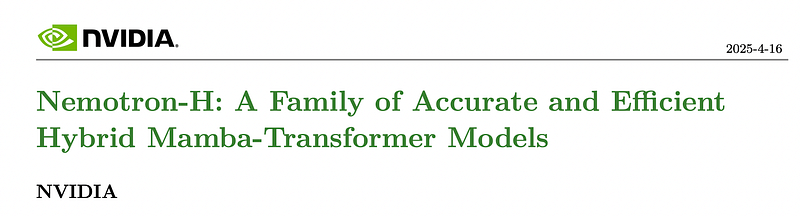 | Title card: Nemotron-H. |
| 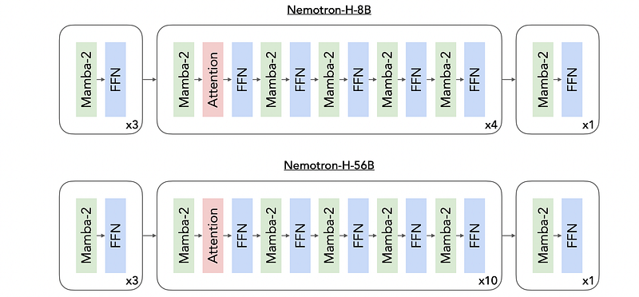 | Nemotron-H-8B/56B model architectures. |
| 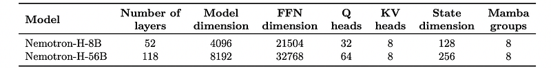 | Summary of the Nemotron-H hybrid Mamba-Transformer architectures. |
|  | Quality distribution of the 6.3 trillion English Common Crawl tokens. |
| 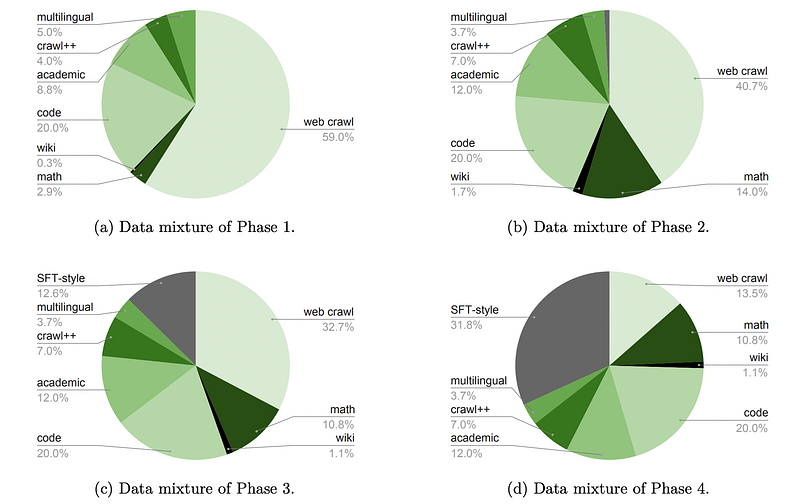 | Data mixtures for each phase of Nemotron-H pre-training. |
| 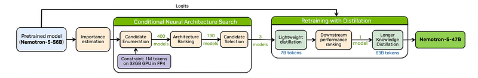 | MiniPuzzle’s optimization process. |
| 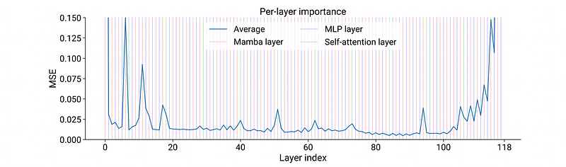 | Layer importance. |
|  | FFN importance: FFN layers internally are composed of two linear operators with a non-linear activation in between. |
|  | SFT-style data: Here, 𝑊𝑖1 refers to the 𝑖th row of the weight matrix 𝑊1. |
| 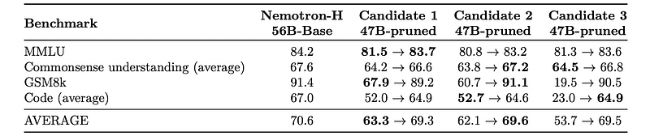 | Comparison of benchmark scores for pruned candidates before and after lightweight distillation. |
| 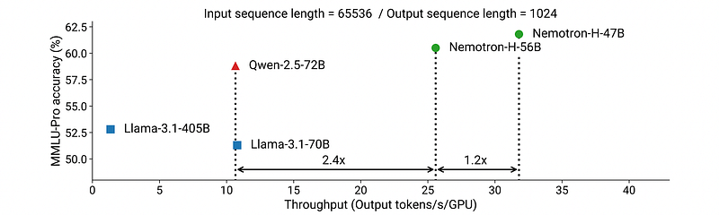 | MMLU-Pro accuracy versus per-GPU inference throughput for Nemotron-H-56B/47B-Base compared to existing similarly-sized Transformer models. |
| 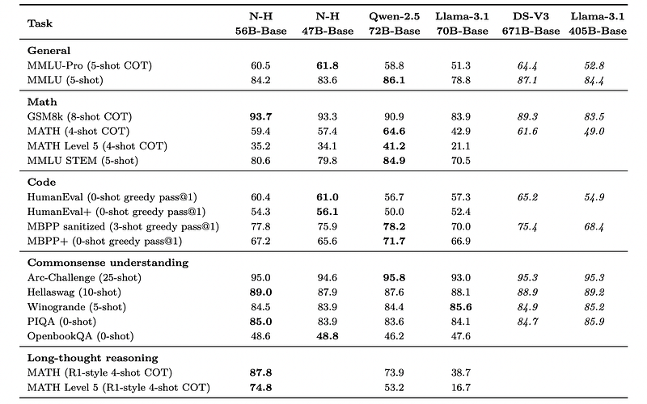 | Accuracy of Nemotron-H-56B-Base (and its distilled version Nemotron-H-47B-Base) versus existing SoTA models. |
| 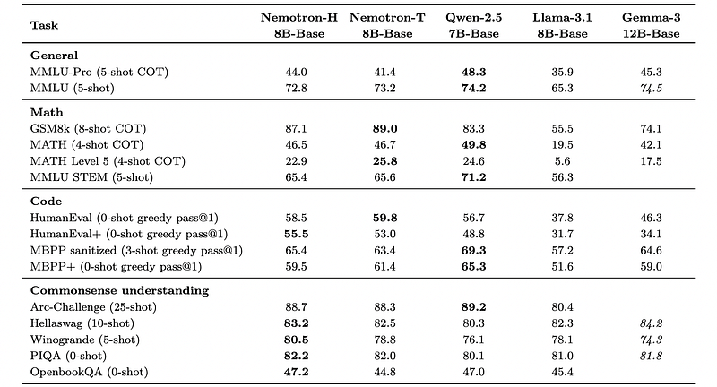 | Accuracy of Nemotron-H-8B-Base versus existing SoTA models and a Transformer (Nemotron-T-8B-Base) trained on exactly the same data. |
| 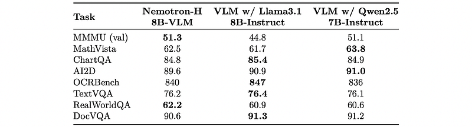 | Evaluation of Nemotron-H-8B-VLM on vision-language benchmarks. |
| 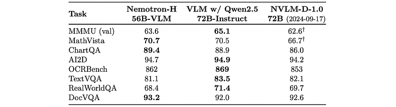 | Evaluation ofNemotron-H-56B-VLM on a range of vision-language benchmarks, compared to a VLM built using Qwen2.5–72B-Instruct with the same training recipe. |
| 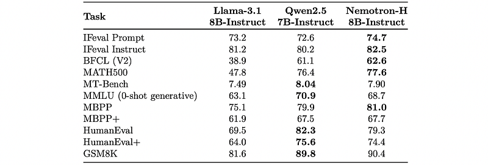 | Comparison of benchmarks after post-training. |
|  | Comparison of RULER scores across sequence lengths. |
|  | Comparison of experimental Transformer and hybrid base models on various tasks. |
| 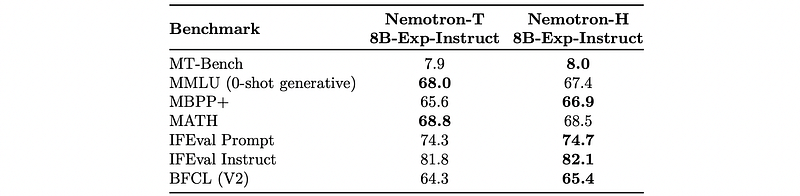 | Comparison of experimental aligned models on key alignment benchmarks. |
## Related

- [[Papers Explained Corpus]]
- [[Large Language Models]]
- [[Synthetic Data]]
- [[Code Models]]
- [[Papers Explained 452 - Apriel-Nemotron-15B-Thinker]]
- [[Papers Explained 454 - Nemotron Nano 2]]

#summary #topic
