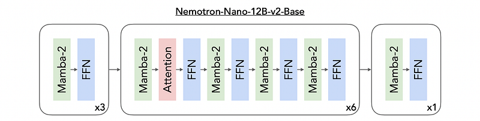
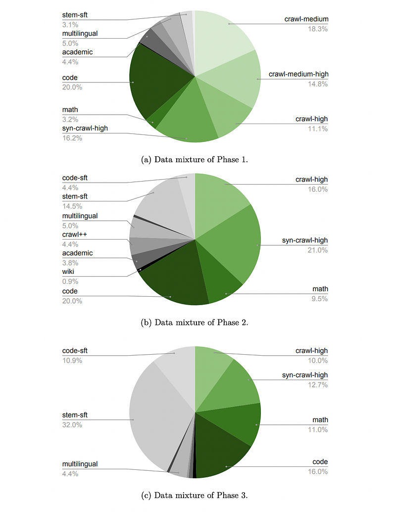
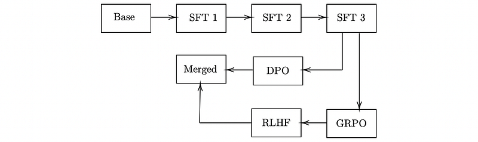
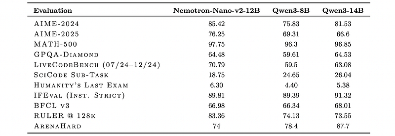
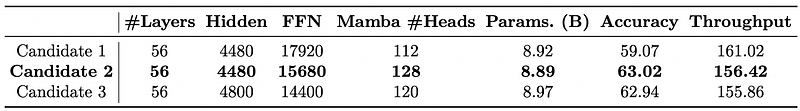
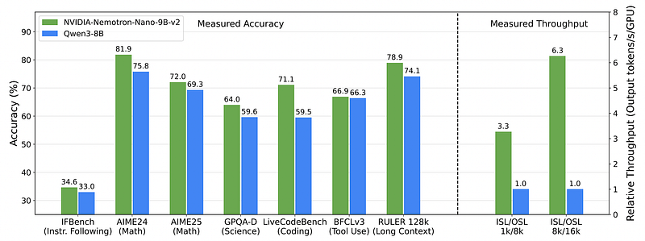

# Papers Explained 454 - Nemotron Nano 2

Nemotron-Nano-9B-v2 is a hybrid Mamba-Transformer language model designed to increase throughput for reasoning workloads while achieving state-of-the-art accuracy compared to similarly-sized models.

This page ingests the source article into the wiki and connects it to [[Papers Explained Corpus]], [[Large Language Models]], [[Reasoning Models]], [[Model Compression and Efficiency]], [[Synthetic Data]], [[Document AI]].

## Source Metadata

- Source file: `raw/2025-09-16_Papers-Explained-454--Nemotron-Nano-2-d3cc3326fe5c.html`
- Source title: Papers Explained 454: Nemotron Nano 2
- Published: 2025-09-16
- Canonical: [https://medium.com/@ritvik19/papers-explained-454-nemotron-nano-2-d3cc3326fe5c](https://medium.com/@ritvik19/papers-explained-454-nemotron-nano-2-d3cc3326fe5c)

## Key Ideas

- The models are available at [HuggingFace](https://huggingface.co/collections/nvidia/nvidia-nemotron-689f6d6e6ead8e77dd641615).
- The Nemotron-CC dataset is updated to include eight more recent Common Crawl snapshots (CC-MAIN-2024–33 through CC-MAIN-2025–13) using the same pipeline. For synthetic rephrasing, Qwen3–30B-A3B (from Mistral Nemo 12B) is used.
- URL Aggregation: Compiled a comprehensive list of math-related URLs from prior datasets (e.g., InfiMM-WebMath, OpenWebMath, FineMath, MegaMath).
- HTML Re-fetching: Re-fetched raw HTML documents from 98 Common Crawl snapshots (2014–2024).
- Rendering: Each page is rendered using the lynx text-based browser to preserve layout and math structure.

## Notes

Nemotron-Nano-9B-v2 is a hybrid Mamba-Transformer language model designed to increase throughput for reasoning workloads while achieving state-of-the-art accuracy compared to similarly-sized models. Nemotron-Nano-9B-v2 builds on the Nemotron-H architecture, in which the majority of the self-attention layers in the common Transformer architecture are replaced with Mamba-2 layers, to achieve improved inference speed when generating the long thinking traces needed for reasoning.

The models are available at [HuggingFace](https://huggingface.co/collections/nvidia/nvidia-nemotron-689f6d6e6ead8e77dd641615).

## Model Architecture

*Figure: Nemotron-Nano-12B-v2-Base layer pattern.*

*Figure: Summary of Nemotron-Nano-12B-v2-Base architecture.*

Nemotron-Nano-12B-v2-Base consists of a mixture of Mamba-2, self-attention, and FFN layers. 62 layers are used, with 6 of them being self-attention layers, 28 being FFN, and 28 being Mamba-2 layers. A hidden dimension of 5120, FFN hidden dimension of 20480, and Grouped-Query Attention with 40 query heads and 8 key-value heads are employed. For Mamba-2 layers, 8 groups, a state dimension of 128, a head dimension of 64, an expansion factor of 2, and a window size for convolution of 4 are used. Squared ReLU activation is used for FFN layers. Position embeddings are not used and RMSNorm, separate embedding and output layer weights, no dropout, and no bias weights for linear layers are utilized.

## Pre-Training Data

### Curated Data

English web crawl data

The Nemotron-CC dataset is updated to include eight more recent Common Crawl snapshots (CC-MAIN-2024–33 through CC-MAIN-2025–13) using the same pipeline. For synthetic rephrasing, Qwen3–30B-A3B (from Mistral Nemo 12B) is used. Additionally, data from CC-NEWS through April 23, 2025 (filtered for English and globally fuzzily de-duplicated), is used to help improve the knowledge cutoff of the model.

Multilingual data

Data for fifteen languages (Arabic, Chinese, Danish, Dutch, French, German, Italian, Japanese, Korean, Polish, Portuguese, Russian, Spanish, Swedish, and Thai) is extracted from three Common Crawl snapshots: CC-MAIN-2024–51, CC-MAIN-2025–08, and CC-MAIN-2025–18. Heuristic filtering is applied due to a lack of reliable multilingual model-based quality classifiers. This is similar to low-quality English data filtering in Nemotron-CC, but with selective disabling of filters with high false positive rates for some languages. De-duplication is done in the same way as for Nemotron-CC. Additionally, data from Wikipedia and FineWeb-2 is used for these fifteen languages.

Math data

Mathematical content on the web is expressed in a wide range of formats, including inline and block L ATEX, MathML, Unicode symbols, and custom renderers such as MathJax or KaTeX. Prior math-specific extraction pipelines (OpenWebMath, MegaMath, jusText, Trafilatura, Resiliparse) could not reliably preserve mathematical expressions or code structure, often discarding or distorting equations and flattening code formatting. Hence a new pipeline is built specifically for high-fidelity mathematical extraction from Common Crawl:

- URL Aggregation: Compiled a comprehensive list of math-related URLs from prior datasets (e.g., InfiMM-WebMath, OpenWebMath, FineMath, MegaMath).

- HTML Re-fetching: Re-fetched raw HTML documents from 98 Common Crawl snapshots (2014–2024).

- Rendering: Each page is rendered using the lynx text-based browser to preserve layout and math structure.

- Processing with Phi-4: Applied Phi-4 (14B-parameters) to remove boilerplate, standardize notation into LaTeX, and correct inconsistencies.

- Quality Filtering: A FineMath classifier is used to retain high-quality documents.

- Fuzzy Deduplication: Performed via MinHash-based Locality Sensitive Hashing (LSH) using the NeMo-Curator framework.

- Decontamination: Decontaminated the dataset using LLM Decontaminator.

This process resulted in a 133B-token corpus, Nemotron-CC-Math-3+, and a higher-quality 52B-token subset, Nemotron-CC-Math-4+, containing only the top-scoring samples.

Code data

All source code used originated from GitHub and went through a multi-stage processing pipeline.

A license detection pipeline similar to the BigCode project is used, but with fewer accepted licenses.

Both exact (via hashing) and fuzzy deduplication (using MinHash LSH) is performed. All files are annotated with various measures, and heuristic filters from OpenCoder are leveraged to filter out files less valuable or detrimental for LLM pretraining.

### Synthetically-Generated Data

STEM data

Synthetic data is generated for STEM subjects (Astronomy, Biology, Chemistry, Math, and Physics) using 88.6k questions as seed data, sourced from GSM8K, MATH, AOPS, Stemez, and textbooks from OpenStax and Open Textbook Library.

Qwen2.5-VL-72B-Instruct is used to extract questions from textbooks, with instructions to drop numbering, ignore image-based questions, and format equations in LaTeX. Extracted questions are manually curated to fix OCR errors and remove non-self-contained questions.

Three iterations of question generation are performed using four models (Qwen3–30B-A3B, Qwen3–235B-A22B, Deepseek-R1, and Deepseek V3) and three prompts To expand the quantity and diversity of questions:

- Similar question: Create a new question that explores similar concepts but offers a fresh challenge.

- Harder question: Create a new question that requires more logical steps or involves more advanced concepts.

- Varied question: Create a new question that differs in type from the original question. The model is instructed to avoid superficial or trivial modifications and think through the solution when creating a new question.

Duplicates and highly similar questions are filtered out using fuzzy de-duplication. Solutions are generated for the remaining questions using the same models used in the question generation step. A subset of examples is converted to multiple-choice questions in MMLU or MMLU-Pro style.

Math data

The MIND dataset is regenerated using Nemotron-CC-Math-4+, a math subset comprising 52B tokens, as the source corpus. Seven prompt templates (e.g., Teacher–Student, Debate, Interview, etc) are applied to generate structured mathematical dialogues using the Phi-4 model. This produced a 73B-token synthetic dataset.

Multilingual data

Multilingual diverse question and answer data (Diverse QA) is generated from two sources.

- English Diverse QA data is translated to fifteen languages using Qwen3–30B-A3B.

- Synthetic data is generated from Wikipedia articles in these languages using the Diverse QA prompt, instructing the model to write all questions and answers in the target language.

Additionally, a subset of GSM8K augmentation data is translated into these languages using Qwen3–30B-A3B.

Code data

Question-answer (QA) data is generated at scale for 11 different programming languages by prompting an LLM to generate questions based on short snippets from a curated source code. The model is then asked to solve the generated question. Post hoc filtering of the generated QA pairs is performed based on heuristics as appropriate (e.g., Python AST parsing).

Academic data

First, all documents with educational difficulty at the undergraduate and graduate levels for subjects: math, chemistry, biology, physics, and medicine. Each document is chunked into snippets of 512 token lengths, embedded with the e5-large model, and stored within a vector database that enables approximate nearest neighbor search. The database is queried for the 250 nearest neighbor text snippets to each query document. The returned snippets are then passed into a Qwen-2.5 72B instruct model to generate multiple choice and free response style QA pairs based on the information contained in the snippet. With each QA pair, a justification for the answer is also generated.

SFT-style data

Using SFT-style data in the later stages of pretraining has shown to be helpful to foster more comprehensive model learning. Therefore, different SFT-style data covering several domains are synthesized and included:

- code SFT data which is mainly focused on solving code problems

- math SFT data that is mostly focused on reasoning

- MMLU-style SFT data which contains different question and answer examples covering different knowledge topics

- general instruction following SFT data.

Fundamental reasoning SFT-style data

Existing datasets including:

- the Law School Admission Test (LSAT) dataset which encompasses three tasks: logical reasoning, reading comprehension, and analytical reasoning

- the repurposed LogiQA dataset which contains various types of logical reasoning questions collected from the National Civil Servants Examination of China

- the AQuA-RAT dataset which emphasizes algebraic word problems

DeepSeek-V3 and Qwen3–30B-A3B are then prompted to synthesize more similar questions with corresponding options. For each question generated, DeepSeek-V3 is prompted again to generate the chain-of-thought (CoT) process with the final solution. At the post-processing stage, majority voting is applied to keep only the samples that have the most voted solutions. Overall, 4B tokens are generated from DeepSeek-V3 and 4.2B tokens from Qwen3–30B models.

### Data Mixture and Ordering

The data mixture consists of thirteen data categories. The largest is web crawl data, which is subdivided into four categories denoting medium, medium-high, high and synthetic quality crawl data, respectively. A curriculum based on three phases of data-blending approach is used to pre-train Nemotron-Nano-12B-v2-Base. In the first phase, a data mixture that promotes diversity in data is used. In the second and third phases, high-quality datasets (e.g., Wikipedia) are primarily used. The switch to the second phase occurred at the 60% point of training, and to the third phase at the 90% point of training.

## Pretraining Recipe

DeepSeek’s FP8 training recipe is used for the entirety of the pretraining run. Nemotron-Nano-12B-v2-Base is trained on a token horizon of 20 trillion tokens with a sequence length of 8192. To ensure Nemotron-Nano-12B-v2-Base can infer over long context windows, a long-context phase (Phase LC) is added after Phase 3 of pre-training. In Phase LC, continuous pretraining (CPT) with a context length of 524,288 (512k) tokens is conducted for 18.9 billion tokens.

Additionally, long-context synthetic data generation is performed to create more high-quality data for Phase LC. Since the academic pretraining dataset is a good source of coherent long-context documents, documents longer than 32k tokens are used as seed data. Methods mentioned in the Llama-3 and Qwen-2.5 tech reports are followed to generate long-context document QA data. Each document is split into chunks of 1,024 tokens and then randomly selected 10% of the chunks are fed into Qwen-2.5–72B-Instruct for data synthesis. The generator is asked to generate a QA pair based on the information in the text chunk. The QA pairs are concatenated and appended to the end of the original document as a sample of the long-context document QA data. Such long-document QA provided good material for the model to learn long-context dependencies. The data blend used in Phase LC is built based on that of Phase 3. The weights of all Phase 3 data are proportionally downscaled to 80% of their original values, allocating the remaining 20% to the newly added long-context document-QA data.

## Alignment Data

The alignment process begins with a large-scale SFT stage using approximately 80 billion tokens of prompt-response pairs. The data distribution across domains is as follows:

Math, Coding, Science:

- Number of Samples: 1.5M (Math), 1.1M (Coding), 2.0M (Science).

- Response Generation: Using the open-weights DeepSeek-R1–0528 model with prompts similar to those for Nemotron-H-8B and 47B Reasoning models.

Tool-calling:

- Number of Samples: 400K.

- Types: Single-turn, multi-turn, and multi-step conversations.

- Prompts: Sampled from xlam-function-calling-60k, glaive-function-calling-v2, NVIDIA-When2Call.

- Response Generation: Using Qwen3–235B-A22B.

- Multi-turn/Multi-step: Simulated conversations where Qwen3–235B-A22B plays User-Agent, Assistant-Agent, and API-Server-Agent roles.

- Enhancements: Random personas from Nemotron-Personas for query diversity; rule-based tool-call verification layer ensures consistency and retains only successful trajectories.

Conversational:

- Number of Samples: 1.5M.

- Prompts: From LMSYS dataset, HelpSteer2, HelpSteer3, and a subset of WildChat-1M.

- Response Generation: Using Qwen3–235B-A22B reasoning model.

- Additional: Multi-turn conversations with Deepseek R1 responses using NVIDIA (2025) prompts.

Safety:

- Number of Samples: 2K.

- Prompts: Mix of harmful and benign prompts from Nemotron Content Safety Dataset V2, HarmfulTasks, RedTeam2K, and gretel-v1.

- Response Generation: Using DeepSeek-R1–0528.

- Safety Assurance: Two-step approach: initial prompting followed by filtering with guard models.

Multilingual (all domains):

- Number of Samples: 5.0M.

- Construction: Translated existing English post-training data.

- Quality Assurance: Line-by-line translation, skipping non-translatable content, strict bracket format for extraction, language identification to filter off-target translations.

## Post Training Recipe

*Figure: Flow of alignment procedures followed to arrive at the final “Merged” Nemotron Nano 2 12B checkpoint.*

Stage 1 SFT:

- Uses the full dataset.

- Augmented with ~10% of prompts paired with outputs stripped of reasoning traces to enable “reasoning-off” mode.

- Samples concatenated into sequences of ~128k tokens to improve efficiency and preserve long-context ability.

Stage 2 SFT:

- Targets tool-calling, as its accuracy degraded in Stage 1 due to concatenation.

- Trained without concatenation.

- Uses the full tool-calling dataset and a representative subsample of other domains.

Stage 3 SFT:

- Reinforces long-context capability using data from Nemotron-H preparation.

- Includes augmented examples where reasoning traces were abruptly truncated to 1–2k tokens while preserving the final answer, improving robustness under varying inference-time thinking budgets.

IFEval RL:

- Goal: Improve instruction adherence.

- Data: 16,000 prompts from LMSYS Chat dataset augmented with IFEval-style instructions.

- Mechanism: Rule-based verifier scored outputs for instruction satisfaction, creating a reward signal.

- Result: Significant boost to IFEval capabilities.

DPO:

- Goal: Improve tool-calling, specifically multi-step and multi-turn scenarios.

- Evaluation: BFCL v3 benchmark.

- Data: WorkBench, a multi-step verifiable tool-calling setup.

- Mechanism: Iterative Direct Preference Optimization; generates on-policy data (positive/negative examples) for each WorkBench prompt.

RLHF (GRPO):

- Goal: Improve overall helpfulness and chat capabilities.

- Evaluation: Arena-Hard benchmark.

- Data: English-only contexts from HelpSteer3.

- Mechanism: Generates responses with and without thinking traces; uses a Qwen-based reward model to judge rollouts.

Model Merging:

- Observed trade-off between reasoning and chat capabilities.

- Checkpoint interpolation (linear interpolation of model weights).

- (1 − 𝛼) · 𝑤𝑚𝑜𝑑𝑒𝑙1 + 𝛼 · 𝑤𝑚𝑜𝑑𝑒𝑙2

- 𝛼 values around 0.5 offered a good trade-off.

*Figure: Evaluation results with reasoning “ON”.*

## Pruning and Distillation

Importance or sensitivity scores are collected for each model component (e.g., layers, FFN neurons) to help decide which components to remove. Sensitivity analysis based on gradient information is typically impractical at modern LLM scale. Instead, a lightweight strategy that uses only forward passes is employed. Layers are pruned, and FFN hidden dimensions (effectively neurons) and embedding channels are pruned. Experimentation with pruning Mamba heads unfortunately caused severe accuracy degradation.

### Layer importance

Layer importance is computed in an iterative fashion. For each candidate layer, it is temporarily removed from the model and the mean squared error (MSE) between the original model’s logits and those produced by the pruned model is computed. At each pruning step, the layer with the lowest MSE is removed, as it has the least influence on the final output. This process is repeated until the desired depth is reached.

### FFN and embedding channel importance

FFN layers internally are composed of two linear operators with a non-linear activation in between:

Here, X denotes the input, and 𝑊 1 and 𝑊 2 are the two associated weight matrices in the FFN layer.

The importance of each neuron in the first linear operator of each FFN layer is computed by examining the set of outputs it produces. A small calibration dataset of 1024 samples is used for this purpose. Formally, each neuron’s importance score is computed by aggregating its outputs given an input batch 𝑋:

Here, 𝑊 𝑖1 refers to the 𝑖th row of the weight matrix 𝑊1. ∑︀B,S refers to aggregation along the batch and sequence dimensions.

The mean and l2-norm aggregation functions are used along the batch and sequence dimensions.

Embedding channel importance is computed similarly, by examining the outputs of LayerNorm layers instead.

### Mamba importance

Mamba layers process inputs through multiple projection matrices (𝑊𝑥, 𝑊𝑧 ,𝑊𝐵 ,𝑊𝐶 ,𝑊𝑑𝑡) that produce intermediate representations before causal convolution and selective state space model (SSM) updates, followed by gated normalization and an output projection (𝑊𝑂).

A nested activation-based scoring strategy is adopted over a small calibration dataset of 1024 samples, similar to FFN importance but adapted to Mamba’s group-aware structure. First, activation scores are obtained from the 𝑊𝑥 projection, denoted 𝑠∈R𝑚ℎ×𝑚𝑑 , where 𝑚ℎ is the number of Mamba heads and 𝑚𝑑 is the Mamba head channel dimension. For each channel 𝑑, the score is computed as:

where the aggregation is over the batch (B) and sequence (S) dimensions, using both mean and l2-norm metrics. Next, head scores are computed by using the l2-norm over the Mamba head channel set:

and heads are ranked within each Mamba group 𝒢𝑔 to preserve group-aware computation semantics:

which ensures that pruning decisions respect the model’s structural constraints and SSM’s sequence modeling. The lowest-scoring heads are pruned by trimming the corresponding rows from all affected projection, convolution, and SSM parameter matrices.

### Lightweight NAS

Memory constraints: Memory requirements during inference consist of two distinct components with different scaling behaviors. The parameter memory, while substantial, remains constant regardless of the input size. In contrast, the key-value cache memory scales linearly with both batch size and sequence length, often becoming the dominant factor in long-sequence scenarios. For Nano 2, the target memory budget for inference is 19.66 GiB.

- Starting from 22.06 GiB available memory on an NVIDIA A10G GPU.

- Subtract 5% buffer for frameworks (e.g., vLLM, TensorRT-LLM).

- Subtract 1.3 GiB for a vision encoder.

Measuring throughput: Throughput is measured on an input and output sequence length of 8k and 16k tokens respectively. For this combination of input and output sequence length, vLLM output token generation throughput is reported at the maximum batch size that fits on the A10G GPU.

Candidate Enumeration: The search space includes depth reduction (removing 6–10 layers from the original 62-layer architecture) combined with width pruning of embedding channels (4480–5120), FFN dimension (13440–20480), and Mamba heads (112–128).

Finding the Best Architecture: The problem is divided into two parts: (1) find the optimal depth for the compressed model, and (2) find the optimal width-pruned architecture given the depth.

Effect of depth:

Three depth-pruned candidates obtained from the 12B model with 52, 54 and 56 layers are compared for accuracy. The number of attention layers is fixed at 4 for all three variants to achieve a good balance between KV cache size and long-context performance. Reducing depth beyond 56 layers results in significant accuracy degradation. As a result, the depth is fixed at 56 for further width pruning.

*Figure: Effect of depth on reasoning accuracy.*

Combining depth and width pruning:

The depth of the target model is fixed to 56 layers with 4 attention layers. 60B tokens of distillation are performed on this checkpoint and further width pruning is carried out along the embedding, FFN, and Mamba axes. All candidate pruned architectures that meet the memory budget are enumerated and sorted in decreasing order of estimated memory consumption at 128k context length and batch size 1. The top 3 candidates from this list are picked for further evaluation. Short Knowledge Distillation (KD) is performed on these candidates for 19B tokens after depth+width Pruning. Candidate 2 achieves the best accuracy while still having reasonable runtime performance; consequently, this architecture is used for Nano 2.

*Figure: Top 3 candidates for architecture selection.*

The number of Mamba heads is ablated considering configurations with 87.5% and 93.75% of the original heads. Due to the relatively smaller compression ratios explored in this work (less than 15% after depth pruning), applying Mamba head pruning yields limited benefit, and in these cases, pruning only the FFN and embedding dimensions — after depth pruning — proves sufficient to achieve the desired compression while preserving accuracy.

### Retraining with Distillation

To recover the accuracy lost due to pruning, the model undergoes continued training. Logit-based distillation for continued training is adopted, employing forward KL divergence loss exclusively during the accuracy recovery phase. During this extended phase, Candidate 2 is continued training to yield the final Nano 2 reasoning and base models.

*Figure: Effect of varying reasoning data proportion on math accuracy after ∼ 6B tokens of KD.*

Reasoning model:

The reasoning model is distilled in stages with increasing sequence lengths to strengthen extended reasoning and long-context capabilities. This is followed by targeted reinforcement learning (RL), preference optimization and model merging to retain desired behaviors and ensure robustness across diverse tasks.

1. Depth pruning to 56 layers; Knowledge Distillation (KD) with∼60B tokens at 8,192 sequence length.

2. Width pruning and KD with:

• ∼50B tokens at 8,192 sequence length.

• ∼25B tokens at 49,152 sequence length.

• ∼1B tokens at 262,144 sequence length.

3. Direct Preference Optimization (DPO).

4. Group Relative Policy Optimization (GRPO).

5. KD with∼0.4B tokens at 262,144 sequence length to recover post-RL drops.

6. RLHF for alignment with human preferences.

7. Model merging between steps 5 and 6 via 0.5 linear interpolation.

*Figure: Comparison of Nemotron Nano 2 and Qwen3–8B in terms of accuracy and throughput.*

## Paper

NVIDIA Nemotron Nano 2: An Accurate and Efficient Hybrid Mamba-Transformer Reasoning Model [2508.14444](https://arxiv.org/abs/2508.14444)

## Figures

Figures from the Medium HTML export (`raw/2025-09-16_Papers-Explained-454--Nemotron-Nano-2-d3cc3326fe5c.html`); local copies under `wiki/assets/papers-explained-454-nemotron-nano-2/` when download succeeded.

| Figure | Caption |
|--------|---------|
|  | Title card: Nemotron Nano 2. |
|  | Nemotron-Nano-12B-v2-Base layer pattern. |
|  | Summary of Nemotron-Nano-12B-v2-Base architecture. |
|  | DeepSeek-V3 and Qwen3–30B-A3B are then prompted to synthesize more similar questions with corresponding options. |
|  | Flow of alignment procedures followed to arrive at the final “Merged” Nemotron Nano 2 12B checkpoint. |
|  | Evaluation results with reasoning “ON”. |
|  | FFN layers internally are composed of two linear operators with a non-linear activation in between. |
|  | The importance of each neuron in the first linear operator of each FFN layer is computed by examining the set of outputs it produces. |
|  | Model Merging:: where the aggregation is over the batch (B) and sequence (S) dimensions, using both mean and l2-norm metrics. |
|  | and heads are ranked within each Mamba group 𝒢𝑔 to preserve group-aware computation semantics. |
|  | and heads are ranked within each Mamba group 𝒢𝑔 to preserve group-aware computation semantics. |
|  | Effect of depth on reasoning accuracy. |
|  | Top 3 candidates for architecture selection. |
|  | Effect of varying reasoning data proportion on math accuracy after ∼ 6B tokens of KD. |
|  | Comparison of Nemotron Nano 2 and Qwen3–8B in terms of accuracy and throughput. |
## Related

- [[Papers Explained Corpus]]
- [[Large Language Models]]
- [[Reasoning Models]]
- [[Model Compression and Efficiency]]
- [[Synthetic Data]]
- [[Document AI]]
- [[Papers Explained 453 - Nemotron-H]]
- [[Papers Explained 455 - Shepherd]]

#summary #topic
