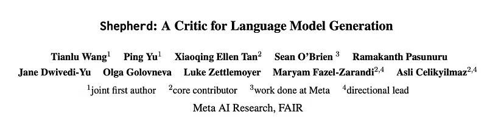
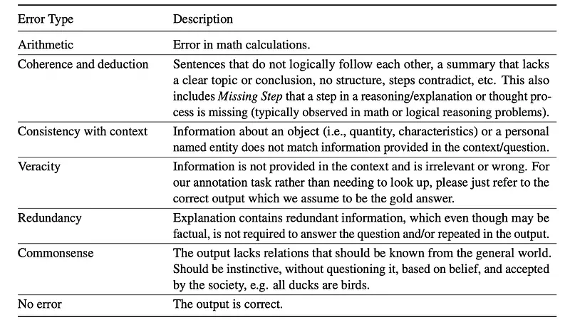
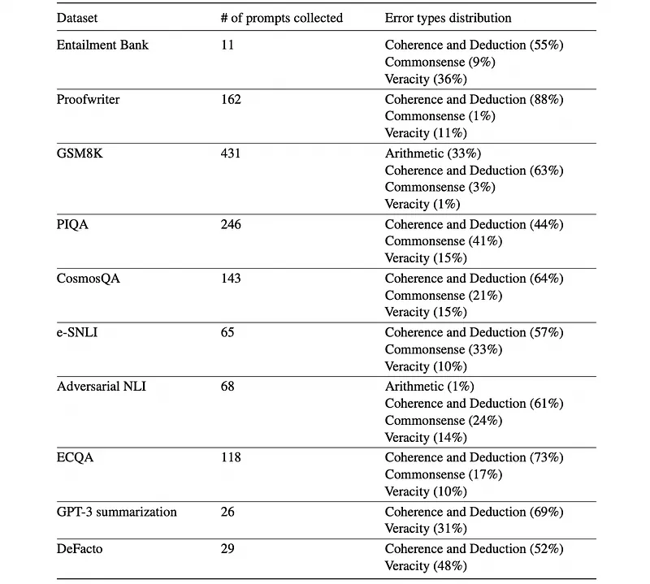
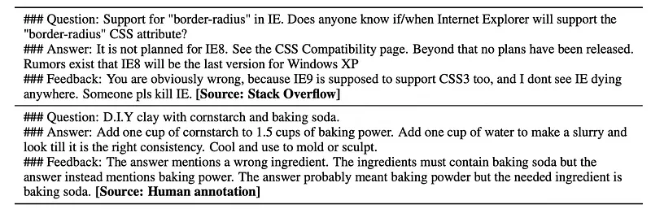
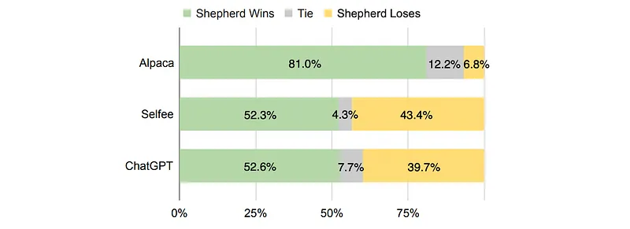
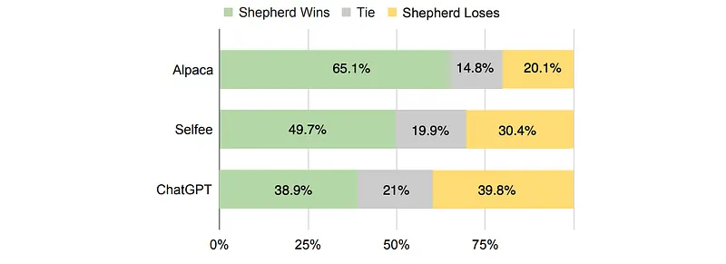
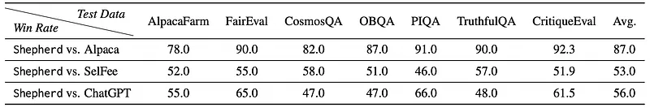
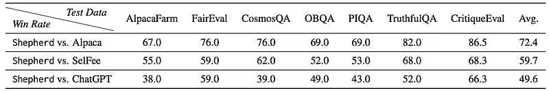

# Papers Explained 455 - Shepherd

Shepherd is a language model specifically tuned to critique model responses and suggest refinements. At the core of the approach is a high quality feedback dataset, which is curated from community feedback and human annotations. The model is named Shepherd, as it guides Llamas.

This page ingests the source article into the wiki and connects it to [[Papers Explained Corpus]], [[Large Language Models]], [[Synthetic Data]].

## Source Metadata

- Source file: `raw/2025-09-17_Papers-Explained-455--Shepherd-4a43cc226a38.md`
- Source title: Papers Explained 455: Shepherd
- Published: 2025-09-17
- Canonical: [https://medium.com/@ritvik19/papers-explained-455-shepherd-4a43cc226a38](https://medium.com/@ritvik19/papers-explained-455-shepherd-4a43cc226a38)

## Key Ideas

- Shepherd is a language model specifically tuned to critique model responses and suggest refinements. At the core of the approach is a high quality feedback dataset, which is curated from community feedback and human annotations.
- Feedback data is gathered from two community question and answering websites: Stack Exchange and the Pushshift Reddit Dataset.
- Stack Exchange Data: Stack Exchange contains a network of 173 dedicated Q&A communities, inclusive of the notable Stack Overflow community, dispensing expert insights in a question and answer format. Data curation temporarily only focuses on English content.
- A critique is considered valid in two scenarios:
- Case #1: The answer is largely accurate, and the critique offers recommendations for further refinement or enhancement.

## Notes

Shepherd is a language model specifically tuned to critique model responses and suggest refinements. At the core of the approach is a high quality feedback dataset, which is curated from community feedback and human annotations. The model is named Shepherd, as it guides Llamas.

## Data Collection

### Community Critique Data

Feedback data is gathered from two community question and answering websites: Stack Exchange and the Pushshift Reddit Dataset. A post’s title and sub-title are considered a question, its top-level comments are answers, and replies to these comments are critiques.

Stack Exchange Data: Stack Exchange contains a network of 173 dedicated Q&A communities, inclusive of the notable Stack Overflow community, dispensing expert insights in a question and answer format. Data curation temporarily only focuses on English content.

Pushshift Reddit Data:Reddit hosts nearly 140,000 active subreddits at any given moment. There are certain challenges associated with fine-tuning a model on Pushshift Reddit data: a substantial proportion of subreddits function primarily for entertainment rather than serious, informative dialogues. Many posts are primarily intended to share information (e.g., news, jokes) instead of posing specific questions, making them unsuitable for fine-tuning. In light of these limitations, data has been selected from 16 subreddits: r/AskAcademia, r/AskAnthropology, r/AskBaking, r/askcarguys, r/AskCulinary, r/AskDocs, r/AskEngineers, r/AskHistorians, r/AskHR, r/askphilosophy, r/AskPhysics, r/askscience, r/AskScienceFiction, r/AskSocialScience, r/AskVet, r/explainlikeimfive.

### Critique Postprocessing

A critique is considered valid in two scenarios:

- Case #1: The answer is largely accurate, and the critique offers recommendations for further refinement or enhancement.

- Case #2: The answer contains inaccuracies, which the critique explicitly highlights.

To curate valid critiques from community data, the following techniques are employed:

Filtering Out Invalid Critique Data

Invalid critique data, such as joke sharing and follow-up questions that fail to provide feedback, are filtered using two methods:

- Keyword Filtering: Examples containing specific keywords matching the two validity cases are kept:

- For Case #1 (accurate answer, refinement critique): “not wrong”, “agree”, “absolutely”, “indeed”, “agreed”, “exactly what I think”, “that’s right”, “not what I think”, “you’re right”, “you are right”, “that is right”.

- For Case #2 (inaccurate answer, highlighting critique): “wrong”, “incorrect”, “not agree”, “not right”, “disagree”, “can’t agree”, “beg to differ”, “that’s not my view”.

- User Edit History: Critiques are collected if users edit their answer after the critique was posted, indicating the critique led to a modification of the original answer.

Refinement Based on Community Vote Scores

To ensure the quality of critiques, additional filters linked with community vote scores are incorporated:

- For Case #1 (accurate answer, refinement critique): Data is omitted if the answer score is lower than 10 AND the critique score is lower than 2. This ensures the initial answer is largely community-approved and the critique has some endorsement.

- For Case #2 (inaccurate answer, highlighting critique): Data is focused on where the critique score surpasses the answer score AND the critique score itself is higher than 2. This ensures the critique, indicating an error, has garnered more community approval than the answer.

Additional Filters

- Diversity: Only one instance per post is retained, specifically the one with the highest critique score.

- Profanity Check: Comments or feedback with a profanity score lower than 0.8 are eliminated to manage offensive language.

- Text-Only Model Compatibility: Instances containing URLs, images, or videos are filtered out as the model is text-only.

- Q&A Format Integrity: Comments that pose further questions to the original question (rather than providing feedback on the original answer) are identified and removed.

### Human Data Collection

Eight popular language-understanding and entailment datasets that require complex reasoning and have step-by-step explanations to arrive at the final answer are selected. These include Entailment Bank (deductive reasoning), Proofwriter (logical reasoning), GSM8K (arithmetic reasoning), PIQA (physical reasoning), CosmosQA (commonsense reasoning), ECQA (commonsense reasoning), e-SNLI (deductive and commonsense reasoning), and Adversarial NLI (adversarial entailment). Two summarization datasets of relatively high quality are also chosen: GPT-3 summarization and DeFacto. Only data from the training sets is used for human annotation.

For each question, a context, a correct output, and a candidate output are provided, and annotators give feedback on whether there are any errors in the candidate output. Except for GPT-3 summarization, in which the summary least preferred by human raters is chosen as the candidate output, all datasets contain a gold answer to the question, i.e., the correct output. For other datasets, to increase the possibility of obtaining candidate outputs that have reasonable errors, LLaMA-65B or LIMA-30B are prompted with zero-shot or few-shot in-context examples to obtain step-by-step reasoning sequences.

Different error types are defined in a taxonomy.

*Figure: Error types for human data collection.*

The postprocessing of human curated data involves several steps to ensure high quality and suitability for the intended purpose.

Removal of Examples with Annotation Issues:

- Examples flagged with “Errors in the correct output” are removed.

- Examples where “The context is too complex to work on” are also removed.

Filtering of Unhelpful Feedback Types:

- Feedback related to “Redundancy” is removed.

- Feedback related to “Consistency with context” is also removed, as these were found not to be helpful.

Concatenation of Feedback:

- If an example has feedback for more than one error type, these individual feedback points are concatenated into a single paragraph.

- Natural language connectors such as “Firstly,” “Secondly,” and “Besides” are used to combine the feedback.

After these postprocessing steps, a total of 1,317 high-quality examples are retained.

*Figure: Distribution of collected prompts and the identified error types from each dataset used in human annotation.*

## The Shepherd Model

Shepherd is trained with LLaMA-7B as the base model. The training data is formatted using the same template where “### {field name}” is used to separate different fields.

*Figure: Examples of the training data collected from Stack Exchange and Human Annotation.*

## Evaluation

Conducted both human evaluation and automatic evaluation using GPT-4 as an evaluator.

Compared Shepherd against ChatGPT (GPT-3.5 Turbo), Alpaca-7B (LLaMA-7B finetuned on 52K instruction-following data), and SelFee (LLaMA-7B finetuned on 178K self-feedback/revision data).

Evaluation Data:

- Utilized 6 public NLP datasets (Alpaca-Farm, FairEval, CommonsenseQA, OBQA, PIQA, TruthfulQA) covering diverse topics and reasoning skills.

- Sampled 50 instances from each public dataset (total 300) for evaluation and 20 instances from each for ablation studies.

- Developed a new test set, CritiqueEval (52 Pushshift Reddit questions from June 2022-June 2023), to prevent data contamination, bringing the total evaluation set to 352 instances.

GPT-4 Evaluation Methodology:

- Absolute Likert Score: GPT-4 graded feedback on a 1–7 Likert scale based on error identification or correctness confirmation, using a carefully selected instruction.

- Pairwise Comparison: GPT-4 was prompted to choose the better of two feedback candidates based on their ability to identify errors or provide useful suggestions.

Human Evaluation Methodology:

- Crowd workers rated feedback on a 1–7 Likert scale.

- Annotators were presented with the question, answer, and feedback from different models together to encourage comparative ranking.

*Figure: Preference evaluation using GPT-4 as the evaluator.*

*Figure: Human preference evaluation.*

*Figure: Win rate (%) by GPT-4 evaluation.*

*Figure: Win rate (%) by human evaluation.*

- Shepherd significantly outperforms Alpaca in both GPT-4 and human evaluations.

- Shepherd consistently outperforms SelFee in both evaluation settings, despite being finetuned on substantially less data (8K vs. 178K examples).

- Shepherd shows slightly better performance than ChatGPT according to GPT-4 evaluation and on-par performance in human evaluation.

## Paper

Shepherd: A Critic for Language Model Generation [2308.04592](https://arxiv.org/abs/2308.04592)

## Figures

Figures from the Medium HTML export (`raw/2025-09-17_Papers-Explained-455--Shepherd-4a43cc226a38.md`); local copies under `wiki/assets/papers-explained-455-shepherd/` when download succeeded.

| Figure | Caption |
|--------|---------|
|  | Title card: Shepherd. |
|  | Error types for human data collection. |
|  | Distribution of collected prompts and the identified error types from each dataset used in human annotation. |
|  | Examples of the training data collected from Stack Exchange and Human Annotation. |
|  | Preference evaluation using GPT-4 as the evaluator. |
|  | Human preference evaluation. |
|  | Win rate (%) by GPT-4 evaluation. |
|  | Win rate (%) by human evaluation. |
## Related

- [[Papers Explained Corpus]]
- [[Large Language Models]]
- [[Synthetic Data]]
- [[Papers Explained 454 - Nemotron Nano 2]]
- [[Papers Explained 456 - Deep Think with Confidence (DeepConf)]]

#summary #topic
