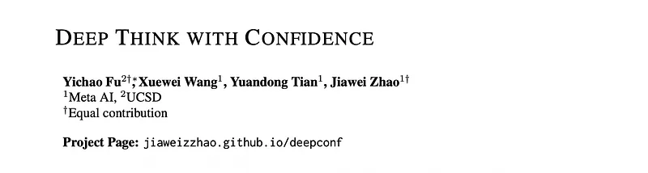
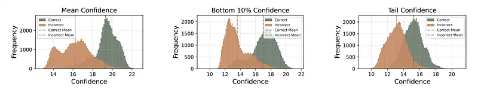
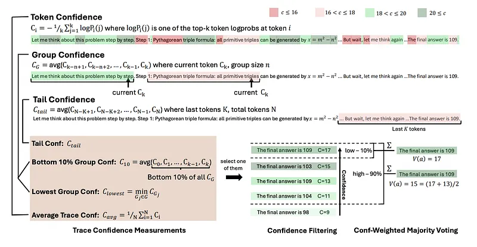
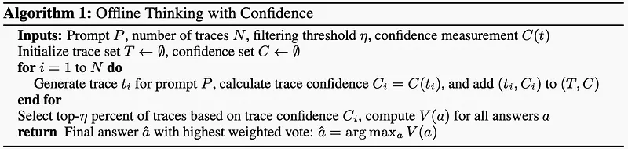
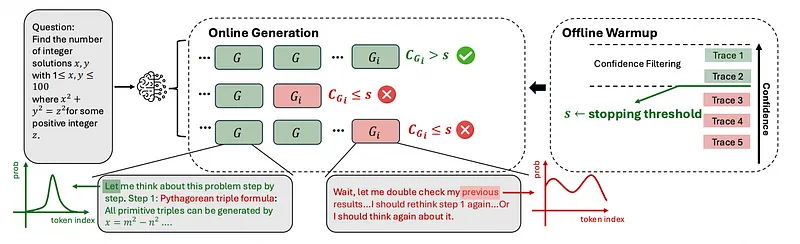
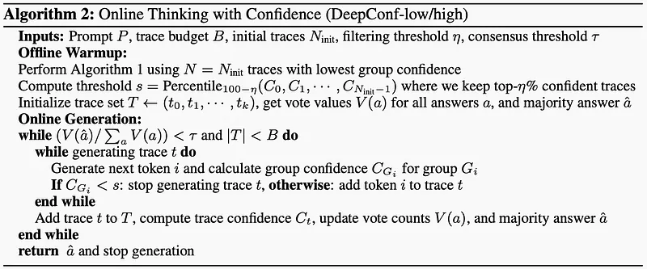
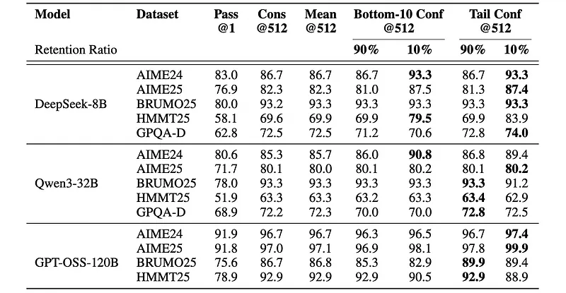
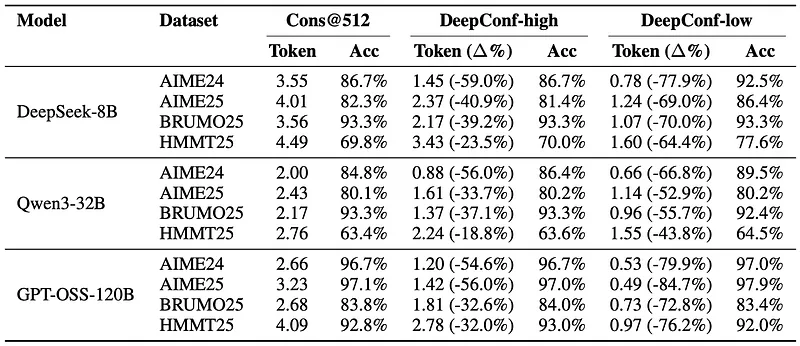

# Papers Explained 456 - Deep Think with Confidence (DeepConf)

Deep Think with Confidence (DeepConf) is a simple yet powerful method that enhances both reasoning efficiency and performance at test time. DeepConf leverages model-internal confidence signals to dynamically filter out low-quality reasoning traces during or after generation.

This page ingests the source article into the wiki and connects it to [[Papers Explained Corpus]], [[Reasoning Models]], [[Model Compression and Efficiency]], [[Large Language Models]], [[Evaluation and Benchmarks]].

## Source Metadata

- Source file: `raw/2025-09-18_Papers-Explained-456--Deep-Think-with-Confidence--DeepConf--5aa9d7018ab0.md`
- Source title: Papers Explained 456: Deep Think with Confidence (DeepConf)
- Published: 2025-09-18
- Canonical: [https://medium.com/@ritvik19/papers-explained-456-deep-think-with-confidence-deepconf-5aa9d7018ab0](https://medium.com/@ritvik19/papers-explained-456-deep-think-with-confidence-deepconf-5aa9d7018ab0)

## Key Ideas

- Deep Think with Confidence (DeepConf) is a simple yet powerful method that enhances both reasoning efficiency and performance at test time.
- Given a language model’s predicted token distribution Pi at position i, the token entropy is defined as:
- where Pi(j) represents the probability of the j-th vocabulary token. Low entropy indicates a peaked distribution with high model certainty, while high entropy reflects uncertainty in the prediction.
- Defined as the negative average log-probability of the top-k tokens at position i:
- where k denotes the number of top tokens considered. High confidence corresponds to peaked distributions and greater model certainty, while low confidence indicates uncertainty in token prediction.

## Notes

Deep Think with Confidence (DeepConf) is a simple yet powerful method that enhances both reasoning efficiency and performance at test time. DeepConf leverages model-internal confidence signals to dynamically filter out low-quality reasoning traces during or after generation.

## Confidence As An Indicator Of Reasoning Quality

Token Entropy

Given a language model’s predicted token distribution Pi at position i, the token entropy is defined as:

where Pi(j) represents the probability of the j-th vocabulary token. Low entropy indicates a peaked distribution with high model certainty, while high entropy reflects uncertainty in the prediction.

Token Confidence

Defined as the negative average log-probability of the top-k tokens at position i:

where k denotes the number of top tokens considered. High confidence corresponds to peaked distributions and greater model certainty, while low confidence indicates uncertainty in token prediction.

Average Trace Confidence

Token-level metrics require aggregation to assess entire reasoning traces. Average trace confidence (also termed self-certainty) is employed as a trace-level quality measure.

where N is the total number of generated tokens.

*Figure: Confidence distributions for correct vs. incorrect reasoning traces across different metrics. Data from HMMT25: 30 problems, 4096 traces each.*

Though average trace confidence effectively distinguishes between correct and incorrect reasoning paths, with higher values indicating greater likelihood of correctness, it has notable limitations.

- Global aggregation obscures intermediate reasoning failures: a few high-confidence tokens can mask numerous low-confidence segments, potentially hiding critical errors.

- This approach requires complete traces for quality assessment, preventing early termination of low-quality generations and resulting in computational inefficiency.

## Deep Think with Confidence

Offline thinking leverages confidence to enhance reasoning performance by evaluating and aggregating information from completed reasoning traces. Online thinking incorporates confidence during token generation to improve reasoning performance and/or computational efficiency in real-time.

### Confidence Measurements

Group Confidence

Group confidence provides a more localized and smoother signal by averaging token confidence over overlapping spans of the reasoning trace. Each token is associated with a sliding window group Gi consisting of n previous tokens (e.g., n = 1024 or 2048) with overlapping adjacent windows. For each group Gi, group confidence is defined as:

where |Gi|is the number of tokens in group Gi.

Estimating reasoning trace quality requires aggregating signals from group confidence. Intermediate steps with extremely low confidence in a trace can significantly affect final solution correctness. When confidence drops sharply during reasoning with repeated low-confidence tokens like “wait”, “however”, and “think again”, it disrupts reasoning flow and leads to subsequent errors.

Bottom 10% Group Confidence

To capture the effect of extremely low confidence groups, bottom 10% group confidence is proposed, where trace confidence is determined by the mean of the bottom 10% of group confidences within the trace.

where Gb is the set of groups with the lowest 10% confidence scores.

Empirically, 10% effectively captures the most problematic reasoning segments across different models and datasets.

Lowest Group Confidence

Lowest group confidence represents the confidence of the least confident group within a reasoning trace — a special case of bottom 10% group confidence. This measurement estimates trace quality based solely on the lowest confidence group.

where Gis the set of all token groups in the reasoning trace.

Tail Confidence

Tail confidence evaluates reasoning trace reliability by focusing on the final portion. This metric is motivated by observations that reasoning quality often degrades toward the end of long chains of thought, and final steps are critical for correct conclusions. Tail confidence Ctail is defined as:

where Ttail represents a fixed number of tokens (e.g., 2048).

Both bottom 10% and tail confidence metrics better separate incorrect and correct trace distributions compared to mean confidence methods, suggesting these metrics are more effective for trace quality estimation.

### Offline Thinking With Confidence

*Figure: Confidence measurements and offline thinking with confidence.*

Majority Voting

In standard majority voting, the final answer from each reasoning trace contributes equally to the final decision. Let T be the set of all generated traces, and for each t∈T, let answer(t) be the answer string extracted from trace t. The vote count for each candidate answer a is:

where I{·}is the indicator function. The final answer is selected as the one with the highest vote count:

Confidence-Weighted Majority Voting

Instead of treating each trace vote equally, each final answer is weighted by the confidence of the associated trace. For every candidate answer *a*, its total vote weight is defined as:

where Ct is the trace-level confidence chosen from the confidence measurements discussed above.

This voting scheme favors answers supported by high-confidence traces, thereby reducing the impact of uncertain or low-quality reasoning answers.

Confidence Filtering

Confidence filtering selects the top-η percent of traces based on trace confidence scores, ensuring only the most reliable paths contribute to the final answer.

### Online Thinking With Confidence

*Figure: DeepConf during online generation.*

Two algorithms, DeepConf-low and DeepConf-high, are proposed, both based on lowest group confidence that adaptively stop generation and adjust trace budgets during online thinking. The approach includes two main components: offline warmup and adaptive sampling.

Offline Warmup

For each new prompt, Ninit reasoning traces are generted (e.g., Ninit = 16). The stopping threshold s is defined as:

where Twarmup represents all warmup traces, Ct is the confidence of trace t, and η is the desired keeping ratio. Specifically, DeepConf-low uses top η= 10% (corresponding to the 90th percentile) and DeepConf-high uses top η = 90% (corresponding to the 10th percentile) uniformly across all settings.

Adaptive Sampling

Adaptive sampling is employed across all methods to dynamically adjust the number of traces generated based on problem difficulty. Difficulty is assessed by consensus among generated traces, quantified by the ratio of majority vote weight V(ˆ a) to total vote weight aV(a).

τ is a preset consensus threshold. If β <τ, the model does not reach consensus for the current problem, and trace generation continues until a fixed trace budget B is met. Otherwise, trace generation halts, finalizing the answer with existing traces.

## Experimental Setup

Five open-source reasoning LLMs from three model families are evaluated: DeepSeek-8B, Qwen3–8B, Qwen3–32B, GPT-OSS-20B and GPT-OSS-120B. Evaluation takes place on five challenging datasets: AIME24, AIME25, BRUMO25, HMMT25, and GPQA. The first four are high-difficulty mathematical competition problems, while GPQA comprises graduate-level STEM reasoning tasks.

For each problem, a common sampling frame is established by pre-generating a pool of 4,096 complete reasoning traces. This pool serves as the foundation for both offline and online evaluations. Offline experiments resample a working set of size K (e.g., K=512) from this pool on each run and apply the specified voting method. Online experiments similarly resample a working set to drive on-the-fly generation with early stopping; the pool ensures consistent sampling across methods.

Four key methods are reported: (i) Pass@1 (single-trace accuracy), (ii) Cons@K (unweighted majority-vote accuracy with K traces), (iii) Measure@K (confidence-weighted majority-vote accuracy), and (iv) Measure+top-η%@K, which retains the top η% traces by confidence within the sampled working set before applying weighted majority voting (η∈{10,90}). Total generated tokens are also reported. All metrics are averaged over 64 independent runs with fresh resampling; unless noted, tokens are counted end-to-end for all generated traces, with early-terminated traces contributing only tokens produced before stopping.

For online evaluation, DeepConf-low and DeepConf-high are instantiated using Lowest Group Confidence with an overlapping window of 2,048 tokens. Each problem begins with Ninit=16 complete traces for offline warmup; a run-specific stopping threshold s= mint∈Ttop Ct is then set, where Ttop contains the top-percentile traces by confidence (η=10 for DeepConf-low, η=90 for DeepConf-high). During generation, traces whose current group confidence falls below s are terminated early; completed traces are aggregated with confidence-weighted majority voting and generation stops adaptively once consensus ≥τ or budget K is reached.

For offline evaluation, three trace-level confidence definitions are benchmarked: (i) Average Trace Confidence, (ii) Bottom-10% Group Confidence, and (iii) Tail Confidence over the last 2,048 tokens.

## Offline Evaluations

*Figure: Benchmarking confidence measurements in offline setting.*

- Confidence-aware weighting with filtering consistently outperforms standard majority voting (Cons@512) across most settings.

- Filtering with η=10% yields the largest accuracy gains, but can sometimes hurt performance due to model overconfidence.

- Conservative filtering (η=90%) provides a safer option when aggressive filtering hurts performance.

- Substantial improvements over single-trace accuracy are observed across all methods, confirming the value of ensemble approaches.

- Using Lowest Group Confidence to capture the least-confident token group within each trace is also effective.

- Focusing on the least-confident segment reliably identifies traces with localized reasoning breakdowns.

## Online Evaluations

*Figure: Benchmark DeepConf in online setting.*

- DeepConf-low reduces tokens by 43–79% compared to majority voting, with some accuracy improvements but also some drops.

- DeepConf-high saves 18–59% tokens while maintaining nearly identical accuracy.

## Paper

Deep Think with Confidence [2508.15260](https://arxiv.org/abs/2508.15260)

## Figures

Figures from the Medium HTML export (`raw/2025-09-18_Papers-Explained-456--Deep-Think-with-Confidence--DeepConf--5aa9d7018ab0.md`); local copies under `wiki/assets/papers-explained-456-deep-think-with-confidence-deepconf/` when download succeeded.

| Figure | Caption |
|--------|---------|
|  | Title card: Deep Think with Confidence (DeepConf). |
|  | Given a language model’s predicted token distribution Pi at position i, the token entropy is defined as. |
|  | Defined as the negative average log-probability of the top-k tokens at position i. |
|  | Token-level metrics require aggregation to assess entire reasoning traces. |
|  | Confidence distributions for correct vs. incorrect reasoning traces across different metrics. Data from HMMT25: 30 problems, 4096 traces each. |
|  | Group confidence provides a more localized and smoother signal by averaging token confidence over overlapping spans of the reasoning trace. |
|  | Bottom 10% Group Confidence: where Gb is the set of groups with the lowest 10% confidence scores. |
|  | Lowest Group Confidence: where Gis the set of all token groups in the reasoning trace. |
|  | Tail confidence evaluates reasoning trace reliability by focusing on the final portion. |
|  | Confidence measurements and offline thinking with confidence. |
|  | where I{·}is the indicator function. The final answer is selected as the one with the highest vote count. |
|  | where I{·}is the indicator function. The final answer is selected as the one with the highest vote count. |
|  | Instead of treating each trace vote equally, each final answer is weighted by the confidence of the associated trace. |
|  | Confidence Filtering. |
|  | DeepConf during online generation. |
|  | For each new prompt, Ninit reasoning traces are generted (e.g., Ninit = 16). The stopping threshold s is defined as. |
|  | Adaptive sampling is employed across all methods to dynamically adjust the number of traces generated based on problem difficulty. |
|  | τ is a preset consensus threshold. |
|  | Benchmarking confidence measurements in offline setting. |
|  | Benchmark DeepConf in online setting. |
## Related

- [[Papers Explained Corpus]]
- [[Reasoning Models]]
- [[Model Compression and Efficiency]]
- [[Large Language Models]]
- [[Evaluation and Benchmarks]]
- [[Papers Explained 455 - Shepherd]]
- [[Papers Explained 457 - Hallucination Tax of Reinforcement Finetuning]]

#summary #topic
